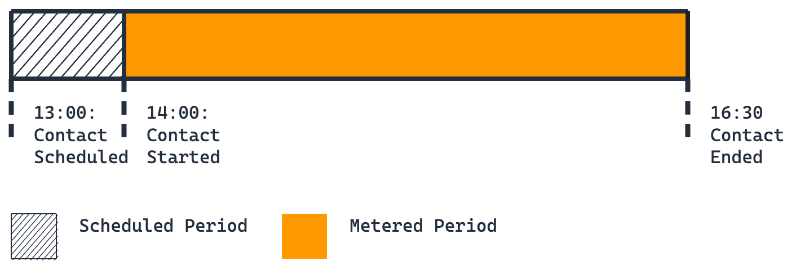
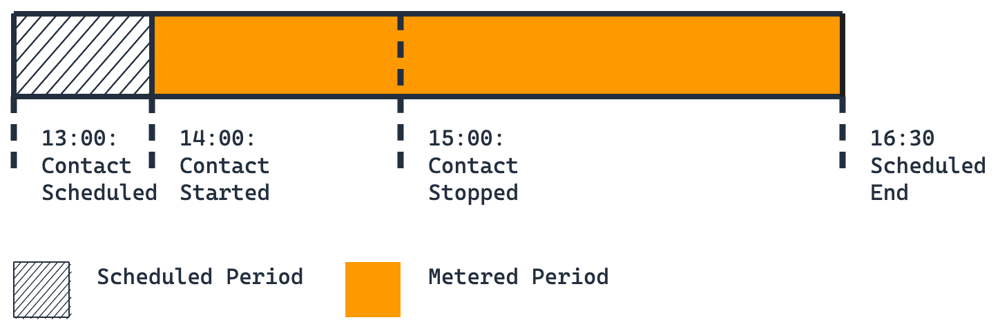
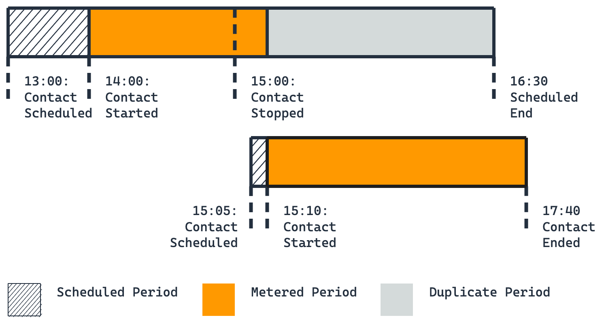
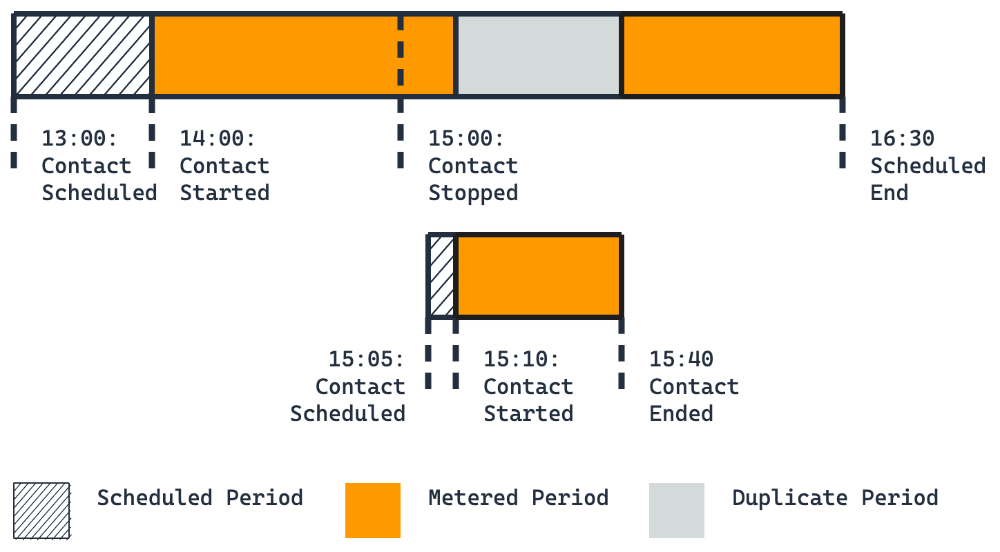
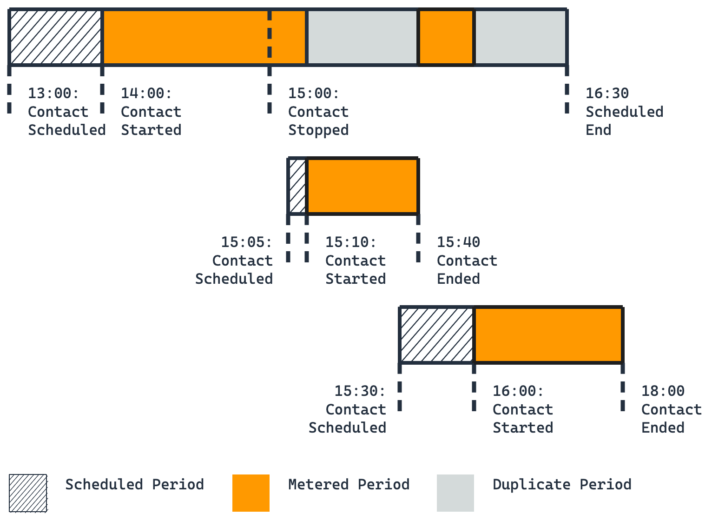
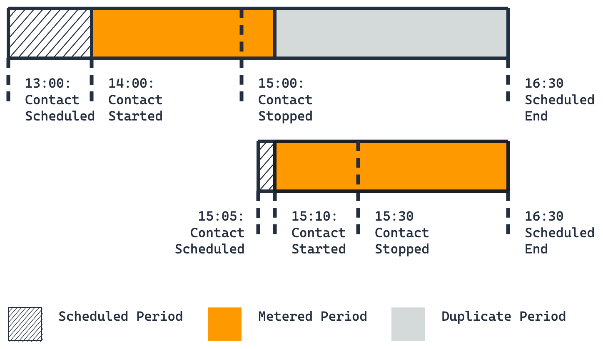
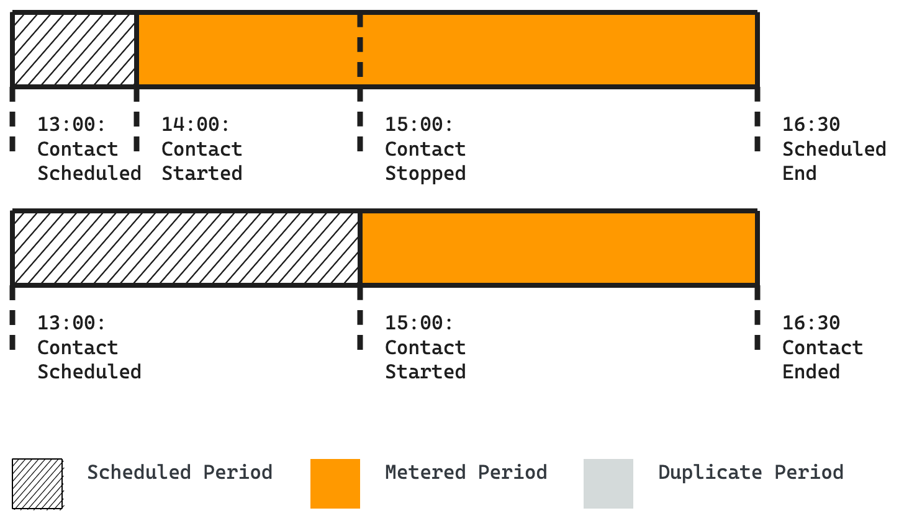
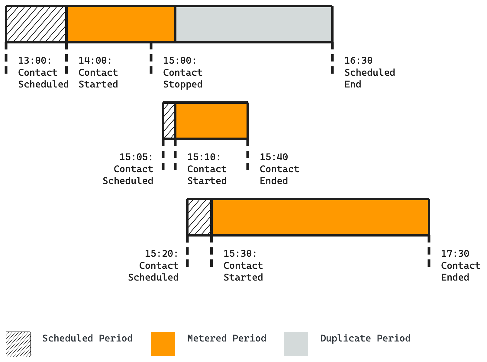

# Understand contact billing

With AWS Ground Station, you pay only for the antenna time you use. AWS Ground Station meters contact usage on a
per-minute basis. For each contact, the service calculates the contact duration from start to
end time and rounds up to the nearest minute. This metered duration determines your charges
for that contact.

Your rate depends on two main factors:

- **Bandwidth** – The amount of bandwidth reserved for the
  contact (narrowband or wideband)
- **Ground station location** – Rates vary by ground station
  location

## Bandwidth definitions

AWS Ground Station categorizes contacts into two bandwidth tiers based on the instantaneous bandwidth:

- **Narrowband** – Any contact where the instantaneous
  bandwidth is less than or equal to 40 MHz
- **Wideband** – Any contact where the instantaneous
  bandwidth is greater than 40 MHz

## Scheduling modes

AWS Ground Station offers two scheduling modes:

- **On-Demand** – Pay for antenna access with no long-term
  commitments
- **Reserved** – Provides a discounted rate and improved
  scheduling compared to On-Demand, with a monthly commitment. Reserved minute pricing is
  available for customers who commit to monthly usage for a certain period of time.

For specific pricing information for your account or to learn more about the Reserved
scheduling mode, contact your
AWS representative.

## CancelContact

Use of the [CancelContact](../APIReference/API_CancelContact.md "../APIReference/API_CancelContact.md") API varies based on the contact state when you call it:

- **Before contact start** - Cancels the contact
  entirely
- **After contact start and before contact end** - Stops
  the contact in progress

When you cancel a contact, billing depends on your scheduling mode and when you cancel.
For more information, reach out to your AWS representative.

When you stop a contact, you are billed for the portion of the contact that executed, and
the remaining time that is not covered by duplicate contacts.
A duplicate contact in this context has been:

- Scheduled on the **same** ground station as the
  original stopped contact
- Scheduled by the **same** AWS account ID as the
  original stopped contact
- Reserved **after** the command was
  issued to stop the original contact

The following scenarios demonstrate how this metering works in practice.

## Scenario 1: Single contact

You schedule a 150-minute contact on Ground Station Anytown 1 to begin at 14:00 and end at
16:30.

Billing breakdown:

- First contact: 150 minutes (full duration)

You're billed for 150 minutes. This is the baseline scenario where a contact runs to its
scheduled completion without any stops or cancellations.

## Scenario 2: Single stopped contact

You schedule a 150-minute contact on Ground Station Anytown 1 to begin at 14:00 and end at
16:30. At
15:00, you call the CancelContact API to stop your contact.

Billing breakdown:

- First contact: 150 minutes (full original duration)

You're billed for the full 150 minutes because you stopped the contact but didn't schedule
any duplicate contacts to cover the remaining time (15:00-16:30). When you stop a contact
without scheduling duplicates, you remain responsible for the entire originally scheduled
duration.

## Scenario 3: Single duplicate

You schedule a 150-minute contact on Ground Station Anytown 1 to begin at 14:00 and end at
16:30. At
15:00, you call the CancelContact API to stop your first contact. After calling
CancelContact, you schedule another contact on the same Ground Station starting at 15:10 for
150 minutes.

Billing breakdown:

- First contact: 70 minutes (60 minutes executed + 10 minutes of downtime before the
  second contact starts)
- Second contact: 150 minutes (full duration)

The second contact is a duplicate because you scheduled it after stopping the first contact.
The duplicate covers the remaining time from 15:10 to 16:30, so you are only billed for the
time the first contact actually ran plus the 10-minute gap between stopping and restarting.

## Scenario 4: Short duplicate

You schedule a 150-minute contact on Ground Station Anytown 1 to begin at 14:00 and end at
16:30. At
15:00, you call the CancelContact API to stop your first contact. After calling
CancelContact, you schedule a 30-minute contact on the same Ground Station starting at
15:10.

Billing breakdown:

- First contact: 120 minutes (60 minutes executed + 10 minutes of downtime before the
  second contact starts + 50 minutes of remaining time that the duplicate didn't cover)
- Second contact: 30 minutes (full duration)

The duplicate contact only covers 30 minutes (15:10-15:40) of the 90 minutes remaining after
you stopped the first contact. You're billed for both the 10-minute gap before the
duplicate
starts and the 50 minutes of uncovered time after the duplicate ends (15:40-16:30).

## Scenario 5: Multiple duplicates

You schedule a 150-minute contact on Ground Station Anytown 1 to begin at 14:00 and end at
16:30. At
15:00, you call the CancelContact API to stop your first contact. After calling
CancelContact,
you schedule a 30-minute contact on the same Ground Station starting at 15:10. Later, at
15:30, you schedule another contact starting at 16:00 for 120 minutes.

Billing breakdown:

- First contact: 90 minutes (60 minutes executed + 10 minutes of downtime before the
  second contact starts + 20 minutes of downtime between the second and third contacts)
- Second contact: 30 minutes (full duration)
- Third contact: 120 minutes (full duration)

Both the second and third contacts count as duplicates because you scheduled them after
stopping the first contact. However, you are still billed for the gaps between contacts: 10
minutes between the first stop (15:00) and second start (15:10), and 20 minutes between the
second end (15:40) and third start (16:00).

## Scenario 6: Multiple stops

You schedule a 150-minute contact on Ground Station Anytown 1 to begin at 14:00 and end at
16:30. At
15:00, you call the CancelContact API to stop your first contact. After calling
CancelContact, you schedule an 80-minute contact on Ground Station Anytown 1 that begins at
15:10
and ends at 16:30. At 15:30, you call the CancelContact API again, stopping your duplicate
contact.

Billing breakdown:

- First contact: 70 minutes (60 minutes executed + 10 minutes of downtime before the
  second contact starts)
- Second contact: 80 minutes (full original duration)

The second contact is billed for its full 80-minute duration because you stopped it at
15:30, leaving 60 minutes of originally scheduled time (15:30-16:30) unfilled. Unless you
schedule another duplicate contact to cover the remaining time, you are responsible for the
entire duration of any stopped contact.

## Scenario 7: Multi-antenna ground station with no

duplicate

At 13:00, you schedule two contacts on Ground Station Anytown 1. The first is a 150-minute
contact
beginning at 14:00 and ending at 16:30. The second is a 90-minute contact beginning at 15:00
and ending at 16:30. At 15:00, you call the CancelContact API to stop your first contact.
Ground Station Anytown 1 is a multi-antenna ground station, which allows both contacts to
run
simultaneously.

Billing breakdown:

- First contact: 150 minutes (full original duration)
- Second contact: 90 minutes (full duration)

Although the second contact overlaps with the stopped portion of the first contact, it
doesn't count as a duplicate. The second contact fails to meet the first criterion for
duplicates: it was scheduled at 13:00, **before** you stopped
the first contact at 15:00. Because it's not a duplicate, you are billed for the full
original duration of the first contact, regardless of when you stopped it.

## Scenario 8: Multi-antenna ground station with

duplicate contacts

You schedule a 150-minute contact on Ground Station Anytown 1 to begin at 14:00 and end at
16:30. At
15:00, you call the CancelContact API to stop your first contact. After calling
CancelContact, you schedule a 30-minute contact on Ground Station Anytown 1 beginning at
15:10 and
ending at 15:40. Later, you schedule another 90-minute contact on Ground Station Anytown 1
starting
at 15:30 and ending at 17:00. Ground Station Anytown 1 is a multi-antenna ground station,
which
allows both duplicate contacts to run simultaneously with overlapping times.

Billing breakdown:

- First contact: 70 minutes (60 minutes executed + 10 minutes of downtime before the
  second contact starts)
- Second contact: 30 minutes (full duration)
- Third contact: 90 minutes (full duration)

Both the second and third contacts count as duplicates because you scheduled them after
stopping the first contact. The 10-minute gap between stopping the first contact (15:00) and
starting the second contact (15:10) represents downtime that you are billed for against the
original contact.
