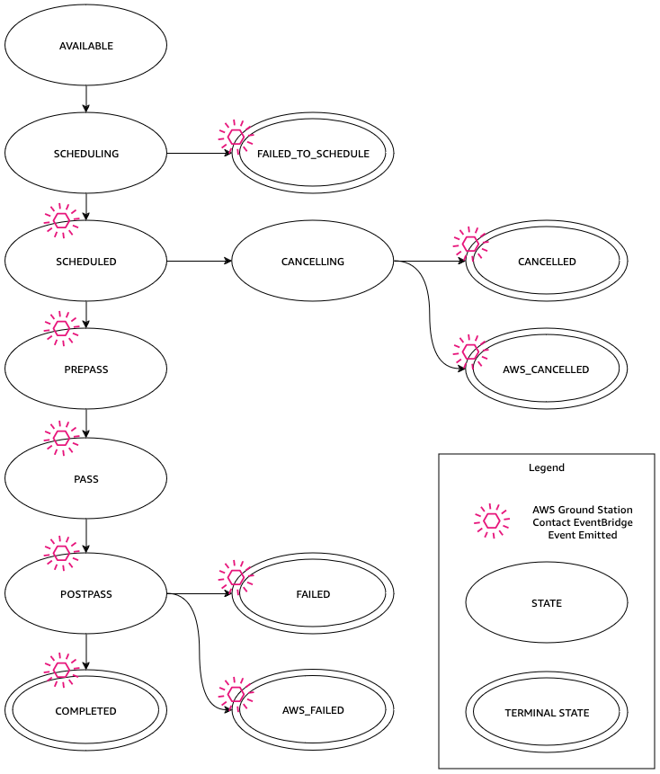

# Understand contact lifecycle

Understanding the contact lifecycle can help you to
automate and troubleshoot various problems while using AWS Ground Station. The following diagram shows the AWS Ground Station contact
lifecycle as well as Event Bridge Events emitted during the lifecycle. It is important to note
that the COMPLETED, FAILED, FAILED_TO_SCHEDULE, CANCELLED, AWS_CANCELLED, and AWS_FAILED are
terminal states. Contacts will not transition out of a terminal state. See the [AWS Ground Station contact statuses](#contact-statuses "#contact-statuses") for details on what each
status indicates and whether it is stoppable or cancellable using [CancelContact](../APIReference/API_CancelContact.md "../APIReference/API_CancelContact.md").

## AWS Ground Station contact statuses

The status of an AWS Ground Station contact provides insight into what is happening to that contact
at a given time.

### Contact statuses

The following table describes the statuses that a contact can have:

| Status             | Description                                                                                                                                              | Terminal | Cancelable | Stoppable |
| ------------------ | -------------------------------------------------------------------------------------------------------------------------------------------------------- | -------- | ---------- | --------- |
| AVAILABLE          | The contact is available to be reserved.                                                                                                                 | No       | N/A        | N/A       |
| SCHEDULING         | The contact is in the process of scheduling.                                                                                                             | No       | Yes        | No        |
| SCHEDULED          | The contact was successfully scheduled.                                                                                                                  | No       | Yes        | No        |
| FAILED_TO_SCHEDULE | The contact failed to schedule.                                                                                                                          | Yes      | No         | No        |
| PREPASS            | The contact is starting soon and resources are being prepared.                                                                                           | No       | Yes        | No        |
| PASS               | The contact is currently executing and the satellite is being communicated with.                                                                      | No       | No         | Yes       |
| POSTPASS           | The communication has completed and resources used are being cleaned up.                                                                                 | No       | No         | No        |
| COMPLETED          | The contact completed without error.                                                                                                                     | Yes      | No         | No        |
| FAILED             | The contact failed because of an issue with your resource configuration.                                                                                 | Yes      | No         | No        |
| AWS_FAILED         | The contact failed because of a problem in the AWS Ground Station service.                                                                               | Yes      | No         | No        |
| CANCELLING         | The contact is in the process of being cancelled.                                                                                                        | No       | No         | No        |
| AWS_CANCELLED      | The contact was cancelled by the AWS Ground Station service. Antenna or site maintenance, and ephemeris drift are examples of when this could happen. | Yes      | No         | No        |
| CANCELLED          | The contact was cancelled by you.                                                                                                                        | Yes      | No         | No        |

###### Note

For information about billing implications of cancelled or stopped contacts, see [Understand contact billing](contacts.md "contacts.md").

## Contact Data Retention

AWS Ground Station retains contact data for 1 year after a [ReserveContact](../APIReference/API_ReserveContact.md "../APIReference/API_ReserveContact.md") request is made
to reserve a contact. After the 1 year period, the contact data is deleted.

If you need to retain contact data beyond one year, it is recommended to export your data before
the retention period expires. For more information on how to access and export contact data, refer to:

- [AWS Ground Station API Reference](../APIReference/Welcome.md "../APIReference/Welcome.md")
- [AWS Ground Station CLI Command Reference](../../../cli/latest/reference/groundstation/index.md "../../../cli/latest/reference/groundstation/index.md")
