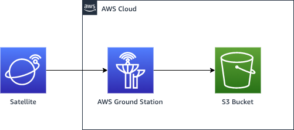
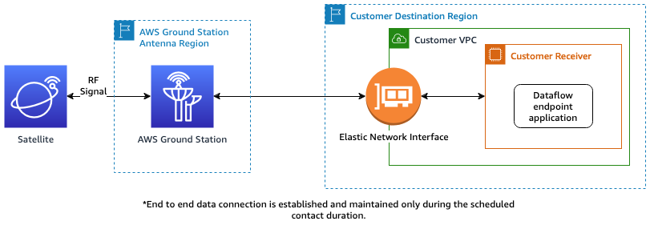
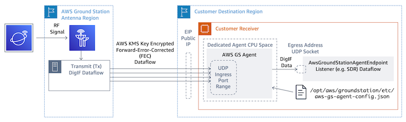

# Plan your dataflow communication paths

You have the choice between synchronous and asynchronous communication for each communication
path on your satellite. Depending on your satellite and your use case, you may require one or
both types. Synchronous communication paths allow for near real-time uplink as well as
narrowband and wideband downlink operations. Asynchronous communication paths support narrowband
and wideband downlink operations only.

## Asynchronous data delivery

With data delivery to Amazon S3, your contact data is delivered asynchronously to an Amazon S3 bucket in
your account. Your contact data is delivered as packet capture (pcap) files to allow replaying
the contact data into a Software Defined Radio (SDR) or to extract the payload data from the
pcap files for processing. The pcap files are delivered to your Amazon S3 bucket every 30 seconds as
contact data is received by the antenna hardware to allow processing contact data during the
contact if desired. Once received, you can process the data using your own post-processing
software or use other AWS services like Amazon SageMaker AI or Amazon Rekognition. Data delivery to Amazon S3 is only
available for downlinking data from your satellite; it is not possible to uplink data to your
satellite from Amazon S3.

To utilize this path, you will use need to create an Amazon S3 bucket for AWS Ground Station to deliver the data
into. In the next step, you'll also need to create a _S3 Recording Config_
in the next step. Please reference the
[Amazon S3 Recording Config](how-it-works.md#how-it-works.config-s3-recording "how-it-works.md#how-it-works.config-s3-recording")
for restrictions on bucket naming and how to specify the naming convention used for your
files.

## Synchronous data delivery

With data delivery to Amazon EC2, your contact data is streamed to and from your Amazon EC2 instance.
You can process your data in real-time on your Amazon EC2 instance or forward the data for
post-processing.

To utilize a synchronous path, you will use need to set up and configure your Amazon EC2
instances and create one or more _Dataflow Endpoint Groups_. To configure
your Amazon EC2 instance reference the
[Set up and configure Amazon EC2](dataflows.md "dataflows.md").
To create your Dataflow Endpoint Group, please reference the
[Use AWS Ground Station Dataflow endpoint groups](how-it-works.md "how-it-works.md").

The following shows the communication path if you are using the dataflow endpoint configuration.

The following shows the communication path if you are using the AWS Ground Station Agent configuration.

