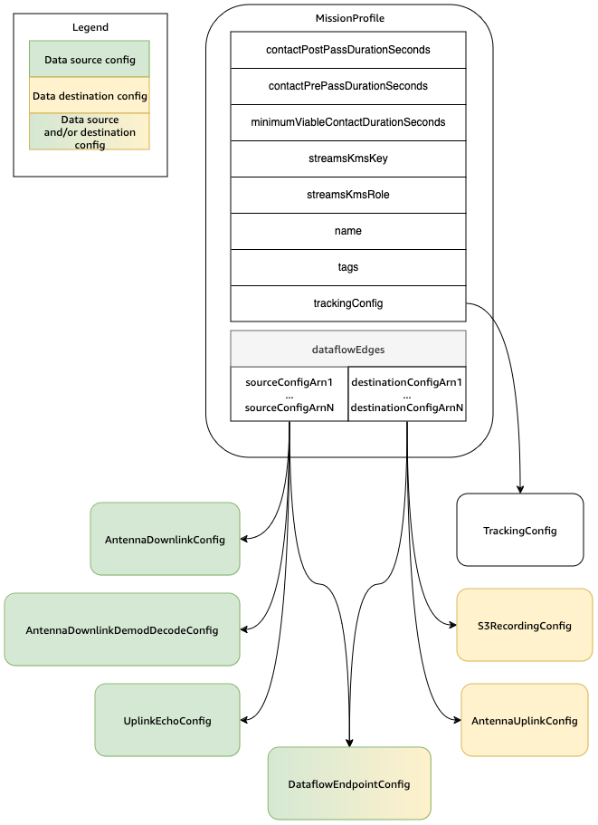

# Use AWS Ground Station Mission Profiles

Mission profiles contain configs and parameters for how contacts are executed.
When you reserve a contact or search for available contacts, you supply the
mission profile that you intend to use. Mission profiles bring all of your configs
together and define how the antenna will be configured and where data will go during your
contact.

Mission profiles can be shared across satellites which share the same radio
characteristics. You can create additional dataflow endpoint groups to bound the maximum
simultaneous contacts you want to perform for your constellation.

Tracking configs are specified as a unique field within the mission profile. Tracking
configs are used to specify your preference for using program-tracking and auto-tracking
during your contact. For more information, see [Tracking Config](how-it-works.md#how-it-works.config-tracking "how-it-works.md#how-it-works.config-tracking").

All other configs are contained in the `dataflowEdges` field of the mission profile.
These configs can be thought of as dataflow nodes that each represent an AWS Ground Station managed
resource that can send or receive data and its associated configuration.
The `dataflowEdges` field defines which source and destination dataflow nodes
(configs) are needed. A single dataflow edge is a list of two config
[Amazon Resource Names (ARNs)](../../../IAM/latest/UserGuide/reference-arns.md "../../../IAM/latest/UserGuide/reference-arns.md")—the first is the
_source_ config and the second is the _destination_ config.
By specifying a dataflow edge between two configs, you are telling AWS Ground Station from where and to where
data should flow during a contact. For more information, see [Use AWS Ground Station Configs](how-it-works.md "how-it-works.md").

The `contactPrePassDurationSeconds` and `contactPostPassDurationSeconds` allow you to specify times relative to the contact where you will receive an CloudWatch Event notification. For a timeline of events related to your contact, please read [Understand contact lifecycle](contacts.md "contacts.md").

The `name` field of the mission profile helps distinguish between the mission profiles that you create.

The `streamsKmsRole` and `streamsKmsKey` are used to define the encryption used by AWS Ground Station for your data delivery with AWS Ground Station Agent. Please see [Data encryption during transit for AWS Ground Station](security.md "security.md").

The `telemetrySinkConfigArn` field is optional and allows you to enable AWS Ground Station telemetry during contacts. When specified, AWS Ground Station streams near real-time telemetry data to your account during the execution of your contacts. For more information about configuring and using telemetry, see [Work with telemetry](telemetry.md "telemetry.md").

A full list of parameters and examples is included at the following documentation.

- [AWS::GroundStation::MissionProfile CloudFormation resource type](../../../AWSCloudFormation/latest/UserGuide/aws-resource-groundstation-missionprofile.md "../../../AWSCloudFormation/latest/UserGuide/aws-resource-groundstation-missionprofile.md")
