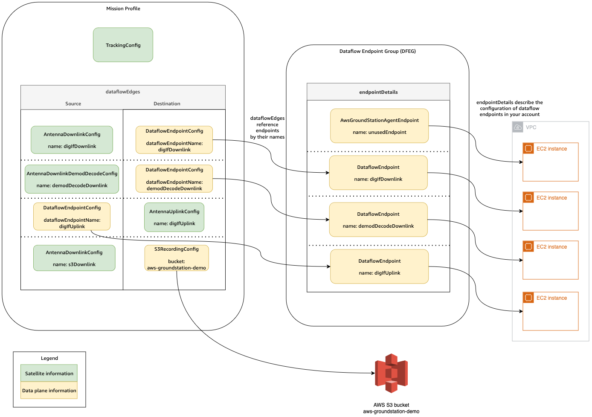
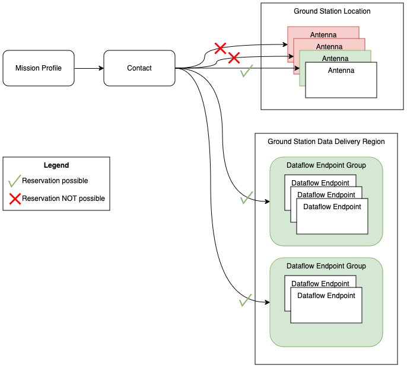
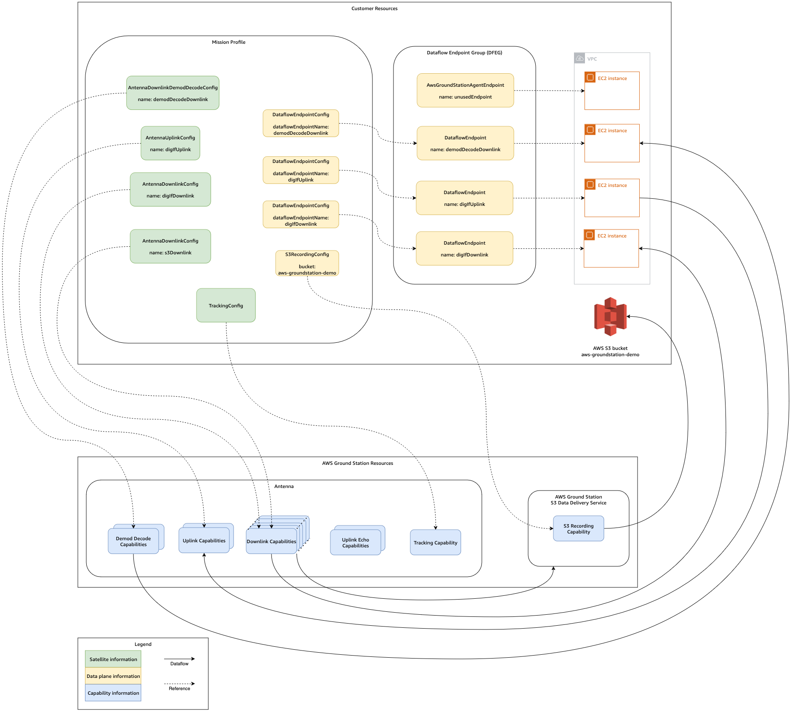

# How AWS Ground Station works

AWS Ground Station operates ground-based _antennas_ to facilitate communication with
your _satellite_. The physical characteristics of what the antennas can do
are abstracted and are referred to as _capabilities_. The physical location
of the antenna along with its current capabilities can be referenced in the
[AWS Ground Station Locations](aws-ground-station-antenna-locations.md "aws-ground-station-antenna-locations.md") section.
Please contact us at `<aws-groundstation@amazon.com>` if your use case requires
additional capabilities, additional location offerings, or more precise antenna locations.

To use one of the AWS Ground Station antennas you must reserve a time at a specific location. This
reservation is referred to as a _contact_. To successfully schedule a
contact, AWS Ground Station requires additional data to ensure its success.

- Your satellite must be onboarded to one or more locations –
  This ensures you have approval to operate the various capabilities at the requested location.
- Your satellite must have a valid _ephemeris_ –
  This ensures the antennas have line of sight and can accurately point at your satellite
  during the contact.
- You must have a valid _mission profile_ –
  This allows you to customize how this contact will behave including how you will receive and
  send data to your satellite. You may utilize multiple mission profiles for the same vehicle
  to create different contacts to fit different operating postures or scenarios you encounter.

## Satellite onboarding

Onboarding a satellite into AWS Ground Station is a multistep process involving data collection, technical
validation, spectrum licensing, with integration and testing.

The [Satellite onboarding](getting-started.md "getting-started.md") section of the guide will
walk you through this process.

## Mission profile composition

The satellite frequency information,
[data plane](../../../whitepapers/latest/aws-fault-isolation-boundaries/control-planes-and-data-planes.md "../../../whitepapers/latest/aws-fault-isolation-boundaries/control-planes-and-data-planes.md")
information, and other details are encapsulated into a mission profile. The mission profile is
a collection of _config_ components. This allows you to reuse config
components across different mission profiles as suits your use case. Since mission profiles
don't directly reference individual satellites, but instead only have information about their
technical capabilities, mission profiles can also be reused by multiple satellites that have the
same configuration.

A valid mission profile will have a _tracking config_ and one or more
_dataflows_. The tracking config will specify your preference for tracking
during a contact. Each config pair within a dataflow establishes a source and destination.
Depending on your satellite and its operational modes, the exact number of dataflows will vary
in a mission profile to represent your uplink and downlink communication paths as well as any
data processing aspects.

- For more information on configuring your Amazon VPC, Amazon S3, and Amazon EC2 resources that will be used
  during a contact, see [Work with dataflows](dataflows.md "dataflows.md").
- For details on how each config behaves, see [Use AWS Ground Station Configs](how-it-works.md "how-it-works.md").
- For specific details on all parameters expected, see [Use AWS Ground Station Mission Profiles](how-it-works-mission-profile.md "how-it-works-mission-profile.md").
- For examples on how various mission profiles can be created to support your use case, see [Example mission profile configurations](examples.md "examples.md").

The following diagram shows an example mission profile and additional resources needed.
Note that the example shows a dataflow endpoint which is not needed for this mission profile,
named _unusedEndpoint_, to demonstrate the flexibility. The example supports
the following dataflows:

- Synchronous downlink of digital intermediate frequency data to an Amazon EC2
  instance that you manage. Denoted by the name _digIfDownlink_.
- Asynchronous downlink of digital intermediate frequency data to an Amazon S3 bucket. Denoted by the
  bucket name _aws-groundstation-demo_.
- Synchronous downlink of demodulated and decoded data to an Amazon EC2 instance that you manage.
  Denoted by the name _demodDecodeDownlink_.
- Synchronous uplink of data from an Amazon EC2 instance that you manage to a AWS Ground Station managed antenna.
  Denoted by the name _digIfUplink_.

## Contact scheduling

With a valid mission profile, you can request a contact with your onboarded
satellites. The contact reservation request is asynchronous to allow time for the global
antenna service to achieve a consistent schedule across all AWS Regions involved. During this
process, various antennas at the requested ground station location are evaluated to determine
if they are available and capable to process the contact. During this process, your
configured _dataflow endpoints_ are also evaluated to determine their
availability. While this evaluation is occurring, the contact status will be in SCHEDULING.

This asynchronous scheduling process will finish within five minutes of the request, but
typically finishes within one minute. Please review
[Automate AWS Ground Station with
Events](monitoring.md "monitoring.md")
for event-based monitoring during scheduling time.

Contacts which can be performed and have availability result in
_SCHEDULED_ contacts. With a scheduled contact, the resources which are
needed to perform your contact have been reserved across the needed AWS Regions as defined by
your mission profile. Contacts which cannot be performed, or have unavailable parts will
result in _FAILED_TO_SCHEDULE_ contacts.
See [Troubleshoot FAILED_TO_SCHEDULE contacts](troubleshooting-failed-to-schedule-contacts.md "troubleshooting-failed-to-schedule-contacts.md")
for debugging details.

## Contact execution

AWS Ground Station will automatically orchestrate your AWS managed resources during your contact
reservation. If applicable, you are responsible for orchestrating EC2 resources defined by
your mission profile as dataflow endpoints. AWS Ground Station provides
[AWS EventBridge Events](../../../eventbridge/latest/userguide/eb-events.md "../../../eventbridge/latest/userguide/eb-events.md")
for automating orchestration of your resources to reduce costs.
See [Automate AWS Ground Station with
Events](monitoring.md "monitoring.md")
for more details.

During the contact, telemetry about your contact performance is delivered to AWS CloudWatch.
For information about how to monitor your contact during execution, please see
[Understand monitoring with AWS Ground Station](monitoring.md "monitoring.md").

The following diagram continues the previous example by showing the same resources orchestrated
during the contact.

###### Note

Not all the antenna capabilities were used in this example. For instance, there are more
than a dozen antenna downlink capabilities available at each antenna that support multiple
frequencies and polarizations. For more details about the number of each capability type
available from AWS Ground Station antennas, and their supported frequencies and polarizations, see
[AWS Ground Station Site Capabilities](locations.md "locations.md").

At the end of your contact, AWS Ground Station will assess the performance of your contact and will
determine a final contact status. Contacts where no errors are detected will result in a
_COMPLETED_ contact status. Contacts where service errors have caused data
delivery issues during the contact will result in an _AWS_FAILED_
status. Contacts where client or user errors have caused data delivery issues during the
contact will result in a _FAILED_ status. Errors outside a contact time,
that is during pre-pass or post-pass, are not taken into account during the adjudication.

See [Understand contact lifecycle](contacts.md "contacts.md") for more information.

## Digital twin

The digital twin feature for AWS Ground Station allows you to schedule contacts against virtual ground station locations. These virtual
ground stations are exact replicas of production ground stations including antenna capabilities, site masks,
and actual GPS coordinates. The digital twin feature enables you to test your contact orchestration workflow for a fraction
of the cost compared to production ground stations. See [Use the AWS Ground Station digital twin feature](digital-twin.md "digital-twin.md") for more information.
