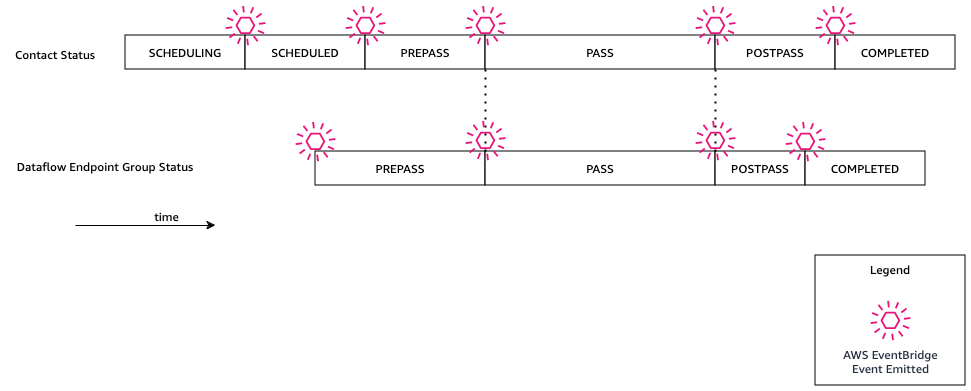

# Automate AWS Ground Station with

Events

###### Note

This document uses the term “event” throughout. CloudWatch Events and EventBridge are the same
underlying service and API. Rules to match incoming events and route them to targets for
processing can be built using either service.

Events enable you to automate your AWS services and respond automatically to system events
such as application availability issues or resource changes. Events from AWS services are
delivered in near real time. You can write simple rules to indicate which events are of interest
to you, and what automated actions to take when an event matches a rule. Some of the actions
that can be automatically triggered include the following:

- Invoking an AWS Lambda function
- Invoking Amazon EC2 Run Command
- Relaying the event to Amazon Kinesis Data Streams
- Activating an AWS Step Functions state machine
- Notifying an Amazon SNS topic or an Amazon SQS queue
  Some examples of using events with AWS Ground Station include:

- Invoking a Lambda function to automate the starting and stopping of Amazon EC2 instances based
  off the event state.
- Publishing to an Amazon SNS topic whenever a contact changes states. These topics can be set
  up to send out email notices at the beginning or end of contacts.

For more information, see the
[Amazon EventBridge Events User Guide](../../../eventbridge/latest/userguide/eb-events.md "../../../eventbridge/latest/userguide/eb-events.md").

## AWS Ground Station Event Types

###### Note

All events generated by AWS Ground Station have "aws.groundstation" as the value for "source".

AWS Ground Station emits events related to state changes to support your ability to customize your
automation. Currently, AWS Ground Station supports contact state change events, dataflow endpoint group
change events, and ephemeris state change events. The following sections provide detailed
information about each type.

## Contact Event Timeline

AWS Ground Station emits events when your contact changes states. For more information on what those
state changes are, and what the states themselves mean, see
[Understand contact lifecycle](contacts.md "contacts.md") . Any dataflow
endpoint groups being used in your contact have an independent set of events that are also
emitted. During that same timeframe, we also emit events for your dataflow endpoint group. The
precise time of the pre-pass and post-pass events are configurable by you as you set up your
mission profile and dataflow endpoint group.

The following diagram shows the statuses and events emitted for a nominal contact and its
associated dataflow endpoint group.



**Ground Station Contact State Change**

If you want to perform a specific action when an upcoming contact is changing states, you can
set up a rule to automate this action. This is helpful for when you want to receive
notifications about the state changes of your contact. If you would like to change when you
receive these events, you can modify your mission profile's
[contactPrePassDurationSeconds](../APIReference/API_UpdateMissionProfile.md#groundstation-UpdateMissionProfile-request-contactPrePassDurationSeconds "../APIReference/API_UpdateMissionProfile.md#groundstation-UpdateMissionProfile-request-contactPrePassDurationSeconds") and
[contactPostPassDurationSeconds](../APIReference/API_UpdateMissionProfile.md#groundstation-UpdateMissionProfile-request-contactPostPassDurationSeconds "../APIReference/API_UpdateMissionProfile.md#groundstation-UpdateMissionProfile-request-contactPostPassDurationSeconds"). The events are sent to the region that the contact was
scheduled from.

An example event is provided below.

```

{
    "version": "0",
    "id": "01234567-0123-0123",
    "account": "123456789012",
    "time": "2019-05-30T17:40:30Z",
    "region": "us-west-2",
    "source": "aws.groundstation",
    "resources": [
        "arn:aws:groundstation:us-west-2:123456789012:contact/11111111-1111-1111-1111-111111111111"
    ],
    "detailType": "Ground Station Contact State Change",
    "detail": {
        "contactId": "11111111-1111-1111-1111-111111111111",
        "groundstationId": "Ground Station 1",
        "missionProfileArn": "arn:aws:groundstation:us-west-2:123456789012:mission-profile/11111111-1111-1111-1111-111111111111",
        "satelliteArn": "arn:aws:groundstation::123456789012:satellite/11111111-1111-1111-1111-111111111111",
        "contactStatus": "PASS"
    }
}

```

The possible values for `contactStatus` are defined in [AWS Ground Station contact statuses](contacts.md#contact-statuses "contacts.md#contact-statuses").

**Ground Station Dataflow Endpoint Group State Change**

If you want to perform an action when your dataflow endpoint group is being used to receive data, you can set up a rule to automate this action.
This will allow you to perform different actions in response to the dataflow endpoint group status changing states. If you would like to change when you receive these events, use a dataflow endpoint group with different [contactPrePassDurationSeconds](../APIReference/API_CreateDataflowEndpointGroup.md#groundstation-CreateDataflowEndpointGroup-request-contactPrePassDurationSeconds "../APIReference/API_CreateDataflowEndpointGroup.md#groundstation-CreateDataflowEndpointGroup-request-contactPrePassDurationSeconds") and [contactPostPassDurationSeconds](../APIReference/API_CreateDataflowEndpointGroup.md#groundstation-CreateDataflowEndpointGroup-request-contactPostPassDurationSeconds "../APIReference/API_CreateDataflowEndpointGroup.md#groundstation-CreateDataflowEndpointGroup-request-contactPostPassDurationSeconds").
This event will be sent to the region of the dataflow endpoint group.

An example is provided below.

```

{
    "version": "0",
    "id": "01234567-0123-0123",
    "account": "123456789012",
    "time": "2019-05-30T17:40:30Z",
    "region": "us-west-2",
    "source": "aws.groundstation",
    "resources": [
        "arn:aws:groundstation:us-west-2:123456789012:dataflow-endpoint-group/bad957a8-1d60-4c45-a92a-39febd98921d",
        "arn:aws:groundstation:us-west-2:123456789012:contact/98ddd10f-f2bc-479c-bf7d-55644737fb09",
        "arn:aws:groundstation:us-west-2:123456789012:mission-profile/c513c84c-eb40-4473-88a2-d482648c9234"
    ],
    "detailType": "Ground Station Dataflow Endpoint Group State Change",
    "detail": {
        "dataflowEndpointGroupId": "bad957a8-1d60-4c45-a92a-39febd98921d",
        "groundstationId": "Ground Station 1",
        "contactId": "98ddd10f-f2bc-479c-bf7d-55644737fb09",
        "dataflowEndpointGroupArn": "arn:aws:groundstation:us-west-2:680367718957:dataflow-endpoint-group/bad957a8-1d60-4c45-a92a-39febd98921d",
        "missionProfileArn": "arn:aws:groundstation:us-west-2:123456789012:mission-profile/c513c84c-eb40-4473-88a2-d482648c9234",
        "dataflowEndpointGroupState": "PREPASS"
    }
}

```

Possible states for the `dataflowEndpointGroupState` include `PREPASS`, `PASS`, `POSTPASS`, and `COMPLETED`.

## Ephemeris Events

**Ground Station Ephemeris State Change**

If you want to perform an action when an ephemeris changes state, you can set up a rule to automate this action.
This allows you to perform different actions in response to an ephemeris changing state.
For example, you can perform an action when an ephemeris has completed validation, and it is now `ENABLED`.
Notification for this event will be sent to the region were the ephemeris was uploaded.

An example is provided below.

```

{
    "id": "7bf73129-1428-4cd3-a780-95db273d1602",
    "detail-type": "Ground Station Ephemeris State Change",
    "source": "aws.groundstation",
    "account": "123456789012",
    "time": "2019-12-03T21:29:54Z",
    "region": "us-west-2",
    "resources": [
        "arn:aws:groundstation::123456789012:satellite/10313191-c9d9-4ecb-a5f2-bc55cab050ec",
        "arn:aws:groundstation::123456789012:ephemeris/111111-cccc-bbbb-a555-bcccca005000",
    ],
    "detail": {
        "ephemerisStatus": "ENABLED",
        "ephemerisId": "111111-cccc-bbbb-a555-bcccca005000",
        "satelliteId": "10313191-c9d9-4ecb-a5f2-bc55cab050ec"
    }
}

```

Possible states for the `ephemerisStatus` include `ENABLED`, `VALIDATING`, `INVALID`, `ERROR`, `DISABLED`, `EXPIRED`
