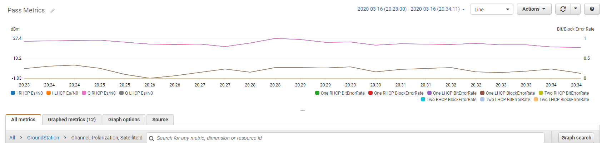
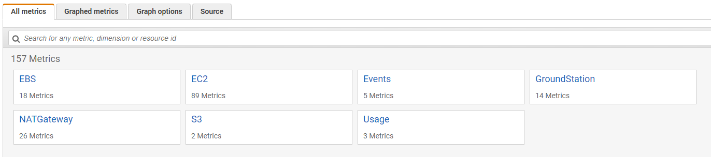
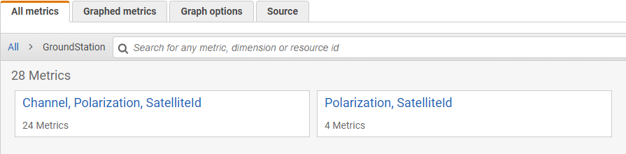

# View metrics with Amazon CloudWatch

During a contact, AWS Ground Station automatically captures and sends data to CloudWatch for analysis.
Your data can be viewed in the Amazon CloudWatch console.
For more information about accessing and CloudWatch Metrics, see
[Using Amazon CloudWatch Metrics](../../../AmazonCloudWatch/latest/monitoring/working_with_metrics.md "../../../AmazonCloudWatch/latest/monitoring/working_with_metrics.md").

## AWS Ground Station Metrics and Dimensions

### What metrics

are available?

The following metrics are available from AWS Ground Station.

###### Note

The specific metrics emitted depend on the AWS Ground Station capabilities being used. Depending on
your configuration, only a subset of the below metrics may be emitted.

| Metric                                        | Metric Dimensions                  | Description                                                                                                                                                                                                     |
| --------------------------------------------- | ---------------------------------- | --------------------------------------------------------------------------------------------------------------------------------------------------------------------------------------------------------------- |
| `AzimuthAngle`                                | SatelliteId                        | The azimuth angle of the antenna. True north is 0 degrees and east is 90<br>degrees.<br>Units: degrees                                                                                                          |
| `BitErrorRate`                                | Channel, Polarization, SatelliteId | The error rate on bits in a given number of bit transmissions. Bit errors are<br>caused by noise, distortion, or interference<br>Units: Bits errors per unit time                                               |
| `BlockErrorRate`                              | Channel, Polarization, SatelliteId | The error rate of blocks in a given number of received blocks. Block errors<br>are caused by interference.<br>Units: Erroneous blocks / Total number of blocks                                                  |
| `CarrierFrequencyRecovery_Cn0`                | Category, Config, SatelliteId      | Carrier to noise density ratio per unit bandwidth.<br>Units: decibel-Hertz (dB-Hz)                                                                                                                              |
| `CarrierFrequencyRecovery_Locked`             | Category, Config, SatelliteId      | Set to 1 when the demodulator carrier frequency recovery loop is locked and 0<br>when unlocked.<br>Units: unitless                                                                                              |
| `CarrierFrequencyRecovery_OffsetFrequency_Hz` | Category, Config, SatelliteId      | The offset between the estimated signal center and ideal center frequency.<br>This is<br>caused by Doppler shift and local oscillator offset between spacecraft and antenna<br>system.<br>Units: hertz (Hz)     |
| `ElevationAngle`                              | SatelliteId                        | The elevation angle of the antenna. The horizon is 0 degrees and zenith is 90<br>degrees.<br>Units: degrees                                                                                                     |
| `Es/N0`                                       | Channel, Polarization, SatelliteId | The ratio of energy per symbol to noise power spectral density.<br>Units: decibels (dB)                                                                                                                         |
| `ReceivedPower`                               | Polarization, SatelliteId          | The measured signal strength in the demodulator/decoder.<br>Units: decibels relative to milliwatts (dBm)                                                                                                        |
| `SymbolTimingRecovery_ErrorVectorMagnitude`   | Category, Config, SatelliteId      | The error vector magnitude between received symbols and ideal constellation<br>points.<br>Units: percent                                                                                                        |
| `SymbolTimingRecovery_Locked`                 | Category, Config, SatelliteId      | Set to 1 when the demodulator symbol timing recovery loop is locked and 0 when<br>unlocked<br>Units: unitless                                                                                                   |
| `SymbolTimingRecovery_OffsetSymbolRate`       | Category, Config, SatelliteId      | The offset between the estimated symbol rate and ideal signal symbol rate.<br>This is<br>caused by Doppler shift and local oscillator offset between spacecraft and antenna<br>system.<br>Units: symbols/second |

### What dimensions are used for AWS Ground Station?

You can filter AWS Ground Station data using the following dimensions.

| Dimension      | Description                                                                                                               |
| -------------- | ------------------------------------------------------------------------------------------------------------------------- |
| `Category`     | Demodulation or Decode.                                                                                                   |
| `Channel`      | The channels for each contact include One, Two, I (in-phase), and Q (quadrature).                                         |
| `Config`       | An antenna downlink demod decode config arn.                                                                              |
| `Polarization` | The polarization for each contact include LHCP (Left Hand Circular Polarized) or RHCP<br>(Right Hand Circular Polarized). |
| `SatelliteId`  | The satellite ID contains the ARN of the satellite for your contacts.                                                     |

## Viewing Metrics

When viewing graphed metrics, it is important to note that the aggregation window determines
how your metrics will be displayed. Each metric in a contact can be displayed as data per
second for 3 hours after the data is received. Your data will be aggregated by CloudWatch Metrics as
data per minute after that 3-hour period has elapsed. If you need to view your metrics on a
data per second measurement, it is recommended to view your data within the 3-hour period
after the data is received or persist it outside of CloudWatch Metrics. For more information on
CloudWatch retention, see
[Amazon CloudWatch concepts - Metric retention](../../../AmazonCloudWatch/latest/monitoring/cloudwatch_concepts.md#metrics-retention "../../../AmazonCloudWatch/latest/monitoring/cloudwatch_concepts.md#metrics-retention").

In addition, any data captured within the first 60 seconds will not contain enough information
to produce meaningful metrics, and will likely not be displayed. In order to view meaningful
metrics, it is recommended to view your data after 60 seconds has passed.



For more information about graphing AWS Ground Station metrics in CloudWatch, see [Graphing Metrics](../../../AmazonCloudWatch/latest/monitoring/graph_metrics.md "../../../AmazonCloudWatch/latest/monitoring/graph_metrics.md").

### To view metrics using the console

1. Open the [CloudWatch console](https://console.aws.amazon.com/cloudwatch "https://console.aws.amazon.com/cloudwatch").
2. In the navigation pane, choose **Metrics**.
3. Select the **GroundStation** namespace.

 4. Select your desired metric dimensions (for example, **Channel, Polarization, SatelliteId**).

 5. The **All metrics** tab displays all metrics for that
dimension in the namespace. You can do the following:

    1. To sort the table, use the column heading.
    2. To graph a metric, select the checkbox associated with the metric. To select all
     metrics, select the checkbox in the heading row of the table.
    3. To filter by resource, choose the resource ID and then choose **Add to search**.
    4. To filter by metric, choose the metric name and then choose **Add to search**.

### To view metrics using AWS CLI

1. Ensure that AWS CLI is installed. For information about installing AWS CLI, see
   [Installing the AWS CLI version 2](../../../cli/latest/userguide/install-cliv2.md "../../../cli/latest/userguide/install-cliv2.md").
2. Use the [get-metric-data](../../../cli/latest/reference/cloudwatch/get-metric-data.md "../../../cli/latest/reference/cloudwatch/get-metric-data.md")
   method of the CloudWatch CLI to generate a file that can be modified to specify the metrics that
   you're interested in, and then be used to query for those metrics.

To do this, run the following: `aws cloudwatch get-metric-data --generate-cli-skeleton`.
This will generate output similar to:

```

        {
           "MetricDataQueries": [
              {
                 "Id": "",
                 "MetricStat": {
                    "Metric": {
                       "Namespace": "",
                       "MetricName": "",
                       "Dimensions": [
                          {
                             "Name": "",
                             "Value": ""
                          }
                       ]
                    },
                    "Period": 0,
                    "Stat": "",
                    "Unit": "Seconds"
                 },
                 "Expression": "",
                 "Label": "",
                 "ReturnData": true,
                 "Period": 0,
                 "AccountId": ""
              } ],
           "StartTime": "1970-01-01T00:00:00",
           "EndTime": "1970-01-01T00:00:00",
           "NextToken": "",
           "ScanBy": "TimestampDescending",
           "MaxDatapoints": 0,
           "LabelOptions": {
              "Timezone": ""
           }
        }

```

3. List the available CloudWatch metrics by running `aws cloudwatch list-metrics`.

If you've recently used AWS Ground Station, the method should return output that contains entries like:

```

        ...
        {
           "Namespace": "AWS/GroundStation",
           "MetricName": "ReceivedPower",
           "Dimensions": [
              {
                 "Name": "Polarization",
                 "Value": "LHCP"
              },
              {
                 "Name": "SatelliteId",
                 "Value": "arn:aws:groundstation::111111111111:satellite/aaaaaaaa-bbbb-cccc-dddd-eeeeeeeeeeee"
              }
           ]
       },
       ...

```

###### Note

Due to a limitation of CloudWatch, if it's been over 2 weeks since you last used AWS Ground Station, then
you will need to manually inspect the [table of available metrics](#monitoring.metrics.metrics-and-dimensions.available-metrics "#monitoring.metrics.metrics-and-dimensions.available-metrics")
to find the metric names and dimensions in the `AWS/GroundStation` metric namespace.
For more information about the CloudWatch limitation see: [View available metrics](../../../AmazonCloudWatch/latest/monitoring/viewing_metrics_with_cloudwatch.md "../../../AmazonCloudWatch/latest/monitoring/viewing_metrics_with_cloudwatch.md") 4. Modify the JSON file you created in step 2 to match the required values from step 3,
for example `SatelliteId`, and `Polarization` from your metrics.
Also be sure to update the `StartTime`, and `EndTime` values to match
your contact. For example:

```

         {
            "MetricDataQueries": [
               {
                  "Id": "receivedPowerExample",
                  "MetricStat": {
                     "Metric": {
                        "Namespace": "AWS/GroundStation",
                        "MetricName": "ReceivedPower",
                        "Dimensions": [
                           {
                              "Name": "SatelliteId",
                              "Value": "arn:aws:groundstation::111111111111:satellite/aaaaaaaa-bbbb-cccc-dddd-eeeeeeeeeeee"
                           },
                           {
                              "Name": "Polarization",
                              "Value": "RHCP"
                           }
                        ]
                     },
                     "Period": 300,
                     "Stat": "Maximum",
                     "Unit": "None"
                  },
                  "Label": "ReceivedPowerExample",
                  "ReturnData": true
               }
            ],
            "StartTime": "2024-02-08T00:00:00",
            "EndTime": "2024-04-09T00:00:00"
         }

```

###### Note

AWS Ground Station publishes metrics every 1 to 60 seconds, depending on the metric. Metrics will not be
returned if the `Period` field has a value less than the publishing period for
the metric. 5. Run `aws cloudwatch get-metric-data` with the configuration file created in the previous steps.
An example is provided below.

```
aws cloudwatch get-metric-data --cli-input-json file://<nameOfConfigurationFileCreatedInStep2>.json
```

Metrics will be provided with timestamps from your contact. An example output of AWS Ground Station metrics is provided below.

```

{
   "MetricDataResults": [
      {
         "Id": "receivedPowerExample",
         "Label": "ReceivedPowerExample",
         "Timestamps": [
            "2024-04-08T18:35:00+00:00",
            "2024-04-08T18:30:00+00:00",
            "2024-04-08T18:25:00+00:00"
         ],
         "Values": [
            -33.30191555023193,
            -31.46100273132324,
            -32.13915576934814
         ],
         "StatusCode": "Complete"
      }
   ],
   "Messages": []
}

```
