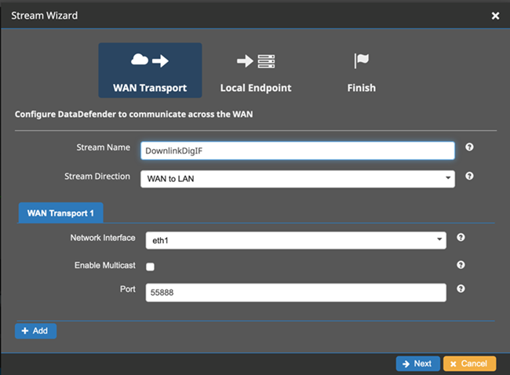
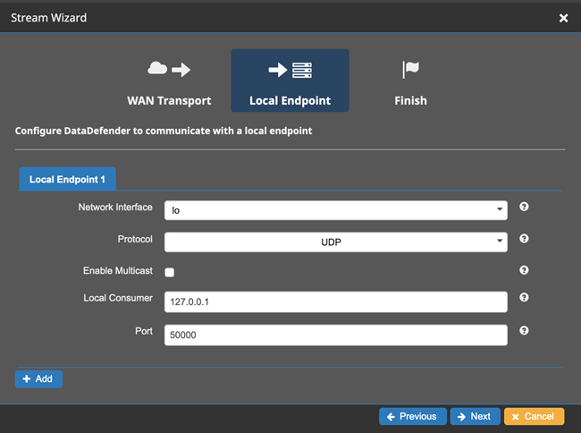

# Troubleshoot contacts that deliver data to Amazon EC2

If you are unable to successfully complete an AWS Ground Station contact, you'll need to verify that your Amazon EC2
instance is running, verify that your dataflow endpoint application is running, and verify that your dataflow endpoint application's stream is configured properly.

###### Note

DataDefender (DDX) is an example of a dataflow endpoint application currently supported by AWS Ground Station

**Prerequisite**

The following procedures assume that an Amazon EC2 instance is already set up. To set up an Amazon EC2 instance in AWS Ground Station,
see [Getting Started](getting-started.md "getting-started.md").

## Step 1: Verify that your EC2 instance is running

The following procedure shows how to find your Amazon EC2 instance in the console and start it if it's not running.

1. Locate the Amazon EC2 instance that was used for the contact you are troubleshooting. Use the following steps:
   1. In your **AWS CloudFormation** dashboard, select the stack that contains your Amazon EC2 instance.
   2. Choose the **Resources** tab and locate your Amazon EC2
      instance in the **Logical ID** column. Verify that the instance is created in the **Status** column.
   3. In the **Physical ID** column, choose the link for your Amazon EC2 instance. This will take you to the Amazon EC2 management console.

2. In the Amazon EC2 management console, ensure that your Amazon EC2 **Instance State** is _running_.
3. If your instance is running, continue to the next step. If your instance is not running, start the instance by using the following step:
   1. With your Amazon EC2 instance selected, choose **Actions > Instance State > Start**.

## Step 2: Determine type of dataflow application used

If you are using the **AWS Ground Station Agent** for data delivery please redirect
to section [Troubleshooting AWS Ground Station Agent](troubleshooting-agent.md "troubleshooting-agent.md").
Otherwise, if you are using the **DataDefender (DDX)** application continue to [Step 3: Verify that dataflow application is running](#verify-that-dataflow-application-is-running "#verify-that-dataflow-application-is-running").

## Step 3: Verify that dataflow application is running

Verifying the status of DataDefender requires you to connect to your instance in Amazon EC2.
For more details on connecting to your instance, see [Connect to your Linux instance](../../../AWSEC2/latest/UserGuide/AccessingInstances.md "../../../AWSEC2/latest/UserGuide/AccessingInstances.md").

The following procedure provides troubleshooting steps using commands in an SSH client.

1. Open a terminal or command prompt and connect to your Amazon EC2 instance by using SSH. Forward port 80 of the remote host in order to view the DataDefender web UI.
   The following commands demonstrate how to use SSH to connect to an Amazon EC2
   instance through a bastion with port forwarding enabled.

###### Note

You must replace <SSH KEY>, <BASTION HOST>, and <HOST>
with your specific ssh key, bastion host name, and Amazon EC2 instance host name.

**For Windows**

```
ssh -L 8080:localhost:80 -o ProxyCommand="C:\Windows\System32\OpenSSH\ssh.exe -o \"ForwardAgent yes\" -W %h:%p -i \"<SSH KEY>\" ec2-user@<BASTION HOST>" -i "<SSH KEY>" ec2-user@<HOST>
```

**For Mac**

```
ssh -L 8080:localhost:80 -o ProxyCommand="ssh -A -o 'ForwardAgent yes' -W %h:%p -i <SSH KEY> ec2-user@<BASTION HOST>" -i <SSH  KEY> ec2-user@<HOST>
```

2. Verify that DataDefender (also called DDX) is running by grepping (checking) for a running process named ddx in the output.
   The command for grepping (checking) for a running process and a successful example output is provided below.

```
[ec2-user@Receiver-Instance ~]$ ps –ef | grep ddx
          Rtlogic   4977      1 10 Oct16 ?        2-00:22:14 /opt/rtlogic/ddx/bin/ddx –m/opt/rtlogic/ddx/modules –p/opt/rtlogic/ddx/plugins –c/opt/rtlogic/ddx/bin/ddx.xml –umask=077 –daemon –f installed=true –f security=true –f enable HttpsForwarding=true
          Ec2-user 18787 18657  0 16:51 pts/0      00:00:00 grep –color=auto ddx
```

If DataDefender is running, skip to [Step 4: Verify that your dataflow application stream is configured](#verify-that-your-dataflow-application-stream-is-configured "#verify-that-your-dataflow-application-stream-is-configured") Otherwise, continue to the next step. 3. Start DataDefender using the command show below.

```
sudo service rtlogic-ddx start
```

If DataDefender is running after using the command, skip to [Step 4: Verify that your dataflow application stream is configured](#verify-that-your-dataflow-application-stream-is-configured "#verify-that-your-dataflow-application-stream-is-configured") Otherwise, continue to the next step. 4. Inspect the following files using the commands below to see if there were any errors while installing and configuring DataDefender.

```
cat /var/log/user-data.log
          cat /opt/aws/groundstation/.startup.out
```

###### Note

A common issue discovered when inspecting these files is that the Amazon VPC that your Amazon EC2 instance is running in does not have access to Amazon S3 to download the installation files.
If you discover in your logs that this is the issue, check your EC2 instance's Amazon VPC and security group settings to ensure they are not blocking access to Amazon S3.

If DataDefender is running after checking your Amazon VPC settings, continue to [Step 4: Verify that your dataflow application stream is configured](#verify-that-your-dataflow-application-stream-is-configured "#verify-that-your-dataflow-application-stream-is-configured"). If the problem persists,
[contact AWS Support](https://aws.amazon.com/support/createCase "https://aws.amazon.com/support/createCase") and send your log files with a description of your issue.

## Step 4: Verify that your dataflow application stream is configured

1. In a web browser, access your DataDefender web user interface by entering the following address in the address bar: _localhost:8080_.
   Then, press **Enter**.
2. On the **DataDefender** dashboard, choose **Go to Details**.
3. Select your stream from the list of streams, and choose **Edit Stream**.
4. In the **Stream Wizard** dialog box, do the following:
   1. In the **WAN Transport** pane, ensure **WAN to LAN** is selected for **Stream Direction**.
   2. In the **Port** box, ensure the WAN port you have chosen for your dataflow endpoint group is present. By default, this port is 55888.
      Then, choose **Next**.

    3. In the **Local Endpoint** pane, ensure that a valid port is present in the _Port_
   box. By default, this port is 50000. This is the port on which you'll receive your data after DataDefender has received it from the AWS Ground Station service.
   Then, choose **Next**.

    4. Choose **Finish** in the remaining menu if you have changed any values. Otherwise, you can cancel out of the
   **Stream Wizard** menu.

You have now ensured that your Amazon EC2 instance and DataDefender are both running and configured properly to receive data from AWS Ground Station. Continue to [Step 5: Ensure you have enough available IP addresses in your receiver instance(s) subnet](#verify-that-you-have-enough-available-addresses-in-your-subnets "#verify-that-you-have-enough-available-addresses-in-your-subnets").

## Step 5: Ensure you have enough available IP addresses in your receiver instance(s) subnet

The following procedure shows how to find the number of available IP addresses in an Amazon EC2 reciever instance in the console.

1. For each Amazon EC2 receiver instance that was used for the contact you are troubleshooting. Use the following steps:
   1. In your **AWS CloudFormation** dashboard, select the stack that contains your Amazon EC2 instance.
   2. Choose the **Resources** tab and locate your Amazon EC2
      instance in the **Logical ID** column. Verify that the instance is created in the **Status** column.
   3. In the **Physical ID** column, choose the link for your Amazon EC2 instance. This will take you to the Amazon EC2 management console.

2. In the Amazon EC2 management console, find and click the **Subnet ID** link in your Amazon EC2 receiver instance's **Instance Summary**. This will take you to the corresponding Amazon VPC management console.
3. Select the matching subnet in the Amazon VPC management console and check the **Details** of your subnet for **Available IPv4 addresses**. If this number is not at least as many as dataflow endpoints that use this Amazon EC2 receiver instance do the following:
   1. Update your AWS CloudFormation template's corresponding subnet **CidrBlock** to be sized correctly. For more details on subnet sizing see, [Subnet CIDR blocks](../../../vpc/latest/userguide/subnet-sizing.md "../../../vpc/latest/userguide/subnet-sizing.md").
   2. Redeploy your stack with your updated AWS CloudFormation template.

If you continue to experience issues, [contact AWS Support](https://aws.amazon.com/support/createCase "https://aws.amazon.com/support/createCase").
