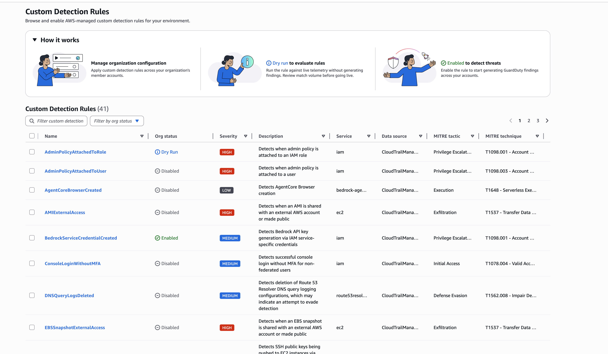
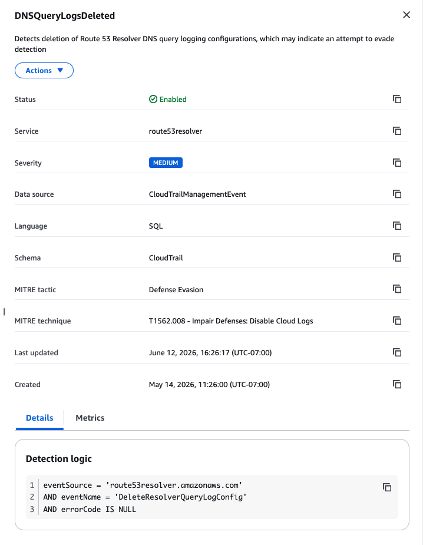

# Available Custom Detection Rules

GuardDuty owns and maintains a library of rules that you can enable in your accounts.
GuardDuty adds new rules and refines existing ones over time to improve detection accuracy
and reduce false positives. Each rule update is versioned. Because the available rules
change, the [ListCustomDetectionRules](../APIReference/API_ListCustomDetectionRules.md "../APIReference/API_ListCustomDetectionRules.md") API operation is the authoritative
source for the rules that you can currently enable. For information about available
rules, see [Custom Detection Rules finding types](findings-custom-detection-rules.md "findings-custom-detection-rules.md").

###### Note

The availability of individual rules depends on the availability of the
corresponding AWS service and feature in each Region. For example, rules that
target AWS Organizations or Amazon Simple Email Service are available only in Regions where those
services operate. Similarly, rules that target Lambda function URLs or SageMaker AI
notebook instances are available only in Regions where those features are
supported.

## Viewing rule detection logic

Each rule defines specific conditions that determine when it fires. You can
inspect the detection logic for any rule:

- **Console** – In the GuardDuty console,
  navigate to **Custom Detection Rules**, and choose a
  rule name. The split panel displays the rule's detection logic on the
  **Details** tab.
- **API** – Call the
  [GetCustomDetectionRule](../APIReference/API_GetCustomDetectionRule.md "../APIReference/API_GetCustomDetectionRule.md") operation. The response
  includes the rule's expression in the
  `Definition.Expression` field.

The following image shows the Custom Detection Rules catalog.

The following image shows the rule details panel with the detection
logic.

## Functions used in detection logic

Custom Detection Rules use SQL conditions that evaluate AWS CloudTrail event fields.
Some rules use specialized functions to inspect nested JSON structures within
event fields like `requestParameters` and
`responseElements`. The following table describes the functions that
might appear in rule detection logic.

| Function                                              | Returns | Description                                                                                                                                                                                                                           |
| ----------------------------------------------------- | ------- | ------------------------------------------------------------------------------------------------------------------------------------------------------------------------------------------------------------------------------------- |
| `get_json_object(json, path)`                         | String  | Extracts a value from a JSON document using a dot-separated path (for example, `$.requestParameters.bucketName`). Returns the value as a string.                                                                             |
| `json_collect_values(json, path, field)`           | Array   | Navigates to an array within a JSON document and collects the specified field from each element. This function extracts a list of values from repeated structures like IAM policy statements or security group rules.        |
| `get_aws_principal(policy_json, effect)`           | Array   | Parses an IAM, Amazon S3, or Lambda resource policy and returns the AWS account principals from statements that match the specified effect (Allow or Deny). This function detects cross-account access in resource policies. |
| `policy_has_public_principal(policy_json, effect)` | Boolean | Returns true when any statement with the specified effect grants access to a public principal (`"*"`). This function detects policies that allow public access.                                                              |
