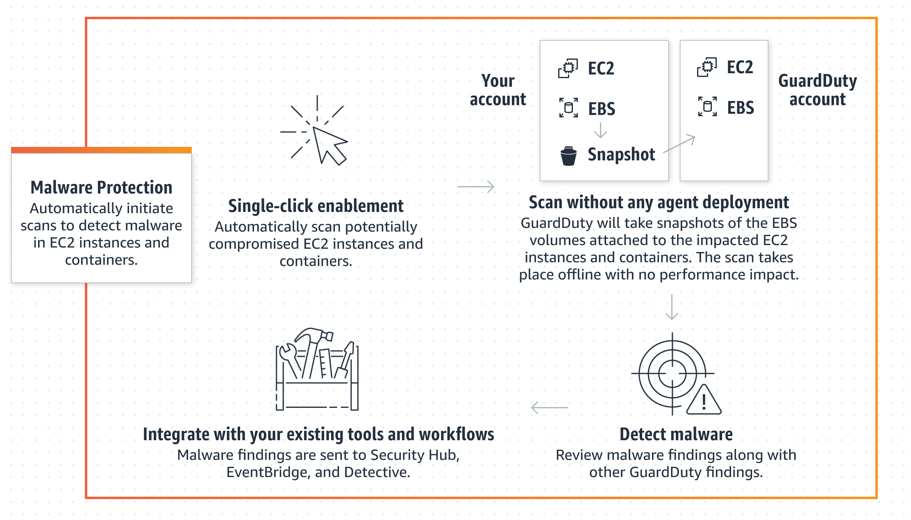

# GuardDuty-initiated malware scan

With GuardDuty-initiated malware scan enabled, whenever GuardDuty generates
[Findings that invoke
GuardDuty-initiated malware scan](gd-findings-initiate-malware-protection-scan.md "gd-findings-initiate-malware-protection-scan.md"), an agentless malware scan on
the Amazon Elastic Block Store (Amazon EBS) volumes attached to the potentially impacted Amazon EC2
resource will initiate. Before a scan initiates, you must prepare your account for any customizations. With scan options, you can add
inclusion tags associated with the resources that you want to scan, or add exclusion tags
associated with the resources that you want to skip from the scanning process. An automatic scan
initiation will always consider your scan options. GuardDuty also supports a global
`GuardDutyExcluded`:`true` tag key:value pair. When you add this global tag to an Amazon EC2 resource, GuardDuty
will initiate the scan and then skip it. You can also choose to turn on the snapshots
retention setting to retain the snapshots of your EBS volumes where malware was potentially detected.
For more information about scan options, global exclusion tag, and snapshot settings, see [Set up snapshot retention and EC2 scan coverage](malware-protection-customizations.md "malware-protection-customizations.md").

When GuardDuty generates multiple findings for the same Amazon EC2 resource, GuardDuty will be able to initiate a scan only after 24 hours have been passed since
the last GuardDuty-initiated malware scan. For information about how the
Amazon EBS volumes attached to your Amazon EC2 instance or container workload are scanned, see [How GuardDuty scans EBS
volumes for malware detection](guardduty_malware_protection-ebs-volume-data.md "guardduty_malware_protection-ebs-volume-data.md").

The following image describes how GuardDuty-initiated malware scan works.

For information about GuardDuty malware detection methodology and the scan engines that it uses, see
[GuardDuty malware detection scan
engine](guardduty-malware-detection-scan-engine.md "guardduty-malware-detection-scan-engine.md").

When malware is found, GuardDuty generates [Malware Protection for EC2 finding types](findings-malware-protection.md "findings-malware-protection.md"). If GuardDuty doesn't generate a finding indicative of
malware on the same resource, no GuardDuty-initiated malware scan will be invoked. You can also initiate an
On-demand malware scan on the same resource. For more information, see [On-demand malware scan in GuardDuty](on-demand-malware-scan.md "on-demand-malware-scan.md").
