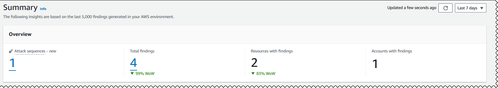
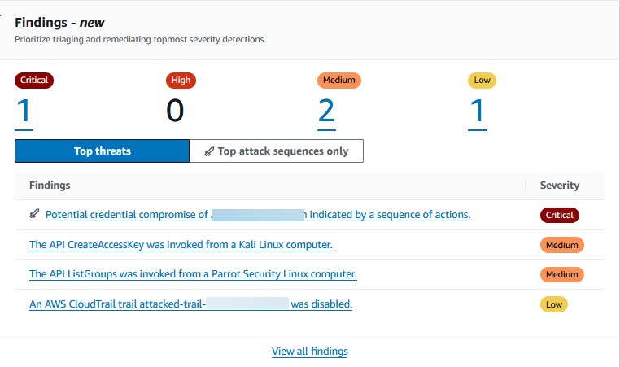
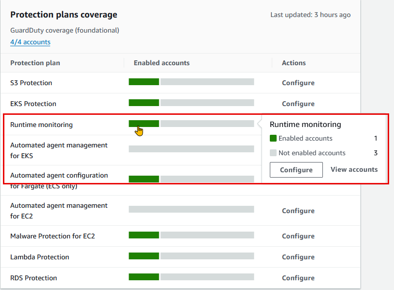

# Summary dashboard in Amazon GuardDuty

The GuardDuty **Summary** dashboard provides an aggregated view of the GuardDuty findings
generated in your AWS account in the current AWS Region.

If you're using a GuardDuty administrator account, the dashboard provides aggregated statistics and data for your
account and member accounts in your organization.

###### Viewing Summary dashboard

1. Open the GuardDuty console at [https://console.aws.amazon.com/guardduty/](https://console.aws.amazon.com/guardduty/ "https://console.aws.amazon.com/guardduty/").

GuardDuty displays the **Summary** dashboard by default when you open the console. 2. On the **Summary** page, choose the desired AWS Region from the Region selector
in the top-right corner of the console. 3. From the date range selector menu, choose the date range for which you want to view the summary. By default,
the dashboard displays the data for the present day, **Today**.

###### Note

If no findings were generated during the selected date range, the dashboard will not have any data to display. You
can refresh the dashboard, or adjust the date range.

###### Topics

- [Overview](#understanding-guardduty-summary-overview "#understanding-guardduty-summary-overview")
- [Findings](#understanding-guardduty-summary-findings-widget "#understanding-guardduty-summary-findings-widget")
- [Most common finding
  types](#understanding-guardduty-summary-most-common-finding-types "#understanding-guardduty-summary-most-common-finding-types")
- [Findings by severity](#understanding-guardduty-summary-findings-by-sev "#understanding-guardduty-summary-findings-by-sev")
- [Accounts with most
  findings](#understanding-guardduty-summary-account-with-findings "#understanding-guardduty-summary-account-with-findings")
- [Resources with findings](#understanding-guardduty-summary-resources-with-findings "#understanding-guardduty-summary-resources-with-findings")
- [Least occurring
  findings](#understanding-guardduty-summary-least-occurring-findings "#understanding-guardduty-summary-least-occurring-findings")
- [Protection plans
  coverage](#understanding-guardduty-summary-protection-plans-coverage "#understanding-guardduty-summary-protection-plans-coverage")

## Overview

This section provides the following data:

- **Attack sequences**: Indicates the number of attack sequence findings
  that GuardDuty generated in your account in the current Region.

GuardDuty detects potential multi-stage attacks in your account. You can select
the _number_ under **Attack sequences** to view its details on the
**Findings** page.

- **Total findings**: Indicates the total number of findings
  generated in your account in the current Region. This includes both individual findings and
  attack sequence findings.
- **Resources with findings**: Indicates the number of
  resources that are associated to a finding, and have been potentially compromised.
- **Accounts with findings**: Indicates the number of
  accounts in which at least one finding was generated. If you're a standalone account, the
  value in this field is **1**.

For the time ranges **Last 7 days** and **Last 30
days**, the **Overview** pane may show the percentage difference in
the findings generated week over week (WoW) or month over month (MoM), respectively. If no
findings were generated in the week or the month before, then with no data to compare, the
percentage difference may not be available.

If you're a GuardDuty administrator account, all of these fields provide the summarized data across all the
member accounts in your organization.

## Findings

The **Findings** widget displays up to eight top findings. These findings are listed on the basis of
their severity level, with _Critical_ findings displayed first.

By default, you can view all the findings. To view only attack sequence findings data, turn on
**Top attack sequences only**.

In this list, you can select any finding to view its details.

## Most common finding

types

This section provides a pie chart illustrating the top five most common finding types
generated in the current Region. When hovering over each sector
of the pie chart, you can observe the following:

- **Findings count**: Indicates the number of times this
  finding has been generated in the chosen date range.
- **Severity**: Indicates the severity level of the finding.
- **Percentage**: Indicates proportion of this finding type
  relative to the total.
- **Last generated**: Indicates how much time has passed
  since this finding type was last detected.

## Findings by severity

This section displays a bar chart showing the total number of findings over the selected date range.
The chart breaks down findings by severity (_Critical_,
_High_, _Medium_, and _Low_),
and helps you view the number of findings for specific dates within the range.

To view the counts for each severity level on a specific date, hover over the corresponding bar in
the chart.

## Accounts with most

findings

This section provides the following data:

- **Account**: Indicates the AWS account ID where the
  finding was generated.
- **Finding count**: Indicates the number of times a finding
  was generated for this account ID.
- **Last generated**: Indicates how much time has passed
  since a finding type was last generated for this account ID.
- **Severity filter**: By default, the data is shown for the
  high severity finding types. Possible options for this field are **All
  severity**, **Critical
  severity**, **High
  severity**, and **Medium severity**.

## Resources with findings

This section provides the following data:

- **Resource**: Shows the potentially impacted resource
  type and if this resource belongs to your account, you can access the quick link to view the
  resource details. If you're a GuardDuty administrator account, you can view the details of the potentially
  impacted resource by accessing the GuardDuty console with the credentials of the owner member account.
- **Account**: Indicates the AWS account ID to which this
  resource belongs.
- **Finding count**: Indicates the number of times that this
  resource was associated to a finding.
- **Last generated**: Indicates how much time has passed
  since a finding type associated to this resource was last generated.
- **Resource type filter**: By default, the data is shown for
  all the resource types. By using this filter, you can choose to
  view the data for a specific
  resource type, such as **Instance**, **AccessKey**,
  **Lambda**, and others.
- **Severity filter**: By default, the data is shown for **All
  severity**. By using this filter, you can choose to view the data for other severity
  levels. Possible options are **Critical severity**, **High severity**, **Medium
  severity**, and **All severity**.

## Least occurring

findings

This section highlights finding types that occur infrequently in your AWS environment. This
widget is designed to help you identify and investigate potential emergent threat patterns.

This widget displays the following data:

- **Finding type**: Shows the finding type name.
- **Finding count**: Indicates the number of times that this
  finding type was generated in the chosen time range.
- **Last generated**: Indicates how much time has passed
  since this finding type was last generated.
- **Severity filter**: By default, the data is shown for the
  high severity finding types. Possible options for this field are **Critical
  severity**, **High
  severity**, **Medium severity**, and **All
  severity**.

## Protection plans

coverage

This section displays statistics for the member accounts in your organization. It shows the number of member accounts
that have enabled GuardDuty (foundational threat detection) in the current Region. Only a delegated GuardDuty administrator
can view the statistics for the member accounts
within their organization. When you create a new AWS organization, it might take up to 24 hours to generate the
statistics for the entire organization.

###### How to use this widget

- **Configuration**: If a protection plan is not configured, choose
  **Configure** under the **Actions** column.
- **Viewing enabled accounts**: Hover over the bar in the
  **Enabled accounts** column to view how many accounts have enabled each protection plan.
  To further view account details, select the green bar, and choose **View accounts**.

