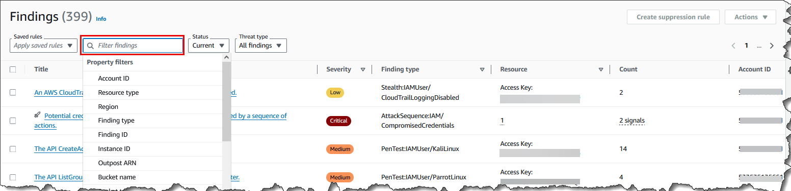
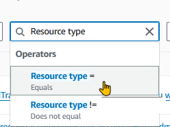
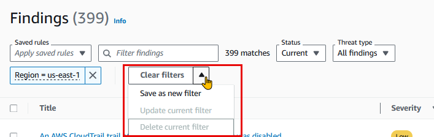

# Filtering findings in GuardDuty

A finding filter allows you to view findings that match the criteria you specify and
filter out any unmatched findings. You can easily create finding filters using the Amazon GuardDuty
console, or you can create them with the [CreateFilter](../APIReference/API_CreateFilter.md "../APIReference/API_CreateFilter.md") API using JSON. Review the following sections to
understand how to create a filter in the console. To use these filters to automatically
archive incoming findings, see [Suppression rules in GuardDuty](findings_suppression-rule.md "findings_suppression-rule.md").

When you create filters, take the following list into consideration:

- GuardDuty **doesn't support** wild cards for filter criteria.
- You can specify a minimum of one attribute and up to a maximum of 50
  attributes as the criteria for a particular filter.
- When you use the **Equals** or **Does not equals**
  operator to filter on an attribute value, such as Account ID,
  you can specify a maximum of 50 values.
- Each filter criteria attribute is evaluated as an `AND` operator.
  Multiple values for the same attribute are evaluated as
  `AND/OR`.
- For information about the maximum number of saved filters that you can create in an AWS account in each AWS Region, see
  [GuardDuty quotas](guardduty_limits.md "guardduty_limits.md").
  The following sections provide instructions on how to create and save filters using GuardDuty console, and API and CLI commands. Choose
  your preferred access method to proceed.

## Creating and saving filter set in the GuardDuty console

Finding filters can be created and tested through the GuardDuty console. You can save
filters created through the console for use in suppression rules or future filter
operations. A filter is made up of at least one filter criteria, which consists of one
filter attribute paired with at least one value.

###### To create and save filter criteria (console)

1. Sign in to the AWS Management Console and open the GuardDuty console at [https://console.aws.amazon.com/guardduty/](https://console.aws.amazon.com/guardduty/ "https://console.aws.amazon.com/guardduty/").
2. In the left navigation pane, choose **Findings**.
3. On the **Findings** page, select the _Filter findings_ bar next to
   **Saved rules** menu. This will display an expanded list of **Property
   filters**.

 4. From the expanded list of filters, select an attribute based on which you want to filter the
findings table.

For example, to view findings for which the potentially
impacted resource is an **S3Bucket**, choose **Resource type**. 5. For
**Operators**, choose one that will help you filter the findings to get the desired result.
To continue the example from the previous step, choose **Resource type =**. This will
display a list of resource types in GuardDuty.



If your use case requires excluding specific findings, you can choose **Does not equal**
or **!=** operator. 6. Specify the value for the selected property filter. If needed, choose **Apply**.
To continue the example from the previous step, you can choose **S3Bucket**.

This will display the findings that match with the applied filters. 7. To add more than one filter criteria, repeat steps 3-6.

For a complete list of attributes, see [Property filters in GuardDuty](#filter_criteria "#filter_criteria"). 8. ###### (Optional) save the specified attributes and values as filters

To apply this filter combination again in the future, you can
save the specified attributes and their values as
a filter set.

    1. After you have created a filter criteria with one or more property filters, select
     the *arrow* in the **Clear filters** menu.


    
    2. Enter the filter set **Name**. The name must be 3-64 characters. Valid characters
     are a-z, A-Z, 0-9, period (.), hyphen (-), and underscore (\_).
    3. The **Description** is optional. If you enter a description, it can have up to 512 characters.
    4. Choose **Create**.

## Creating and saving filter set by using GuardDuty API and CLI

You can create and test the finding filters by using either API or CLI commands.
A filter is made up of at least one filter criteria, which consists of one
filter attribute paired with at least one value. You can save
filters to create [Suppression rules](findings_suppression-rule.md "findings_suppression-rule.md") or to perform
other filter operations later.

###### To create finding filters using API/CLI

- Run [CreateFilter](../APIReference/API_CreateFilter.md "../APIReference/API_CreateFilter.md") API
  by using the regional detector ID of the AWS account where you want to create a filter.

To find the `detectorId` for your account and current Region, see the
**Settings** page in the [https://console.aws.amazon.com/guardduty/](https://console.aws.amazon.com/guardduty/ "https://console.aws.amazon.com/guardduty/") console,
or run the [ListDetectors](../APIReference/API_ListDetectors.md "../APIReference/API_ListDetectors.md") API.

- Alternatively, you can use the [create-filter](https://awscli.amazonaws.com/v2/documentation/api/latest/reference/guardduty/create-filter.html "https://awscli.amazonaws.com/v2/documentation/api/latest/reference/guardduty/create-filter.html") CLI
  to create and save the filter. You can use one or more filter criteria from [Property filters in GuardDuty](#filter_criteria "#filter_criteria").

Use the following examples by replacing the placeholder values shown in red.

**Example 1**: Create a new filter to view all the findings that match a specific finding type

The following example creates a filter that matches all `PortScan` findings for
an instance created from a specific image. The placeholder values are shown in red.
Replace these values with suitable values for your account. For example, replace
`12abc34d567e8fa901bc2d34EXAMPLE` with your
regional detector ID.

```
aws guardduty create-filter \
--detector-id `12abc34d567e8fa901bc2d34EXAMPLE` \
--name `FilterExampleName` \
--finding-criteria '{"Criterion": {`"type": {"Equals": ["`Recon:EC2/Portscan`"]`}, "`resource.instanceDetails.imageId": {"Equals":["ami-0a7a207083example"]}`} }'
```

**Example 2**: Create a new filter to view all the findings that match severity levels

The following example creates a filter that matches all findings associated with the `HIGH` severity levels.
The placeholder values are shown in red.
Replace these values with suitable values for your account. For example, replace `12abc34d567e8fa901bc2d34EXAMPLE` with your
regional detector ID.

```
aws guardduty create-filter \
--detector-id `12abc34d567e8fa901bc2d34EXAMPLE` \
--name `FilterExampleName` \
--finding-criteria '{"Criterion": {`"severity": {"Equals": ["`7`", "`8`"]`}} }'
```

- For API/CLI, the [Findings severity
  levels](guardduty_findings-severity.md "guardduty_findings-severity.md") are represented as numerals. To filter the findings based on the severity levels, use the following values:
  - For `LOW` severity levels, use `{
"severity": {
"Equals": ["1", "2", "3"]
}
}`
  - For `MEDIUM` severity levels, use `{
"severity": {
"Equals": ["4", "5", "6"]
}
}`
  - For `HIGH` severity levels, use `{
"severity": {
"Equals": ["7", "8"]
}
}`
  - For `CRITICAL` severity levels, use `{
"severity": {
"Equals": ["9", "10"]
}
}`
  - For findings with multiple severity levels, use placeholder values similar to the following example: `{
"severity": {
"Equals": ["7", "8", "9", "10"]
}
}`

  This example will show the findings that have either `HIGH` or `CRITICAL` severity levels.

  ###### Note

  If you specify an example with only one numeric value instead of all the numeric values associated with a severity level,
  the API and CLI might show the filtered findings. When you use this saved filter set in
  the GuardDuty console, it will not work as expected. This
  is because the GuardDuty console considers the filter values as `CRITICAL`, `HIGH`, `MEDIUM`, and `LOW`.
  For example, a filter created with a CLI command that includes `{
 "severity": {
 "Equals": ["9"]
 }
 }` is expected to show an appropriate output in API/CLI. However, this saved filter includes
  partial severity level when used in the GuardDuty console and will not show an expected output. This makes
  it necessary for the API and CLI to specify all the values associated with each severity level.

## Property filters in GuardDuty

When you create filters or sort findings using the API operations, you must specify
filter criteria in JSON. These filter criteria correlate to a finding's details JSON.
The following table contains a list of the console display names for filter attributes
and their equivalent JSON field names.

| Console field name                     | JSON field name                                                                                                                                                                                                                                                                                                                                                                                                                                                                                                                                                                                                     |
| -------------------------------------- | ------------------------------------------------------------------------------------------------------------------------------------------------------------------------------------------------------------------------------------------------------------------------------------------------------------------------------------------------------------------------------------------------------------------------------------------------------------------------------------------------------------------------------------------------------------------------------------------------------------------- |
| Account ID                             | accountId                                                                                                                                                                                                                                                                                                                                                                                                                                                                                                                                                                                                           |
| Finding ID                             | id                                                                                                                                                                                                                                                                                                                                                                                                                                                                                                                                                                                                                  |
| Region                                 | region                                                                                                                                                                                                                                                                                                                                                                                                                                                                                                                                                                                                              |
| Severity                               | severity You can filter the finding types based on the severity level of the finding types. For more information about severity values, see [Severity levels of GuardDuty findings](guardduty_findings-severity.md "guardduty_findings-severity.md"). If you use `severity` with API, AWS CLI, or AWS CloudFormation, it is assigned a numeric value. For more information, see [findingCriteria](../APIReference/API_CreateFilter.md#guardduty-CreateFilter-request-findingCriteria "../APIReference/API_CreateFilter.md#guardduty-CreateFilter-request-findingCriteria") in the _Amazon GuardDuty API Reference_. |
| Finding type                           | type                                                                                                                                                                                                                                                                                                                                                                                                                                                                                                                                                                                                                |
| Updated at                             | updatedAt                                                                                                                                                                                                                                                                                                                                                                                                                                                                                                                                                                                                           |
| Access Key ID                          | resource.accessKeyDetails.accessKeyId                                                                                                                                                                                                                                                                                                                                                                                                                                                                                                                                                                               |
| Principal ID                           | resource.accessKeyDetails.principalId                                                                                                                                                                                                                                                                                                                                                                                                                                                                                                                                                                               |
| Username                               | resource.accessKeyDetails.userName                                                                                                                                                                                                                                                                                                                                                                                                                                                                                                                                                                                  |
| User type                              | resource.accessKeyDetails.userType                                                                                                                                                                                                                                                                                                                                                                                                                                                                                                                                                                                  |
| IAM instance profile ID                | resource.instanceDetails.iamInstanceProfile.id                                                                                                                                                                                                                                                                                                                                                                                                                                                                                                                                                                      |
| Instance ID                            | resource.instanceDetails.instanceId                                                                                                                                                                                                                                                                                                                                                                                                                                                                                                                                                                                 |
| Instance image ID                      | resource.instanceDetails.imageId                                                                                                                                                                                                                                                                                                                                                                                                                                                                                                                                                                                    |
| Instance tag key                       | resource.instanceDetails.tags.key                                                                                                                                                                                                                                                                                                                                                                                                                                                                                                                                                                                   |
| Instance tag value                     | resource.instanceDetails.tags.value                                                                                                                                                                                                                                                                                                                                                                                                                                                                                                                                                                                 |
| IPv6 address                           | resource.instanceDetails.networkInterfaces.ipv6Addresses                                                                                                                                                                                                                                                                                                                                                                                                                                                                                                                                                            |
| Private IPv4 address                   | resource.instanceDetails.networkInterfaces.privateIpAddresses.privateIpAddress                                                                                                                                                                                                                                                                                                                                                                                                                                                                                                                                      |
| Public DNS name                        | resource.instanceDetails.networkInterfaces.publicDnsName                                                                                                                                                                                                                                                                                                                                                                                                                                                                                                                                                            |
| Public IP                              | resource.instanceDetails.networkInterfaces.publicIp                                                                                                                                                                                                                                                                                                                                                                                                                                                                                                                                                                 |
| Security group ID                      | resource.instanceDetails.networkInterfaces.securityGroups.groupId                                                                                                                                                                                                                                                                                                                                                                                                                                                                                                                                                   |
| Security group name                    | resource.instanceDetails.networkInterfaces.securityGroups.groupName                                                                                                                                                                                                                                                                                                                                                                                                                                                                                                                                                 |
| Subnet ID                              | resource.instanceDetails.networkInterfaces.subnetId                                                                                                                                                                                                                                                                                                                                                                                                                                                                                                                                                                 |
| VPC ID                                 | resource.instanceDetails.networkInterfaces.vpcId                                                                                                                                                                                                                                                                                                                                                                                                                                                                                                                                                                    |
| Outpost ARN                            | resource.instanceDetails.outpostARN                                                                                                                                                                                                                                                                                                                                                                                                                                                                                                                                                                                 |
| Resource type                          | resource.resourceType                                                                                                                                                                                                                                                                                                                                                                                                                                                                                                                                                                                               |
| Bucket permissions                     | resource.s3BucketDetails.publicAccess.effectivePermission                                                                                                                                                                                                                                                                                                                                                                                                                                                                                                                                                           |
| Bucket name                            | resource.s3BucketDetails.name                                                                                                                                                                                                                                                                                                                                                                                                                                                                                                                                                                                       |
| Bucket tag key                         | resource.s3BucketDetails.tags.key                                                                                                                                                                                                                                                                                                                                                                                                                                                                                                                                                                                   |
| Bucket tag value                       | resource.s3BucketDetails.tags.value                                                                                                                                                                                                                                                                                                                                                                                                                                                                                                                                                                                 |
| Bucket type                            | resource.s3BucketDetails.type                                                                                                                                                                                                                                                                                                                                                                                                                                                                                                                                                                                       |
| Action type                            | service.action.actionType                                                                                                                                                                                                                                                                                                                                                                                                                                                                                                                                                                                           |
| API called                             | service.action.awsApiCallAction.api                                                                                                                                                                                                                                                                                                                                                                                                                                                                                                                                                                                 |
| API caller type                        | service.action.awsApiCallAction.callerType                                                                                                                                                                                                                                                                                                                                                                                                                                                                                                                                                                          |
| API Error Code                         | service.action.awsApiCallAction.errorCode                                                                                                                                                                                                                                                                                                                                                                                                                                                                                                                                                                           |
| API caller city                        | service.action.awsApiCallAction.remoteIpDetails.city.cityName                                                                                                                                                                                                                                                                                                                                                                                                                                                                                                                                                       |
| API caller country                     | service.action.awsApiCallAction.remoteIpDetails.country.countryName                                                                                                                                                                                                                                                                                                                                                                                                                                                                                                                                                 |
| API caller IPv4 address                | service.action.awsApiCallAction.remoteIpDetails.ipAddressV4                                                                                                                                                                                                                                                                                                                                                                                                                                                                                                                                                         |
| API caller IPv6 address                | service.action.awsApiCallAction.remoteIpDetails.ipAddressV6                                                                                                                                                                                                                                                                                                                                                                                                                                                                                                                                                         |
| API caller ASN ID                      | service.action.awsApiCallAction.remoteIpDetails.organization.asn                                                                                                                                                                                                                                                                                                                                                                                                                                                                                                                                                    |
| API caller ASN name                    | service.action.awsApiCallAction.remoteIpDetails.organization.asnOrg                                                                                                                                                                                                                                                                                                                                                                                                                                                                                                                                                 |
| API caller service name                | service.action.awsApiCallAction.serviceName                                                                                                                                                                                                                                                                                                                                                                                                                                                                                                                                                                         |
| DNS request domain                     | service.action.dnsRequestAction.domain                                                                                                                                                                                                                                                                                                                                                                                                                                                                                                                                                                              |
| DNS request domain suffix              | service.action.dnsRequestAction.domainWithSuffix                                                                                                                                                                                                                                                                                                                                                                                                                                                                                                                                                                    |
| Network connection blocked             | service.action.networkConnectionAction.blocked                                                                                                                                                                                                                                                                                                                                                                                                                                                                                                                                                                      |
| Network connection direction           | service.action.networkConnectionAction.connectionDirection                                                                                                                                                                                                                                                                                                                                                                                                                                                                                                                                                          |
| Network connection local port          | service.action.networkConnectionAction.localPortDetails.port                                                                                                                                                                                                                                                                                                                                                                                                                                                                                                                                                        |
| Network connection protocol            | service.action.networkConnectionAction.protocol                                                                                                                                                                                                                                                                                                                                                                                                                                                                                                                                                                     |
| Network connection city                | service.action.networkConnectionAction.remoteIpDetails.city.cityName                                                                                                                                                                                                                                                                                                                                                                                                                                                                                                                                                |
| Network connection country             | service.action.networkConnectionAction.remoteIpDetails.country.countryName                                                                                                                                                                                                                                                                                                                                                                                                                                                                                                                                          |
| Network connection remote IPv4 address | service.action.networkConnectionAction.remoteIpDetails.ipAddressV4                                                                                                                                                                                                                                                                                                                                                                                                                                                                                                                                                  |
| Network connection remote IPv6 address | service.action.networkConnectionAction.remoteIpDetails.ipAddressV6                                                                                                                                                                                                                                                                                                                                                                                                                                                                                                                                                  |
| Network connection remote IP ASN ID    | service.action.networkConnectionAction.remoteIpDetails.organization.asn                                                                                                                                                                                                                                                                                                                                                                                                                                                                                                                                             |
| Network connection remote IP ASN name  | service.action.networkConnectionAction.remoteIpDetails.organization.asnOrg                                                                                                                                                                                                                                                                                                                                                                                                                                                                                                                                          |
| Network connection remote port         | service.action.networkConnectionAction.remotePortDetails.port                                                                                                                                                                                                                                                                                                                                                                                                                                                                                                                                                       |
| Remote account affiliated              | service.action.awsApiCallAction.remoteAccountDetails.affiliated                                                                                                                                                                                                                                                                                                                                                                                                                                                                                                                                                     |
| Kubernetes API caller IPv4 address     | service.action.kubernetesApiCallAction.remoteIpDetails.ipAddressV4                                                                                                                                                                                                                                                                                                                                                                                                                                                                                                                                                  |
| Kubernetes API caller IPv6 address     | service.action.kubernetesApiCallAction.remoteIpDetails.ipAddressV6                                                                                                                                                                                                                                                                                                                                                                                                                                                                                                                                                  |
| Kubernetes namespace                   | service.action.kubernetesApiCallAction.namespace                                                                                                                                                                                                                                                                                                                                                                                                                                                                                                                                                                    |
| Kubernetes API caller ASN ID           | service.action.kubernetesApiCallAction.remoteIpDetails.organization.asn                                                                                                                                                                                                                                                                                                                                                                                                                                                                                                                                             |
| Kubernetes API call request URI        | service.action.kubernetesApiCallAction.requestUri                                                                                                                                                                                                                                                                                                                                                                                                                                                                                                                                                                   |
| Kubernetes API status code             | service.action.kubernetesApiCallAction.statusCode                                                                                                                                                                                                                                                                                                                                                                                                                                                                                                                                                                   |
| Network connection local IPv4 address  | service.action.networkConnectionAction.localIpDetails.ipAddressV4                                                                                                                                                                                                                                                                                                                                                                                                                                                                                                                                                   |
| Network connection local IPv6 address  | service.action.networkConnectionAction.localIpDetails.ipAddressV6                                                                                                                                                                                                                                                                                                                                                                                                                                                                                                                                                   |
| Protocol                               | service.action.networkConnectionAction.protocol                                                                                                                                                                                                                                                                                                                                                                                                                                                                                                                                                                     |
| API call service name                  | service.action.awsApiCallAction.serviceName                                                                                                                                                                                                                                                                                                                                                                                                                                                                                                                                                                         |
| API caller account ID                  | service.action.awsApiCallAction.remoteAccountDetails.accountId                                                                                                                                                                                                                                                                                                                                                                                                                                                                                                                                                      |
| Threat list name                       | service.additionalInfo.threatListName                                                                                                                                                                                                                                                                                                                                                                                                                                                                                                                                                                               |
| Resource role                          | service.resourceRole                                                                                                                                                                                                                                                                                                                                                                                                                                                                                                                                                                                                |
| EKS cluster name                       | resource.eksClusterDetails.name                                                                                                                                                                                                                                                                                                                                                                                                                                                                                                                                                                                     |
| Kubernetes workload name               | resource.kubernetesDetails.kubernetesWorkloadDetails.name                                                                                                                                                                                                                                                                                                                                                                                                                                                                                                                                                           |
| Kubernetes workload namespace          | resource.kubernetesDetails.kubernetesWorkloadDetails.namespace                                                                                                                                                                                                                                                                                                                                                                                                                                                                                                                                                      |
| Kubernetes user name                   | resource.kubernetesDetails.kubernetesUserDetails.username                                                                                                                                                                                                                                                                                                                                                                                                                                                                                                                                                           |
| Kubernetes container image             | resource.kubernetesDetails.kubernetesWorkloadDetails.containers.image                                                                                                                                                                                                                                                                                                                                                                                                                                                                                                                                               |
| Kubernetes container image prefix      | resource.kubernetesDetails.kubernetesWorkloadDetails.containers.imagePrefix                                                                                                                                                                                                                                                                                                                                                                                                                                                                                                                                         |
| Scan ID                                | service.ebsVolumeScanDetails.scanId                                                                                                                                                                                                                                                                                                                                                                                                                                                                                                                                                                                 |
| EBS volume scan threat name            | service.ebsVolumeScanDetails.scanDetections.threatDetectedByName.threatNames.name                                                                                                                                                                                                                                                                                                                                                                                                                                                                                                                                   |
| S3 object scan threat name             | service.malwareScanDetails.threats.name                                                                                                                                                                                                                                                                                                                                                                                                                                                                                                                                                                             |
| Threat severity                        | service.ebsVolumeScanDetails.scanDetections.threatDetectedByName.threatNames.severity                                                                                                                                                                                                                                                                                                                                                                                                                                                                                                                               |
| File SHA                               | service.ebsVolumeScanDetails.scanDetections.threatDetectedByName.threatNames.filePaths.hash                                                                                                                                                                                                                                                                                                                                                                                                                                                                                                                         |
| ECS cluster name                       | resource.ecsClusterDetails.name                                                                                                                                                                                                                                                                                                                                                                                                                                                                                                                                                                                     |
| ECS container image                    | resource.ecsClusterDetails.taskDetails.containers.image                                                                                                                                                                                                                                                                                                                                                                                                                                                                                                                                                             |
| ECS task definition ARN                | resource.ecsClusterDetails.taskDetails.definitionArn                                                                                                                                                                                                                                                                                                                                                                                                                                                                                                                                                                |
| Standalone container image             | resource.containerDetails.image                                                                                                                                                                                                                                                                                                                                                                                                                                                                                                                                                                                     |
| Database Instance Id                   | resource.rdsDbInstanceDetails.dbInstanceIdentifier                                                                                                                                                                                                                                                                                                                                                                                                                                                                                                                                                                  |
| Database Cluster Id                    | resource.rdsDbInstanceDetails.dbClusterIdentifier                                                                                                                                                                                                                                                                                                                                                                                                                                                                                                                                                                   |
| Database Engine                        | resource.rdsDbInstanceDetails.engine                                                                                                                                                                                                                                                                                                                                                                                                                                                                                                                                                                                |
| Database user                          | resource.rdsDbUserDetails.user                                                                                                                                                                                                                                                                                                                                                                                                                                                                                                                                                                                      |
| Database instance tag key              | resource.rdsDbInstanceDetails.tags.key                                                                                                                                                                                                                                                                                                                                                                                                                                                                                                                                                                              |
| Database instance tag value            | resource.rdsDbInstanceDetails.tags.value                                                                                                                                                                                                                                                                                                                                                                                                                                                                                                                                                                            |
| Executable SHA-256                     | service.runtimeDetails.process.executableSha256                                                                                                                                                                                                                                                                                                                                                                                                                                                                                                                                                                     |
| Process name                           | service.runtimeDetails.process.name                                                                                                                                                                                                                                                                                                                                                                                                                                                                                                                                                                                 |
| Executable path                        | service.runtimeDetails.process.executablePath                                                                                                                                                                                                                                                                                                                                                                                                                                                                                                                                                                       |
| Lambda function name                   | resource.lambdaDetails.functionName                                                                                                                                                                                                                                                                                                                                                                                                                                                                                                                                                                                 |
| Lambda function ARN                    | resource.lambdaDetails.functionArn                                                                                                                                                                                                                                                                                                                                                                                                                                                                                                                                                                                  |
| Lambda function tag key                | resource.lambdaDetails.tags.key                                                                                                                                                                                                                                                                                                                                                                                                                                                                                                                                                                                     |
| Lambda function tag value              | resource.lambdaDetails.tags.value                                                                                                                                                                                                                                                                                                                                                                                                                                                                                                                                                                                   |
| DNS request domain                     | service.action.dnsRequestAction.domainWithSuffix                                                                                                                                                                                                                                                                                                                                                                                                                                                                                                                                                                    |
