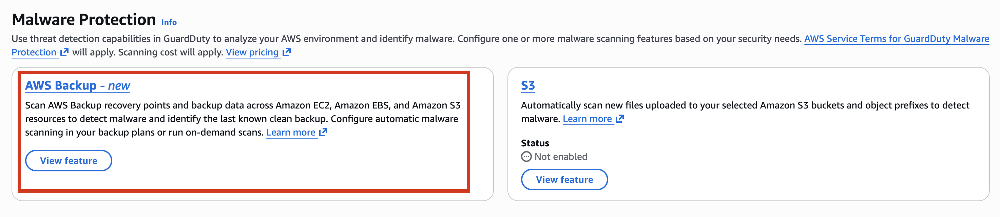
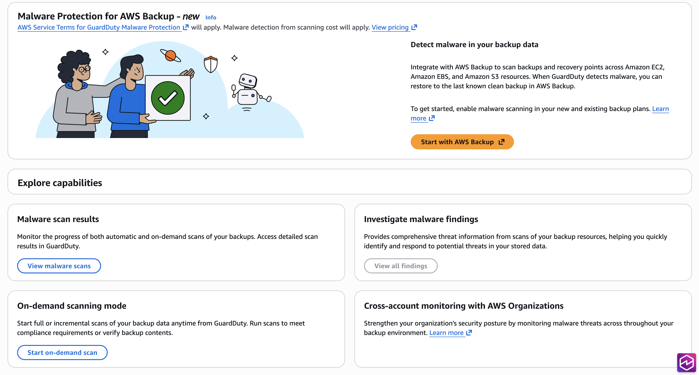

# **(Optional) Get started with Malware Protection for Backup Independently (console only)**

Use this optional step when you want to get started with Malware Protection for Backup threat detection option independent of the GuardDuty status in your AWS account.

If you also want to use other dedicated protection plans in GuardDuty, you must get started with the Amazon GuardDuty service. For information about GuardDuty protection plans, see [Features of GuardDuty](what-is-guardduty.md#features-of-guardduty "what-is-guardduty.md#features-of-guardduty").

## **Steps to get started with Malware Protection for Backup**

1. Sign in to the AWS Management Console and open the [https://console.aws.amazon.com/guardduty/](https://console.aws.amazon.com/guardduty/ "https://console.aws.amazon.com/guardduty/") console at [https://console.aws.amazon.com/guardduty/](https://console.aws.amazon.com/guardduty/ "https://console.aws.amazon.com/guardduty/")
2. Select **Discover Malware Protection Features** and click on **Get Started**.
3. On clicking **Get Started**, you can choose between options including AWS Backup and S3 Malware Protection features.

 4. You are taken to the Malware Protection for Backup page, where you can choose to **Start an on-demand scan** or **View malware scans**.

