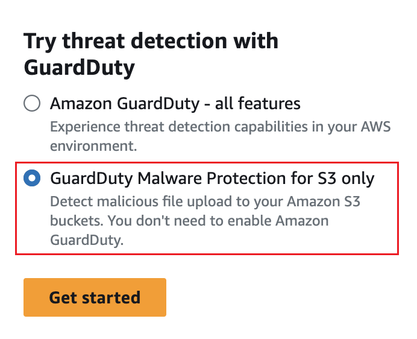

# (Optional) Get started with GuardDuty

Malware Protection for S3 independently (console only)

Use this optional step when you want to get started with Malware Protection for S3 threat detection option
independent of the GuardDuty status in your AWS account.

If you also want to use other dedicated protection plans in GuardDuty, you must get started with
the Amazon GuardDuty service. For information about GuardDuty protection plans, see [Features of GuardDuty](what-is-guardduty.md#features-of-guardduty "what-is-guardduty.md#features-of-guardduty"). When you have already
enabled GuardDuty in your account, then you can skip this step and continue with [Configuring Malware Protection for S3 for your
bucket](configuring-malware-protection-for-s3-guardduty.md "configuring-malware-protection-for-s3-guardduty.md").

###### Steps to get started with Malware Protection for S3 only threat detection

1. Sign in to the AWS Management Console and open the GuardDuty console at [https://console.aws.amazon.com/guardduty/](https://console.aws.amazon.com/guardduty/ "https://console.aws.amazon.com/guardduty/").
2. Select **GuardDuty Malware Protection for S3 only**. This helps you detect if a newly uploaded
   file in your Amazon Simple Storage Service (Amazon S3) bucket potentially contains malware.

 3. Choose **Get started**. You can now continue with steps under [Configuring Malware Protection for S3 for your
bucket](configuring-malware-protection-for-s3-guardduty.md "configuring-malware-protection-for-s3-guardduty.md").
