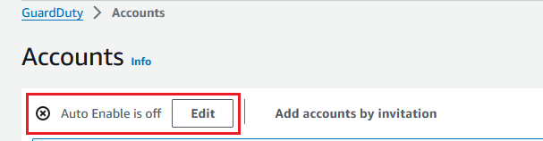

# Setting organization auto-enable

preferences

The auto-enable organization feature in GuardDuty helps you set the same GuardDuty and
protection plans status for `ALL` existing or `NEW` member
accounts in your organization, in a single step. Similarly, you can also specify when
you don't want to take any action on the member accounts, by choosing `NONE`.
The following steps explain these settings and also indicate when you would want to use
a specific setting.

###### Note

You can set auto-enable preferences for all the protection plans except
[Malware Protection for S3](gdu-malware-protection-s3.md "gdu-malware-protection-s3.md").

Choose a preferred access method to update the auto-enable preferences for the
organization.

Console

1. Open the GuardDuty console at [https://console.aws.amazon.com/guardduty/](https://console.aws.amazon.com/guardduty/ "https://console.aws.amazon.com/guardduty/").

To sign in, use the GuardDuty administrator account credentials. 2. In the navigation pane, choose
**Accounts**.

The **Accounts** page provides configuration
options to the GuardDuty administrator account to **Auto-enable**
GuardDuty and the optional protection plans on behalf of the member
accounts that belong to the organization. 3. To update the existing auto-enable settings, choose
**Edit**.



This support is available to configure GuardDuty and all of the
supported optional protection plans in your AWS Region. You can
select one of the following configuration options for GuardDuty on
behalf of your member accounts:

    * **Enable for all accounts
     (`ALL`)** – Select to enable
     the corresponding option for all the accounts in an
     organization. This includes new accounts that join the
     organization and those accounts that may have been suspended
     or removed from the organization. This also includes the
     delegated GuardDuty administrator account.


    ###### Note

    It may take up to 24 hours to update the configuration
     for all member accounts.
    * **Auto-enable for new accounts
     (`NEW`)** – Select to enable
     GuardDuty or the optional protection plans for only new member
     accounts automatically when they join your
     organization.
    * **Do not enable (`NONE`)**
     – Select to prevent enabling the corresponding option
     for new accounts in your organization. In this case, the
     GuardDuty administrator account will manage each account individually.


    When you update the auto-enable setting from
     `ALL` or `NEW` to
     `NONE`, this action doesn't disable the
     corresponding option for your existing accounts. This
     configuration will apply to the new accounts that join the
     organization. After you update the auto-enable settings, no
     new account will have the corresponding option as
     enabled.

###### Note

When a delegated GuardDuty administrator account opts out of an opt-in Region, even if your organization
has the GuardDuty auto-enable configuration set to either new member accounts only
(`NEW`) or all member accounts (`ALL`), GuardDuty
cannot be enabled for any member account in the organization that currently
has GuardDuty disabled. For information about the
configuration of your member accounts,
open **Accounts** in the [GuardDuty console](https://console.aws.amazon.com/guardduty/ "https://console.aws.amazon.com/guardduty/") navigation pane or use the
[ListMembers](../APIReference/API_ListMembers.md "../APIReference/API_ListMembers.md") API. 4. Choose **Save changes**. 5. (Optional) if you want to use the same preferences in each Region,
update your preferences in each of the supported Regions
separately.

Some of the optional protection plans may not be available in all
the AWS Regions where GuardDuty is available. For more information,
see [Regions and endpoints](guardduty_regions.md "guardduty_regions.md").

API/CLI

1. Run [UpdateOrganizationConfiguration](../APIReference/API_UpdateOrganizationConfiguration.md "../APIReference/API_UpdateOrganizationConfiguration.md") by
   using the credentials of the delegated GuardDuty administrator account, to automatically configure
   GuardDuty and optional protection plans in that Region for your
   organization. For information about the various auto-enable
   configurations, see [autoEnableOrganizationMembers](../APIReference/API_UpdateOrganizationConfiguration.md#guardduty-UpdateOrganizationConfiguration-request-autoEnableOrganizationMembers "../APIReference/API_UpdateOrganizationConfiguration.md#guardduty-UpdateOrganizationConfiguration-request-autoEnableOrganizationMembers").

To find the `detectorId` for your account and current Region, see the
**Settings** page in the [https://console.aws.amazon.com/guardduty/](https://console.aws.amazon.com/guardduty/ "https://console.aws.amazon.com/guardduty/") console,
or run the [ListDetectors](../APIReference/API_ListDetectors.md "../APIReference/API_ListDetectors.md") API.

To set auto-enable preferences for any of the supported optional
protection plans in your Region, follow the steps provided in the
corresponding documentation sections of each protection plan. 2. You can validate the preferences for your organization in the
current Region. Run [describeOrganizationConfiguration](../APIReference/API_DescribeOrganizationConfiguration.md "../APIReference/API_DescribeOrganizationConfiguration.md").
Make sure to specify the detector ID of the delegated GuardDuty administrator account.

###### Note

It may take up to 24 hours to update the configuration for all
the member accounts. 3. Alternatively, run the following AWS CLI command to set the
preferences to automatically enable or disable GuardDuty in that Region
for new accounts (`NEW`) that join the organization, all
the accounts (`ALL`), or none of the accounts
(`NONE`) in the organization. For more information,
see [autoEnableOrganizationMembers](../APIReference/API_UpdateOrganizationConfiguration.md#guardduty-UpdateOrganizationConfiguration-request-autoEnableOrganizationMembers "../APIReference/API_UpdateOrganizationConfiguration.md#guardduty-UpdateOrganizationConfiguration-request-autoEnableOrganizationMembers"). Based on your
preference, you may need to replace `NEW` with
`ALL` or `NONE`. If you configure the
protection plan with `ALL`, the protection plan will also
be enabled for the delegated GuardDuty administrator account. Make sure to specify the detector ID of
the delegated GuardDuty administrator account that manages the organization configuration.

To find the `detectorId` for your account and current Region, see the
**Settings** page in the [https://console.aws.amazon.com/guardduty/](https://console.aws.amazon.com/guardduty/ "https://console.aws.amazon.com/guardduty/") console,
or run the [ListDetectors](../APIReference/API_ListDetectors.md "../APIReference/API_ListDetectors.md") API.

```
aws guardduty update-organization-configuration --detector-id `12abc34d567e8fa901bc2d34e56789f0` --auto-enable-organization-members=NEW
```

4. You can validate the preferences for your organization in the
   current Region. Run the following AWS CLI command by using the
   detector ID of the delegated GuardDuty administrator account.

```
aws guardduty describe-organization-configuration --detector-id `12abc34d567e8fa901bc2d34e56789f0`
```

(Recommended) repeat the previous steps in each Region by using the
delegated GuardDuty administrator account detector ID.

###### Note

When a delegated GuardDuty administrator account opts out of an opt-in Region, even if your organization
has the GuardDuty auto-enable configuration set to either new member accounts only
(`NEW`) or all member accounts (`ALL`), GuardDuty
cannot be enabled for any member account in the organization that currently
has GuardDuty disabled. For information about the
configuration of your member accounts,
open **Accounts** in the [GuardDuty console](https://console.aws.amazon.com/guardduty/ "https://console.aws.amazon.com/guardduty/") navigation pane or use the
[ListMembers](../APIReference/API_ListMembers.md "../APIReference/API_ListMembers.md") API.
