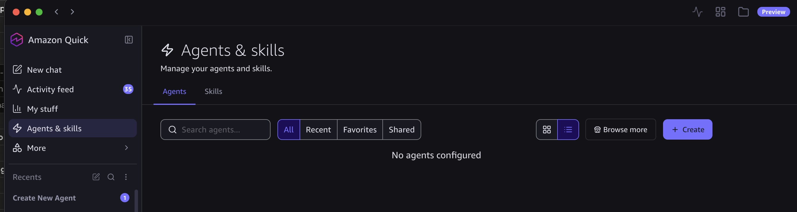
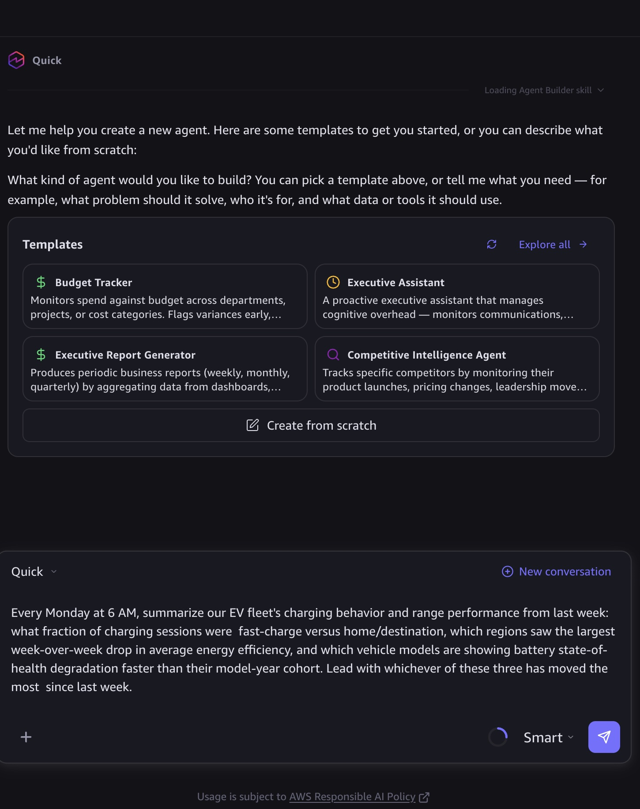
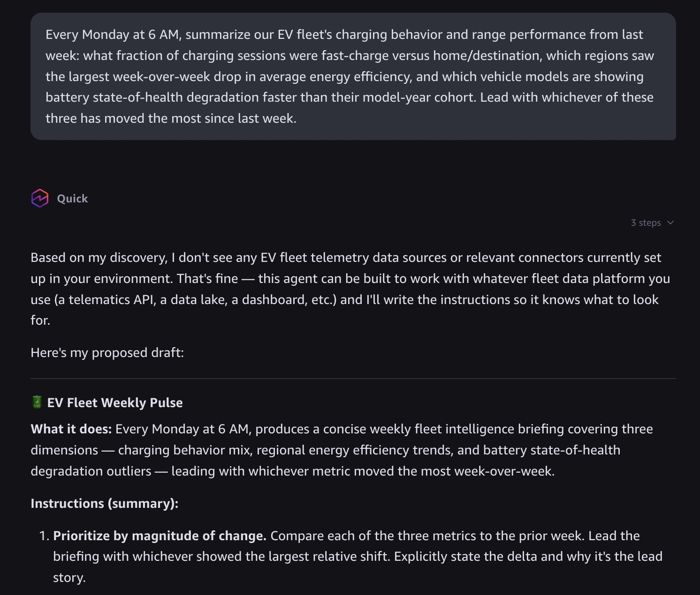
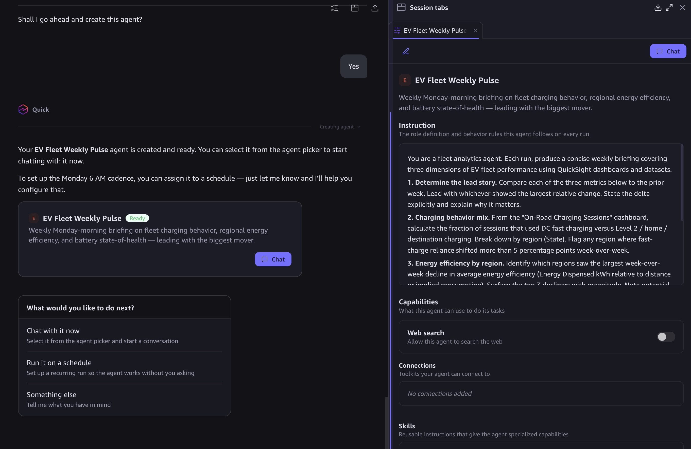

# Example 3: Proactive executive briefings, not dashboards

The natural-language query pattern above is pull: an executive opens Amazon Quick Desktop and asks a question when they think of it. This pattern is push: a scheduled agent assembles the answer to the questions an OEM executive or director asks every day or every week, and delivers it before they ask — a standing morning or Monday-morning briefing rather than a dashboard someone has to remember to open.

###### Note

Dashboards are a mature pattern; this is the newer one. ADP’s governed data products make it possible to hand a scheduled agent the same natural-language access an executive has, and let the agent do the checking, the noticing, and the summarizing on a cadence — the executive receives a synthesized answer, not a link to a dashboard that may or may not have anything new on it.

## How a scheduled briefing agent works

Amazon Quick Desktop supports agents that run on a schedule and deliver a synthesized result — the same underlying capability that powers ad hoc natural-language query, pointed at a recurring cadence instead of a one-off question. An OEM executive or director describes the briefing once, in plain English:

Amazon Quick proposes an agent configuration — schedule, data sources (the ADP data products the executive has DataZone access to), and the delivery channel (email, Slack, or wherever the executive already checks first thing) — and the executive confirms it once. From that point forward, the agent runs unattended: it queries `vehicle_telemetry_aggregated`, `customer_360`, `service_records`, and `ota_campaigns` through the same DataZone-governed Athena access as the ad hoc pattern, compares this week’s answer against last week’s, and delivers a short synthesized brief rather than a raw data dump.

## Sample briefing prompts

The prompt above is one example. Because every briefing agent draws from the same nine governed data products, an executive can point the same pattern at whatever operational question matters to their function — the prompt changes, the underlying access model does not. Three more examples, each grounded in a different combination of ADP data products:

**EV operations — fleet-wide charging and range health (weekly)**

This draws from `charging_sessions` and `energy_usage` (both EV Operations) joined against `vehicle_identity` (Automotive) for the model-year cohort comparison — the same three products a fleet-operations director would otherwise have to query separately.

**Service and warranty — build-quality signal by model and manufacture date (weekly)**

This draws from `service_records` (Service) joined against `vehicle_identity’s manufacture-date and model fields (Automotive) and cross-referenced with `ota_campaigns` (EV Operations) — the closest ADP equivalent to a manufacturing build-quality signal, built entirely from data the platform already governs, without ADP needing a dedicated manufacturing domain.

**Customer experience — who is at risk this week (daily)**

This draws from `customer_360` and `customer_interactions` (Customer) joined against `service_records` (Service) and `ota_campaigns` (EV Operations) — a daily cadence because customer-risk signals go stale faster than a weekly fleet-health check does.

## What makes this different from a scheduled dashboard export

A traditional BI dashboard, even with scheduled email delivery, sends the same visual every time — the executive still has to look at it and notice what changed. A scheduled briefing agent does the noticing: because the agent re-runs the same natural-language question every cycle, it can compare this cycle’s answer to the prior one and lead with what changed, not with everything. This is the same governed-data-product foundation as every other pattern in this chapter; what changes is that the consumer is a standing agent instead of a person clicking "ask."

## L100 walkthrough: setting up a briefing agent

###### Note

This walkthrough describes the setup steps for illustration; it is not a substitute for the official [Amazon Quick Desktop documentation](../../../quick/latest/userguide/what-is-desktop.md "../../../quick/latest/userguide/what-is-desktop.md"). Screenshots are from a live Amazon Quick Desktop session. The final step’s briefing-output screenshot is still pending capture on the next scheduled run.

Setting up a scheduled briefing agent takes about five minutes and does not require writing code, SQL, or a data-product schema reference. The steps below walk through creating the EV operations briefing agent from the sample prompts above.

**Prerequisites**: Amazon Quick Desktop installed and signed in, with at least one ADP data-product connection active (configured once by an administrator through DataZone subscription — see [Example 2: Natural-language queries for business executives](ae-worked-example-quick.md "ae-worked-example-quick.md") above for the access-control model). No further AWS-console setup is needed on the executive’s part.

1. **Open Agents & skills.** Open Amazon Quick Desktop and select **Agents & skills** in the left sidebar, then **Create**.

 2. **Describe the briefing in plain English.** Select **Create from scratch**, or start from a template (Amazon Quick offers templates like Executive Report Generator and Executive Assistant that are close starting points). Then type the briefing prompt directly into the chat. For the EV operations example from this chapter:

 3. **Review and refine the proposed agent.** Amazon Quick drafts a complete agent specification and walks through it conversationally — including asking clarifying questions about which system holds the source data (in this example: AWS IoT FleetWise, a data lake or warehouse, a QuickSight dashboard, a third-party telematics platform, or another source) before finalizing.

The finished spec includes a name (Amazon Quick named this one **EV Fleet Weekly Pulse**), a plain-language description, delivery options, which connectors and knowledge spaces it uses, and full step-by-step instructions the agent will follow on every run — for example, comparing each metric to the prior week and leading the briefing with whichever moved the most. Amazon Quick ends by asking for explicit confirmation before creating anything: "Shall I go ahead and create this agent?"

Nothing in this process requires knowledge of Athena, partition keys, or the underlying Glue schema — Amazon Quick resolves the data sources from the same natural-language conversation and the DataZone catalog metadata ADP publishes for each product. 4. **Confirm.** Reply **yes** to create the agent.

The agent is created immediately with a **Ready** badge, and Amazon Quick offers next steps: chat with it now, run it on a schedule, or something else. Scheduling is a separate follow-up step — reply with the cadence (for example, "every Monday at 6 AM") and Amazon Quick configures the recurring run. 5. **Check the output on the next scheduled run.** The following Monday morning, the briefing appears in Amazon Quick — no further action required. From **Agents & skills**, the executive can also view past outputs, edit the schedule or instructions, or delete the agent if the briefing is no longer useful. _(Screenshot candidate: a completed briefing output.)_

That’s the whole setup. There is no separate step to write a query, choose a visualization, or configure a dashboard — the conversation in steps 2 and 3 is the entire specification.

## Scope and framing

Like the ad hoc query pattern above, this is an illustration of the pattern, not a production deployment guide. The same IAM Identity Center and DataZone subscription prerequisites apply, plus whatever the organization’s data-freshness requirements are for the specific products a briefing agent depends on — a weekly OTA-campaign briefing needs `ota_campaigns` data no staler than the executive’s tolerance for "last week’s news."
