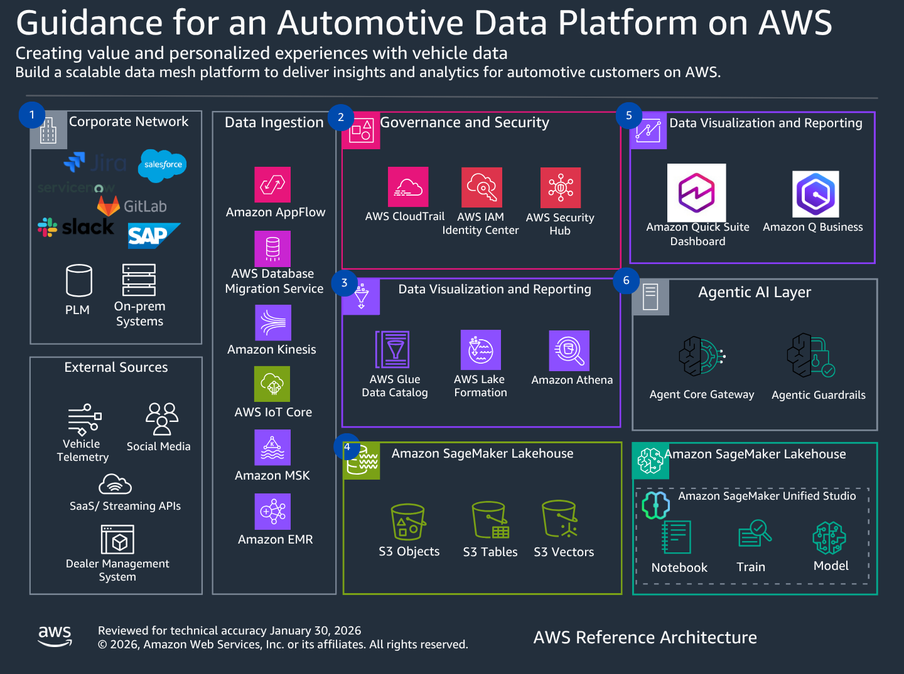

# Architecture overview

This chapter provides a high-level overview of the Automotive Data Platform architecture, including the three integrated solutions and their deployment options.



## Solution Components

The Automotive Data Platform consists of four integrated solutions that can be deployed independently or together:

### Automotive Data Mesh

A domain-oriented decentralized data architecture with centralized governance using [Amazon SageMaker Unified Studio](https://aws.amazon.com/sagemaker/unified-studio/ "https://aws.amazon.com/sagemaker/unified-studio/") and [Amazon DataZone](https://aws.amazon.com/datazone/ "https://aws.amazon.com/datazone/"). This foundation enables cross-domain collaboration, data product discovery, and federated governance across all automotive data domains.

**Key capabilities**: Data product catalog, self-service data access, automated lineage tracking, federated governance, and collaborative workspaces.

### Customer 360 Analytics

Unify customer data from CRM, service, telemetry, and external sources to create comprehensive customer profiles. Enable AI-powered insights through natural language queries using [Amazon Bedrock](https://aws.amazon.com/bedrock/ "https://aws.amazon.com/bedrock/") agents and interactive dashboards with [Amazon QuickSight](https://aws.amazon.com/quicksight/ "https://aws.amazon.com/quicksight/").

**Key capabilities**: Entity resolution, unified customer profiles, AI-powered analytics, and real-time dashboards.

### Predictive Maintenance

Predict vehicle component failures using machine learning models trained on connected vehicle telemetry. Enable proactive service scheduling to reduce downtime and improve customer satisfaction using [Amazon SageMaker](https://aws.amazon.com/sagemaker/ "https://aws.amazon.com/sagemaker/") and [AWS IoT Core](https://aws.amazon.com/iot-core/ "https://aws.amazon.com/iot-core/").

**Key capabilities**: Real-time telemetry ingestion, ML-based failure prediction, proactive service alerts, and dealer integration.

### Automotive Data Governance

Implement comprehensive data governance with automated PII detection, multi-region compliance, and fine-grained access control using [AWS Lake Formation](https://aws.amazon.com/lake-formation/ "https://aws.amazon.com/lake-formation/") and [Amazon Macie](https://aws.amazon.com/macie/ "https://aws.amazon.com/macie/"). Support GDPR, CCPA, and regional data residency requirements.

**Key capabilities**: Automated PII classification, policy-based access control, cross-region governance, and compliance monitoring.

## High-Level Architecture

The Automotive Data Platform consists of six layers that work together to provide comprehensive data management, analytics, and AI capabilities:

### 1. Data Sources Layer

**Internal Systems**:

- CRM platforms (Salesforce, Microsoft Dynamics)
- ERP systems (SAP, Oracle)
- Dealer management systems
- Service management platforms
- Finance and billing systems
- Collaboration tools

**External Systems**:

- Connected vehicle telemetry (IoT Core, MQTT)
- Warranty claims databases
- Social media sentiment feeds
- Third-party market data
- Supply chain systems
- Sales and inventory data

### 2. Data Ingestion Layer

**Real-Time Streaming**:

- [AWS IoT Core](https://aws.amazon.com/iot-core/ "https://aws.amazon.com/iot-core/") for vehicle telemetry (MQTT, X.509 mTLS)
- [Amazon Kinesis Data Streams](https://aws.amazon.com/kinesis/data-streams/ "https://aws.amazon.com/kinesis/data-streams/") for high-throughput ingestion
- [Amazon MSK](https://aws.amazon.com/msk/ "https://aws.amazon.com/msk/") (Managed Streaming for Apache Kafka) for event streaming
- AWS IoT Core Basic Ingest with direct MSK integration

**Near Real-Time APIs**:

- [Amazon API Gateway](https://aws.amazon.com/api-gateway/ "https://aws.amazon.com/api-gateway/") for transactional updates
- [AWS Lambda](https://aws.amazon.com/lambda/ "https://aws.amazon.com/lambda/") for event-driven processing
- [Amazon EventBridge](https://aws.amazon.com/eventbridge/ "https://aws.amazon.com/eventbridge/") for event routing

**Batch Processing**:

- [AWS Glue](https://aws.amazon.com/glue/ "https://aws.amazon.com/glue/") ETL for scheduled data loads
- [Amazon Data Firehose](https://aws.amazon.com/firehose/ "https://aws.amazon.com/firehose/") for S3 delivery
- [AWS DataSync](https://aws.amazon.com/datasync/ "https://aws.amazon.com/datasync/") for on-premises data transfer
- [AWS Transfer Family](https://aws.amazon.com/aws-transfer-family/ "https://aws.amazon.com/aws-transfer-family/") for SFTP/FTPS ingestion

### 3. Data Storage and Governance Layer

**Data Lake Storage**:

- [Amazon S3](https://aws.amazon.com/s3/ "https://aws.amazon.com/s3/") for scalable object storage
- Parquet files for columnar analytics
- Apache Iceberg tables for ACID transactions
- Vector embeddings for semantic search

**Metadata and Governance**:

- [AWS Glue Data Catalog](https://aws.amazon.com/glue/ "https://aws.amazon.com/glue/") for centralized metadata
- [AWS Lake Formation](https://aws.amazon.com/lake-formation/ "https://aws.amazon.com/lake-formation/") for fine-grained access control
- [Amazon DataZone](https://aws.amazon.com/datazone/ "https://aws.amazon.com/datazone/") for data discovery and lineage
- [AWS Glue Data Quality](https://aws.amazon.com/glue/ "https://aws.amazon.com/glue/") for validation rules

**Security and Compliance**:

- [AWS IAM](https://aws.amazon.com/iam/ "https://aws.amazon.com/iam/") for access control
- [AWS CloudTrail](https://aws.amazon.com/cloudtrail/ "https://aws.amazon.com/cloudtrail/") for audit logging
- [Amazon Macie](https://aws.amazon.com/macie/ "https://aws.amazon.com/macie/") for PII detection
- [AWS Security Hub](https://aws.amazon.com/security-hub/ "https://aws.amazon.com/security-hub/") for security monitoring
- [AWS KMS](https://aws.amazon.com/kms/ "https://aws.amazon.com/kms/") for encryption key management

### 4. Data Processing Layer

**Batch Processing**:

- [AWS Glue ETL](https://aws.amazon.com/glue/ "https://aws.amazon.com/glue/") for data transformation
- AWS Glue crawlers for schema discovery
- [Amazon EMR](https://aws.amazon.com/emr/ "https://aws.amazon.com/emr/") for large-scale processing
- [AWS Step Functions](https://aws.amazon.com/step-functions/ "https://aws.amazon.com/step-functions/") for workflow orchestration

**Stream Processing**:

- [Amazon Managed Service for Apache Flink](https://aws.amazon.com/managed-service-apache-flink/ "https://aws.amazon.com/managed-service-apache-flink/") for real-time analytics
- [AWS Lambda](https://aws.amazon.com/lambda/ "https://aws.amazon.com/lambda/") for event-driven transformations
- [Amazon Kinesis Data Analytics](https://aws.amazon.com/kinesis/data-analytics/ "https://aws.amazon.com/kinesis/data-analytics/") for SQL-based streaming

**Entity Resolution**:

- [AWS Entity Resolution](https://aws.amazon.com/entity-resolution/ "https://aws.amazon.com/entity-resolution/") for customer deduplication
- [AWS Glue DataBrew](https://aws.amazon.com/glue/features/databrew/ "https://aws.amazon.com/glue/features/databrew/") for data preparation
- Custom Lambda functions for business logic

**ML Training and Inference**:

- [Amazon SageMaker](https://aws.amazon.com/sagemaker/ "https://aws.amazon.com/sagemaker/") for model training
- SageMaker Pipelines for ML workflows
- SageMaker endpoints for real-time inference
- SageMaker batch transform for bulk predictions

### 5. Analytics and AI Layer

**SQL Analytics**:

- [Amazon Athena](https://aws.amazon.com/athena/ "https://aws.amazon.com/athena/") for serverless SQL queries
- [Amazon Redshift](https://aws.amazon.com/redshift/ "https://aws.amazon.com/redshift/") for data warehousing
- [Amazon EMR](https://aws.amazon.com/emr/ "https://aws.amazon.com/emr/") for Spark analytics

**Interactive Dashboards**:

- [Amazon QuickSight](https://aws.amazon.com/quicksight/ "https://aws.amazon.com/quicksight/") for dashboards and reports
- [Amazon Q in QuickSight](https://aws.amazon.com/quicksight/q/ "https://aws.amazon.com/quicksight/q/") for natural language queries
- Embedded insights and anomaly detection
- Role-based access with Lake Formation integration

**AI and Machine Learning**:

- [Amazon Bedrock](https://aws.amazon.com/bedrock/ "https://aws.amazon.com/bedrock/") for generative AI
- [Amazon Bedrock Agents](https://aws.amazon.com/bedrock/agents/ "https://aws.amazon.com/bedrock/agents/") for autonomous workflows
- [Amazon Bedrock Knowledge Bases](https://aws.amazon.com/bedrock/knowledge-bases/ "https://aws.amazon.com/bedrock/knowledge-bases/") with Aurora pgvector
- [Amazon SageMaker](https://aws.amazon.com/sagemaker/ "https://aws.amazon.com/sagemaker/") for custom ML models
- [Amazon Comprehend](https://aws.amazon.com/comprehend/ "https://aws.amazon.com/comprehend/") for sentiment analysis

**Caching and State Management**:

- [Amazon ElastiCache for Redis](https://aws.amazon.com/elasticache/redis/ "https://aws.amazon.com/elasticache/redis/") for last known vehicle state
- [Amazon DynamoDB](https://aws.amazon.com/dynamodb/ "https://aws.amazon.com/dynamodb/") for low-latency lookups
- [Amazon MemoryDB for Redis](https://aws.amazon.com/memorydb/ "https://aws.amazon.com/memorydb/") for durable caching

### 6. Consumption Layer

**Business Users**:

- [Amazon QuickSight](https://aws.amazon.com/quicksight/ "https://aws.amazon.com/quicksight/") dashboards
- [Amazon Q in QuickSight](https://aws.amazon.com/quicksight/q/ "https://aws.amazon.com/quicksight/q/") conversational analytics
- [Amazon Bedrock Agent](https://aws.amazon.com/bedrock/agents/ "https://aws.amazon.com/bedrock/agents/") chat interface
- Email alerts and notifications

**Data Scientists and Analysts**:

- [Amazon SageMaker Studio](https://aws.amazon.com/sagemaker/studio/ "https://aws.amazon.com/sagemaker/studio/") for ML development
- [Amazon Athena](https://aws.amazon.com/athena/ "https://aws.amazon.com/athena/") for ad-hoc SQL queries
- [Amazon EMR](https://aws.amazon.com/emr/ "https://aws.amazon.com/emr/") notebooks for Spark analytics
- Jupyter notebooks with SageMaker

**Applications and APIs**:

- [Amazon API Gateway](https://aws.amazon.com/api-gateway/ "https://aws.amazon.com/api-gateway/") for REST APIs
- [AWS AppSync](https://aws.amazon.com/appsync/ "https://aws.amazon.com/appsync/") for GraphQL APIs
- [AWS Lambda](https://aws.amazon.com/lambda/ "https://aws.amazon.com/lambda/") for serverless functions
- [Amazon EventBridge](https://aws.amazon.com/eventbridge/ "https://aws.amazon.com/eventbridge/") for event-driven integration

**Third-Party Systems**:

- Dealer management systems
- Usage-based insurance platforms
- Fleet management applications
- Mobile apps for vehicle owners

## Data Flow Architecture

### Customer 360 Data Flow

```
1. Data Sources (CRM, Service, Telemetry)
   ↓
2. Ingestion (API Gateway, Kinesis, Glue ETL)
   ↓
3. Raw Storage (S3 Bronze Layer)
   ↓
4. Entity Resolution (AWS Entity Resolution, Glue ETL)
   ↓
5. Unified Profiles (S3 Silver Layer)
   ↓
6. Aggregated Metrics (S3 Gold Layer)
   ↓
7. Glue Data Catalog + Lake Formation Permissions
   ↓
8. Analytics (Athena Views, Quick Suite Datasets)
   ↓
9. AI Agent (Bedrock Knowledge Base + Agent)
   ↓
10. Business Users (Dashboards, Natural Language Queries)
```

### Predictive Maintenance Data Flow

```
1. Connected Vehicles (MQTT over IoT Core)
   ↓
2. IoT Core Basic Ingest → Amazon MSK
   ↓
3. Apache Flink (Decode, Decompress, Enrich)
   ↓
4. Processed Telemetry → S3 + ElastiCache
   ↓
5. ML Training Pipeline (Step Functions + SageMaker)
   ↓
6. Trained Model → SageMaker Endpoint
   ↓
7. Inference API (API Gateway + Lambda)
   ↓
8. Predictions → DynamoDB + EventBridge
   ↓
9. Alerts (SNS, Email, Dealer Systems)
   ↓
10. Service Scheduling (Proactive Outreach)
```

### Multi-Region Governance Data Flow

```
Central Governance Region:
  - Lake Formation (Global Policies)
  - DataZone (Catalog + Lineage)
  - CloudTrail (Audit Logs)
  - Macie (PII Monitoring)
     ↓
EU Producer Region:
  - IoT Core → Kinesis → S3
  - Glue ETL Streaming (PII Classification)
  - PII Data Store (GPS, Driver Info)
  - Anonymized Data Store (Hashed IDs, City-Level)
  - Cognito + API Gateway (Vehicle Owner Access)
     ↓
Global Consumer Region:
  - SageMaker (ML Training on Anonymized Data)
  - Quick Suite (Analytics Dashboards)
  - Lake Formation (Enforce Anonymized-Only Access)
```

## AWS Services Used

This solution uses the following AWS services:

### Data Lake and Storage

- [**Amazon S3**](https://aws.amazon.com/s3/ "https://aws.amazon.com/s3/") - Scalable object storage for data lake with support for Parquet, Iceberg, and vector embeddings
- [**AWS Glue Data Catalog**](https://aws.amazon.com/glue/ "https://aws.amazon.com/glue/") - Centralized metadata repository for all data assets
- [**AWS Lake Formation**](https://aws.amazon.com/lake-formation/ "https://aws.amazon.com/lake-formation/") - Fine-grained access control at database, table, and column level
- [**Amazon Athena**](https://aws.amazon.com/athena/ "https://aws.amazon.com/athena/") - Serverless SQL queries with Lake Formation permission inheritance

### Data Ingestion

- [**AWS IoT Core**](https://aws.amazon.com/iot-core/ "https://aws.amazon.com/iot-core/") - Managed MQTT broker for vehicle connectivity with X.509 mTLS authentication
- [**Amazon Kinesis Data Streams**](https://aws.amazon.com/kinesis/data-streams/ "https://aws.amazon.com/kinesis/data-streams/") - Real-time data streaming for high-throughput telemetry
- [**Amazon MSK**](https://aws.amazon.com/msk/ "https://aws.amazon.com/msk/") - Managed Apache Kafka for event streaming and message buffering
- [**Amazon Data Firehose**](https://aws.amazon.com/firehose/ "https://aws.amazon.com/firehose/") - Serverless data delivery to S3 with transformation capabilities
- [**Amazon API Gateway**](https://aws.amazon.com/api-gateway/ "https://aws.amazon.com/api-gateway/") - REST APIs for transactional data ingestion

### Data Processing

- [**AWS Glue ETL**](https://aws.amazon.com/glue/ "https://aws.amazon.com/glue/") - Serverless data transformation with Apache Spark
- [**Amazon Managed Service for Apache Flink**](https://aws.amazon.com/managed-service-apache-flink/ "https://aws.amazon.com/managed-service-apache-flink/") - Real-time stream processing for vehicle telemetry
- [**AWS Entity Resolution**](https://aws.amazon.com/entity-resolution/ "https://aws.amazon.com/entity-resolution/") - Customer deduplication and identity linking across systems
- [**AWS Step Functions**](https://aws.amazon.com/step-functions/ "https://aws.amazon.com/step-functions/") - Workflow orchestration for ML pipelines and data processing
- [**AWS Lambda**](https://aws.amazon.com/lambda/ "https://aws.amazon.com/lambda/") - Event-driven serverless compute for data transformations

### Analytics and Visualization

- [**Amazon QuickSight**](https://aws.amazon.com/quicksight/ "https://aws.amazon.com/quicksight/") - Interactive dashboards with natural language queries and embedded insights
- [**Amazon Q in QuickSight**](https://aws.amazon.com/quicksight/q/ "https://aws.amazon.com/quicksight/q/") - Conversational analytics with role-based access
- [**Amazon Athena**](https://aws.amazon.com/athena/ "https://aws.amazon.com/athena/") - Serverless SQL analytics on S3 data lake

### AI and Machine Learning

- [**Amazon Bedrock**](https://aws.amazon.com/bedrock/ "https://aws.amazon.com/bedrock/") - Generative AI with Claude 3.5 Sonnet for natural language understanding
- [**Amazon Bedrock Agents**](https://aws.amazon.com/bedrock/agents/ "https://aws.amazon.com/bedrock/agents/") - Autonomous AI workflows with multi-step reasoning
- [**Amazon Bedrock Knowledge Bases**](https://aws.amazon.com/bedrock/knowledge-bases/ "https://aws.amazon.com/bedrock/knowledge-bases/") - Retrieval-augmented generation with vector search
- [**Amazon SageMaker**](https://aws.amazon.com/sagemaker/ "https://aws.amazon.com/sagemaker/") - ML model training and inference for predictive maintenance
- [**Amazon Aurora PostgreSQL with pgvector**](https://aws.amazon.com/rds/aurora/ "https://aws.amazon.com/rds/aurora/") - Vector database for semantic search

### Governance and Security

- [**Amazon DataZone**](https://aws.amazon.com/datazone/ "https://aws.amazon.com/datazone/") - Data discovery, lineage tracking, and self-service collaboration
- [**AWS CloudTrail**](https://aws.amazon.com/cloudtrail/ "https://aws.amazon.com/cloudtrail/") - Immutable audit log of all API calls and data access
- [**Amazon Macie**](https://aws.amazon.com/macie/ "https://aws.amazon.com/macie/") - Automated PII discovery and classification
- [**AWS Security Hub**](https://aws.amazon.com/security-hub/ "https://aws.amazon.com/security-hub/") - Centralized security findings and compliance monitoring
- [**AWS IAM**](https://aws.amazon.com/iam/ "https://aws.amazon.com/iam/") - Identity and access management for all AWS resources
- [**AWS KMS**](https://aws.amazon.com/kms/ "https://aws.amazon.com/kms/") - Encryption key management for data at rest
- [**AWS Secrets Manager**](https://aws.amazon.com/secrets-manager/ "https://aws.amazon.com/secrets-manager/") - Secure storage for database credentials and API keys

### Caching and State Management

- [**Amazon ElastiCache for Redis**](https://aws.amazon.com/elasticache/redis/ "https://aws.amazon.com/elasticache/redis/") - In-memory caching for last known vehicle state
- [**Amazon DynamoDB**](https://aws.amazon.com/dynamodb/ "https://aws.amazon.com/dynamodb/") - Low-latency NoSQL database for vehicle profiles and predictions
- [**Amazon MemoryDB for Redis**](https://aws.amazon.com/memorydb/ "https://aws.amazon.com/memorydb/") - Durable in-memory database for real-time state

### Authentication and Access

- [**Amazon Cognito**](https://aws.amazon.com/cognito/ "https://aws.amazon.com/cognito/") - User authentication for vehicle owner portals
- [**AWS IAM Identity Center**](https://aws.amazon.com/iam/identity-center/ "https://aws.amazon.com/iam/identity-center/") - Single sign-on for enterprise users
- [**AWS Organizations**](https://aws.amazon.com/organizations/ "https://aws.amazon.com/organizations/") - Multi-account management and governance

### Monitoring and Observability

- [**Amazon CloudWatch**](https://aws.amazon.com/cloudwatch/ "https://aws.amazon.com/cloudwatch/") - Logs, metrics, and alarms for all services
- [**AWS X-Ray**](https://aws.amazon.com/xray/ "https://aws.amazon.com/xray/") - Distributed tracing for API requests and ML inference
- [**AWS Service Catalog AppRegistry**](https://aws.amazon.com/servicecatalog/ "https://aws.amazon.com/servicecatalog/") - Application resource grouping and cost tracking

## Well-Architected Framework Alignment

This solution aligns with the AWS Well-Architected Framework across all six pillars:

### Operational Excellence

- CloudFormation/CDK for infrastructure as code
- CloudWatch for centralized logging and monitoring
- X-Ray for distributed tracing across ML pipelines
- Step Functions for visual workflow monitoring
- Athena query history for audit trails

### Security

- IAM and Lake Formation for fine-grained access control
- KMS encryption for data at rest
- VPC isolation for Aurora and SageMaker
- Secrets Manager for credential rotation
- Bedrock Guardrails for PII protection
- CloudTrail for complete audit trails

### Reliability

- S3 with 99.999999999% durability
- Aurora Multi-AZ for automatic failover
- SageMaker multi-instance endpoints
- Step Functions automatic retry logic
- Serverless architecture eliminates infrastructure failures

### Performance Efficiency

- Athena partition pruning for fast queries
- Glue Spark for distributed processing
- Aurora pgvector HNSW indexing for vector search
- SageMaker GPU instances for ML training
- CloudFront caching for Quick Suite dashboards

### Cost Optimization

- Serverless architecture (Lambda, Athena, Glue) for pay-per-use
- S3 Intelligent-Tiering for automatic storage optimization
- Aurora Serverless v2 for automatic capacity scaling
- SageMaker auto-scaling for inference endpoints
- Quick Suite pay-per-session pricing for occasional users

### Sustainability

- Serverless architecture minimizes idle resources
- Graviton processors for 60% better energy efficiency
- S3 Intelligent-Tiering reduces storage energy consumption
- Aurora Serverless v2 scales down during low-traffic periods
- Deployment in renewable energy AWS Regions

## Next Steps

For detailed architecture of each solution, see the respective chapter:

- Automotive Data Mesh Architecture
- Customer 360 Analytics Architecture
- Predictive Maintenance Architecture
- Automotive Data Governance Architecture

For deployment planning, see the Plan Your Deployment chapter for cost estimates, security considerations, and compliance requirements.
