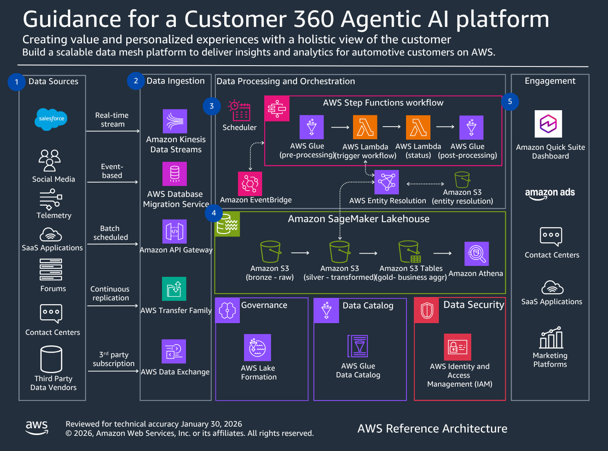

# Architecture overview

The solution combines Quick Suite analytics with Bedrock AI agents in a three-tier architecture.

## Architecture layers

**Data Layer**:

- Amazon S3 Data Lake with bronze/silver/gold architecture
- AWS Glue Catalog for metadata management
- AWS Glue Crawlers for schema discovery
- Amazon Athena for SQL queries

**Analytics Layer**:

- Quick Suite Datasets (8 pre-built datasets)
- Quick Suite Dashboards with interactive visualizations
- Quick Automate for AI-powered workflows
- Quick Flows for approval processes

**AI Layer**:

- Amazon Aurora PostgreSQL with pgvector extension
- Amazon Bedrock Knowledge Base with remediation playbooks
- Amazon Bedrock Agent with Claude 3.5 Sonnet
- Lambda functions for action groups

## Data model

The solution uses 11 datasets:

**Core datasets**:

1. customers (500K records) - Customer master data
2. customer_health (500K records) - Health scores and NPS
3. interactions (1.4M records) - Customer touchpoints
4. service_records (900K records) - Service history
5. cases (500K records) - Support cases

**Aggregated metrics**: 6. monthly_kpis - NPS and health scores by month 7. operational_kpis - Service quality metrics 8. issue_categories - Issue breakdown by type 9. revenue_streams - Revenue by stream 10. revenue_trends - Revenue changes 11. at_risk_revenue - Revenue at risk by segment

**Key metrics**: \* NPS: 52 → 42 (declining 1.5% monthly) \* Health Score: 65 → 56 (declining 1.5% monthly) \* Battery Issues: 15% → 40% (increasing 2% monthly)
