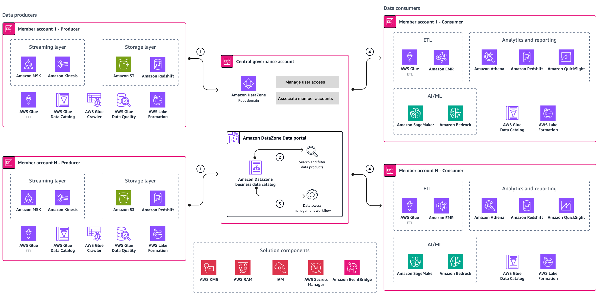
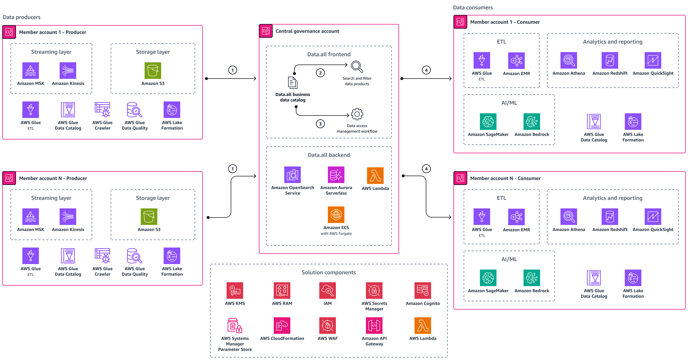
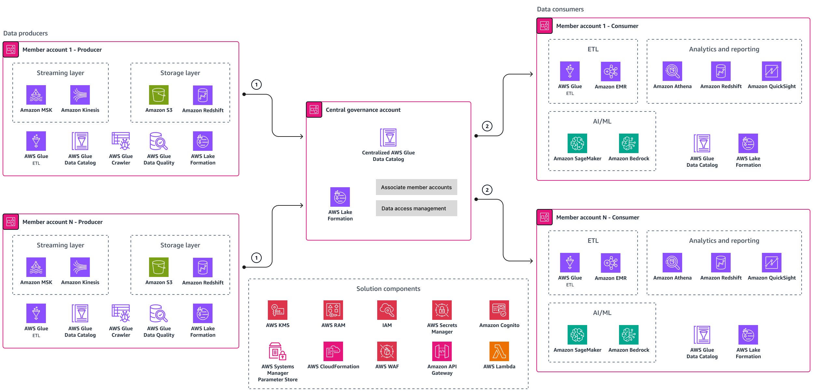

# AWS implementation options

AWS provides multiple approaches for implementing data mesh architectures. Use the capabilities of [analytics on AWS](https://aws.amazon.com/big-data/datalakes-and-analytics/ "https://aws.amazon.com/big-data/datalakes-and-analytics/") to build data mesh–based solutions for your organization. The analytics on AWS resource recommends several AWS services to build data mesh at low cost without compromising on performance.

Customers have adopted the following options for building a data mesh–based solution:

- Implement data mesh by using Amazon DataZone
- Implement data mesh by using open source frameworks on AWS such as data.all
- Implement data mesh by using AWS Lake Formation

## Common AWS Services

These three options use the following AWS services:

- [Amazon Athena](../../../athena/latest/ug/what-is.md "../../../athena/latest/ug/what-is.md")
- [Amazon Bedrock](../../../bedrock/latest/userguide/what-is-bedrock.md "../../../bedrock/latest/userguide/what-is-bedrock.md")
- [Amazon EMR](../../../emr/latest/ManagementGuide/emr-what-is-emr.md "../../../emr/latest/ManagementGuide/emr-what-is-emr.md")
- [AWS Glue](../../../glue/latest/dg/what-is-glue.md "../../../glue/latest/dg/what-is-glue.md") (including AWS Glue Data Catalog and AWS Glue crawler)
- [AWS Identity and Access Management (IAM)](../../../IAM/latest/UserGuide/introduction.md "../../../IAM/latest/UserGuide/introduction.md")
- [AWS Key Management Service (AWS KMS)](../../../kms/latest/developerguide/overview.md "../../../kms/latest/developerguide/overview.md")
- [Amazon Kinesis](../../../kinesis.md "../../../kinesis.md")
- [AWS Lake Formation](../../../lake-formation/latest/dg/what-is-lake-formation.md "../../../lake-formation/latest/dg/what-is-lake-formation.md")
- [Amazon Managed Streaming for Apache Kafka (Amazon MSK)](../../../msk/latest/developerguide/what-is-msk.md "../../../msk/latest/developerguide/what-is-msk.md")
- [Amazon QuickSight](../../../quicksight/latest/user/welcome.md "../../../quicksight/latest/user/welcome.md")
- [Amazon Redshift](../../../redshift/latest/mgmt/welcome.md "../../../redshift/latest/mgmt/welcome.md")
- [AWS Resource Access Manager (AWS RAM)](../../../ram/latest/userguide/what-is.md "../../../ram/latest/userguide/what-is.md")
- [Amazon SageMaker AI](../../../sagemaker/latest/dg/whatis.md "../../../sagemaker/latest/dg/whatis.md")
- [AWS Secrets Manager](../../../secretsmanager/latest/userguide/intro.md "../../../secretsmanager/latest/userguide/intro.md")
- [Amazon Simple Storage Service (Amazon S3)](../../../AmazonS3/latest/userguide/Welcome.md "../../../AmazonS3/latest/userguide/Welcome.md")

The Amazon DataZone option also uses [Amazon EventBridge](../../../eventbridge/latest/userguide/eb-what-is.md "../../../eventbridge/latest/userguide/eb-what-is.md").

The data.all and AWS Lake Formation options also use the following AWS services and resources:

- [Amazon API Gateway](../../../apigateway/latest/developerguide/welcome.md "../../../apigateway/latest/developerguide/welcome.md")
- [AWS CloudFormation](../../../AWSCloudFormation/latest/UserGuide/Welcome.md "../../../AWSCloudFormation/latest/UserGuide/Welcome.md")
- [Amazon Cognito](../../../cognito/latest/developerguide/cognito-user-identity-pools.md "../../../cognito/latest/developerguide/cognito-user-identity-pools.md")
- [AWS Lambda](../../../lambda/latest/dg/welcome.md "../../../lambda/latest/dg/welcome.md")
- [AWS Systems Manager Parameter Store](../../../systems-manager/latest/userguide/systems-manager-parameter-store.md "../../../systems-manager/latest/userguide/systems-manager-parameter-store.md")
- [AWS WAF](../../../waf/latest/developerguide/waf-chapter.md "../../../waf/latest/developerguide/waf-chapter.md")

The AWS services that you use in your implementation might differ, based on your organization’s requirements.

## Amazon DataZone

If you want to use a fully managed service, consider using Amazon DataZone to implement data mesh for your organization. Amazon DataZone is a data management service for cataloging, discovering, sharing, and governing data stored across AWS, on premises, and third-party sources. The following diagram shows a data mesh reference architecture based on Amazon DataZone.

In the reference architecture, the member accounts belong to the data domains. They’re grouped into data producers and data consumers. The architecture diagram contains following components:

1. The data producers publish data products in the business catalog provided by the Amazon DataZone data portal. The data portal is hosted in the central governance account.
2. Data consumers (users) log in to the data portal by using their AWS credentials or single sign-on credentials. They can browse the catalog and search for the data products of their interest by using keywords. They can filter the search results.
3. After the data users belonging to the consumer teams find the data product of their interest, they can request access to the data. Amazon DataZone has a built-in access-management workflow that the data owner uses to review and approve the request.
4. The data consumer teams can consume the data to empower their artificial intelligence and machine learning (AI/ML), analytics and reporting, and extract, transform, and load (ETL) use cases.

## Data.all

If you understand open source and want to build and manage your own solution, consider using open source frameworks such as [data.all](https://awslabs.github.io/aws-dataall/ "https://awslabs.github.io/aws-dataall/"). Data.all is a modern data marketplace that supports collaboration among diverse users. Data.all simplifies data discovery, sharing, and granular data access management while builders use the AWS portfolio of data and analytics services. The following diagram shows a data mesh reference architecture based on data.all.

The architecture diagram contains following components:

1. The data producers publish data products in the catalog provided by the data.all frontend. The frontend and backend of data.all are hosted in the central governance account.
2. Data consumers (users) log in to the data.all frontend by using their single sign-on or Amazon Cognito credentials. They can browse the catalog and search for the data products of their interest. They can filter the search results.
3. After the data users belonging to the consumer teams find the data product of their interest, they can request access the data. Data.all has a built-in access-management workflow that the data owner uses to review and approve access requests.
4. The consumer teams can consume the data to empower their AI/ML, analytics and reporting, and ETL use cases.

## AWS Lake Formation

If you want to build a custom data mesh solution from the ground up and manage it, consider using AWS Lake Formation. Lake Formation helps you centrally govern, secure, and globally share data for analytics and machine learning. The following diagram shows a data mesh reference architecture based on Lake Formation.

The architecture diagram contains following components:

1. The data producers publish data products in the AWS Glue Data Catalog of the central governance account. AWS Lake Formation manages access to the entities of the central Data Catalog.
2. After access is granted, the consumer teams can consume the data to empower their AI/ML, analytics and reporting, and ETL use-cases.

## This Implementation

This Automotive Data Platform uses **Amazon DataZone V2** as the primary catalog and governance surface for the following reasons:

- **Rapid Deployment**: One foundation deploy (`make deploy STAGE=`) provisions the complete DataZone V2 domain and all 9 governed data products
- **Integrated Governance**: DataZone V2 combines data catalog, producer/consumer project management, subscription workflows, and Lake Formation tag-based access control in a single managed service
- **Managed Service**: Focus on data products, not infrastructure management
- **AWS Native**: Seamless integration with S3 Iceberg lake, Glue, Athena, Lake Formation, Macie, CloudTrail, and IAM Identity Center
- **Enterprise Ready**: Built-in governance, security, and compliance features; downstream consumers can subscribe via DataZone for BI or analytics workloads; predictive-maintenance reference consumers use SageMaker Studio notebooks

For organizations requiring more customization, the architecture can be adapted to use data.all or Lake Formation with minimal changes to the domain structure and data product definitions.
