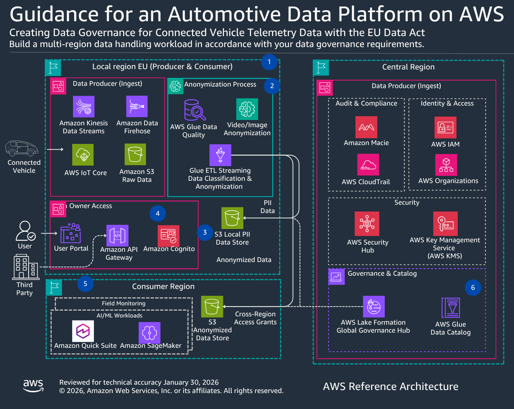

# Architecture overview

The Governance Framework in Automotive Data Platform solution provides a comprehensive framework for managing vehicle data across multiple geographic regions with capabilities that support EU Data Act, GDPR, and regional data sovereignty requirements. This solution addresses the unique challenge of separating PII data processing in EU regions from anonymized analytics in global regions, enabling worldwide R&D collaboration with appropriate technical controls.

## Why This Architecture Matters for Global Automakers

Modern automotive manufacturers operate in a complex regulatory landscape where data sovereignty requirements conflict with the need for global collaboration. A vehicle sold in Germany generates terabytes of telemetry data containing precise GPS coordinates, driver behavior patterns, and biometric information—all classified as PII under GDPR and subject to strict EU data residency requirements. Yet that same vehicle’s anonymized performance data is critical for R&D teams in Detroit, Tokyo, and Shanghai who are developing next-generation battery management systems and autonomous driving features.

Traditional approaches force automakers into an impossible choice: either replicate PII data globally (violating data sovereignty laws) or fragment R&D teams into regional silos (slowing innovation). This architecture solves that dilemma by implementing technical controls that enforce compliance while enabling collaboration.

AWS provides the global infrastructure and native services to implement this pattern at scale. With 33 geographic regions including multiple EU locations, AWS enables automakers to keep PII data within regulatory boundaries while using Lake Formation resource links to provide read-only access to anonymized data across regions. This isn’t just about compliance—it’s about competitive advantage. Automakers who can safely aggregate global fleet data for machine learning while maintaining regional compliance can iterate faster on quality issues, predict warranty costs more accurately, and deliver software updates that reflect worldwide driving patterns rather than regional subsets.

The architecture leverages AWS’s shared responsibility model: AWS ensures infrastructure compliance (TISAX AL3, SOC 2, ISO 27001), while automakers control data classification, access policies, and retention through Lake Formation, Macie, and CloudTrail. This separation allows security teams to enforce "PII never leaves EU" policies through Lake Formation’s explicit deny rules, while R&D teams access anonymized data through the same familiar tools (Athena, SageMaker, QuickSight) they use for other analytics workloads.

For automakers with existing on-premises data lakes, this architecture provides a migration path: start with EU vehicle data in AWS (where regulatory pressure is highest), prove the governance model works, then expand to other regions. The multi-account structure isolates blast radius—a misconfigured Glue job in the US consumer account cannot access EU PII data because Lake Formation enforces permissions at the producer region level, regardless of IAM policies in the consumer account.

The business impact is measurable: reduced time-to-insight for quality issues (days to hours), lower compliance risk (automated PII detection and audit trails), and faster R&D cycles (global teams access fresh data without waiting for manual anonymization and transfer). This architecture transforms data governance from a compliance burden into an enabler of global innovation.

## Key Capabilities

The solution delivers:

- **Multi-Region Data Architecture**: Separate data domains for EU producers (PII + anonymized data), global consumers (anonymized only), and central governance
- **EU Data Act Supportive Capabilities**: Data sharing mechanisms enabling vehicle owners and authorized third parties to access vehicle-generated data
- **Data Sovereignty**: Region-specific data residency controls ensuring PII remains in EU regions with Lake Formation policies preventing cross-border replication
- **Cross-Region Data Sharing**: Secure, governed data exchange using Lake Formation resource links that enforce producer region permissions
- **GDPR Supportive Capabilities**: Technical controls for implementing data subject rights (access, erasure, portability)
- **Audit and Lineage**: Complete tracking of data access, transformations, and sharing through CloudTrail and Glue Data Catalog

## Solution Components

The Governance Framework consists of six specialized modules implemented using AWS native services:

**PII Detection Module**: Amazon Macie automatically identifies and classifies personally identifiable information in S3 stored data using custom patterns for VINs, license plates, and driver identifiers, with daily automated scans and compliance reporting.

**Anonymization Module**: AWS Glue ETL processes raw vehicle telemetry to remove or obfuscate sensitive data through GPS geofencing (city-level precision), VIN hashing (SHA-256), and driver behavior aggregation while preserving analytical value for R&D teams.

**Access Rights Module**: AWS Lake Formation provides fine-grained, role-based access control policies that govern who can access specific automotive datasets across all regions, enforcing column-level security and data residency requirements.

**Data Sharing Module**: API Gateway and AWS Lake Formation policies control third-party data sharing, with CloudTrail logging all external data access and consent validation through custom workflows.

**Cross-Region Governance Module**: AWS Lake Formation enables cross-region data access through resource links, allowing consumer regions to query data while permissions are enforced in the producer region where data resides, supporting local data residency requirements while preventing PII replication outside EU regions.

**Audit and Lineage Tracking Module**: AWS CloudTrail and AWS Glue Data Catalog provide comprehensive audit logging and end-to-end data lineage tracking from vehicle sensors to business applications. S3 Object Lock creates tamper-proof audit trails for regulatory inquiries.

## Regional Data Domains

**Central Governance Region**: AWS Lake Formation serves as the global governance hub, enforcing fine-grained access control policies across all regions. AWS Glue Data Catalog maintains centralized metadata and technical data lineage. AWS Organizations and IAM manage multi-account structure and access permissions. AWS CloudTrail logs all data access for audit trails, and Amazon Macie performs daily automated scans of S3 buckets to identify and classify PII.

**EU Producer Region**: Vehicle data collection and initial processing in EU regions (eu-west-1 Frankfurt, eu-central-1 Ireland). Connected vehicles transmit telemetry through AWS IoT Core to Amazon Kinesis Data Streams, with Amazon Data Firehose delivering data to Amazon S3 raw storage. AWS Glue Data Quality validates incoming data, and AWS Glue ETL Streaming performs real-time anonymization, separating telemetry into PII and anonymized data stores.

**Global Consumer Regions**: R&D teams access anonymized data through Lake Formation resource links that point to producer region tables. Amazon SageMaker and Amazon QuickSight query data through these resource links, with Lake Formation enforcing permissions from the producer region to ensure R&D teams can only access anonymized data—never PII.

## Compliance Supportive Capabilities

**EU Data Act Supportive Capabilities**: Vehicle owners can access their complete data through a User Portal (Amazon Cognito authentication, API Gateway endpoints), with data export in machine-readable formats (JSON, CSV) supporting Article 4 data portability requirements. Third-party data sharing (independent repair shops, insurance companies) is enabled through API Gateway endpoints with consent validation.

**GDPR Supportive Capabilities**: Customers can implement Right to Access (Article 15) using the User Portal with Cognito authentication. Right to Erasure (Article 17) can be implemented through custom workflows using AWS Step Functions to identify and remove records. Right to Portability (Article 20) can be supported through API Gateway data export endpoints. Consent management can be tracked in DynamoDB or Aurora with custom Lambda functions validating consent status before data access.

**Data Classification**: AWS Glue Data Quality validates incoming data against automotive-specific rules (tire pressure ranges, VIN formats, sensor data integrity). Amazon Macie scans stored S3 data for PII patterns using custom automotive identifiers. AWS Glue ETL Streaming performs real-time anonymization with structured data transformation and video/image anonymization via partner computer vision services.

## Access Governance

**AWS Lake Formation**: Fine-grained access control at table and column level. Cross-region access through resource links that enforce producer region permissions. Role-based policies: Vehicle owners access only their own PII data, R&D teams access all anonymized data (no PII), Compliance teams access all data with audit trail.

**IAM Policies**: Permissions enabling AWS service API access (Glue, Athena, Lake Formation). Fine-grained data access control is managed through Lake Formation.

**Amazon Cognito**: User authentication for vehicle owner portal with MFA requirements and password complexity policies.

**API Gateway**: Secure endpoints for vehicle owner data access and third-party data sharing with rate limiting and OAuth 2.0 authentication.

## Monitoring and Audit

**AWS CloudTrail**: Organization trail logging all API activity across all regions and accounts. Logs all Lake Formation permission grants/revocations, S3 data access, Athena queries, Glue job executions. S3 Object Lock ensures audit logs are immutable and tamper-proof for regulatory inquiries. Customer-defined retention supporting compliance requirements.

**Amazon CloudWatch**: Real-time monitoring of data access patterns with automated alerts for policy violations and quality validation failures.

**AWS Config**: Configuration tracking and drift detection across all governance components.

**Amazon Macie**: Daily automated discovery scans of all S3 buckets with findings sent to Security Hub and SNS for remediation workflows.

**Compliance Reports**: Generated using Amazon QuickSight dashboards and AWS Lambda functions, showing data processing activities, retention periods, access patterns, and third-party data sharing supporting regulatory record-keeping and transparency requirements.
