# Add Account Names ( Optional )

## Account Map

The Cost & Usage Report data doesn’t currently contain account names and
other business or organization specific mapping so you can create a view
that enhances your CUR data. There are a few options you can leverage to
create your account_map view to provide opportunities to leverage
your existing mapping tables, organization information, or other
business mappings allowing for deeper insights. This view will be used
to create the **Account Map** for your dashboards.

The steps below are necessary **ONLY** if you have deployed your
dashboards using legacy CUR. Dashboards created using CUR 2.0 have
account names integrated as part of deployment process.

### Option 1: Leverage your existing AWS Organizations account mapping (Recommended)

This option allows you to bring in your AWS Organizations data including
OU groupings

You will need to go through an additional Lab for this. This can collect
multiple types of data across accounts and AWS Organization, including
Trusted Advisor and Compute Optimizer Data. For Account Names you will
need only one module **AWS Organization Module**, but we recommend to
explore other modules of this lab as well.

[Click to navigate to Optimization Data Collection Lab](data-collection-deployment.md "data-collection-deployment.md")

After successful deployment create or update your account_map view by
running the following query in Athena Query Editor.

```
 CREATE OR REPLACE VIEW account_map AS
SELECT DISTINCT
    "id" "account_id",
    "name" "account_name",
    ' ' "parent_account_id",
    ' ' "account_email_id"
FROM
    "optimization_data"."organization_data"
```

Also you must update the role that Quick Sight uses to update datasets.
This can be a standard Quick Sight role that you can manage in Quick Sight
Admin space (Security and Permissions section). Or this can be a role
named CidQuick SightDataSourceRole. This role can be managed by
Cloud-Intelligence-Dashboards stack in CloudFormation. Please make
sure that you configure there the same bucket name as in [Data Collection Lab](data-collection.md "data-collection.md").

### Option 2: Leverage AWS Cost Categories to add account names

This option allows you to bring in account names using AWS Cost
Categories. If you have multiple payer accounts, please ensure you use
the same name for your cost category in each of the payer accounts, so
that consolidated cost and usage report in the data collection account
will be consistent. Recommended cost category name: **accountname**

Navigate to cost categories by either searching for cost categories in
the AWS console search bar

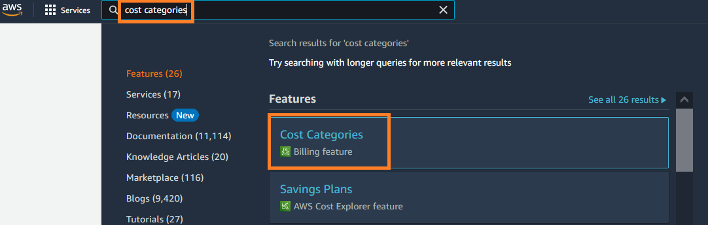
OR by going to the Billing console and choosing Cost Categories from the
navigation menu

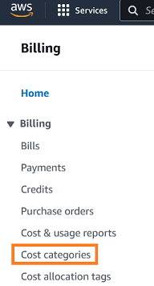
In the Cost Categories console Select **Create cost category**

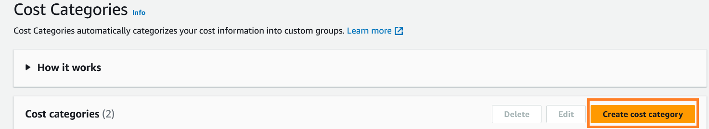
Name your cost category as **accountname** or any other name you’d like.
Be consistent with the name across multiple payer accounts if you are
consolidating data from other payer accounts

For lookback period select the second option **Apply cost category rules
starting any specified month from the previous 12 months** and then
choose a month which is atleast 3 months prior to the current month.
Select **Next**

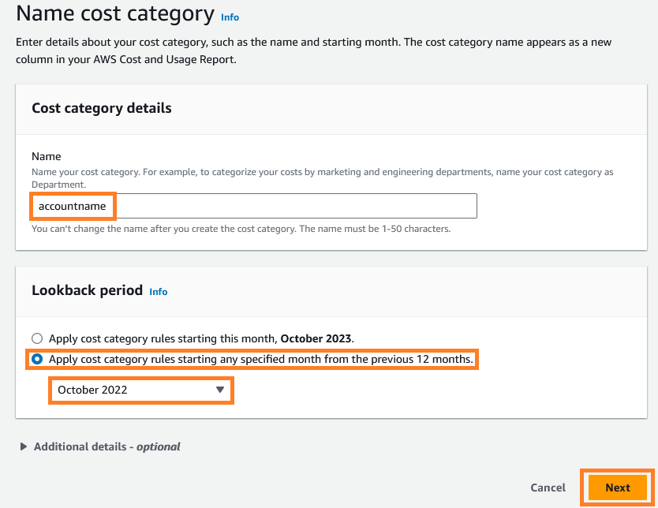
In the category rules under Rule Builder choose Rule Type as **Inherited value** and Dimension as **Account**

Specify a default value as **unnamed**. You can use anything you’d like to
define accounts which do not have an account name but be consistent
across multiple payer accounts. Select **Next**

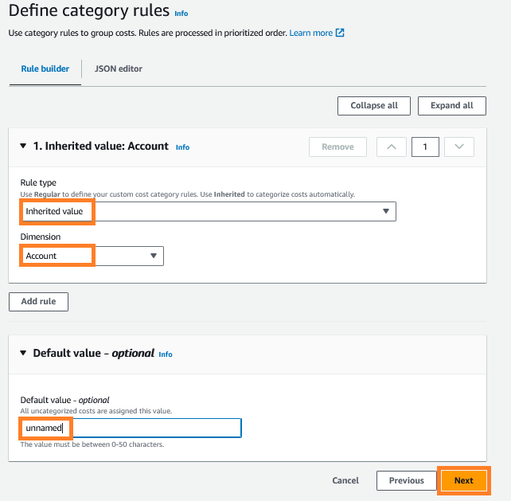
Select **create cost category**

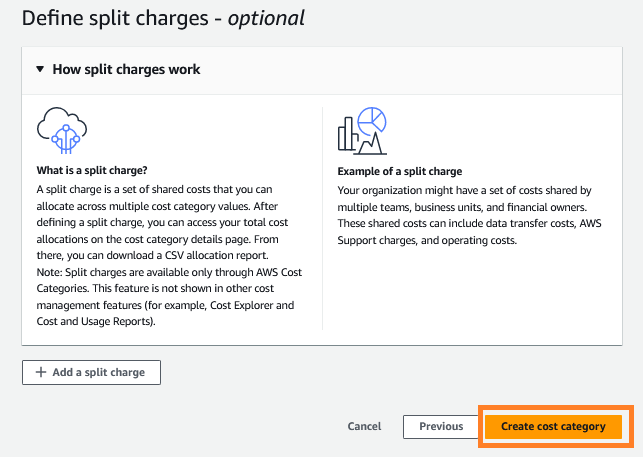
The CUR will now have a column called **CostCategory/accountname** with
the account names populated in them. Please note, it might take **24-48
hours** for the CUR to be updated. In Athena the column name in the CUR
table will be something similar to **cost_category_accountname**

Once the cost category is available in your CUR Athena table, update
your account_map view with the below query with the following
modifications

On line 4 and line 9, replace **cost_category_accountname** with the name
of the cost category you chose for account name. If you chose just
accountname as shown in the example above then no change is needed.

On line 8, replace **(database).(tablename)** with your CUR database and
table name (e.g. cid_cur.cur)

Run the query after the modification. Your account_map view will now
have account names from the cost category created.

```
 CREATE OR REPLACE VIEW "account_map" AS
SELECT DISTINCT
line_item_usage_account_id "account_id"
, max_by(cost_category_accountname,line_item_usage_start_date) "account_name"
, ’ ’ parent_account_id
, ’ ’ account_email_id
FROM
(database).(tablename)
WHERE ((cost_category_accountname <> ’') AND (("bill_billing_period_start_date" >= ("date_trunc"(’month', current_timestamp) - INTERVAL '2' MONTH)) AND (CAST("concat"("year", '-', "month", '-01') AS date) >= ("date_trunc"('month', current_date) - INTERVAL '2' MONTH))))
group by line_item_usage_account_id
```

### Option 3: Account Map CSV file using your existing AWS Account mapping data

Many organizations already maintain their account mapping outside of
AWS. You can leverage your existing mapping data by creating a csv file
with your account mapping data including any additional organization
attributes.

**Create your account_map csv file**

This example will show you how to create using a sample account_map csv file

1. Create an account_map csv file locally, you can use the sample here and requirements below as a starting point: [account_map.csv](samples/account_map.csv.md "samples/account_map.csv.md")
2. Update your account_map csv with your account mapping data

**Upload your account_map csv file to Amazon S3**

1. Navigate to **Amazon S3**
2. Select **Create Bucket**

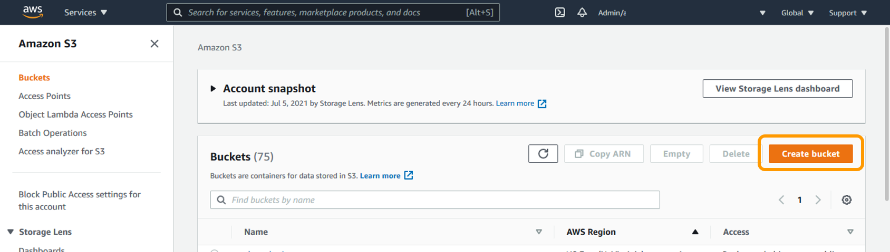

1. Name your bucket, we recommend **cost-account-map-** to easily locate

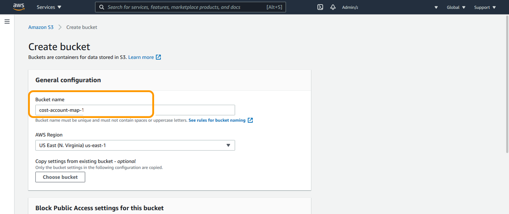

1. Scroll to the bottom and select **Create Bucket**

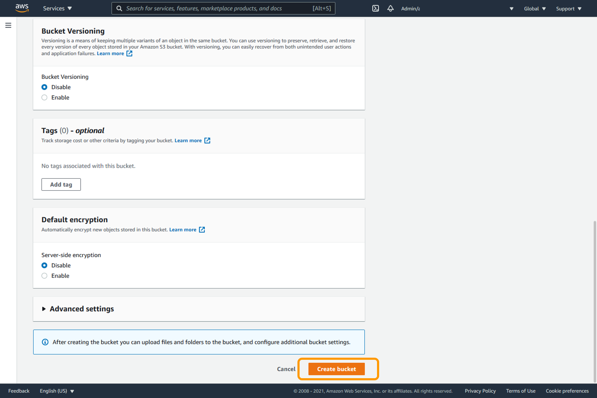

1. Navigate to your newly created s3 bucket

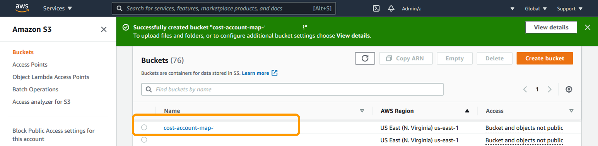

1. Select **Create folder**

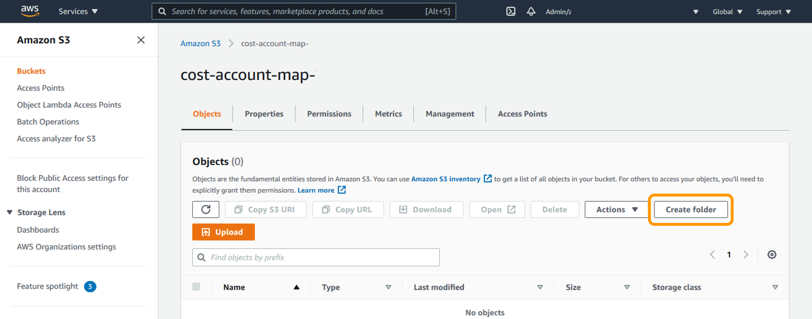

1. Name your folder **account-map** and select **Create folder**

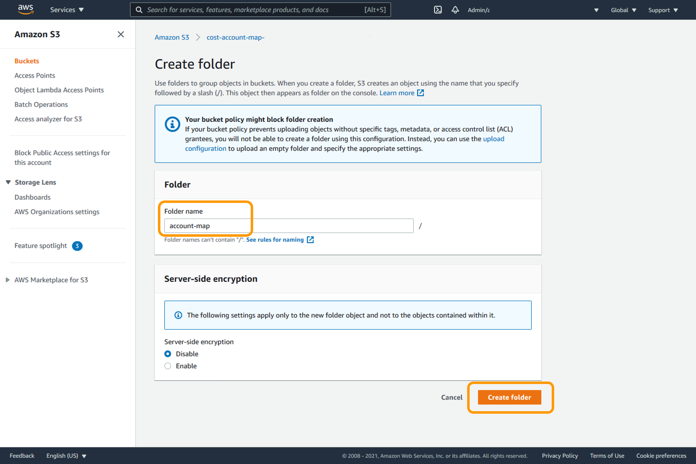

1. Click on your newly created **account-map** folder

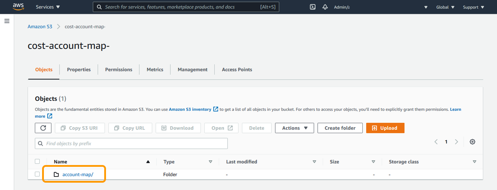

1. Select **Upload**

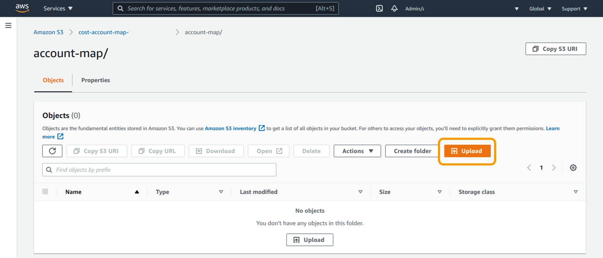

1. In your newly created folder, **drag and drop** your account_map.csv file then select **Upload**

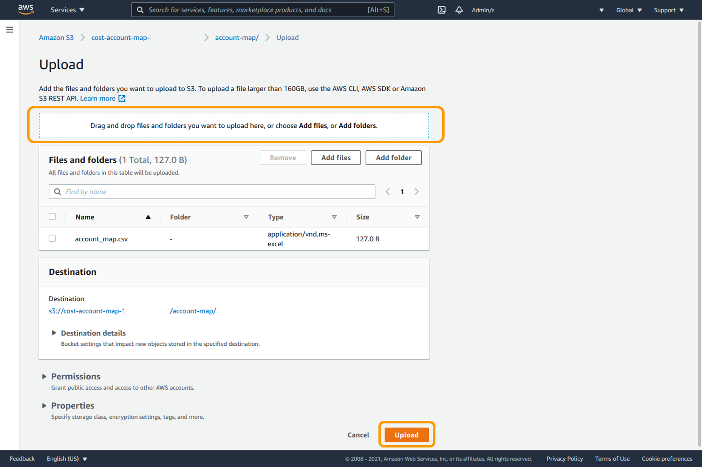

1. Copy down the **S3 Destination** of the account-map.csv. You will need this to create your Athena table

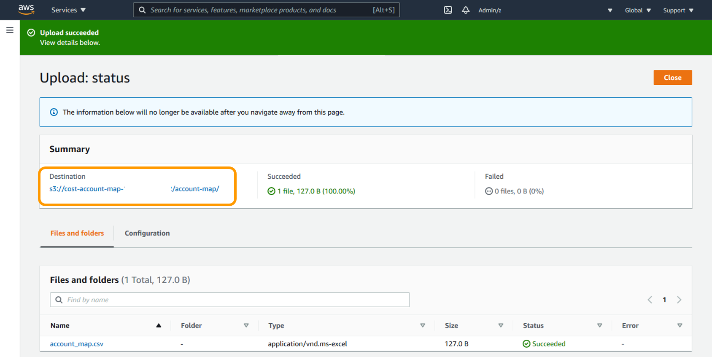

**Create your account_mapping Athena table**

1. Navigate to **Amazon Athena**
2. Modify the below query with your account_map.csv information. Replace
   the **(S3.Destination) value in row 15** with your account_map folder S3
   destination from step 8 of the last section (e.g. cost-account-map-123456789012/account-map)

###### Note

Validate rows **2-5** match your csv columns. If you removed one of the fields in the csv you will need to remove it in the query. If you added any additional fields you will need to add the attribute to the query.\*

```
 CREATE EXTERNAL TABLE +account_mapping+(
    +account_id+ string,
    +account_name+ string,
    +business_unit+ string,
    +team+ string,
    +cost_center+ string
    )
ROW FORMAT DELIMITED
    FIELDS TERMINATED BY ','
STORED AS INPUTFORMAT
    'org.apache.hadoop.mapred.TextInputFormat'
OUTPUTFORMAT
    'org.apache.hadoop.hive.ql.io.HiveIgnoreKeyTextOutputFormat'
LOCATION
    '(S3.Destination)'
TBLPROPERTIES (
    'has_encrypted_data'='false',
    'skip.header.line.count'='1')
```

**Create your account_map Athena view**

The account_map Athena view ensures any new
accounts are not missed in your dashboard by creating a view off of your
CUR table and account_mapping Athena table.

Modify the following query with your table names:

1. Replace **(database).(tablename)** in line 13 with your CUR database and table name (e.g. cid_cur.cur)
2. Replace **(database).(tablename)** in line 23 with your account_mapping database and table name (e.g. cid_cur.account_mapping)

```
 CREATE OR REPLACE VIEW account_map AS
SELECT DISTINCT
a.line_item_usage_account_id "account_id"
, b.account_name
, b.business_unit
, b.team
, b.cost_center
FROM
    ((
    SELECT DISTINCT line_item_usage_account_id
    FROM (database).(tablename) ) a
LEFT JOIN (
    SELECT DISTINCT
        "lpad"("account_id", 12, '0') "account_id"
    , account_name
    , business_unit
    , team
    , cost_center
    FROM
    (database).(tablename) ) b ON (b.account_id = a.line_item_usage_account_id))
```

You must update the role that Quick Sight uses to update datasets. This
can be a standard Quick Sight role that you can manage in Quick Sight
Admin space (Security and Permissions section). Or this can be a role
named CidQuick SightDataSourceRole. This role can be managed by
Cloud-Intelligence-Dashboards stack in CloudFormation. Please make
sure that you configure there the same bucket name as in
[Data Collection Lab](data-collection.md "data-collection.md").

Alternatively you can also choose to do an one-time update of your
account map view using one of the options below

```
cid-cmd map --account-map-source csv --account-map-file FILE.CSV
```

### Final Steps

Once you update and test the account_map view in Athena, you need to
make sure Quick Sight has access to the bucket containing Optimization
Data Collection data and then refresh summary_view dataset in
Quick Sight.
