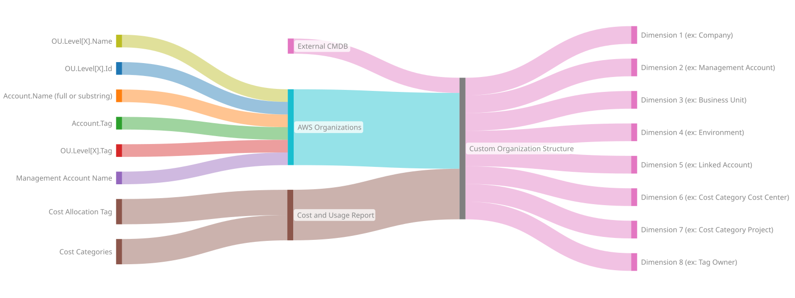
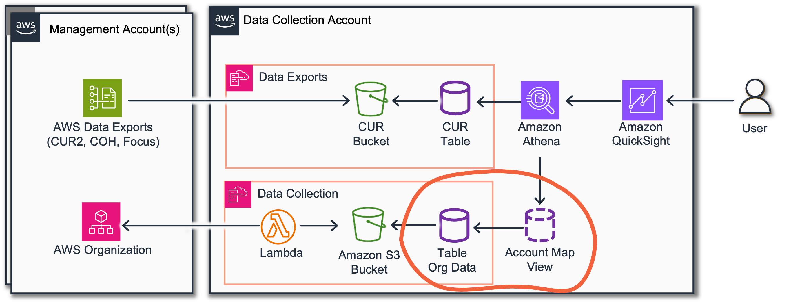
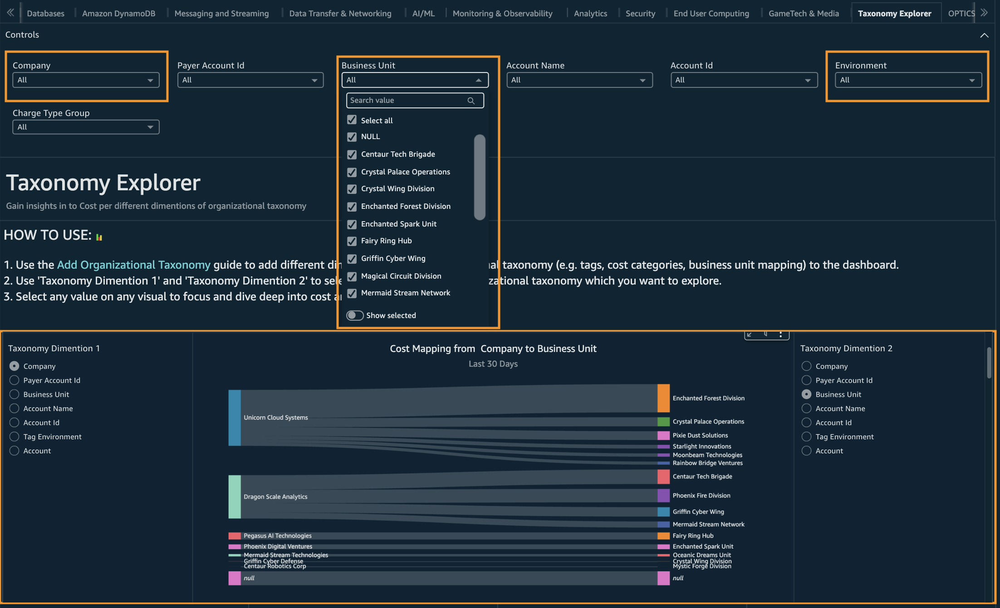

# Add organizational taxonomy

## Introduction

AWS customers use various methods to allocate costs of AWS resources,
ranging from a single level of business units to complex,
multi-dimensional organizational
[taxonomy](https://en.wikipedia.org/wiki/Taxonomy "https://en.wikipedia.org/wiki/Taxonomy").

This document presents the architectural framework for resource
ownership attribution and cost allocation in AWS environment, including
automated integration with Cloud Intelligence Dashboards.

The following video introduces the concept of taxonomy in the context of AWS resource management. It will guide you through the main concepts using the example of Unicorn Rental Corporation.

## Architectural Foundations

Resource allocation in AWS typically follows two primary architectural
patterns:

1.  [Account-Level Allocation](#add-org-taxonomy-account-level-cost-allocation "#add-org-taxonomy-account-level-cost-allocation") - Uses
    information at the AWS account level, such as:

        1. AWS Account Names
        2. Organizational Unit (OU) hierarchical structure
        3. Account-level or OU level tagging in AWS Organizations
        4. External sources (e.g. CMDB) as a source of truth to allocate account
        ownership based on organizational policies

2.  [Resource-Level Allocation](#add-org-taxonomy-resource-level-cost-allocation "#add-org-taxonomy-resource-level-cost-allocation") - Enables more granular allocation through:
    1. AWS Cost Allocation Tags (user-defined and AWS-generated)
    2. AWS Cost Categories

Cloud Intelligence Dashboards provide a comprehensive way to integrate
organizational taxonomy into your dashboards, enabling precise filtering
and cost allocation tracking. You can define a set of taxonomy fields to
be used as Filters and GroupBy dimensions within the CID dashboards.
Additionally, you can configure Row-Level Security (RLS) to restrict
access based on one of these taxonomy fields, ensuring that users see
only the data relevant to their scope of responsibility.

### Components for building Organizational Taxonomy

It is essential to establish reporting that accurately reflects the
current structure of your organization while also accounting for
potential future changes. Once the organizational taxonomies are clear,
the next step is to map them to the appropriate technical data.



| Name                     | Level                           | Source                    | Prerequisite                   | Comment                                                                                                                                                                                                                                                                |
| ------------------------ | ------------------------------- | ------------------------- | ------------------------------ | ---------------------------------------------------------------------------------------------------------------------------------------------------------------------------------------------------------------------------------------------------------------------- |
| Account Tag              | Account Level                   | AWS Organizations         | CID Data Collection            | Very common use case                                                                                                                                                                                                                                                   |
| OU Name                  | Account Level                   | AWS Organizations         | CID Data Collection            |                                                                                                                                                                                                                                                                        |
| OU Tag                   | Account Level                   | AWS Organizations         | CID Data Collection            | [RECOMMENDED] More flexible then Account Tag. CID Data Collection<br>allows collecting Hierarchical Tags when the lower level Tags can<br>override higher level. This can create a flexible system that do not<br>require setting tags on the individual Account level |
| Account Name             | Account Level                   | AWS Organizations or CUR2 | CID Data<br>Collection or CUR2 | Some organizations can have an established naming<br>convention for AWS Accounts. A part of this name can be used for a<br>business unit taxonomy.                                                                                                                     |
| AWS Cost Allocation Tags | Resource Level                  | CUR                       | AWS Data Exports               |                                                                                                                                                                                                                                                                        |
| AWS Cost Categories      | Resource Level or Account Level | CUR                       | AWS Data<br>Exports            |                                                                                                                                                                                                                                                                        |

Additional recommendations:

1. **Anticipate Organizational Change**. Using AWS Account Tags or OU
   (Organizational Unit) Tags can be a flexible and maintainable approach,
   especially in environments where organizational changes are frequent.
   Account-level tagging allows you to adapt to these changes with minimal
   operational overhead. However, if an account contains shared resources
   used across multiple teams or business units, Resource-Level Attribution
   becomes necessary to accurately reflect usage and costs at a more
   granular level.
2. **Balance Granularity and Effort**. Resource-Level Attribution, such as
   Tags and Cost Categories, provides detailed visibility into per resource
   usage and cost and is essential when shared resources exist within a
   single account. It requires consistent and disciplined tagging practices
   across teams and services, along with ongoing governance to ensure tags
   remain accurate and meaningful over time. In contrast, Account-Level
   Attribution is easier to implement and maintain but offers less
   granularity.

## Account Level Cost Allocation

To implement account level mapping CID provides a special View in Amazon
Athena called `account_map`. This Athena view is specifically designed
to be customizable by customers. You can modify this Athena view,
leveraging various options:

1. Cost and Usage Report (CUR) data. CUR2 data contains Account Names.
2. AWS Organizations metadata collected via [CID Data Collection](data-collection.md "data-collection.md").
3. External sources such as external
   [CMDB](https://en.wikipedia.org/wiki/Configuration_management_database "https://en.wikipedia.org/wiki/Configuration_management_database")
   systems or just a spreadsheet or csv file on Amazon S3.



### Example of default account map based on CUR 2.0

```
CREATE OR REPLACE VIEW account_map AS
SELECT DISTINCT
    line_item_usage_account_id                                        account_id,
    MAX_BY(line_item_usage_account_name, line_item_usage_start_date)  account_name,
    MAX_BY(bill_payer_account_id,        line_item_usage_start_date)  parent_account_id,
    MAX_BY(bill_payer_account_name,      line_item_usage_start_date)  parent_account_name
FROM
    "${cur_database}"."${cur_table_name}"
GROUP BY
    line_item_usage_account_id
```

### Advanced example of account map based on AWS Organizations data (Recommended)

This example leverages the AWS Organization Data collected by [CID Data Collection](data-collection.md "data-collection.md") and allows you adding Account and OU level tags into account_map. Please note that you do not need to use all the fields from this example, you can adjust it to your specific business and organizational requirements.

```
CREATE OR REPLACE VIEW "account_map" AS
SELECT DISTINCT
    -- Mandatory
      id account_id
    , Name account_name

    -- Optional
    , email account_email_id
    , ManagementAccountId parent_account_id
    , Parent "o_u" -- The Name of the lowest level OU of the Account

    -- Part of Account Name.
    -- Account names are sometimes structured in a way that allows us to use part of the name as a taxonomy identifier
    , TRY(split_part(Name, '-', 1)) "account_prefix"
    , TRY(split_part(Name, '-', 2)) "account_suffix"

    -- A simple mapping of Management Account Ids to user-friendly names
    , CASE ManagementAccountId
        WHEN '111111111111' THEN 'My Management Org'
        WHEN '222222222222' THEN 'My Test Org'
        ELSE ManagementAccountId
    END parent_account_name

    -- Full path separated with '>'
    , HierarchyPath as o_u_hierarchy

    -- Levels of OU hierarchy
    , TRY(hierarchy[1].name) o_u_level1 -- root
    , TRY(hierarchy[2].name) o_u_level2
    , TRY(hierarchy[3].name) o_u_level3
    , TRY(hierarchy[4].name) o_u_level4
    , TRY(hierarchy[5].name) o_u_level5

    -- Hierarchical Tags
    -- You can set on OU level and override on lower OU or set Account level Tags
    , TRY(FILTER(HierarchyTags, x -> x.key = 'MyEnterprise')[1].value) as ou_tag_enterprise
    , TRY(FILTER(HierarchyTags, x -> x.key = 'MyBusinessLine')[1].value) as ou_tag_business_line
    , TRY(FILTER(HierarchyTags, x -> x.key = 'MyBusinessUnit')[1].value) as ou_tag_business_unit
FROM
    "optimization_data"."organization_data"
```

### Example of static Account Map

Static account map is useful when you have custom mapping maintained in
the CMDB outside of account names and you want to bring it to account
map.

```
CREATE OR REPLACE VIEW account_map AS
SELECT *
FROM
  (
 VALUES
     ROW ('111111111111', 'Account1', 'Company 1', 'Business Unit 11')
   , ROW ('222222222222', 'Account2', 'Company 1', 'Business Unit 11')
   , ROW ('333333333333', 'Account3', 'Company 2', 'Business Unit 21')
   , ROW ('444444444444', 'Account4', 'Company 2', 'Business Unit 22')
)  ignored_table_name (
    account_id,   --mandatory
    account_name, --mandatory
    company,      --custom
    business_unit --custom
)
```

You can also leverage `cid-cmd csv2view` command that accepts a csv
file and generates the code of view as above.

### How to update Account Map

1. Navigate to Amazon Athena and the cur database (default: `cid_cur`).
2. Locate the `account_map` and click on the vertical ellipses (`⋮`) next to the view and select _Show/edit query_ from the context menu.
3. First, make a copy of the view as backup, naming the new view something like _account_map_original_.
4. Select the entire view and replace it with this query adjusted to your needs.
5. Click `Run` to execute the query and create/update the view.
6. Run `cid-cmd update --force --recursive` in CloudShell.

## Resource Level Cost Allocation (Tags and Cost Categories)

Some data sources—such as the Cost and Usage Report (CUR) v2.0, Cost
Optimization Hub, and FOCUS already include tag information. The
`cid-cmd` deployment tool allows you to specify a list of tags to be
included in the dashboard during initial deployment or during a
recursive update.

Please note that introducing tags with many unique values can significantly expand the dataset. For example, using tag_a with 10 unique values and tag_b with 100 independent values could result in up to a 1,000-fold increase in dataset size due to combinatorial growth. Avoid using high-cardinality tags, such as `Name`, especially when working with large datasets based on the Cost and Usage Report (CUR).

###### Warning

Each tag added to the dashboard increases the cardinality of data and increases the size of aggregated SPICE datasets in Amazon QuickSight. This architectural decision directly impacts SPICE caching size and performance. We recommend selecting only the minimum necessary tags to satisfy business requirements.

If your QuickSight datasets takes too much time refreshing after configuring the tags, please remove all tags (`cid update --force --recursive -y`) and try re-adding them one by one.

## Adding Taxonomy to the Dashboards

The CID framework allows you to seamlessly add taxonomy fields to the
dashboards including attributes from the [Account Map](#add-org-taxonomy-account-level-cost-allocation "#add-org-taxonomy-account-level-cost-allocation") as well as resource-level tags.

Once configured, taxonomy fields are added as Filter Controls across all
sheets in the respective dashboard. They can also be used in Calculated
Fields and Parameter Controls to support "Group By" aggregations.

To modify the taxonomy fields or update the set of Cost Allocation Tags,
run the following commands:

1. Install the tool

```
pip3 install -U cid-cmd
```

2. Update a dashboard and all dependency datasets

```
cid-cmd update --force --recursive
```

After update Amazon QuickSight datasets will be refreshed automatically. During the refresh process you may see `Dataset changed too much` error which should disappear once datasets are fully refreshed.

See more in [update](update-dashboards.md "update-dashboards.md") documentation.

Following command can be used for deployment if the taxonomy fields are known. Parameters `--taxonomy` and `--resource-tags` are optional. If not provided the tool with discover and propose operator to choose them.

```
cid-cmd update --force --recursive  --resource-tags 'tag_environment' --taxonomy 'company,business_unit,tag_environment'
```

Once dashboard is installed AND all datasets are updated, you can use
filters and Group By elements in dashboards.



See more details on the live
[interactive
dashboard demo](https://cid.workshops.aws.dev/demo/?dashboard=cudos&sheet=Taxonomy%20Explorer "https://cid.workshops.aws.dev/demo/?dashboard=cudos&sheet=Taxonomy%20Explorer").

- You can use top level filters (for Company or Business units from Account Map or Environment Tag).
- You can use the same taxonomy dimensions as GroupBy fields.

## FAQ

## Do all dashboards support taxonomy?

For the moment only Foundational Dashboards (CID, KPI, CUDOS) support adding organizational
taxonomy with `cid-cmd` tool, we plan to support this in all CID dashboards in the future.

## I need to append a taxonomy from AWS Organization Tags

1. Make sure [CID Data Collection](data-collection.md "data-collection.md") is installed.
2. Modify your account map query ([example](#add-org-taxonomy-account-map-based-on-org-example "#add-org-taxonomy-account-map-based-on-org-example")).
3. Run [update](#add-account-level-resource-level-taxonomy-dimension "#add-account-level-resource-level-taxonomy-dimension") via command line.

## I just need to add a taxonomy based on AWS Cost Allocation Tag

Run [update](#add-account-level-resource-level-taxonomy-dimension "#add-account-level-resource-level-taxonomy-dimension") via command line. No other actions needed.

[#After Update and Adding Tags the refresh of SPICE datasets times out or shows a error about resources limitation
== After Update and Adding Tags the refresh of SPICE datasets times out or shows a error about resources limitation

Try to [re-update](#add-account-level-resource-level-taxonomy-dimension "#add-account-level-resource-level-taxonomy-dimension") using tags with less cardinality (less unique values).

## Can I change taxonomy?

Yes. Just [re-update](#add-account-level-resource-level-taxonomy-dimension "#add-account-level-resource-level-taxonomy-dimension").

## Can CloudFormation Template manage this?

As of now only you can use CID-CMD command line tool to manage taxonomy in as it allows choosing values from existing configuration in interactive way.
