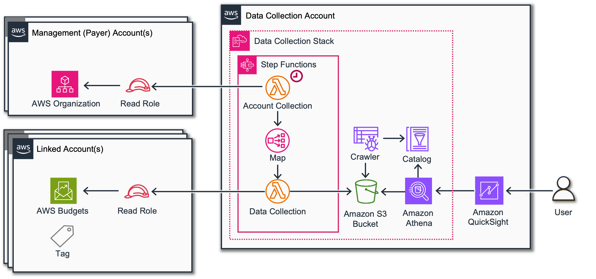
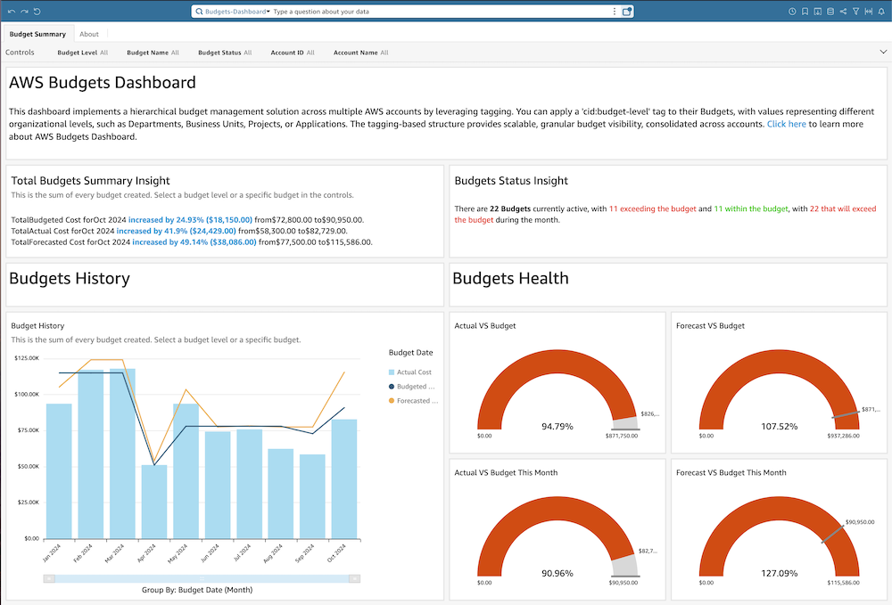
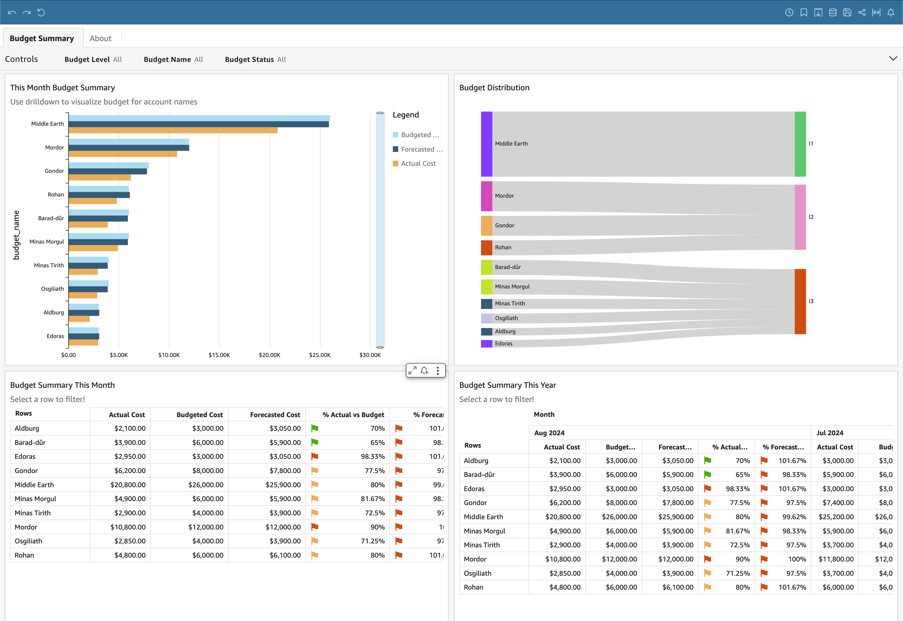
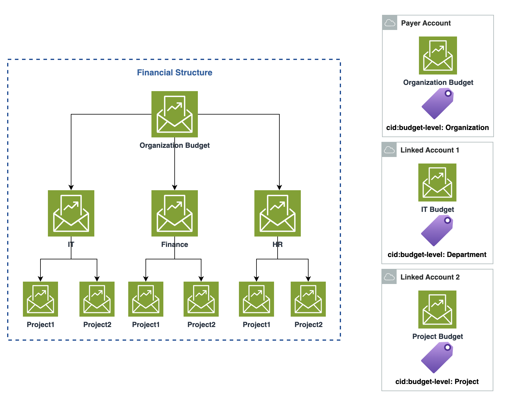

# AWS Budgets Dashboard

## Introduction

[AWS Budgets](https://aws.amazon.com/aws-cost-management/aws-budgets/ "https://aws.amazon.com/aws-cost-management/aws-budgets/") is
a service that helps customers plan and track their cloud spending
across AWS services. It allows customers to set custom budgets for their
AWS costs and usage, enabling better financial management and control
over their AWS resources.

This dashboard gives you a clear, hierarchical view of your
organization’s budgets, from the top-level down to individual
departments and applications. Now, you can easily track budgeted,
forecasted, and actual spend all in one place. With customizable
visualizations and real-time insights, you’ll be empowered to make
informed, data-driven decisions that drive strategic alignment and
optimization. Identify areas for improvement, forecast future needs, and
ensure your financial resources are being used efficiently.



## Demo Dashboard

Get more familiar with Dashboard using the live, interactive demo
dashboard following this
[link](https://cid.workshops.aws.dev/demo?dashboard=aws-budgets "https://cid.workshops.aws.dev/demo?dashboard=aws-budgets")





## Tagging and Hierarchy

Using tags with AWS Budgets adds a powerful layer of organization and
flexibility to the budgeting process. Tags are key-value pairs that
customers can attach to AWS resources as metadata. When applied to
budgets, tags allow customers to:

1. Organize budgets hierarchically: Customers can create a tag structure
   that mirrors their organizational hierarchy, such as
   department/team/project.
2. Represent their financial structure: Tags can reflect a company’s cost
   centers, business units, or other financial divisions.
3. Create granular budgets: Set up budgets for specific projects,
   applications, or environments using relevant tags.
4. Improve cost allocation: Easily track and allocate costs to the
   appropriate business units or projects based on tags.
5. Enhance reporting: Generate more detailed and meaningful reports by
   filtering and grouping budget data using tags.

By leveraging tags with AWS Budgets, customers can create a more
organized and insightful budgeting system that aligns with their
organization’s structure and financial practices (refer the below
diagram). This approach provides greater visibility into AWS spend and
helps make more informed decisions about resource allocation and cost
optimization.

This Dashboard shows budgets with a specific tag key
`cid:budget-level`.



## Prerequisites

1. Deploy or update [Data Collection Lab](data-collection.md "data-collection.md") and make
   sure Budgets and Organization Data collection modules are enabled.
   Version 3.0.3 or higher required.
2. Tagging your budgets enables the option of introducing hierarchy
   within the organizational budgets. To achieve this, we recommend to set
   the tags with a key value pair as below:

```
Key: cid:budget-level
Value: Organization
```

## Deployment

###### Example

CloudFormation

###### Note

**Prerequisite**: To install this dashboard using CloudFormation, you need to install Foundational Dashboards CFN with version v4.0.0 or above as described [here](deployment-in-global-regions.md#deployment-in-global-region-deploy-dashboard "deployment-in-global-regions.md#deployment-in-global-region-deploy-dashboard")

1. Log in to to your **Data Collection** Account.
2. Click the Launch Stack button below to open the **pre-populated stack template** in your CloudFormation.

[](https://console.aws.amazon.com/cloudformation/home#/stacks/create/review?templateURL=https://aws-managed-cost-intelligence-dashboards.s3.amazonaws.com/cfn/cid-plugin.yml&stackName=AWS-Budgets-Dashboard&param_DashboardId=aws-budgets&param_RequiresDataCollection=yes "https://console.aws.amazon.com/cloudformation/home#/stacks/create/review?templateURL=https://aws-managed-cost-intelligence-dashboards.s3.amazonaws.com/cfn/cid-plugin.yml&stackName=AWS-Budgets-Dashboard¶m_DashboardId=aws-budgets¶m_RequiresDataCollection=yes")

1. You can change **Stack name** for your template if you wish.
2. Leave **Parameters** values as it is.
3. Review the configuration and click **Create stack**.
4. You will see the stack will start in **CREATE_IN_PROGRESS**. Once complete, the stack will show **CREATE_COMPLETE**
5. You can check the stack output for dashboard URLs.

###### Note

**Troubleshooting:** If you see error "No export named cid-CidExecArn found" during stack deployment, make sure you have completed prerequisite steps.

Command Line
Alternative method to install dashboards is the
[cid-cmd](https://github.com/aws-solutions-library-samples/cloud-intelligence-dashboards-framework/blob/main/CID-CMD.md#command-line-tool-cid-cmd "https://github.com/aws-solutions-library-samples/cloud-intelligence-dashboards-framework/blob/main/CID-CMD.md#command-line-tool-cid-cmd")
tool.

1. Log in to to your **Data Collection** Account.
2. Open up a command-line interface with permissions to run API requests
   in your AWS account. We recommend to use
   [CloudShell](https://console.aws.amazon.com/cloudshell "https://console.aws.amazon.com/cloudshell").
3. In your command-line interface run the following command to download
   and install the CID CLI tool:

```
pip3 install ---upgrade cid-cmd
```

4. In your command-line interface run the following command to deploy the
   dashboard:

```
cid-cmd deploy --dashboard-id aws-budgets
```

Please follow the instructions from the deployment wizard. More info
about command line options are in the
[Readme](https://github.com/aws-solutions-library-samples/cloud-intelligence-dashboards-framework/blob/main/CID-CMD.md#command-line-tool-cid-cmd "https://github.com/aws-solutions-library-samples/cloud-intelligence-dashboards-framework/blob/main/CID-CMD.md#command-line-tool-cid-cmd")
or `cid-cmd --help`.

## Update

Please note that dashboards are not updated with update of
CloudFormation Stack. When new version of the dashboard template is
released, you can update your dashboard by running the following command
in your command-line interface:

```
cid-cmd update --dashboard-id aws-budgets
```

## Troubleshooting

**Column "optimization_data.budgets_data.tags" cannot be resolved**

If you see this issue on deployment please make sure you have updated
the Data Collection stack to the version required on Prerequisites.

## Authors

- Mohideen Hajamohideen, Sr. Cloud Infrastructure Architect
- Marco De Bianchi, Sr. Cloud & FinOps Architect

## Contributors

- Iakov Gan, Ex-Amazonian
- Yuriy Prykhodko, Principal Technical Account Manager

## Feedback & Support

Follow [Feedback & Support](feedback-support.md "feedback-support.md") guide

###### Note

These dashboards and their content: (a) are for informational
purposes only, (b) represent current AWS product offerings and
practices, which are subject to change without notice, and (c) does not
create any commitments or assurances from AWS and its affiliates,
suppliers or licensors. AWS content, products or services are provided
"as is" without warranties, representations, or conditions of any
kind, whether express or implied. The responsibilities and liabilities
of AWS to its customers are controlled by AWS agreements, and this
document is not part of, nor does it modify, any agreement between AWS
and its customers.
