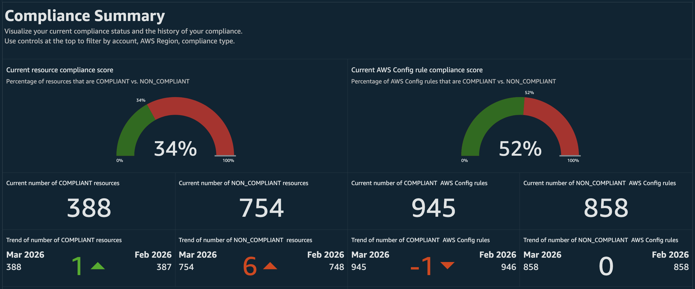
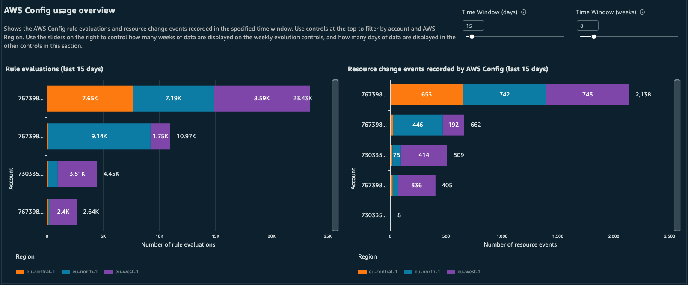
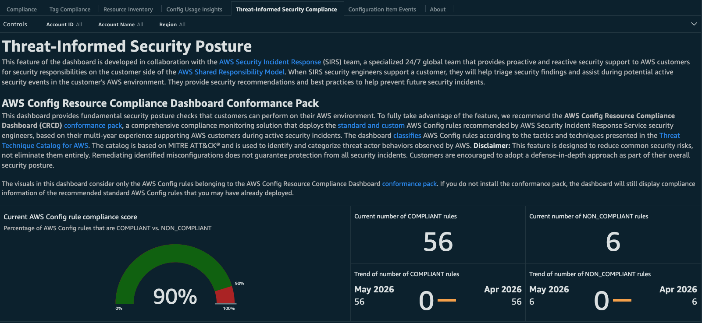

# AWS Config Resource Compliance Dashboard

## Introduction

[AWS Config](https://aws.amazon.com/config/ "https://aws.amazon.com/config/") is a fully managed service that provides you with resource inventory, configuration history, and inventory tracking for security and governance. By actively recording every configuration change across your AWS resources, Config enables continuous compliance auditing, in-depth security analysis, and precise resource change tracking to help you maintain visibility and control over your environment.

The Amazon Web Services (AWS) Config Resource Compliance Dashboard (CRCD) shows the inventory of your AWS resources, along with their compliance status, across multiple AWS accounts and Regions by leveraging your AWS Config data.

## Links

### Demo Dashboard

Get more familiar with the dashboard using the live, interactive demo dashboard following this [link](https://cid.workshops.aws.dev/demo/?dashboard=cid-crcd "https://cid.workshops.aws.dev/demo/?dashboard=cid-crcd").

### GitHub Project

See the source code and the changelog at our GitHub [project](https://github.com/aws-samples/config-resource-compliance-dashboard "https://github.com/aws-samples/config-resource-compliance-dashboard").

## Dashboard features

The AWS Config Resource Compliance Dashboard addresses significant challenges of AWS customers in maintaining their compliance and security posture and establishing effective resource configuration management practices at scale.

Through this unified platform, organizations can bridge the gap between security oversight and operational execution, creating a more efficient and secure cloud infrastructure management and compliance process.

### AWS Config compliance

Track compliance of your AWS Config rules and conformance packs per service, AWS Region, account, resource. Identify resources that require compliance remediation and establish a process for continuous compliance review. Verify that your tagging strategy is consistently applied across accounts and Regions. Evaluate compliance against risky misconfigurations that can lead to common security incidents.

- At-a-glance status of compliant and non-compliant resources and AWS Config rules.
- Compliance score for AWS Config rules, conformance packs, and AWS resources.
- Month-by-month compliance trend for resources and AWS Config rules.
- Compliance breakdown by service, account, and Region.
- Compliance tracking for AWS Config rules and conformance packs.

### Democratize security and compliance visibility

The AWS Config Dashboard helps security teams establish a compliance practice and offers visibility over security compliance to field teams, without them accessing AWS Config service or dedicated security tooling accounts.

### Shift-left security and compliance practices

Field teams will see their non-compliant resources as quickly as security teams. This creates a short feedback loop that helps keep non-compliant resources to a minimum and helps organizations establish a consistent compliance review process with a shorter path to get to green compliance.

### Resource inventory management

The dashboard delivers a simplified Configuration Management Database (CMDB) experience in AWS. Avoid investment in a dedicated external CMDB system or third-party tools. Access the inventory of resources in a single pane of glass, without accessing the AWS Management Console on each account and Region. Filter resources by account, Region, and fields that are specific to the resource such as IP address. If you tag consistently your resources — for example to map them to the application, owning team and environment — specify those tags to the dashboard and they will be displayed alongside the other resource-specific information, and used for filtering your configuration items. Manage and plan the upgrade of Amazon RDS DB engines and AWS Lambda runtimes.

Inventory of Amazon EC2, Amazon EBS, Amazon S3, Amazon Relational Database Service (RDS) and AWS Lambda resources with filtering on account, Region and resource-specific fields (e.g. IP addresses for EC2). Option to filter resources by the custom tags that you use to categorize workloads, such as Application, Owner and Environment. The name of the tags will be provided by you during installation.

#### Resource inventory and EC2 Availability Zone dashboards

Graphs that report summarized insights about resource configuration data, including detailed information about EC2 and EBS. Evaluate your resilience to AZ-level events by checking the distribution of your EC2 instances across Availability Zones.

### Tag compliance

Visualize the results of AWS Config Managed Rule [required-tags](../../../config/latest/developerguide/required-tags.md "../../../config/latest/developerguide/required-tags.md") or one of the several [rules](../../../config/latest/developerguide/managed-rules-by-aws-config.md "../../../config/latest/developerguide/managed-rules-by-aws-config.md") ending with `-tagged`. You can deploy these rules to find resources in your accounts that were not launched with your desired tag configurations.

### Understand and optimize AWS Config usage

AWS Config costs can be difficult to attribute without the right visibility. The dashboard surfaces the patterns behind your spending — so you can streamline your AWS Config setup, eliminate redundant evaluations, and maintain the same level of compliance coverage with less overhead.
AWS Config costs are driven by two primary factors: the number of configuration item (CI) changes being recorded and the number of rule evaluations performed over time. Because AWS Config supports multiple recording modes and deployment options, costs can accumulate in ways that are difficult to track without dedicated tooling. Calculating precise Config costs is complex, and the **Config Usage Insights** tab is designed to surface the trends and patterns that matter most — giving you a clear view of how many CI changes are being recorded and how rule evaluations are trending across your environment.

Rule evaluations are triggered continuously in response to resource configuration changes, or periodically based on scheduled checks. AWS Config can be deployed through individual rules, conformance packs, Security Hub standards, and AWS Control Tower controls — and many organizations inadvertently end up with duplicate rules across these deployment methods. This duplication results in redundant evaluations that increase costs without improving compliance coverage, adds governance complexity, and can lead to inconsistent remediation actions for the same compliance issue. Regularly auditing your rules and conformance packs to identify and eliminate this redundancy is one of the most effective ways to reduce Config spending.

Another cost pattern worth monitoring involves conformance pack rules with a compliance status of `INSUFFICIENT_DATA`. These rules have no AWS resources currently in scope, yet evaluations are still triggered — and you are charged for each evaluation regardless of its outcome. Identifying these rules allows you to deactivate them, avoiding charges for evaluations that provide no compliance value.

The **Config Usage Insights** tab provides the visibility needed to address these patterns systematically. By tracking CI recording volumes and rule evaluation counts over time, the dashboard helps you identify where spending is concentrated, surface redundant or inactive rules, and make informed decisions about where to streamline your AWS Config configuration — without compromising your compliance posture.

### Threat-Informed Security Posture with AWS Security Incident Response

The [AWS Security Incident Response](https://aws.amazon.com/security-incident-response/ "https://aws.amazon.com/security-incident-response/") team is a specialized 24/7 global team that provides proactive and reactive security support to AWS customers for security responsibilities on the customer side of the [AWS Shared Responsibility Model](https://aws.amazon.com/compliance/shared-responsibility-model/ "https://aws.amazon.com/compliance/shared-responsibility-model/"). When AWS Security Incident Response security engineers support a customer, they will help triage security findings and assist during potential active security events in the customer’s AWS environment. They provide security recommendations and best practices to help prevent future security incidents.

This feature of the AWS Config Dashboard was developed in collaboration with AWS Security Incident Response security experts, drawing on their multi-year experience supporting AWS customers during active security incidents. It uses AWS Config rules recommended by security engineers to identify preventable, common misconfigurations that are known to create vulnerabilities exploited in attacks against AWS environments. Addressing these misconfigurations helps eliminate the low-hanging fruit that bad actors frequently target when attempting to gain unauthorized access.

**Disclaimer**: This feature is designed to reduce common security risks, not eliminate them entirely. Remediating identified misconfigurations does not guarantee protection from all security incidents. Customers are encouraged to adopt a defense-in-depth approach as part of their overall security posture.

The **Threat-Informed Security Compliance** tab displays the compliance status of a curated set of standard AWS Config rules recommended by AWS Security Incident Response security engineers. The dashboard classifies these rules according to the tactics and techniques presented in the Threat Technique Catalog for AWS. The catalog is based on MITRE ATTCK® and is used to identify and categorize threat actor behaviors observed by AWS.

If you have already deployed any of the recommended standard AWS Config rules in your environment, the dashboard will automatically surface their compliance status in this tab — no additional configuration is required.

### Configuration Item events

The AWS Config Dashboard shows the timeline of your configuration changes. Find which resources were recently created, updated or deleted and see which accounts and Regions are delivering AWS Config data. Visualize the latest data imported into the dashboard and confirm that you are receiving data from all accounts and Regions.

## Steps

There are two possible ways to deploy the AWS Config dashboard on AWS Organizations. Read the [Prerequisites](config-resource-prerequisites.md "config-resource-prerequisites.md") page to understand which deployment setup is better for you. If you install the dashboard on a standalone account that is not part of an AWS Organization, follow the installation instructions in the AWS Config account.

- [Prerequisites](config-resource-prerequisites.md "config-resource-prerequisites.md")
- [Deployment: AWS Config account](config-resource-log-archive.md "config-resource-log-archive.md")
- [Deployment: Dashboard account](config-resource-dashboard-account.md "config-resource-dashboard-account.md")
- [Optional post-deployment activities and FAQ](config-resource-post-deployment.md "config-resource-post-deployment.md")
- [Teardown](config-resource-teardown.md "config-resource-teardown.md")

###### Note

These dashboards and their content: (a) are for informational purposes only, (b) represent current AWS product offerings and practices, which are subject to change without notice, and (c) does not create any commitments or assurances from AWS and its affiliates, suppliers or licensors. AWS content, products or services are provided "as is" without warranties, representations, or conditions of any kind, whether express or implied. The responsibilities and liabilities of AWS to its customers are controlled by AWS agreements, and this document is not part of, nor does it modify, any agreement between AWS and its customers.

## Update instructions

If you already have installed the AWS Config Dashboard, you can check our [GitHub repository upgrade page](https://github.com/aws-samples/config-resource-compliance-dashboard/blob/main/documentation/upgrade.md "https://github.com/aws-samples/config-resource-compliance-dashboard/blob/main/documentation/upgrade.md") to see if there are instructions on how to upgrade to the latest version.

## Authors

- Luca Casarini, Senior Technical Account Manager, AWS

## Contributors

- Iakov Gan, Ex-Amazonian

## Feedback Support

Follow [Feedback & Support](feedback-support.md "feedback-support.md") guide.
