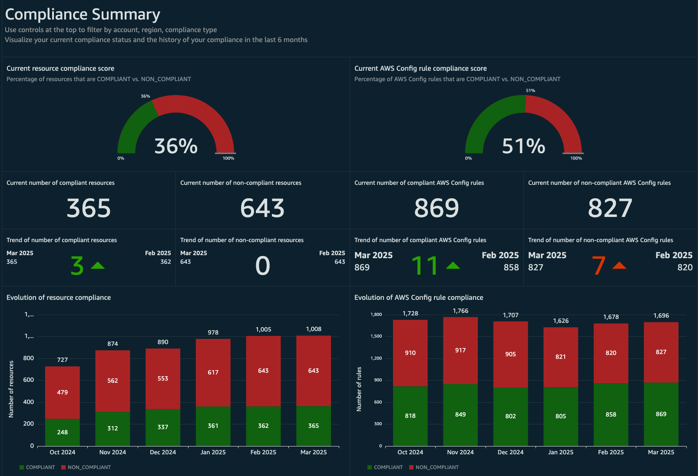
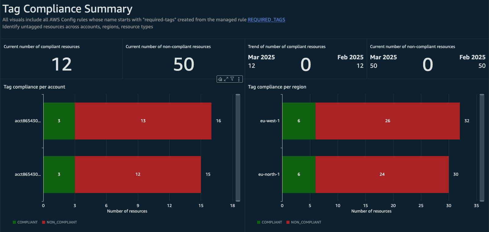
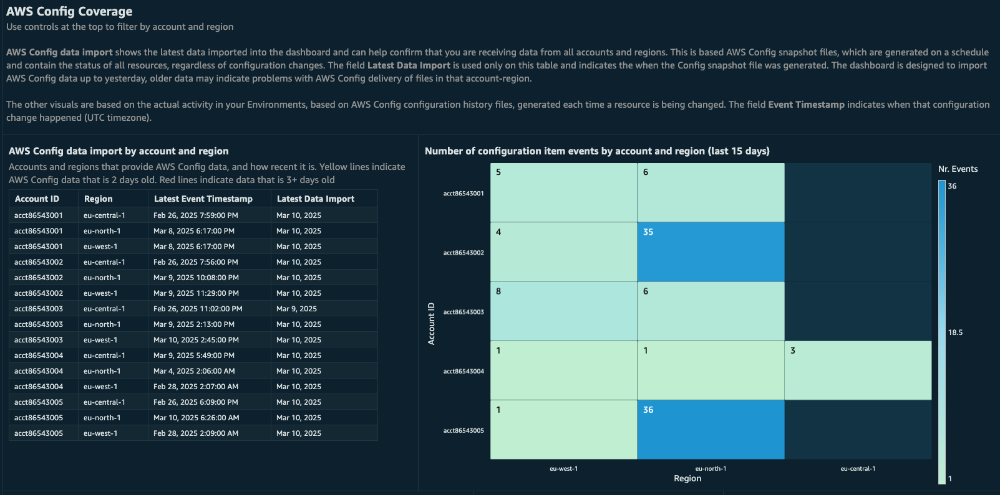

# AWS Config Resource Compliance Dashboard

## Authors

- Luca Casarini, Senior Technical Account Manager, AWS

## Contributors

- Iakov Gan, Senior Solution Architect, AWS

## Feedback & Support

Follow [Feedback & Support](feedback-support.md "feedback-support.md") guide.

## Demo Dashboard

Get more familiar with the dashboard using the live, interactive demo
dashboard following this
[link](https://cid.workshops.aws.dev/demo/?dashboard=cid-crcd "https://cid.workshops.aws.dev/demo/?dashboard=cid-crcd").

## Introduction

AWS Config is a fully managed service that provides you with resource
inventory, configuration history, and configuration change notifications
for security and governance.

The Amazon Web Services (AWS) Config Resource Compliance Dashboard
(CRCD) shows the inventory of your AWS resources, along with their
compliance status, across multiple AWS accounts and regions by
leveraging your AWS Config data.

## Advantages

### A simplified Configuration Management Database (CMDB) experience in AWS

Avoid investment in a dedicated external CMDB system or third-party
tools. Access the inventory of resources in a single pane of glass,
without accessing the AWS Management Console on each account and region.
Filter resources by account, region, and fields that are specific to the
resource such as IP address. If you tag consistently your resources, for
example to map them to the application, owning team and environment,
specify those tags to the dashboard and they will be displayed alongside
other resource-specific information, and used for filtering your
configuration items. Manage and plan the upgrade of Amazon RDS DB
engines and AWS Lambda runtimes.

### Compliance tracking

Track compliance of your AWS Config rules and conformance packs per
service, region, account, resource. Identify resources that require
compliance remediation and establish a process for continuous compliance
review. Verify that your tagging strategy is consistently applied across
accounts and regions.

### Democratize security and compliance visibility

The AWS Config Dashboard helps security teams establish a compliance
practice and offers visibility over security compliance to field teams,
without them accessing AWS Config service or dedicated security tooling
accounts.

## Dashboard features

### AWS Config compliance

- At-a-glance status of compliant and non-compliant resources and AWS
  Config rules.
- Month-by-month compliance trend for resources and AWS Config rules.
- Compliance breakdown by service, account, and region.
- Compliance tracking for AWS Config rules and conformance packs.

### Inventory management

Inventory of Amazon EC2, Amazon EBS, Amazon S3, Amazon Relational
Database Service (RDS) and AWS Lambda resources with filtering on
account, region and resource-specific fields (e.g. IP addresses for
EC2). Furthermore, the dashboard supports filtering of these resources
by the custom tags that you use to categorize workloads, such as
Application, Owner and Environment. The name of the tags will be
provided by you during installation.

#### AWS Config Aggregator Dashboard

Graphs from the AWS Config
[Aggregator
Dashboard](../../../config/latest/developerguide/viewing-the-aggregate-dashboard.md#aggregate-compliance-dashboard "../../../config/latest/developerguide/viewing-the-aggregate-dashboard.md#aggregate-compliance-dashboard") are added here, so that you can share it without managing
read-only access to the AWS Config console.

### Tag compliance

Visualize the results of AWS Config Managed Rule
[required-tags](../../../config/latest/developerguide/required-tags.md "../../../config/latest/developerguide/required-tags.md").
You can deploy this rule to find resources in your accounts that were
not launched with your desired tag configurations by specifying which
resource types should have tags and the expected value for each tag. The
rule can be deployed multiple times in AWS Config. To display data on
the dashboard, the rules must have a name that starts with
`required-tags` (this is case-sensitive).

### Configuration Item events

The AWS Config Dashboards shows the timeline of your configuration
changes. Find which resources were recently created, updated or deleted
and see which accounts and regions are delivering AWS Config data.
Visualize the latest data imported into the dashboard and confirm that
you are receiving data from all accounts and regions.

## Steps

There are two possible ways to deploy the AWS Config dashboard on AWS
Organizations. Read the [Perequisites](config-resource-prerequisites.md "config-resource-prerequisites.md") page to understand which
deployment setup is better for you. If you install the dashboard on a
standalone account that is not part of an AWS Organization, follow the
installation instructions in the Log Archive account.

- [Prerequisites](config-resource-prerequisites.md "config-resource-prerequisites.md")
- [Deployment: Log Archive account](config-resource-log-archive.md "config-resource-log-archive.md")
- [Deployment: Dashboard account](config-resource-dashboard-account.md "config-resource-dashboard-account.md")
- [Optional post-deployment activities and FAQ](config-resource-post-deployment.md "config-resource-post-deployment.md")
- [Teardown](config-resource-teardown.md "config-resource-teardown.md")

###### Note

These dashboards and their content: (a) are for informational
purposes only, (b) represent current AWS product offerings and
practices, which are subject to change without notice, and (c) does not
create any commitments or assurances from AWS and its affiliates,
suppliers or licensors. AWS content, products or services are provided
"as is" without warranties, representations, or conditions of any
kind, whether express or implied. The responsibilities and liabilities
of AWS to its customers are controlled by AWS agreements, and this
document is not part of, nor does it modify, any agreement between AWS
and its customers.

## Update instructions

If you already have installed the AWS Config Dasboard, you can check our
[GitHub
repository upgrade page](https://github.com/aws-samples/config-resource-compliance-dashboard/blob/main/documentation/upgrade.md "https://github.com/aws-samples/config-resource-compliance-dashboard/blob/main/documentation/upgrade.md") to see if there are instructions on how to
upgrade to the latest version.
