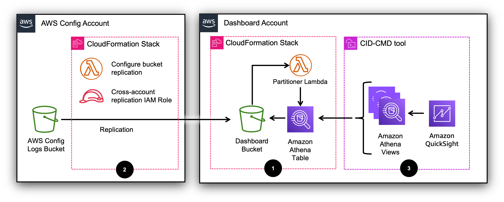

# Deployment: Dashboard account

## Deployment Instructions

The infrastructure needed to collect and process the data is defined in AWS CloudFormation. The dashboard resources are defined in a template file that can be installed using the [CID-CMD](https://github.com/aws-solutions-library-samples/cloud-intelligence-dashboards-framework/blob/main/CID-CMD.md "https://github.com/aws-solutions-library-samples/cloud-intelligence-dashboards-framework/blob/main/CID-CMD.md") tool.

## Installation on dedicated Dashboard account

The installation process consists of three steps:

1. On the Dashboard account, deploy data pipeline resources for the dashboard using a CloudFormation stack.
2. On the Log Archive account, configure the S3 replication rule that copies AWS Config files from the Log Archive bucket to the Dashboard bucket using a CloudFormation stack.
3. On the Dashboard account, deploy Quick Sight resources for the dashboard and the necessary Athena views using the [CID-CMD](https://github.com/aws-solutions-library-samples/cloud-intelligence-dashboards-framework/blob/main/CID-CMD.md "https://github.com/aws-solutions-library-samples/cloud-intelligence-dashboards-framework/blob/main/CID-CMD.md") command line tool.



###### Note

The S3 replication rule configured at step 2 is valid only for new AWS Config files delivered to the Log Archive bucket, i.e. it **will not** replicate files that previously existed on the Log Archive bucket.

## Deployment Steps

###### Note

Ensure you are in the AWS Region where both your Log Archive bucket and Amazon Quick Sight are deployed.

## Step 1 [in Dashboard account]

1. Log into the AWS Management Console for your Dashboard account.
2. Ensure you are in the same Region as the Log Archive bucket.
3. Click the Launch Stack button below to open the stack template in your CloudFormation console. This Stack will create the data pipeline resources for the dashboard.

[](https://console.aws.amazon.com/cloudformation/home#/stacks/create/review?&templateURL=https://aws-managed-cost-intelligence-dashboards.s3.amazonaws.com/cfn/cid-crcd-resources.yaml&stackName=config-dashboard-resources "https://console.aws.amazon.com/cloudformation/home#/stacks/create/review?&templateURL=https://aws-managed-cost-intelligence-dashboards.s3.amazonaws.com/cfn/cid-crcd-resources.yaml&stackName=config-dashboard-resources")

1. Specify the following parameters:
   - `Log Archive account ID` Enter the AWS account ID of the Log Archive account. Notice this in **not** where you are currently logged in (Required).
   - `Log Archive bucket` Enter the name of the Amazon S3 bucket that collects AWS Config data (Required).
   - `ARN of the KMS key that encrypts the Log Archive bucket` If you encrypt the Log Archive bucket with a KMS key, copy the key’s ARN here.
     - If a KMS key ARN is passed here, the CloudFormation template will create a new KMS key and use it to encrypt the the Dashboard bucket.

   - `Dashboard account ID` Enter the AWS account ID where you are currently logged in (Required).
   - `Dashboard bucket` Enter the name of the Amazon S3 bucket that will collect AWS Config data. The CloudFormation template will create this bucket on the Dashboard account (Required).
   - `ARN of the KMS key that encrypts the Dashboard bucket` Leave empty. This parameter is ignored in this deployment mode.
   - `Configure S3 event notification` Leave at the default value. This parameter is ignored in this deployment mode.
   - `Configure cross-account replication` Leave at the default value. This parameter is ignored in this deployment mode.
   - Leave all other parameters at their default value.

1. Run the CloudFormation template.
1. Note down the output values of the CloudFormation template.
1. If you encrypt the Log Archive bucket with a KMS key, the template will create a KMS key to encrypt the Dashboard bucket. Note down its ARN from the output value `DashboardBucketKmsKeyArn`. You will use it at the next step.

## Step 2 [in Log Archive account]

1. Log into the AWS Management Console for your Log Archive account.
2. Click the Launch Stack button below to open the stack template in your CloudFormation console. This Stack will create the data pipeline resources for the dashboard.

[](https://console.aws.amazon.com/cloudformation/home#/stacks/create/review?&templateURL=https://aws-managed-cost-intelligence-dashboards.s3.amazonaws.com/cfn/cid-crcd-resources.yaml&stackName=config-dashboard-resources "https://console.aws.amazon.com/cloudformation/home#/stacks/create/review?&templateURL=https://aws-managed-cost-intelligence-dashboards.s3.amazonaws.com/cfn/cid-crcd-resources.yaml&stackName=config-dashboard-resources")

1. Specify the following parameters:
   - `Log Archive account ID` Enter the AWS account ID where you are currently logged in (Required).
   - `Log Archive bucket` Enter the name of the Amazon S3 bucket that collects AWS Config data (Required).
   - `ARN of the KMS key that encrypts the Log Archive bucket` If you encrypt the Log Archive bucket with a KMS key, copy the key’s ARN here.
   - `Dashboard account ID` Insert the ID of the Dashboard account that you specified in this field at Step 1 (Required).
   - `Dashboard bucket` Insert the bucket name that you specified in this field at Step 1 (Required).
   - `ARN of the KMS key that encrypts the Dashboard bucket` This parameter is used only at this step of the Dashboard account deployment. If you encrypt the Log Archive bucket with a KMS key, insert the ARN of the KMS key created in Step 1 (it’s `DashboardBucketKmsKeyArn` on the CloudFormation Outputs).
   - `Configure S3 event notification` Leave at the default value. This parameter is ignored in this deployment mode.
   - `Configure cross-account replication` (Required)
     - Select `yes` to configure S3 replication from the Log Archive bucket to the Dashboard bucket.
     - Select `no` if you already have configured S3 replication rules on the Log Archive bucket. You will have to setup S3 replication manually (see below).
     - The S3 replication configuration is performed by an ad-hoc Lambda function (**Configure bucket replication** in the diagram above) that will be called by the CloudFormation template automatically.

     ###### Note

     If you select `yes`, and you have existing S3 replication configurations, the **Configure bucket replication** function will return an error and the entire stack will fail. In this case you must select `no` and run the stack again.

   - Leave all other parameters at their default value.

1. Run the CloudFormation template.
1. Note down the output values of the CloudFormation template.

**Manual setup of S3 replication**

1. Log onto the Log Archive account and open the Amazon S3 console.
2. You can replicate AWS Config files from the centralized Log Archive bucket to the Dashboard bucket through an Amazon S3 Replication configuration, follow these [instructions](../../../AmazonS3/latest/userguide/replication-walkthrough-2.md "../../../AmazonS3/latest/userguide/replication-walkthrough-2.md").
3. Specify the IAM role created by the CloudFormation template at Step 2, as reported in the output value `ReplicationRoleArn` of the template.
   If your Log Archive bucket is SSE-KMS encrypted, the replication role will have the necessary permissions, no need for additional steps.

###### Note

The S3 replication rule configured at step 2 is valid only for new AWS Config files delivered to the Log Archive bucket, i.e. it **will not** replicate files that previously existed on the Log Archive bucket.

## Step 3 [in Dashboard account]

Log back into the AWS Management Console for your Dashboard account.

###### Note

At this step you will specify the tags to be used to display resources in the [Resource inventory management](config-resource-compliance-dashboard.md#config-resource-compliance-dashboard-inventory-management "config-resource-compliance-dashboard.md#config-resource-compliance-dashboard-inventory-management") part of the dashboard. Use the tags that classify workloads and resources in your organization.

1. Navigate to the AWS Management Console and open [AWS CloudShell](https://console.aws.amazon.com/cloudshell "https://console.aws.amazon.com/cloudshell"). Ensure to be in the correct Region.
2. Install the latest pip package of the [CID-CMD](https://github.com/aws-solutions-library-samples/cloud-intelligence-dashboards-framework/blob/main/CID-CMD.md "https://github.com/aws-solutions-library-samples/cloud-intelligence-dashboards-framework/blob/main/CID-CMD.md") tool:

```
pip3 install --upgrade cid-cmd
```

1. Deploy the dashboard by running the following command (replace the parameters accordingly):
   - `--tag1` The name of the first tag you use to categorize resources.
   - `--tag2` The name of the second tag you use to categorize resources.
   - `--tag3` The name of the third tag you use to categorize resources.
   - `--tag4` The name of the fourth tag you use to categorize resources.
   - Notice that tag parameters are case sensitive and cannot be empty. If you do not use a tag, pass a short default value, e.g. `--tag4 'NA'`.
   - Leave all other parameters at their default value.

   ```
   cid-cmd deploy \
      --resources 'https://raw.githubusercontent.com/aws-samples/config-resource-compliance-dashboard/refs/heads/main/dashboard_template/cid-crcd.yaml' \
      --dashboard-id 'cid-crcd' \
      --athena-database 'cid_crcd_database' \
      --athena-workgroup 'crcd-dashboard' \
      --tag1 'REPLACE_WITH_CUSTOM_TAG_1' \
      --tag2 'REPLACE_WITH_CUSTOM_TAG_2' \
      --tag3 'REPLACE_WITH_CUSTOM_TAG_3' \
      --tag4 'REPLACE_WITH_CUSTOM_TAG_4'
   ```

1. The CID-CMD tool will prompt you to select a datasource: `[quicksight-datasource-id] Please choose DataSource (Select the first one if not sure):`.
   - If you have installed other CID/CUDOS dashboards, select the existing datasource `CID-CMD-Athena`.
   - Otherwise select `CID-CMD-Athena <CREATE NEW DATASOURCE>`.

1. When prompted `[quicksight-datasource-role] Please choose a Quick Sight role.` select `CidCmdQuick SightDataSourceRole <ADD NEW ROLE>` or `CidCmdQuick SightDataSourceRole` (the second option will appear as default if you have other CID/CUDOS dashboards).
1. In certain cases the installer will show an updated IAM policy JSON code and prompt `? [confirm-policy-AthenaAccess] Please confirm:`. Select `yes`.
1. When prompted `[timezone] Please select timezone for datasets scheduled refresh.:` select the time zone for dataset scheduled refresh in your Region (it is already preselected).
1. When prompted `Select taxonomy fields to add as dashboard filters and group by fields` select `Looks good` without adding taxonomy items. Taxonomy is not yet supported by the dashboard.
1. When prompted `[share-with-account] Share this dashboard with everyone in the account?:` select the option that works for you.

## Visualize the dashboard

1. Navigate to Quick Sight and then `Dashboards`.
2. Ensure you are in the correct Region.
3. Click on the **AWS Config Resource Compliance Dashboard (CRCD)**
   dashboard.
