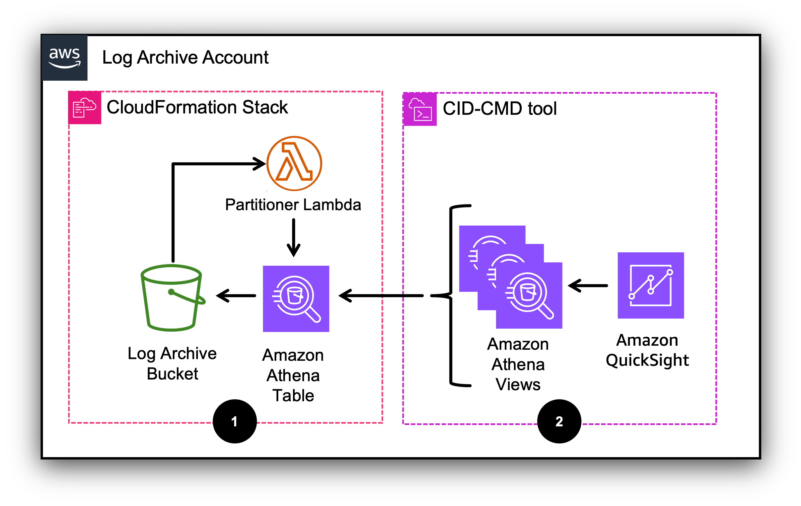

# Deployment: Log Archive account

## Deployment Instructions

The infrastructure needed to collect and process the data is defined in
AWS CloudFormation. The dashboard resources are defined in a template
file that can be installed using the
[CID-CMD](https://github.com/aws-solutions-library-samples/cloud-intelligence-dashboards-framework/blob/main/CID-CMD.md "https://github.com/aws-solutions-library-samples/cloud-intelligence-dashboards-framework/blob/main/CID-CMD.md")
tool.

### Deployment on standalone account

Follow the same installation instructions for the Log Archive account.

### Deployment on Log Archive account

The installation process consists of two steps:

1. Data pipeline resources for the dashboard, via CloudFormation stack.
2. QuickSight resources for the dashboard and the necessary Athena views, using the [CID-CMD](https://github.com/aws-solutions-library-samples/cloud-intelligence-dashboards-framework/blob/main/CID-CMD.md "https://github.com/aws-solutions-library-samples/cloud-intelligence-dashboards-framework/blob/main/CID-CMD.md") command line tool.



#### Deployment Steps

###### Note

Ensure you are in the region where both your Log Archive bucket
and Amazon QuickSight are deployed.

##### Step 1

1. Log into the AWS Management Console for your Log Archive account.
2. Click the Launch Stack button below to open the stack template in your CloudFormation console. This Stack will create the data pipeline resources for the dashboard.

[](https://console.aws.amazon.com/cloudformation/home#/stacks/create/review?&templateURL=https://aws-managed-cost-intelligence-dashboards.s3.amazonaws.com/cfn/cid-crcd-resources.yaml&stackName=config-dashboard-resources "https://console.aws.amazon.com/cloudformation/home#/stacks/create/review?&templateURL=https://aws-managed-cost-intelligence-dashboards.s3.amazonaws.com/cfn/cid-crcd-resources.yaml&stackName=config-dashboard-resources") 3. Specify the following parameters:

    * `Log Archive account ID` Enter the AWS account ID where you are currently logged in (Required).
    * `Log Archive bucket` Enter the name of the Amazon S3 bucket that collects AWS Config data (Required).
    * `ARN of the KMS key that encrypts the Log Archive bucket` Leave empty if the bucket is not encrypted with a KMS key. If you encrypt the bucket with a KMS key, copy the key’s ARN here.


    	+ CloudFormation will create an IAM policy that grants Amazon QuickSight permissions to use the key for decrypt operations.
    	+ You may prefer managing key permissions on the key policy, rather than IAM. In his case, leave the parameter empty. You’ll have to manually grant key permissions in the key policy (more details below).
    * `Dashboard account ID` Enter the same value as the `Log Archive account ID` (Required).
    * `Dashboard bucket` Enter the same value as the `Log Archive bucket` (Required).
    * `ARN of the KMS key that encrypts the Dashboard bucket` Leave empty, this parameter is ignored in this deployment mode.
    * `Configure S3 event notification` This will configure S3 event notifications to trigger the Partitioner Lambda function, which creates the corresponding partition on Amazon Athena, when a new AWS Config file is delivered to the Log Archive bucket (Required).


    	+ Select `yes` to configure S3 event notifications.
    	+ Select `no` if you have already configured event notifications on the Log Archive bucket. You’ll have to manually configure S3 event notifications (more details below).
    	+ The S3 event notification configuration is performed by an ad-hoc Lambda function (**Configure bucket notification** in the diagram above)
    	that will be called by the CloudFormation template automatically.


    	###### Note

    	The **Configure bucket notification** function will return an
    	error (and the entire stack will fail) if you have already configured
    	event notifications on the Log Archive bucket. In this case you must
    	select `no` and run the stack again.
    * `Configure cross-account replication` Leave at the default value. This parameter is ignored in this deployment mode.
    * Leave all other parameters at their default value.

1. Run the CloudFormation template.
2. Note down the output values of the CloudFormation template.

**Manual setup of KMS key permissions**

###### Note

Skip this section if you do not utilize a KMS key to encrypt your Dashboard bucket, or if you specified the key ARN in the CloudFormation parameter `ARN of the KMS key that encrypts the Dashboard bucket` in Step 1.

Follow these steps to
[edit](../../../kms/latest/developerguide/key-policy-modifying.md "../../../kms/latest/developerguide/key-policy-modifying.md")
the key policy and grant the QuickSight role permissions to use the key
for decrypt operations.

1. Ensure you are logged into the AWS Management Console on the Log Archive account and region where you created the KMS key that encrypts the Log Archive bucket.
2. Open the AWS Key Management Service console and click on the KMS key.
3. Add the following statement to the key policy:

```
{
    "Sid": "CRCD Dashboard allow Quicksight Role access",
    "Effect": "Allow",
    "Principal": {
        "AWS": "arn:aws:iam::ACCOUNT_ID:role/QUICKSIGHT_DATASOURCE_ROLE"
    },
    "Action": [
        "kms:Decrypt"
    ],
    "Resource": "*"
}
```

Where:

- `ACCOUNT_ID` is the AWS account ID where you installed thedashboard.
- `QUICKSIGHT_DATASOURCE_ROLE` is the value of the output `QuickSightDataSourceRole` from the CloudFormation template.

**Manual setup of S3 event notification**

###### Note

Skip this section if you selected `yes` in CloudFormation parameter `Configure S3 event notification` in Step 1.

If you selected `no`, you must configure the Log Archive S3 bucket
event notification to trigger the Lambda Partitioner function when
objects are added to the bucket. CloudFormation has already deployed the
necessary permissions for the Lambda function to access the Log Archive
bucket. You can find the ARN of the Lambda Partitioner function in the
output values of the CloudFormation template.

We recommend that you configure your event notification to an SNS topic in these cases:

1. If your bucket already publishes events notifications to an SNS topic, [subscribe](../../../lambda/latest/dg/with-sns.md#sns-trigger-console "../../../lambda/latest/dg/with-sns.md#sns-trigger-console") the Lambda Partitioner function to the topic.
2. If your bucket sends event notifications to another Lambda function, change the notification to an SNS topic and [subscribe](../../../lambda/latest/dg/with-sns.md#sns-trigger-console "../../../lambda/latest/dg/with-sns.md#sns-trigger-console") both the existing function and the Lambda Partitioner function to that SNS topic.
   The S3 event notifications for this dashboard must meet the following
   requirements:

3. All object create events.
4. All prefixes.
   This may be a challenge depending on your current S3 event notification
   setup, as Amazon S3
   [cannot
   have](../../../AmazonS3/latest/userguide/notification-how-to-filtering.md#notification-how-to-filtering-examples-invalid "../../../AmazonS3/latest/userguide/notification-how-to-filtering.md#notification-how-to-filtering-examples-invalid") overlapping prefixes in two rules for the same event type.

Follow
[these
instructions](../../../AmazonS3/latest/userguide/how-to-enable-disable-notification-intro.md "../../../AmazonS3/latest/userguide/how-to-enable-disable-notification-intro.md") to add a notification configuration to your bucket using
an Amazon SNS topic. Also, ensure that the Log Archive bucket is
[granted
permissions to publish event notification messages to your SNS topic](../../../AmazonS3/latest/userguide/grant-destinations-permissions-to-s3.md "../../../AmazonS3/latest/userguide/grant-destinations-permissions-to-s3.md").

##### Step 2

Remain logged into the AWS Management Console for your Log Archive
account.

###### Note

At this step you will specify the tags to be used to display resources in the [Inventory management](config-resource-compliance-dashboard.md#config-resource-compliance-dashboard-inventory-management "config-resource-compliance-dashboard.md#config-resource-compliance-dashboard-inventory-management") part of the dashboard. Use the tags that classify workloads and resources in your organization.

1.  Download the
    [dashboard
    template file](https://github.com/aws-samples/config-resource-compliance-dashboard/blob/main/dashboard_template/cid-crcd.yaml "https://github.com/aws-samples/config-resource-compliance-dashboard/blob/main/dashboard_template/cid-crcd.yaml") on a temporary folder. Save it with name:
    `cid-crcd.yaml`.
2.  Deploy the QuickSight dashboard using the
    [CID-CMD](https://github.com/aws-solutions-library-samples/cloud-intelligence-dashboards-framework/blob/main/CID-CMD.md "https://github.com/aws-solutions-library-samples/cloud-intelligence-dashboards-framework/blob/main/CID-CMD.md")
    tool:

        * Navigate to the AWS Management Console and open
        [AWS CloudShell](https://console.aws.amazon.com/cloudshell "https://console.aws.amazon.com/cloudshell"). Ensure to be
        in the correct region.
        * Install the latest pip package:


        ```
        python3 -m ensurepip --upgrade
        ```
        * Install the CID-CMD tool:


        ```
        pip3 install --upgrade cid-cmd
        ```
        * On the top right corner, click on `Actions`, and then `Upload file`.
        * Select the `cid-crcd.yaml` file and click on `Upload`.
        * Deploy the dashboard by running the following command (replace the parameters accordingly):


        	+ `--tag1` The name of the first tag you use to categorize workloads.
        	+ `--tag2` The name of the second tag you use to categorize
        	workloads.
        	+ `--tag3` The name of the third tag you use to categorize workloads.
        	+ `--tag4` The name of the fourth tag you use to categorize workloads.
        	+ Notice that tag parameters are case sensitive and cannot be empty. If you do not use a tag, pass a short default value, e.g. `--tag4 'NA'`.
        	+ Leave all other parameters at their default value.

```
cid-cmd deploy --resources '`cid-crcd.yaml`' --tag1 '`REPLACE_WITH_CUSTOM_TAG_1`' --tag2 '`REPLACE_WITH_CUSTOM_TAG_2`' --tag3 '`REPLACE_WITH_CUSTOM_TAG_3`' --tag4 '`REPLACE_WITH_CUSTOM_TAG_4`' --dashboard-id '`cid-crcd`' --athena-database '`cid_crcd_database`' --athena-workgroup '`crcd-dashboard`'
```

1. The CID-CMD tool will prompt you to select a datasource: `[quicksight-datasource-id] Please choose DataSource (Select the first one if not sure):`.
   - If you have installed other CID/CUDOS dashboards, select the existing datasource `CID-CMD-Athena`.
   - Otherwise select `CID-CMD-Athena <CREATE NEW DATASOURCE>`.

2. When prompted `[quicksight-datasource-role] Please choose a QuickSight role. It must have access to Athena:` select `CidCmdQuickSightDataSourceRole <ADD NEW ROLE>` or `CidCmdQuickSightDataSourceRole` (the second option will appear by default if you have other CID/CUDOS dashboards).
3. In certain cases the installer will show an updated IAM policy JSON code and prompt `? [confirm-policy-AthenaAccess] Please confirm:`. Select `yes`.
4. When prompted `[timezone] Please select timezone for datasets scheduled refresh.:` select the time zone for dataset scheduled refresh in your region (it is already preselected).
5. When prompted `[share-with-account] Share this dashboard with everyone in the account?:` select the option that works for you.

**Configure dataset refresh schedule (optional)**

By default, the datasets for the CRCD dashboard are refreshed once a
day. You can optionally configure the Refresh Schedule in QuickSight
with a different frequency:

1. Navigate to QuickSight and then `Datasets`.
2. All the datasets for this dashboard have the prefix `config_`.
3. Click on a dataset, and then open the `Refresh` tab.
4. Click on `ADD NEW SCHEDULE`, select `Full refresh`, and choose the desired frequency.

**Visualize the dashboard**

1. Navigate to QuickSight and then `Dashboards`.
2. Ensure you are in the correct region.
3. Click on the **AWS Config Resource Compliance Dashboard (CRCD)** dashboard.
