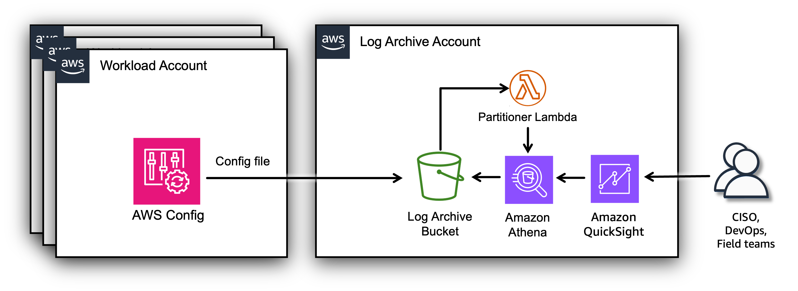
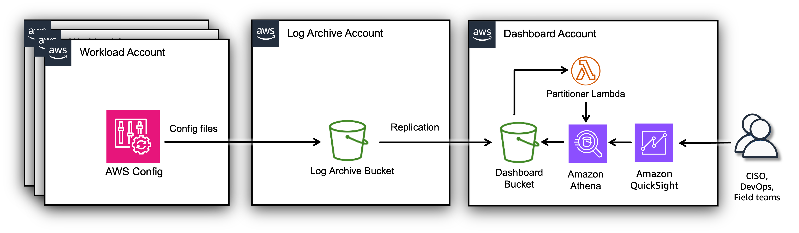

# Prerequisites

## Architecture

The AWS Config Resource Compliance Dashboard (CRCD) solution can be
deployed in standalone AWS accounts or AWS accounts that are members of
an AWS Organization.

You can deploy the dashboard in a standalone account with
[AWS
Config enabled](../../../config/latest/developerguide/getting-started.md "../../../config/latest/developerguide/getting-started.md"). This option may be useful for proof of concept or
testing purposes. In this case, all dashboard resources are deployed
within the same AWS account.

If you use AWS Organizations, AWS Config must be enabled with an
[AWS
Config delivery channel](../../../config/latest/developerguide/manage-delivery-channel.md "../../../config/latest/developerguide/manage-delivery-channel.md") sending files to a centralized Amazon S3 bucket
(which we will call the Log Archive bucket) in a dedicated account
(which we will call the Log Archive account). In this case, there are
two possible ways to deploy the CRCD dashboard.

1. **Deploy in the Log Archive Account** You can deploy the dashboard resources in the same Log Archive account where your AWS Config configuration files are delivered. The architecture in this case looks like this:



1. **Deploy in a separate Dashboard Account** Alternatively, you can create a separate Dashboard account to deploy the dashboard resources. In this case, objects from the Log Archive bucket in the Log Archive account are replicated to another bucket in the Dashboard account.



An Amazon Athena table is used to extract data from the AWS Config
configuration files delivered to Amazon S3. Whenever a new object is
added to the bucket, the Lambda Partitioner function is triggered. This
function checks if the object is an AWS Config configuration update. If
it is, the function adds a new partition to the corresponding Athena
table with the new data; otherwise, the function ignores it. The
solution provides Athena views, which are SQL queries that extract data
from Amazon S3 using the schema defined in the Athena table. Finally,
you can visualize the data in a QuickSight dashboard that uses these
views through Amazon QuickSight datasets.

### Log Archive bucket encrypted with an AWS Key Management Service (KMS) key

The deployment process supports Log Archive buckets encrypted using a
customer-managed KMS key (SSE-KMS).

In case of Log Archive account deployment:

- Amazon Quicksight will be granted permissions to use the KMS key for decrypt operations. This is done with an IAM policy. If you prefer, you can manually grant this permission directly on the key policy. See below for instructions.

In case of Dashboard account deployment:

- S3 replication must occur between buckets with the same type of encryption.
- The Dashboard bucket will be encrypted with a KMS key which is created by the AWS CloudFormation template.
- The S3 replication policy will have permissions to use the KMS keys of both buckets.

###### Note

If your Log Archive bucket is SSE-KMS encrypted, and you do not
pass the ARN of the corresponding KMS key, the dashboard resources will
not have the necessary permissions to function correctly.

## Prerequisites

1.  AWS Config enabled in the accounts and regions you want to track, with
    an AWS Config delivery channel sending files to a centralized Amazon S3
    bucket (which we will call the Log Archive bucket) in a dedicated
    account (which we will call the Log Archive account).

        * We recommend that your AWS Config delivery channel delivers AWS Config
        configuration snapshot files every 24 hours for all accounts and regions
        where AWS Config is active (see below for more information).

2.  An AWS Account where you’ll deploy the dashboard.
3.  An IAM Role or IAM User with permissions to deploy the infrastructure
    using CloudFormation.
4.  Sign up for
    [Amazon
    QuickSight](../../../quicksight/latest/user/signing-up.md "../../../quicksight/latest/user/signing-up.md") and create a user:

        1. Select **Enterprise** edition.
        2. For the **Get Paginated Reports add-on**, choose the option you prefer (this is not required for deploying the CRCD dashboard).
        3. **Use IAM federated identities and QuickSight-managed users**.
        4. Select the region where to deploy the dashboard. We recommend using the same region of your Amazon S3 bucket.
        5. Add a username and an e-mail where you’ll receive notifications about failed QuickSight datasets updates.
        6. Use the **QuickSight-managed role (default)**.
        7. Don’t modify the **Allow access and autodiscovery for these resources** section and click **Finish**.

5.  Ensure you have SPICE capacity available in the region where you’re deploying the dashboard.

## Before you start

### AWS Config considerations

_Skip this paragraph if you have AWS Config enabled._

The solution leverages AWS Config data to build the visualizations on
the dashboard. If you **do not** have AWS Config enabled, we strongly
recommend building your strategy first:

- Decide which accounts, regions, and resources to monitor.
- Define what "compliance" means to your organization, i.e. which [AWS Config rules](../../../config/latest/developerguide/evaluate-config.md "../../../config/latest/developerguide/evaluate-config.md") or [conformance packs](../../../config/latest/developerguide/conformance-packs.md "../../../config/latest/developerguide/conformance-packs.md") to activate.
- Identify the account that will be delegated admin for AWS Config.
- Keep in mind the paragraphs below when enabling AWS Config.

###### Note

Only when the AWS Config setup matches your needs should you consider deploying this dashboard.

### AWS Config delivery channel considerations

The AWS Config delivery channel is a crucial component for managing and
controlling where configuration updates are sent. It consists of an
Amazon S3 bucket and an optional Amazon SNS topic, which is not needed
by the AWS Config dashboard. The S3 bucket is used to store AWS Config
configuration history and configuration snapshots files, while the SNS
topic can be used for streaming configuration changes. A delivery
channel is required to use AWS Config and is limited to one per region
per AWS account. When setting up a delivery channel, you can specify the
name, the S3 bucket for file delivery, and the frequency of
configuration snapshot delivery.

A configuration **snapshot** provides a comprehensive view of all
currently active recorded configuration items within a customer’s AWS
account. In contrast, AWS Config delivers automatically a configuration
**history** file to the S3 bucket every 6 hours. This file contains
changes detected for each resource type since the last history file was
delivered. Check this
[blog
post](https://aws.amazon.com/blogs/mt/configuration-history-configuration-snapshot-files-aws-config/ "https://aws.amazon.com/blogs/mt/configuration-history-configuration-snapshot-files-aws-config/") for more information on the difference between AWS Config
configuration history and configuration snapshot files.

To check your AWS Config delivery channel setup, you can use the AWS CLI
command:

```
aws configservice describe-delivery-channels
```

This command will provide information about the delivery channel
configuration on the account and region where it is launched, including
the S3 bucket where configuration updates are sent and the configuration
snapshot delivery properties. Ensure the configuration is consistent
across all accounts and regions you want to record. The output of the
CLI command should look like this:

```
{
    "DeliveryChannels": [
        {
            "name": "[YOUR-DELIVERY-CHANNEL-NAME]",
            "s3BucketName": "[YOUR-LOG-ARCHIVE-BUCKET-NAME]",
            "s3KeyPrefix": "[OPTIONAL-S3-PREFIX-FOR-AWS-CONFIG-FILES]",
            "configSnapshotDeliveryProperties": {
                "deliveryFrequency": "TwentyFour_Hours"
            }
        }
    ]
}
```

We recommend to have `configSnapshotDeliveryProperties` configured on
your delivery channel with a delivery frequency of 24 hours, run the CLI
command above to verify your setup.

###### Note

AWS Control Tower configures the AWS Config delivery channel
with a 24-hour delivery frequency for configuration snapshot files.

**How to add daily delivery of configuration snapshot files to your delivery channel**

You have to configure this on every account and region where you have
AWS Config active. We’ll give an example below of how this can be
achieved with the AWS CLI, but if your environment consists of several
AWS accounts and regions, we recommend using CloudFormation StackSets to
ensure a consistent configuration.

Here’s how you can use the AWS CLI to modify the existing settings and
schedule the delivery of configuration snapshot files to your delivery
channel configuration.

1. Log into the AWS Console in any account and region, open AWS
   CloudShell.
2. Run the AWS CLI command `aws configservice describe-delivery-channels` and save the resulting JSON to a local file. Name it `deliveryChannel.json`. For example, your file may look like the one below.

```
{
  "name": "default",
  "s3BucketName": "config-bucket-123456789012",
  "snsTopicARN": "arn:aws:sns:us-east-1:123456789012:config-topic",
  "s3KeyPrefix": "my-prefix"
}
```

1. Verify the S3 bucket in `s3BucketName` is the name of your Log
   Archive bucket.
2. Edit the file to add the `configSnapshotDeliveryProperties` section:

```
{
  "name": "default",
  "s3BucketName": "config-bucket-123456789012",
  "snsTopicARN": "arn:aws:sns:us-east-1:123456789012:config-topic",
  "s3KeyPrefix": "my-prefix",
  "configSnapshotDeliveryProperties": {
    "deliveryFrequency": "TwentyFour_Hours"
  }
}
```

You have to follow these steps consistently in every account and region:

1. Log into the AWS Console of one account and region, open AWS CloudShell.
2. Upload the `deliveryChannel.json` file containing the delivery channel configuration.
3. Use the `put-delivery-channel` AWS CLI [command](../../../cli/latest/reference/configservice/put-delivery-channel.md "../../../cli/latest/reference/configservice/put-delivery-channel.md") to update your delivery channel configuration according to the content of the JSON file. This command allows you to update or modify your current delivery channel settings.

```
aws configservice put-delivery-channel --delivery-channel file://deliveryChannel.json
```

Ensure this is done consistently in every account and region.

### Regional considerations

###### Note

Data transfer costs will incur when Amazon Athena queries an
Amazon S3 bucket across regions.

To avoid cross-region data transfer, Amazon QuickSight and the Amazon S3 bucket containing AWS Config files must be deployed in the same region.

- If you have already deployed either resource, the other must use the same region. If you haven’t deployed anything yet, you can choose a region of your preference.
- If you have deployed both resources in different regions, we strongly recommend making changes so that both are in the same region.
- Once you have decided on the region, deploy AWS resources supporting the dashboard (via CloudFormation) in the same region.

### Tag Compliance: naming convention on the AWS Config rule

This part of the dashboard visualizes the evaluation results of AWS
Config Managed Rule
[required-tags](../../../config/latest/developerguide/required-tags.md "../../../config/latest/developerguide/required-tags.md").
You can deploy this rule to find resources in your accounts that were
not launched with your desired tag configurations by specifying which
resource types should have tags and the expected value for each tag. The
rule can be deployed multiple times in AWS Config. To display data on
the dashboard, the rules must have a name that starts with
`required-tags` (this is case-sensitive).

### Deployment architecture

The most important decision is whether to deploy the dashboard on a
dedicated Dashboard account or directly into the Log Archive account.
These are the implications of each architecture.

#### Log Archive account architecture

| Pros                                                                                                                             | Cons                                                                                                                                                                                                                                       |
| -------------------------------------------------------------------------------------------------------------------------------- | ------------------------------------------------------------------------------------------------------------------------------------------------------------------------------------------------------------------------------------------ | ------------------------------------------------------------------------------------------------------------------------------------------------------------------------------------------------------------------------------------------------------------------------------------------------------------------------------------------------------------------------------------------- |
| Keep your logs secure in the Log Archive account.                                                                                | Your security team must deploy and maintain the AWS Config Dashboard resources, including user access to QuickSight. Alternatively, you have to share access to the Log Archive account with other teams that will manage these resources. |
| Avoid cost for data transfer and storing data on the Dashboard account.                                                          | The CRCD Dashboard adds complexity in user management if you already have QuickSight dashboards deployed in the Log Archive account.                                                                                                       |
|                                                                                                                                  | If you already have S3 object notification configured on your Config bucket, a part of the deployment process must be done manually.                                                                                                       | #### Dashboard account architecture                                                                                                                                                                                                                                                                                                                                                         |
| Pros                                                                                                                             | Cons                                                                                                                                                                                                                                       |
| ---                                                                                                                              | ---                                                                                                                                                                                                                                        |
| Allow your DevOps or Platform teams independence in installing and maintaining the dashboard, as well as regulating user access. | Your security data will be copied to another AWS account.                                                                                                                                                                                  |
| A limited number of resources must be deployed on Log Archive account.                                                           | Control Tower default installations may collect AWS Config and AWS CloudTrail on the same bucket. This means that all your security logs will be replicated to another account.                                                            |
|                                                                                                                                  | You will incur costs for the replication and storing a copy of your data on another Amazon S3 bucket. Cloud Trail logs will increase those costs needlessly, as they are not used by the dashboard.                                        |
|                                                                                                                                  | If you already have S3 replication configured on your Log Archive bucket, a part of the deployment process must be done manually.                                                                                                          | ### Deployment instructions <br>• Follow [these instructions](config-resource-log-archive.md "config-resource-log-archive.md") to deploy the dashboard in the **Log Archive** account, or in a standalone AWS account. <br>• Follow [these instructions](config-resource-dashboard-account.md "config-resource-dashboard-account.md") to deploy the dashboard in the **Dashboard** account. |
