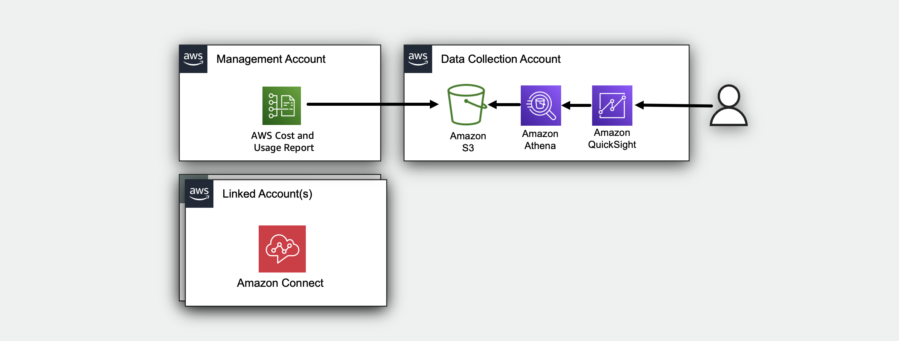
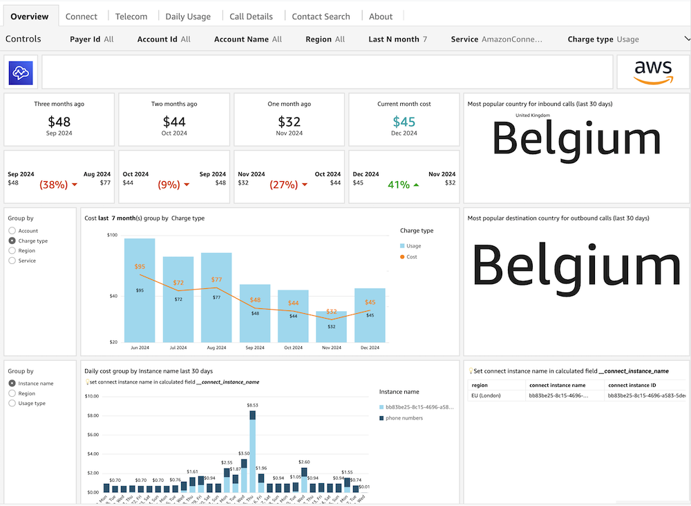
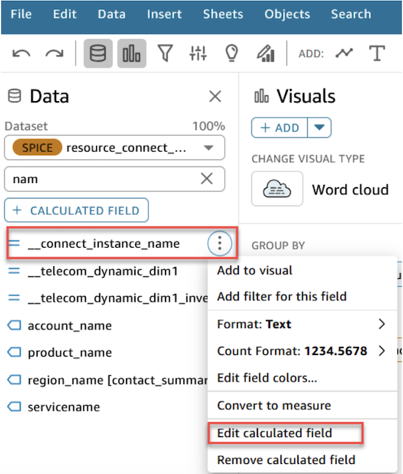
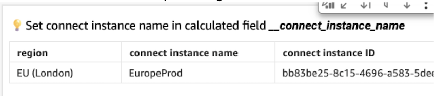

# Amazon Connect Cost Insight Dashboard

## Introduction

The Amazon Connect Cost Insight Dashboard leverages AWS Cost and Usage
Report data to provide visualizations that helps optimizing cloud
spending and enhance operational efficiency within the
[Amazon Connect contact center](https://aws.amazon.com/pm/connect "https://aws.amazon.com/pm/connect")
infrastructure.



The Amazon Connect Cost Insight Dashboard is organized into 7 intuitive
tabs:

1. **Overview** A high-level summary of Amazon Connect and Contact Center Telecom charges.
2. **Contact Center Analysis** Focus on cost and usage metrics exclusively for accounts running Amazon Connect and associated contact center services, enabling targeted monitoring of contact center operations.
3. **Connect** Detailed view of Amazon Connect Voice service usage and costs.
4. **Telecom Spend** Breakdown of contact center Telecommunications costs by number types and countries.
5. **Daily Usage** 30-day trending data for costs and usage patterns with drill downs to inbound/outbound minutes and phone numbers usage.
6. **Call Details** Key metrics about call patterns, durations, and regional distribution.
7. **Contact Search** Detailed analysis of individual contacts and their characteristics. You can focus on a particular contact and see detailed information.

Each tab progressively moves from broad insights to specific details,
helping you effectively monitor your contact center operations.

## Demo Dashboard

Get more familiar with Dashboard using the live, interactive demo
dashboard following this
[link](https://cid.workshops.aws.dev/demo?dashboard=amazon-connect-cost-insight-dashboard "https://cid.workshops.aws.dev/demo?dashboard=amazon-connect-cost-insight-dashboard")



## Prerequisites

1. Deploy one or more of the foundational dashboards: [CUDOS, Cost Intelligence, or KPI Dashboard.](cudos-cid-kpi.md "cudos-cid-kpi.md")

## Deployment

###### Example

CloudFormation

###### Note

**Prerequisite**: To install this dashboard using CloudFormation, you need to install Foundational Dashboards CFN with version v4.0.0 or above as described [here](deployment-in-global-regions.md#deployment-in-global-region-deploy-dashboard "deployment-in-global-regions.md#deployment-in-global-region-deploy-dashboard")

1. Log in to to your **Data Collection** Account.
2. Click the Launch Stack button below to open the **pre-populated stack template** in your CloudFormation.

[](https://console.aws.amazon.com/cloudformation/home#/stacks/create/review?templateURL=https://aws-managed-cost-intelligence-dashboards.s3.amazonaws.com/cfn/cid-plugin.yml&stackName=Amazon-Connect-Cost-Insight-Dashboard&param_DashboardId=amazon-connect-cost-insight-dashboard "https://console.aws.amazon.com/cloudformation/home#/stacks/create/review?templateURL=https://aws-managed-cost-intelligence-dashboards.s3.amazonaws.com/cfn/cid-plugin.yml&stackName=Amazon-Connect-Cost-Insight-Dashboard¶m_DashboardId=amazon-connect-cost-insight-dashboard") 3. You can change **Stack name** for your template if you wish. 4. Leave **Parameters** values as it is. 5. Review the configuration and click **Create stack**. 6. You will see the stack will start in **CREATE_IN_PROGRESS**. Once complete, the stack will show **CREATE_COMPLETE** 7. You can check the stack output for dashboard URLs.

###### Note

**Troubleshooting:** If you see error "No export named cid-CidExecArn found" during stack deployment, make sure you have completed prerequisite steps.

Command Line
Alternative method to install dashboards is the [cid-cmd](https://github.com/aws-solutions-library-samples/cloud-intelligence-dashboards-framework/blob/main/CID-CMD.md#command-line-tool-cid-cmd "https://github.com/aws-solutions-library-samples/cloud-intelligence-dashboards-framework/blob/main/CID-CMD.md#command-line-tool-cid-cmd") tool.

1. Log in to to your **Data Collection** Account.
2. Open up a command-line interface with permissions to run API requests in your AWS account. We recommend to use [CloudShell](https://console.aws.amazon.com/cloudshell "https://console.aws.amazon.com/cloudshell").
3. In your command-line interface run the following command to download and install the CID CLI tool:

```
pip3 install --upgrade cid-cmd
```

4. In your command-line interface run the following command to deploy the
   dashboard:

```
cid-cmd deploy --dashboard-id amazon-connect-cost-insight-dashboard
```

Please follow the instructions from the deployment wizard. More info about command line options are in the
[Readme](https://github.com/aws-solutions-library-samples/cloud-intelligence-dashboards-framework/blob/main/CID-CMD.md#command-line-tool-cid-cmd "https://github.com/aws-solutions-library-samples/cloud-intelligence-dashboards-framework/blob/main/CID-CMD.md#command-line-tool-cid-cmd")
or `cid-cmd --help`.

## Update

Please note that dashboards are not updated with update of
CloudFormation Stack. When new version of the dashboard template is
released, you can update your dashboard by running the following command
in your command-line interface:

```
cid-cmd update --dashboard-id amazon-connect-cost-insight-dashboard
```

## Dashboard Customization

1. Unleash your data creativity! Dive into custom analysis by creating your own visuals from this dashboard. Follow our quick [guide](create-analysis.md "create-analysis.md") to get started.
2. To integrate CID with AWS Organizations for enhanced cost visibility across multiple accounts and organizational units follow this [documentation](add-org-taxonomy.md "add-org-taxonomy.md")
3. To replace Amazon Connect instance IDs with more readable custom labels in your dashboard check following section [link](#replace-connect-instance-id-with-custom-names "#replace-connect-instance-id-with-custom-names")
4. To set up granular billing for a detailed view of your Amazon Connect usage follow this [documentation](../../../connect/latest/adminguide/granular-billing.md "../../../connect/latest/adminguide/granular-billing.md")

### Replacing Connect Instance IDs with Custom Names in Amazon Connect Dashboard

This process allows you to replace Amazon Connect instance IDs with more readable custom labels in your dashboard. This is a one-time setup that needs to be done after dashboard deployment.

**Steps**

1. Create an Analysis. Refer to [How do I edit or customize the dashboards](faq.md#faq-how-do-i-edit-or-customize-the-dashboards "faq.md#faq-how-do-i-edit-or-customize-the-dashboards")
2. Edit the Calculated Field: Under Data >> Dataset 'resource_connect_view' edit **\_\_connect_instance_name** field


You’ll find an example that you can uncomment to provide your instance ID and preferred label

```
ifelse (
  {#connect_instance_id}="bb83be25-8c15-4696-a583-5dejlk12","EuropeProd",
//   {#connect_instance_id}="<instance_id>","<instance_name2>",
//   {#connect_instance_id}="<instance_id>","<instance_name3>",
   contains({usage_type},'-numbers'), 'phone numbers'
   ,
   {#connect_instance_id}
    )
```

Save the calculated field and verify the changes in the Overview tab’s verification table (bottom right)



1. Publish your Analysis as Dashboard.

**Notes**

- Each instance ID mapping should follow the format: {#connect_instance_id}="instance-id","custom-name"
- Maintain the default 'phone numbers' handling and fallback options
- Multiple instances can be added by repeating the mapping line
- Remember to include the comma between each condition

## Authors

- Alex Yankovskyy, Solutions Architect
- Baraa Elkosh, Sr Technical Account Manager
- Mariia Poliakh, Technical Account Manager

## Feedback & Support

Follow [Feedback & Support](feedback-support.md "feedback-support.md") guide

Have a success story to share with the Team, suggest an improvement or report an error?

- Please email: [cloud-intelligence-dashboards-amazon-connect@amazon.com](mailto:cloud-intelligence-dashboards-amazon-connect@amazon.com "mailto:cloud-intelligence-dashboards-amazon-connect@amazon.com")

###### Note

These dashboards and their content: (a) are for informational
purposes only, (b) represent current AWS product offerings and
practices, which are subject to change without notice, and (c) does not
create any commitments or assurances from AWS and its affiliates,
suppliers or licensors. AWS content, products or services are provided
"as is" without warranties, representations, or conditions of any
kind, whether express or implied. The responsibilities and liabilities
of AWS to its customers are controlled by AWS agreements, and this
document is not part of, nor does it modify, any agreement between AWS
and its customers.
