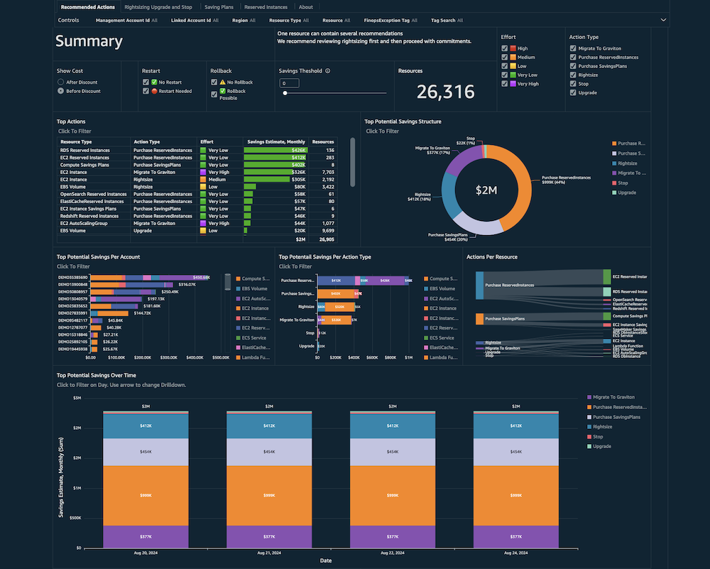
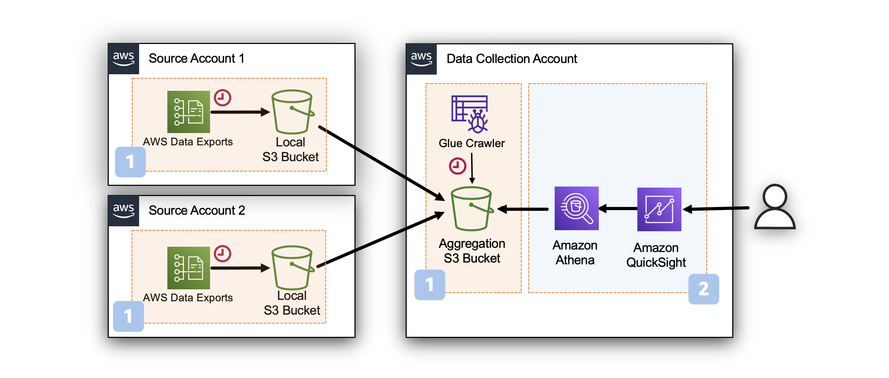

# CORA Dashboard

## Introduction

The CORA (Cost Optimization Recommended Actions) Dashboard provides
FinOps professionals, executives, and engineering leads with a
comprehensive visualization of data from the
[AWS
Cost Optimization Hub](https://aws.amazon.com/aws-cost-management/cost-optimization-hub/ "https://aws.amazon.com/aws-cost-management/cost-optimization-hub/").

AWS Cost Optimization Hub offers customers a range of
`Usage Optimization` and `Rate Optimization` aggregated from AWS
Compute Optimizer and AWS Billing Console services

Usage Optimizations include:

- Rightsizing suggestions
- Idle resource detection
- Migration and Upgrade recommendations

Rate Optimization consist of:

- Savings Plans Recommendations
- Reserved Instances recommendations

This dashboard leverages the [AWS Data Export of Cost Optimization Recommendations](data-exports.md "data-exports.md") and enables additional capabilities:

- Visualization of saving opportunities across multiple AWS Organizations (Payer Accounts) in one place.
- Tracking of savings opportunities over time including daily updates and historical view.
- Enablement of integration with customer business unit information to connect savings with workload owners (business units, teams, etc.)

Using the RLS (Row-Level Security) mechanism, this dashboard can be
shared within your organization, allowing owners to track and take
actions locally to maximize cost savings.

## Demo Dashboard

Get more familiar with Dashboard using the live, interactive demo
dashboard following this
[link](https://cid.workshops.aws.dev/demo?dashboard=cora "https://cid.workshops.aws.dev/demo?dashboard=cora")



## Prerequisites

Before installing CORA Dashboard you need to enable COH Data
Export and consolidate it from your Management (Payer) Accounts in Data
Collection Account.



1. Create COH Data Export following the steps in [Data Export](data-exports.md "data-exports.md") page and return to this page
   once completed.
2. Enable
   [AWS
   Cost Optimization Hub](https://aws.amazon.com/aws-cost-management/cost-optimization-hub/faqs/#:~:text=How%20do%20I%20enable%20Cost%20Optimization%20Hub "https://aws.amazon.com/aws-cost-management/cost-optimization-hub/faqs/#:~:text=How%20do%20I%20enable%20Cost%20Optimization%20Hub").

## Deployment

CloudFormation

###### Note

**Prerequisite**: To install this dashboard using CloudFormation, you need to install Foundational Dashboards CFN with version v4.0.0 or above as described [here](deployment-in-global-regions.md#deployment-in-global-region-deploy-dashboard "deployment-in-global-regions.md#deployment-in-global-region-deploy-dashboard")

1. Log in to to your **Data Collection** Account.
2. Click the Launch Stack button below to open the **pre-populated stack template** in your CloudFormation.

[](https://console.aws.amazon.com/cloudformation/home#/stacks/create/review?templateURL=https://aws-managed-cost-intelligence-dashboards.s3.amazonaws.com/cfn/cid-plugin.yml&stackName=CORA-Dashboard&param_DashboardId=cora&param_RequiresDataExports=yes "https://console.aws.amazon.com/cloudformation/home#/stacks/create/review?templateURL=https://aws-managed-cost-intelligence-dashboards.s3.amazonaws.com/cfn/cid-plugin.yml&stackName=CORA-Dashboard¶m_DashboardId=cora¶m_RequiresDataExports=yes")

1. You can change **Stack name** for your template if you wish.
2. Leave **Parameters** values as it is.
3. Review the configuration and click **Create stack**.
4. You will see the stack will start in **CREATE_IN_PROGRESS**. Once complete, the stack will show **CREATE_COMPLETE**
5. You can check the stack output for dashboard URLs.

###### Note

**Troubleshooting:** If you see error "No export named cid-CidExecArn found" during stack deployment, make sure you have completed prerequisite steps.

Command Line
Alternative method to install dashboards is the [cid-cmd](https://github.com/aws-solutions-library-samples/cloud-intelligence-dashboards-framework/blob/main/CID-CMD.md#command-line-tool-cid-cmd "https://github.com/aws-solutions-library-samples/cloud-intelligence-dashboards-framework/blob/main/CID-CMD.md#command-line-tool-cid-cmd") tool.

1. Log in to to your **Data Collection** Account.
2. Open up a command-line interface with permissions to run API requests in your AWS account. We recommend to use [CloudShell](https://console.aws.amazon.com/cloudshell "https://console.aws.amazon.com/cloudshell").
3. In your command-line interface run the following command to download and install the CID CLI tool:

```
pip3 install --upgrade cid-cmd
```

4. In your command-line interface run the following command to deploy the dashboard:

```
cid-cmd deploy --dashboard-id cora
```

Please follow the instructions from the deployment wizard. More info about command line options are in the
[Readme](https://github.com/aws-solutions-library-samples/cloud-intelligence-dashboards-framework/blob/main/CID-CMD.md#command-line-tool-cid-cmd "https://github.com/aws-solutions-library-samples/cloud-intelligence-dashboards-framework/blob/main/CID-CMD.md#command-line-tool-cid-cmd")
or `cid-cmd --help`.

## Update

Please note that dashboards are not updated with update of
CloudFormation Stack. When new version of the dashboard template is
released, you can update your dashboard by running the following command
in your command-line interface:

```
cid-cmd update --dashboard-id cora
```

## Usage Guide

The dashboard has several tabs and we recommend starting with the
Summary. Here you can see the biggest recommendation categories, the
potential savings they represent along with effort required for each
resource and the number of resources.

We recommend first estimate your Rightsizing, Upgrade, Migration and
Stop-Idle opportunities. Typically it takes time to implement these
recommendations especially in the scale. We recommend you proceed with
commitment (reserved instances and savings plan) for the volume that
take into account your rightsizing plan.

## Using Cost Allocation Tags

The dashboard also utilizes
[Cost
Allocation Tags](../../../awsaccountbilling/latest/aboutv2/cost-alloc-tags.md "../../../awsaccountbilling/latest/aboutv2/cost-alloc-tags.md").

- Use the `FinopsException` tag to exclude workloads from the view if they are not eligible for cost optimization recommendations.
- Configure `Name` as Cost Allocation tag to have this visibility on the dashboard by default.
- Use `TagName` to specify a tag that you are interested in for GroupBy.

## Difference with UI

The AWS Cost Optimization Hub Console UI displays opportunities in a
Donut chart with a special
[deduplication](https://aws.amazon.com/aws-cost-management/cost-optimization-hub/faqs/#:~:text=How%20does%20Cost%20Optimization%20Hub%20ensure%20savings%20from%20multiple%20recommendations%20are%20not%20double%20counted%3F "https://aws.amazon.com/aws-cost-management/cost-optimization-hub/faqs/#:~:text=How%20does%20Cost%20Optimization%20Hub%20ensure%20savings%20from%20multiple%20recommendations%20are%20not%20double%20counted%3F").
Commitment savings are shown accounting for the potential impact of
implementing rightsizing recommendations. However, the Data Export of
Cost Optimization do not have data for this level of adjustment.

The dashboard deduplicates recommendations by resource ID. Please note
that dashboard shows recommendations for Rate Optimization and Usage
Optimization deduplicated separately. But Rate Optimization are NOT
taking into account the results of Usage Optimization (Rightsizing,
Stop, Upgrade and such).

You can see discrepancies between the Donut Chart in the AWS Cost
Optimization Hub Console and the data this service exported for
analysis. The Console shows Rate Optimization savings adjusted to the
results of Usage Optimization and thus can be more realistic. Please
note that when using Dashboard you need to estimate the results of Usage
Optimization and readjust the forecast of Rate Optimization accordingly.

## Authors

- Iakov Gan, Ex-Amazonian
- Yuriy Prykhodko, Principal Technical Account Manager, AWS

## Feedback & Support

Follow [Feedback & Support](feedback-support.md "feedback-support.md") guide

###### Note

These dashboards and their content: (a) are for informational
purposes only, (b) represent current AWS product offerings and
practices, which are subject to change without notice, and (c) does not
create any commitments or assurances from AWS and its affiliates,
suppliers or licensors. AWS content, products or services are provided
"as is" without warranties, representations, or conditions of any
kind, whether express or implied. The responsibilities and liabilities
of AWS to its customers are controlled by AWS agreements, and this
document is not part of, nor does it modify, any agreement between AWS
and its customers.
