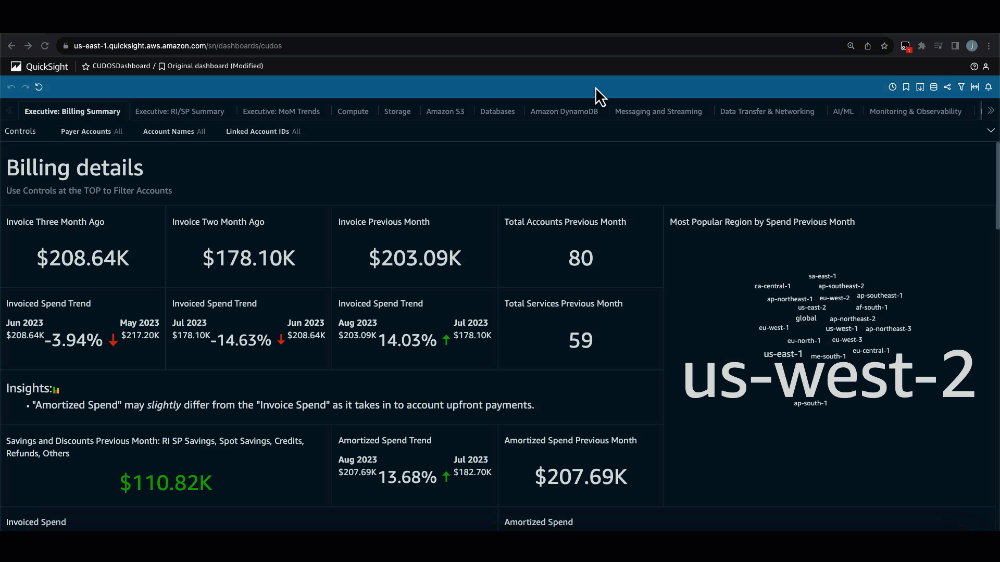
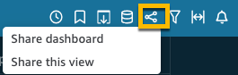
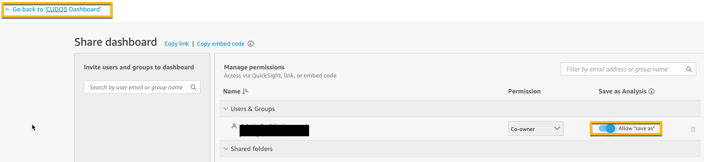
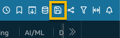
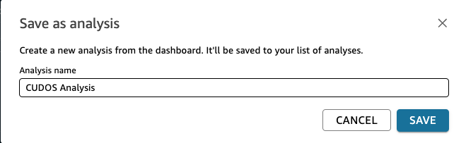
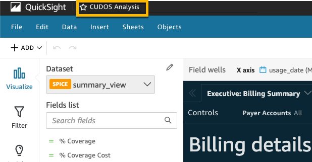

# Create Analysis (Required)

## Last Updated

November 2023

## Create an Analysis

It’s possible to change an existing dashboard and customize existing
visuals and also add your own visuals with your own business logic. The
first step in order to have an editable dashboard is to create an
Analysis from the dashboard deployed in your account. This is
effectively a branch from the main template and any dashboard you
publish from here will be separate from your templated dashboard.

1. Visit the dashboard you wish to customize in QuickSight
2. In the top right, click the **Share** icon, then choose **Share dashboard** from the dropdown

1. Toggle **Allow "save as"** for your own user account and click on **Confirm** in the "Enable save as" prompt
2. Click the **Go back** link in the top left

1. When you’re returned to the dashboard, refresh the web page by reloading the URL or pressing the browser refresh button
2. Now you will see a new **Save** icon in the upper right corner

1. Click on **Save** icon and enter a name for Analysis, for example **CUDOS Analysis** and click on **Save** button

1. Wait for a few seconds and the customizable Analysis will open in the
   same window.

Once you have a customizable QuickSight Analysis created from the above
steps, you can begin to implement the customizations outlined in this
section of the workshop. Click **Next** below to see the first module on
Adding Tags!
