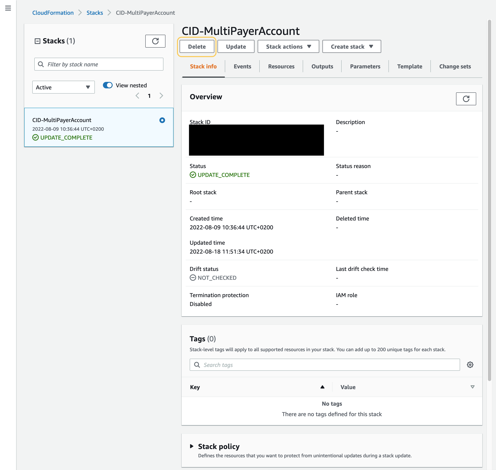

# Teardown

## Teardown of CloudFormation deployment (Automated)

###### Note

**Deleting the CloudFormation template means that CUR data will
not flow to your destination (data collection) account anymore. However,
historical data will be retained in your destination account. To delete
the CURs, go to the ${resource-prefix}-${payer-account-id}-shared S3 Bucket and
manually delete the account data. Note that if you deployed following
best practices with a separate Destination account hosting the
dashboards, you should also delete the CID-CUR-Replication Stack in your
Management/Payer/Source account.**

1. Login to the Account(s) where you deployed CloudFormation templates as
   part of this lab
2. Find your existing CID-related templates and choose Delete.



## Manual Teardown

Please follow instructions
[here](https://github.com/aws-solutions-library-samples/cloud-intelligence-dashboards-framework/blob/main/CID-CMD.md "https://github.com/aws-solutions-library-samples/cloud-intelligence-dashboards-framework/blob/main/CID-CMD.md")
to install cid-cmd tool.

You can run the **delete** command and follow instructions in an
interactive mode to delete the relevant Dashboard.

```
cid-cmd delete
```
