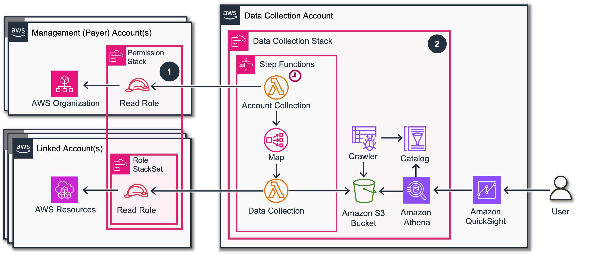
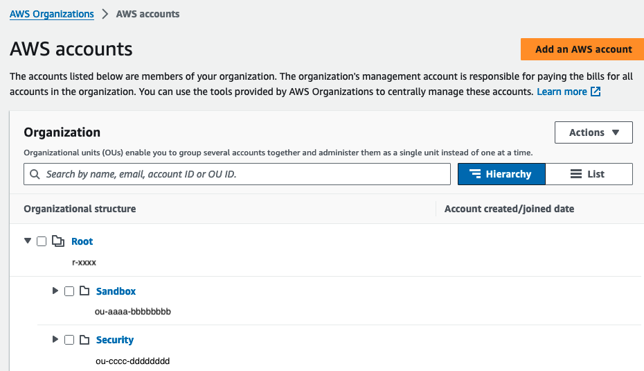
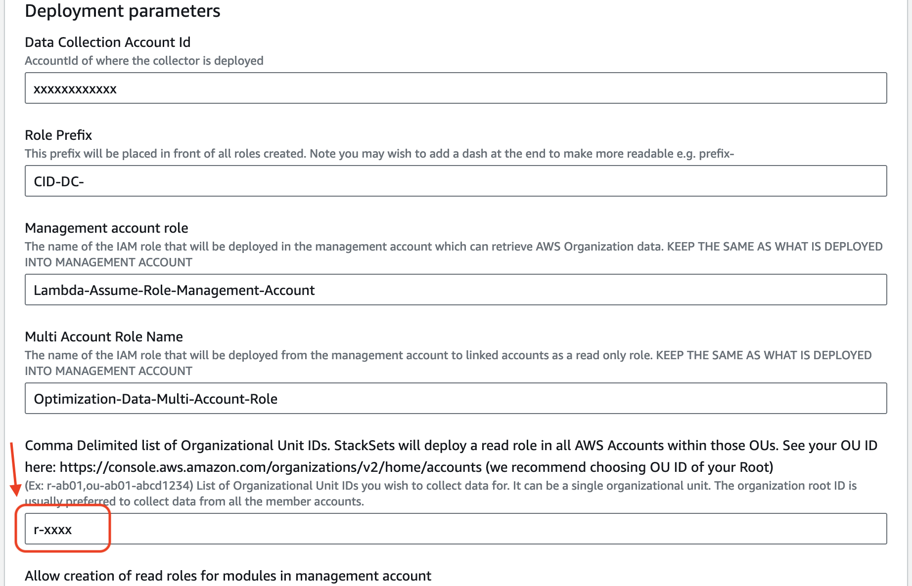
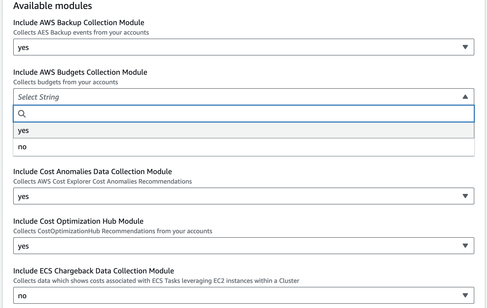
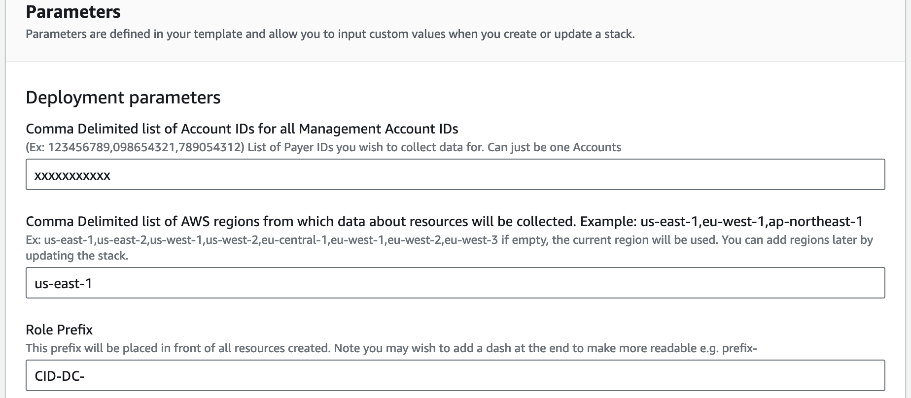

# Deployment

Deployment of the stack consists of 2 steps. First step is in Management
Account and the 2nd in Data Collection Account. If you do not have
access to Management Account please follow this [guide](data-collection-without-org.md "data-collection-without-org.md").

## Prerequisites for deployment

- Access to the **Management AWS Account** of the AWS Organization to
  deploy CloudFormation. You need permissions in the Management Account to
  create an IAM role and policy and deploy CloudFormation Stacks and
  StackSets. **Note:** If you do not have access to the Management Account,
  you can perform an [alternate deployment](data-collection-without-org.md "data-collection-without-org.md")
  of certain modules with a manually created list of Linked Accounts.
- Access to a Linked Account - referred as **Data Collection Account**
- Deployment can be only done in following **regions**: (eu-west-1,
  us-east-2, us-east-1, us-west-1, us-west-2, ap-southeast-1,
  eu-central-1, eu-west-2, eu-north-1, ap-southeast-2, ap-south-1,
  ap-northeast-3, ap-northeast-2, ap-northeast-1, ca-central-1,eu-west-3,
  sa-east-1). Please make sure you choose one of these regions to install
  the Data Collection stack.
- Lambda
  [concurrent
  executions limit](../../../lambda/latest/dg/gettingstarted-limits.md "../../../lambda/latest/dg/gettingstarted-limits.md") of at least 500 (1000 is recommended) in your Data
  Collection Account. Most accounts will have the regular default of 1000.
  But depending upon how your account was provisioned, such as through
  Control Tower, it may have a default limit of only 10, which is
  insufficient for effective operation. You can check and increase your
  limit via the
  [Service
  Quotas console](https://us-east-1.console.aws.amazon.com/servicequotas/home/services/lambda/quotas "https://us-east-1.console.aws.amazon.com/servicequotas/home/services/lambda/quotas").
- The Trusted Advisor and Support Cases Modules of Data Collection
  require a Business, Enterprise On-Ramp, or Enterprise Support plan.
  Please see more information about prerequisites of individual modules
  [on
  GitHub](https://github.com/awslabs/cid-framework/tree/main/data-collection#modules "https://github.com/awslabs/cid-framework/tree/main/data-collection#modules")

## Step 1. [In Management Accounts] Deploy the Read Permissions stack

Prerequisites: Make sure the
[trusted
access with AWS Organizations](../../../AWSCloudFormation/latest/UserGuide/stacksets-orgs-activate-trusted-access.md "../../../AWSCloudFormation/latest/UserGuide/stacksets-orgs-activate-trusted-access.md") is activated. The Management Account
stack makes use of
[stack
sets](../../../AWSCloudFormation/latest/UserGuide/what-is-cfnstacksets.md "../../../AWSCloudFormation/latest/UserGuide/what-is-cfnstacksets.md") configured to use
[service-managed
permissions](../../../AWSCloudFormation/latest/UserGuide/stacksets-concepts.md#stacksets-concepts-stackset-permission-models "../../../AWSCloudFormation/latest/UserGuide/stacksets-concepts.md#stacksets-concepts-stackset-permission-models") to deploy stack instances to linked accounts in the AWS
Organization. Typically in Organizations it is already the case. For the
new Organization you can activate it by going to
[StakSet
page of CloudFormation](https://console.aws.amazon.com/cloudformation/home?#/stacksets "https://console.aws.amazon.com/cloudformation/home?#/stacksets") if this access is not activated you will see the
banner with an action button to do so. **Note:** If you do not have access
to the Management Account, you can perform an [alternate deployment](data-collection-without-org.md "data-collection-without-org.md")
of certain modules with a manually created list of Linked Accounts.

Login to Management Account and click Launch Stack for deploying
[Permission
Stack](https://github.com/awslabs/cid-framework/tree/main/data-collection/deploy/deploy-data-read-permissions.yaml "https://github.com/awslabs/cid-framework/tree/main/data-collection/deploy/deploy-data-read-permissions.yaml"):

[](https://console.aws.amazon.com/cloudformation/home#/stacks/create/review?&templateURL=https://aws-managed-cost-intelligence-dashboards-us-east-1.s3.amazonaws.com/cfn/data-collection/deploy-data-read-permissions.yaml&stackName=CidDataCollectionReadPermissionsStack&param_DataCollectionAccountID=REPLACE%20WITH%20DATA%20COLLECTION%20ACCOUNT%20ID&param_AllowModuleReadInMgmt=yes&param_OrganizationalUnitID=REPLACE%20WITH%20ORGANIZATIONAL%20UNIT%20ID&param_IncludeBackupModule=no&param_IncludeBudgetsModule=no&param_IncludeComputeOptimizerModule=yes&param_IncludeCostAnomalyModule=yes&param_IncludeECSChargebackModule=no&param_IncludeInventoryCollectorModule=yes&param_IncludeRDSUtilizationModule=no&param_IncludeRightsizingModule=no&param_IncludeTAModule=yes&param_IncludeTransitGatewayModule=no&param_IncludeHealthEventsModule=yes&param_IncludeCostOptimizationHubModule=no&param_IncludeLicenseManagerModule=yes "https://console.aws.amazon.com/cloudformation/home#/stacks/create/review?&templateURL=https://aws-managed-cost-intelligence-dashboards-us-east-1.s3.amazonaws.com/cfn/data-collection/deploy-data-read-permissions.yaml&stackName=CidDataCollectionReadPermissionsStack¶m_DataCollectionAccountID=REPLACE%20WITH%20DATA%20COLLECTION%20ACCOUNT%20ID¶m_AllowModuleReadInMgmt=yes¶m_OrganizationalUnitID=REPLACE%20WITH%20ORGANIZATIONAL%20UNIT%20ID¶m_IncludeBackupModule=no¶m_IncludeBudgetsModule=no¶m_IncludeComputeOptimizerModule=yes¶m_IncludeCostAnomalyModule=yes¶m_IncludeECSChargebackModule=no¶m_IncludeInventoryCollectorModule=yes¶m_IncludeRDSUtilizationModule=no¶m_IncludeRightsizingModule=no¶m_IncludeTAModule=yes¶m_IncludeTransitGatewayModule=no¶m_IncludeHealthEventsModule=yes¶m_IncludeCostOptimizationHubModule=no¶m_IncludeLicenseManagerModule=yes")

1. To ensure full visibility of data across your organization accounts,
   in the parameters section, we recommend to pass the Organization Root ID
   as the organizational unit parameter (OrganizationalUnitID). You can
   check it here:
   [https://console.aws.amazon.com/organizations/v2/home/accounts](https://console.aws.amazon.com/organizations/v2/home/accounts "https://console.aws.amazon.com/organizations/v2/home/accounts")

1. Make sure to select all modules that you want to allow access to your
   organization accounts data. You can check the list of the modules
   [on
   GitHub](https://github.com/awslabs/cid-framework/tree/main/data-collection#modules "https://github.com/awslabs/cid-framework/tree/main/data-collection#modules").

1. Please make sure you specify **Data Collection Account Id** correctly.
   It is not the Management Account Id, its an ID of the dedicated Data
   Collection Account.
2. Click **Next** at the bottom of the **Specify stack details** stage, and
   then, click **Next** again at the bottom of the **Configure stack options**
   stage to move to the **Review** stage. Click **Submit** at the end of the
   **Review** stage to initiate the update. This process will take a few
   minutes until completion.

## Step 2. [In Data Collection Account] Deploy the Data Collection Stack

Login to Data Collection Account and click Launch Stack for deploying
[Data
Collection Stack](https://github.com/awslabs/cid-framework/tree/main/data-collection/deploy/deploy-data-collection.yaml "https://github.com/awslabs/cid-framework/tree/main/data-collection/deploy/deploy-data-collection.yaml").

[](https://console.aws.amazon.com/cloudformation/home#/stacks/create/review?&templateURL=https://aws-managed-cost-intelligence-dashboards-us-east-1.s3.amazonaws.com/cfn/data-collection/deploy-data-collection.yaml&stackName=CidDataCollectionStack&param_ManagementAccountID=REPLACE%20WITH%20MANAGEMENT%20ACCOUNT%20ID&param_IncludeTAModule=yes&param_IncludeRightsizingModule=no&param_IncludeCostAnomalyModule=yes&param_IncludeInventoryCollectorModule=yes&param_IncludeComputeOptimizerModule=yes&param_IncludeECSChargebackModule=no&param_IncludeRDSUtilizationModule=no&param_IncludeOrgDataModule=yes&param_IncludeBudgetsModule=yes&param_IncludeTransitGatewayModule=no&param_IncludeHealthEventsModule=yes "https://console.aws.amazon.com/cloudformation/home#/stacks/create/review?&templateURL=https://aws-managed-cost-intelligence-dashboards-us-east-1.s3.amazonaws.com/cfn/data-collection/deploy-data-collection.yaml&stackName=CidDataCollectionStack¶m_ManagementAccountID=REPLACE%20WITH%20MANAGEMENT%20ACCOUNT%20ID¶m_IncludeTAModule=yes¶m_IncludeRightsizingModule=no¶m_IncludeCostAnomalyModule=yes¶m_IncludeInventoryCollectorModule=yes¶m_IncludeComputeOptimizerModule=yes¶m_IncludeECSChargebackModule=no¶m_IncludeRDSUtilizationModule=no¶m_IncludeOrgDataModule=yes¶m_IncludeBudgetsModule=yes¶m_IncludeTransitGatewayModule=no¶m_IncludeHealthEventsModule=yes")

1. Please make sure you specify the same Prefix and Role Name parameters
   and the account Id of the Management Account (can be comma separated
   list).
2. In the same parameters section, update the regions from which data
   about resources will be collected. Specify at least the same regions
   your existing Data Collection stack uses.

1. Click **Next** at the bottom of the **Specify stack details** stage, and
   then, click **Next** again at the bottom of the **Configure stack options**
   stage to move to the **Review** stage. Click **Submit** at the end of the
   **Review** stage to initiate the update. This process will take a few
   minutes until completion.

After deployment you can [check the execution state](data-collection-utilize-data.md#data-collection-utilize-data-check-execution "data-collection-utilize-data.md#data-collection-utilize-data-check-execution") and then install [Advanced Dashboards](dashboard-advanced.md "dashboard-advanced.md") for collected data.
