# Update

## Update Process

You can check the version of your existing Data Collection in the
description of the CloudFormation stack. If it does not contain any
version reference, then it is less then v3 and you need to [update from legacy versions](#data-collection-update-from-legacy-versions "#data-collection-update-from-legacy-versions").

Please check the full
[Change
Log on GitHub](https://github.com/awslabs/cid-framework/blob/main/data-collection/CHANGELOG.md "https://github.com/awslabs/cid-framework/blob/main/data-collection/CHANGELOG.md").

### Step 1. [In Management/Payer Account] Deploy permissions stack

1. The URL to the latest Permissions Stack CloudFormation Template is https://aws-managed-cost-intelligence-dashboards-us-east-1.s3.amazonaws.com/cfn/data-collection/deploy-data-read-permissions.yaml. Copy this URL and keep it at hand, you will use it to update the current stack.
2. Login to the Management/Payer Account. Open respective CloudFormation Stack and update it by providing the URL that you copied above.

### Step 2. [In Data Collection Account] Update Data Collection stack

1. The URL to the latest Data Collection CloudFormation is https://aws-managed-cost-intelligence-dashboards-us-east-1.s3.amazonaws.com/cfn/data-collection/deploy-data-collection.yaml. Copy this URL and keep it at hand, you will use it to update the current Data Collection stack.
2. Login to the Data Collection Account. Open respective CloudFormation Stack and update it by providing the URL that you copied above.

## Update from legacy versions

The Data Collection gets updated to increase performance and add the new
data collection modules. If you already have this lab installed via Well
Architected Labs site, you have a version 1 or 2. This update procedure
will help you updated both to the latest v3. You can check the
description of Data Collection Stack. If the description of the stack
does not contain version (ex: 3.0.0).

Watch [demo of update process from legacy version to v3](https://www.youtube.com/watch?v=vpRNkwmuOEM "https://www.youtube.com/watch?v=vpRNkwmuOEM")

### Step 1. [In Management/Payer Account] Deploy permissions stack

1. Login to your Management/Payer Account and get the Organization Root ID from the
   [AWS Organizations console](https://console.aws.amazon.com/organizations/v2/home/accounts "https://console.aws.amazon.com/organizations/v2/home/accounts").


1. Install the Permission Stack in your Management/Payer Account by clicking Launch Stack below

[](https://console.aws.amazon.com/cloudformation/home#/stacks/create/review?&templateURL=https://aws-managed-cost-intelligence-dashboards-us-east-1.s3.amazonaws.com/cfn/data-collection/deploy-data-read-permissions.yaml&stackName=CidDataCollectionDataReadPermissionsStack&param_DataCollectionAccountID=REPLACE%20WITH%20DATA%20COLLECTION%20ACCOUNT%20ID&param_AllowModuleReadInMgmt=yes&param_OrganizationalUnitID=REPLACE%20WITH%20ORGANIZATIONAL%20UNIT%20ID&param_IncludeBudgetsModule=no&param_IncludeComputeOptimizerModule=no&param_IncludeCostAnomalyModule=no&param_IncludeECSChargebackModule=no&param_IncludeInventoryCollectorModule=no&param_IncludeRDSUtilizationModule=no&param_IncludeRightsizingModule=no&param_IncludeTAModule=no&param_IncludeTransitGatewayModule=no "https://console.aws.amazon.com/cloudformation/home#/stacks/create/review?&templateURL=https://aws-managed-cost-intelligence-dashboards-us-east-1.s3.amazonaws.com/cfn/data-collection/deploy-data-read-permissions.yaml&stackName=CidDataCollectionDataReadPermissionsStack¶m_DataCollectionAccountID=REPLACE%20WITH%20DATA%20COLLECTION%20ACCOUNT%20ID¶m_AllowModuleReadInMgmt=yes¶m_OrganizationalUnitID=REPLACE%20WITH%20ORGANIZATIONAL%20UNIT%20ID¶m_IncludeBudgetsModule=no¶m_IncludeComputeOptimizerModule=no¶m_IncludeCostAnomalyModule=no¶m_IncludeECSChargebackModule=no¶m_IncludeInventoryCollectorModule=no¶m_IncludeRDSUtilizationModule=no¶m_IncludeRightsizingModule=no¶m_IncludeTAModule=no¶m_IncludeTransitGatewayModule=no")

###### Note

To ensure full visibility of data across your organization accounts, in the parameters section, we recommend to pass the Organization Root ID as the organizational unit parameter (OrganizationalUnitID), to ensure the data read role stack is deployed to all accounts in your organization, allowing data collectors to access data from all your organization.


1. Make sure to select all modules that you want to allow access to your organization accounts data.


### Step 2. [Data Collection Account] Update Data Collection stack

1. The URL to the latest Data Collection CloudFormation is https://aws-managed-cost-intelligence-dashboards-us-east-1.s3.amazonaws.com/cfn/data-collection/deploy-data-collection.yaml. Copy this URL and keep it at hand, you will use it to update the current Data Collection stack.
2. Make a note of the value set on your existing Data Collection stack
   regions parameter. Previous versions of the Data Collection stack would
   have the regions in the parameter "ComputeOptimizerRegions":

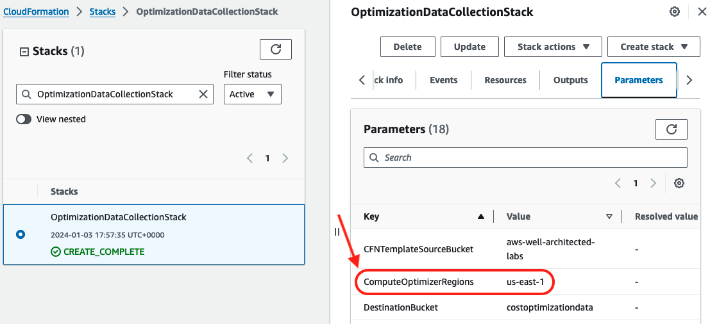

1. Find the existing data collection stack. The default name of the data
   collection stack is **OptimizationDataCollectionStack**.

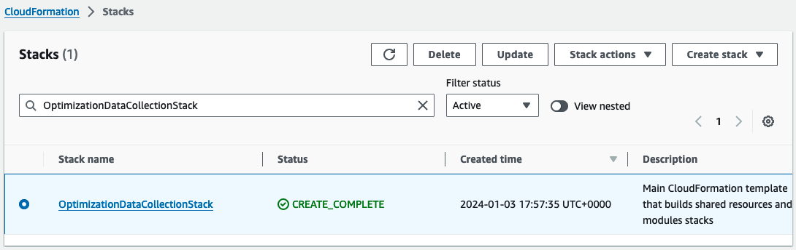

1. Start the Data Collection stack update process by clicking on the "Update" button:

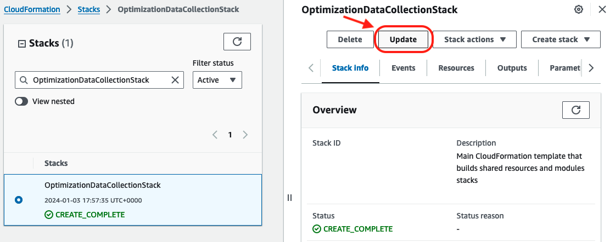

1. Choose the option to "Replace current template", using the "Amazon S3 URL" option, and paste the URL of the latest Data Collection CloudFormation template you copied before.

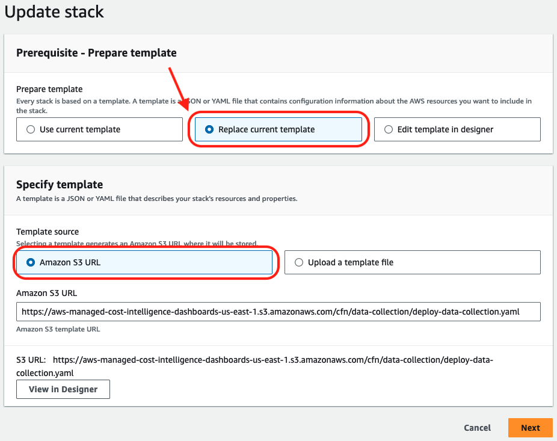

1. In the **Specify stack details** stage parameters section, you will find
   the parameter "Role Prefix" with the value "CID-DC-". We recommend
   to use this new prefix to avoid conflicts with any existing resources
   when updating to the latest version of the Data Collection stack.

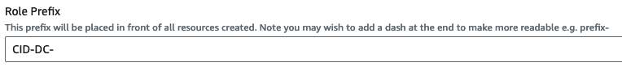

1. In the same parameters section, update the regions from which data
   about resources will be collected. Specify at least the same regions
   your existing Data Collection stack uses.


1. Click **Next** at the bottom of the **Specify stack details** stage, and
   then, click **Next** again at the bottom of the **Configure stack options**
   stage to move to the **Review** stage. Click **Submit** at the end of the
   **Review** stage to initiate the update. This process will take a few
   minutes until completion.

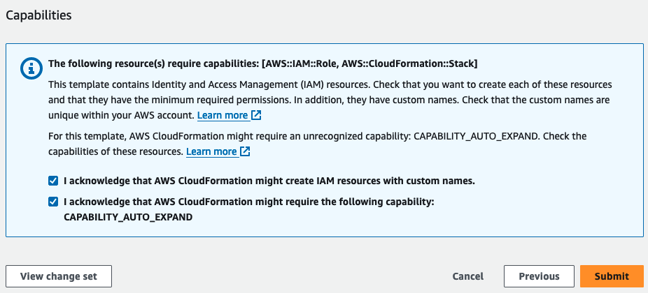
Once updated, the new version of the Data Collection stack will be visible in the stack description.

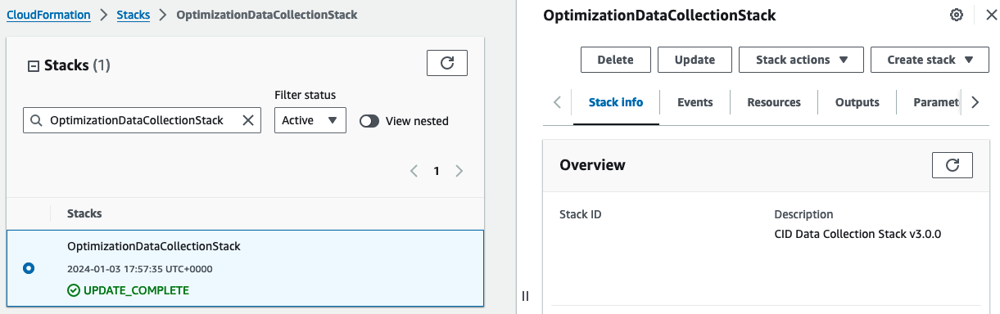

### Step 3. [In Data Collection Account] Run data migration script

The workshop was updated to work for multiple management accounts, and
also minor adjustments have been applied to align the folder structure
across the data collection modules. To migrate the historical data on
your S3 bucket you can run a migration [script](https://aws-managed-cost-intelligence-dashboards-us-east-1.s3.amazonaws.com/cfn/data-collection/source/s3_files_migration.py "https://aws-managed-cost-intelligence-dashboards-us-east-1.s3.amazonaws.com/cfn/data-collection/source/s3_files_migration.py"). The script accepts
the parameter `<your_bucket_name>` which is the bucket of data
collection stack. Default in legacy versions of this lab is
`costoptimizationdata<account_id>`.

You can run following commands from your AWS CloudShell

```
curl https://aws-managed-cost-intelligence-dashboards.s3.amazonaws.com/cfn/data-collection/source/s3_files_migration.py -o s3_files_migration.py
python3 s3_files_migration.py
```

### Step 4. [In Management/Payer Account] Clean up

**Delete read role stacks from v2 (OptimizationDataRoleStack)**

Before version 3.0, 2 stacks were deployed in the Management account: -
Read role stack for Management account specific data. - (Optional) Read
role stack for collector-specific data.

1. Find the current data read permissions stacks by navigating to the
   [CloudFormation
   console](https://us-east-1.console.aws.amazon.com/cloudformation/home "https://us-east-1.console.aws.amazon.com/cloudformation/home")

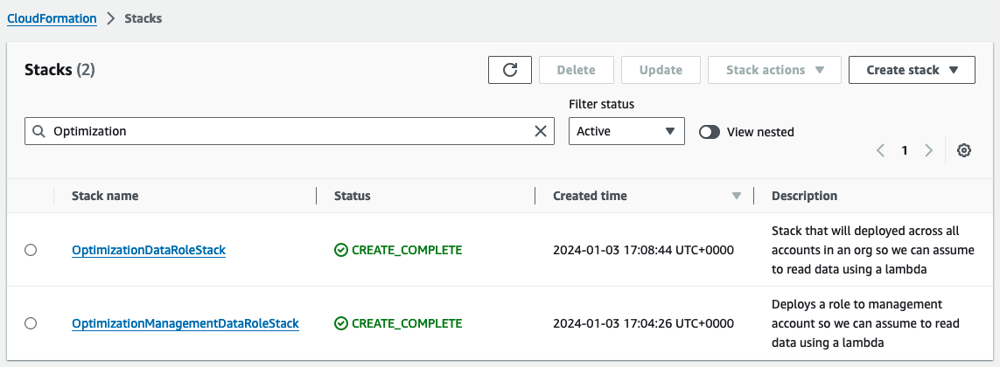

1. Delete the Management data read role stack. The default name of the
   stack is **OptimizationManagementDataRoleStack**.

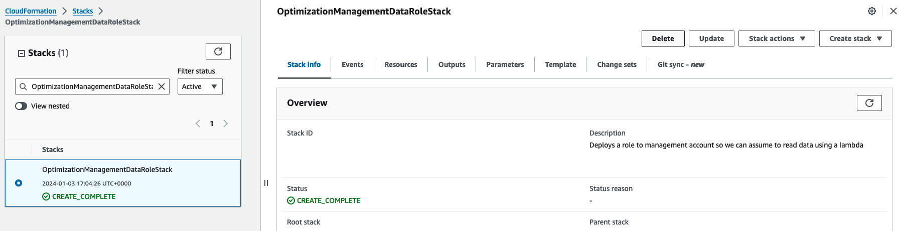

1. Confirm you want to delete the stack.

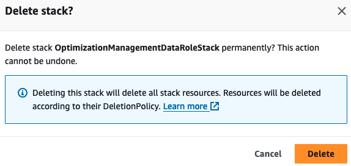

1. Delete data read role stack, if installed. The default name of the
   stack is **OptimizationDataRoleStack**.

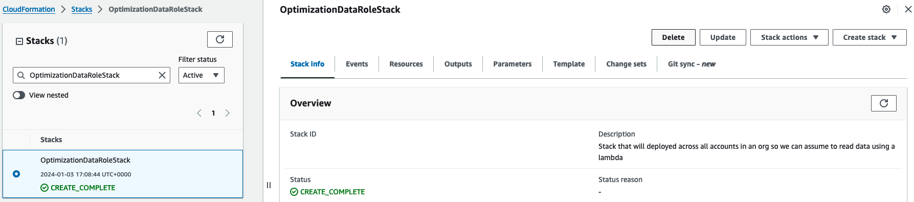

1. Confirm you want to delete the stack.

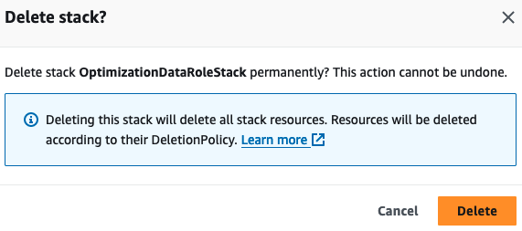

**Delete data read role StackSet from v2 (OptimizationDataRoleStack)**

Before version 3.0, data read permissions were deployed as a StackSet in
the Management account with the default name
**OptimizationDataRoleStack**.

1. Find the Organizational Unit the stackset is targeting by looking at
   the stackset details:

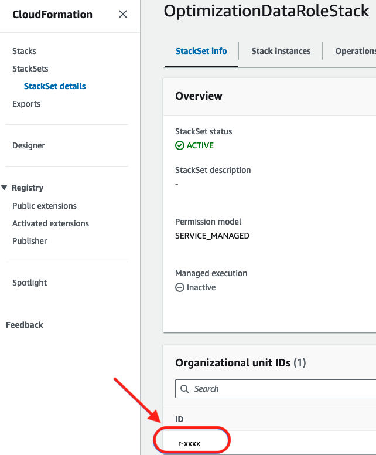

1. Find the data read role permission stackset in the CloudFormation
   StackSet console.

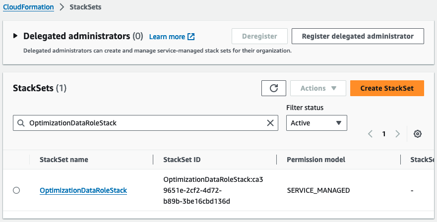

1. Delete the stacks deployed by the stackset. You can select the stackset and select the "Delete stacks from StackSet" menu option.

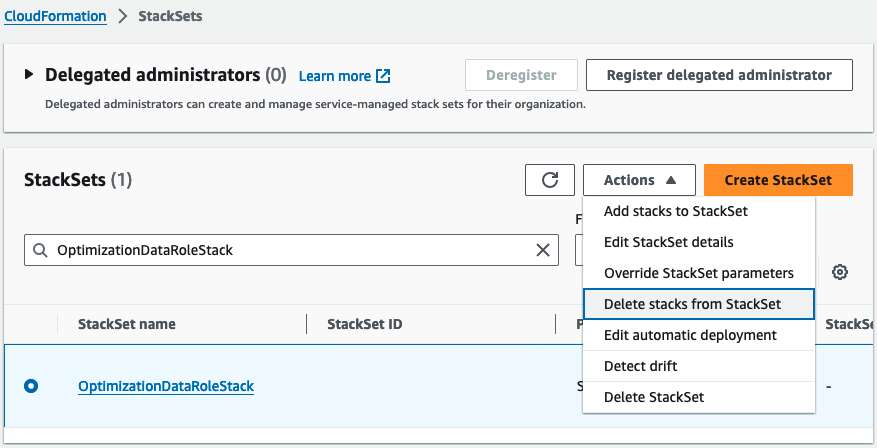

1. Enter the Organizational Unit ID you found in step #1 and select all
   the regions the stackset is targeting. Usually, the stackset will deploy
   to a single region, for example, us-east-1. Click **Next** to move to the
   **Review** stage, and then click **Submit** to start deleting the stacks
   from the stackset. **NOTE** The deletion process can take a few minutes to
   complete.

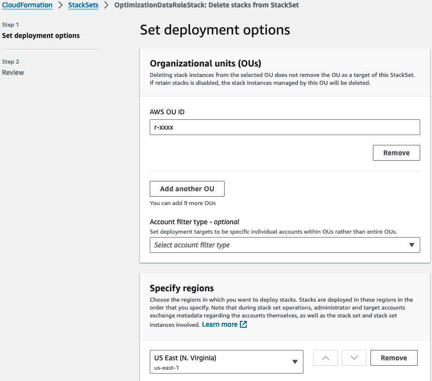

1. After the stackset’s stacks are deleted, return to the StackSets page,
   select the data read roles stackset, and use the menu option **Delete
   StackSet** to delete it.

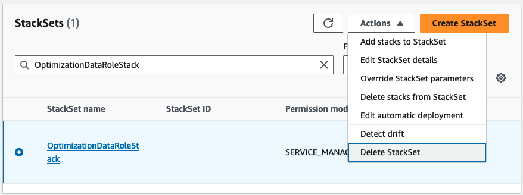

1. Confirm you want to delete the stacks in the set.

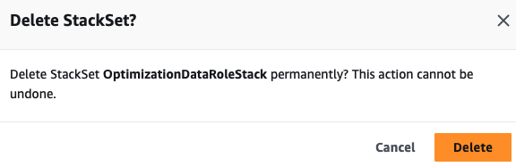

### Step 5. [In Data Collection Account] Update Dashboards

After update from previous versions you might need to update dashboards
of Advanced Group to take into account the change of s3 path:

```
cid-cmd -vvv update --force --recursive --dashboard-id compute-optimizer-dashboard
cid-cmd -vvv update --force --recursive --dashboard-id ta-organizational-view
```

Please carefully verify existence of default path on S3 when asked
(mainly S3 bucket names), and adjust accordingly.

## Post Update

After deployment you can [check the execution state](data-collection-utilize-data.md#data-collection-utilize-data-check-execution "data-collection-utilize-data.md#data-collection-utilize-data-check-execution") and refresh the data by triggering the execution of Step Functions.
