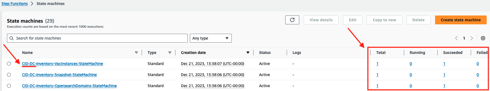
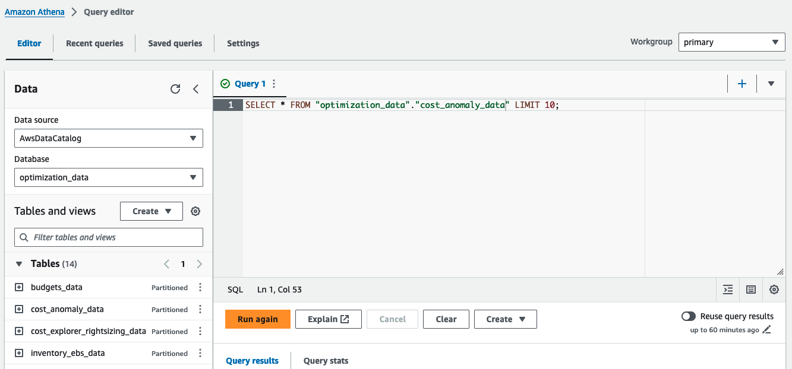
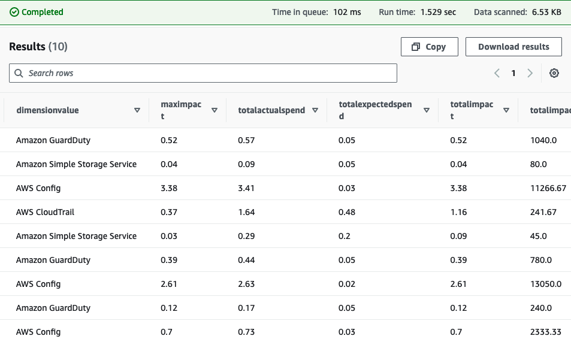
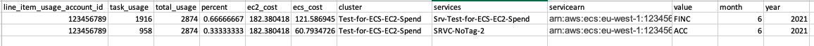

# Utilize Data

## Check execution state

Data Collection stack is using Step Functions to pull the data. You can
login to data collection account and check
[Step
functions Console](https://console.aws.amazon.com/states/home?#/statemachines "https://console.aws.amazon.com/states/home?#/statemachines"). You can select with the prefix (default=CID-DC-),
and make sure they all run successfully. You may need to scroll the
"State machines" table to the right to see "Succeed" and "Failed"
columns.

These Step Functions are scheduled to run the first time in 30 mins
after deployment and then every 14 days by default. You can trigger the
new execution or check the logs of functions if needed.


Now you can inspect tables created in the Athena database, and use a simple SELECT query to inspect the results.


For example:

```
SELECT * FROM "cost_anomaly_data" LIMIT 10;
```



## Utilizing Your Data

Now that you have pulled together optimization data there are different
ways in which you can analyze & visualize it to make infrastructure
optimization decisions.

### Visualization of Trusted Advisor data with Amazon Quick Sight

You can visualize Trusted Advisor Data with the [Trusted Advisor Organizational (TAO) Dashboard.](trusted-advisor-dashboard.md "trusted-advisor-dashboard.md") To deploy the TAO Dashboard please follow [TAO Dashboard
deployment steps](trusted-advisor-dashboard.md#trusted-advisor-dashboard-prerequisites "trusted-advisor-dashboard.md#trusted-advisor-dashboard-prerequisites") and specify the organizational data collection bucket created in this lab as a source.

### Visualization of Compute Optimizer data with Amazon Quick Sight

You can visualize Compute Optimizer Data with [Compute Optimizer Dashboard](compute-optimizer-dashboard.md "compute-optimizer-dashboard.md"). To deploy the Compute Optimizer Dashboard please follow the [Compute Optimizer deployment
steps](compute-optimizer-dashboard.md "compute-optimizer-dashboard.md") which also delivers Athena Tables and Views.

### Visualization of AWS Budgets data with Amazon Quick Sight

You can visualize AWS Budgets Data with [AWS Budgets Dashboard](budgets-dashboard.md "budgets-dashboard.md"). To deploy the AWS Budgets Dashboard please follow the [AWS Budgets Dashboard deployment steps](budgets-dashboard.md "budgets-dashboard.md") which also delivers Athena Tables and Views.

### AWS Organization Data and The Cost Intelligence Dashboard

You can integrate organizational structure with OUs and tags specified in AWS Organizations to the dashboards. Learn more how to add organizational taxonomy to Cloud Intelligence Dashboards following [Add Organizational Taxonomy](add-org-taxonomy.md "add-org-taxonomy.md") guide.

### RDS Graviton Eligibility and Savings Estimation with Amazon Quick Sight

You can get insights into Graviton migration savings opportunities with [Graviton Savings Dashboards](graviton-savings-dashboard.md "graviton-savings-dashboard.md"). To deploy the Graviton Savings Dashboards please follow the [Graviton Savings Dashboards](graviton-savings-dashboard.md "graviton-savings-dashboard.md") which also delivers Athena Tables and Views.

### Snapshots and AMIs

When a AMI gets created it takes a Snapshot of the volume. This is then
needed to be kept in the account whilst the AMI is used. Once the AMI is
released the Snapshot can no longer be used but it still incurs costs.
Using this query we can identify Snapshots that have the "AMI
Available", those where the "AMI Removed" and those that fall outside
of this scope and are "NOT AMI". Data must be collected and the
crawler finished running before this query can be run.

```
   SELECT *,
  CASE
  WHEN snap_ami_id = imageid THEN
  'AMI Avalible'
  WHEN snap_ami_id LIKE 'ami%' THEN
  'AMI Removed'
  ELSE 'Not AMI'
  END AS status
    FROM (
  (SELECT snapshotid AS snap_id,
      volumeid as volume,
      volumesize,
      starttime,
      Description AS snapdescription,
      year,
      month,
      ownerid,

      CASE
      WHEN substr(Description, 1, 22) = 'Created by CreateImage' THEN
      split_part(Description,' ', 5)
      WHEN substr(Description, 2, 11) = 'Copied snap' THEN
      split_part(Description,' ', 9)
      WHEN substr(Description, 1, 22) = 'Copied for Destination' THEN
      split_part(Description,' ', 4)
      ELSE ''
      END AS "snap_ami_id"
  FROM "optimization_data"."snapshot_data"
  ) AS snapshots
  LEFT JOIN
      (SELECT imageid,
      name,
      description,
      state,
      rootdevicetype,
      virtualizationtype
      FROM "optimization_data"."ami_data") AS ami
          ON snapshots.snap_ami_id = ami.imageid )
```

There is an option to add pricing data to this query. This assumes you have deployed the Pricing module.

**Athena**

1. Go to AWS Athena
2. Go to _Saved queries_ at the top of the screen
3. Run the _pricing_ec2_create_table_ Query to create a pricing table
4. In _Saved queries_ Run the _pricing_region_names_ Query to create a normalized region name table
5. In _Saved queries_ run _inventory_snapshot_connected_to_ami_with_pricing_ to create a view
6. Run the below to see your data

```
    SELECT * FROM "optimization_data"."snapshot_ami_quicksight_view" limit 10;
```

You must have access to your Cost and Usage data in the same account and region so you can join through Athena

**Athena**

1. Go to AWS Athena
2. Go to _Saved queries_ at the top of the screen
3. In _Saved queries_ run _inventory_snapshot_connected_to_ami_with_cur_ to create a view
4. Change the value ${table_name} to your Cost and Usage report database and name and your ${date_filter} to look at a certain month/year
5. You will see the price of all Snapshots and how much they cost based on their connection with AMIS
   Please note that if you delete the snapshot and it is part of a lineage you may only make a small saving

### EBS Volumes and Trusted Advisor Recommendations

Trusted advisor identifies idle and underutilized volumes. This query
joins together the data so you can see what portion of your volumes are
flagged. Data must be collected and the crawler finished running before
this query can be run.

This section requires you to have the **Inventory Module** and the **Trusted Advisor Module** deployed.

```
    SELECT * FROM
        "optimization_data"."ebs_data"
    LEFT JOIN
    (select "volume id","volume name", "volume type","volume size", "monthly storage cost" ,accountid, category, region, year,month
    from
    "optimization_data".ta_data ) ta
    ON "ebs_data"."volumeid" = "ta"."volume id" and "ebs_data"."year" = "ta"."year" and "ebs_data"."month" = "ta"."month"
```

There is an option to add pricing data to this query.

**Athena**

1. Go to AWS Athena and run the below
2. Go to **Saved queries** at the top of the screen
3. Run the **ec2-view** Query to create a view of ebs and ta data
4. Run the **ec2_pricing** Query to create a pricing table
5. In **Saved queries** run the **region_names** Query to create a normalized region name table
6. In **Saved queries** run **ebs-ta-query-pricing** to create a view
7. Run the below to see your data

```
    SELECT * FROM "optimization_data"."ebs_quicksight_view" limit 10;
```

The section below will bring in opportunities to move EBS volumes to gp3

1. Go to AWS Athena and run the below
2. Go to **Saved queries** at the top of the screen
3. Run the **ec2-view** Query to create a view of ebs and ta data
4. Run the **ec2_pricing** Query to create a pricing table
5. In **Saved queries** run the **region_names** Query to create a normalized region name table
6. In **Saved queries** run **gp3-opportunity** to create a view

### AWS EBS Volumes and Snapshots

If you wish to see what volumes have what snapshots attached to them
from a holistic view then this query can combine these two data sources.
This could provide information into which snapshots you could archive
using
[Elastic
Block Storage Snapshots Archive](https://aws.amazon.com/ebs/snapshots/faqs/#Snapshots_Archive "https://aws.amazon.com/ebs/snapshots/faqs/#Snapshots_Archive")

```
WITH data as (
        Select volumeid,
          snapshotid,
          ownerid "account_id",
          cast(  replace(split(split(starttime, '+') [ 1 ], '.') [ 1 ], 'T', ' ') as timestamp) as start_time,
          CAST("concat"("year", '-', "month", '-01') AS date) "data_date",
          sum(volumesize) "volume_size"
        from "optimization_data"."snapshot_data"
        group by 1,2,3,4,5
      ),
      latest AS(
        Select max(data_date) "latest_date" from data
      ),
      ratio AS(
        Select distinct volumeid, data_date, latest_date,
          count(distinct snapshotid) AS "snapshot_count_per_volume"
        from data
        LEFT JOIN latest ON latest.latest_date = data_date
          WHERE volumeid like 'vol%' and data_date = latest_date
        group by 1,2,3
      )
      select data.volumeid,
        data.snapshotid,
        account_id,
        data.data_date,
        start_time,
        volume_size,
        snapshot_count_per_volume,
          CASE WHEN data.volumeid NOT LIKE 'vol%' THEN 1 ELSE dense_rank() OVER (partition by data.volumeid ORDER by start_time) END AS "snapshot_lineage"
        from data
        Left JOIN ratio ON ratio.volumeid = data.volumeid
        ORDER by volumeid, snapshot_lineage
```

If you wish to connect to your Cost and Usage report for snapshot costs please use the below:

```
       WITH cur_mapping AS (
        SELECT DISTINCT
        split_part(line_item_resource_id,'/',2) AS "snapshot_id",
        line_item_usage_account_id AS "linked_account_id",
        CAST("concat"("year", '-', "month", '-01') AS date) "billing_period", sum(line_item_usage_amount) "snapshot_size",
        sum(line_item_unblended_cost) "snapshot_cost"
        FROM "athenacurcfn_mybillingreport"."mybillingreport"
        WHERE (CAST("concat"("year", '-', "month", '-01') AS date) = ("date_trunc"('month', current_date) - INTERVAL  '1' MONTH)) AND (line_item_resource_id <> '') AND (line_item_line_item_type LIKE '%Usage%') AND (line_item_product_code = 'AmazonEC2') AND (line_item_usage_type LIKE '%EBS:Snapshot%')
        group by 1,2,3
      ),
      snapshot_data AS (
        Select volumeid,
          snapshotid,
          ownerid "account_id",
          cast(
            replace(split(split(starttime, '+') [ 1 ], '.') [ 1 ], 'T', ' ') as timestamp
          ) as start_time,
          CAST("concat"("year", '-', "month", '-01') AS date) "data_date",
          sum(volumesize) "volume_size"
        from "optimization_data"."snapshot_data"
        group by 1,2,3,4,5
      ),
      data AS (
        SELECT DISTINCT volumeid,
          snapshotid,
          account_id,
          billing_period,
          data_date,
          start_time,
          sum(snapshot_size) AS snapshot_size,
          sum(snapshot_cost) AS snapshot_cost,
          sum(volume_size) AS "volume_size"
        FROM snapshot_data
        LEFT JOIN cur_mapping ON cur_mapping.snapshot_id = snapshotid AND cur_mapping.linked_account_id = account_id
        group by 1,2,3,4,5,6
      ),
      latest AS(
        Select max(data_date) "latest_date"
            from data
      ),
      ratio AS(
        Select distinct volumeid, data_date, latest_date,
          count(distinct snapshotid) AS "snapshot_count_per_volume",
          sum(snapshot_cost) AS "all_snapshot_cost_per_volume",
          sum(snapshot_size) AS "all_snapshot_size_per_volume"
        from data
        LEFT JOIN latest ON latest.latest_date = data_date
        WHERE volumeid like 'vol%' and data_date = latest_date
        group by 1,2,3
      )
      select data.volumeid,
        data.snapshotid,
        account_id,
        data.data_date,
        start_time,
        billing_period,
        snapshot_size,
        volume_size,
        all_snapshot_cost_per_volume
        all_snapshot_size_per_volume,
        snapshot_count_per_volume,
        CASE WHEN data.volumeid NOT LIKE 'vol%' THEN 1 ELSE dense_rank() OVER (partition by data.volumeid ORDER by start_time) END AS "snapshot_lineage"
        from data
        LEFT JOIN ratio ON ratio.volumeid = data.volumeid
```

### ECS Chargeback

Report to show costs associated with ECS Tasks leveraging EC2 instances
within a Cluster

1. Navigate to the Athena service
2. Select the "optimization data" database
3. In **Saved Queries** find **"cluster_metadata_view"** Change "BU" to the tag you wish to do chargeback for
4. Click the **Run** button
5. In **Saved Queries** find **"ec2_cluster_costs_view"** - Replace ${CUR} in the "FROM" clause with your CUR table name - For example, "curdb"."ecs_services_clusters_data"
6. Click the **Run** button
7. In **Saved Queries** find **"bu_usage_view"** - Replace ${CUR} in the "FROM" clause with your CUR table name - For example, "curdb"."ecs_services_clusters_data"
8. Click the **Run** button
   Now your views are created you can run your report

**Manually execute billing report**

- In **Saved Queries** find **"ecs_chargeback_report"** - Replace "bu_usage_view.month" value with the appropriate month desired for the report - For example, a value of "2" returns the charges for February
- Click the **Run** button

**Example Output**


Breakdown:

- task_usage: total memory resources reserved (in GBs) by all tasks over the billing period (i.e. -- monthly)
- percent: task_usage / total_usage
- ec2_cost: monthly cost for EC2 instance in $
- Services: Name of service
- servicearn: Arn of service
- Value: Value of specified tag for the ECS service (could be App, TeamID, etc?)

### AWS Transit Gateway Chargeback

AWS Transit Gateway data transfer cost billed at the central networking
account is allocated proportionally to the end usage accounts. The
proportion is calculated by connecting with AWS CloudWatch bytes in
bytes out data at each Transit Gateway attachment level. The total
central data transfer cost is calculated at the central networking
account with Cost and Usage Report. The chargeback amount is the
corresponding proportional cost of the total central amount.

1. Navigate to the Athena service and open **Saved Queries**.
2. Select your database where you have your Cost and Usage Report
3. In **Saved Queries** find **"tgw_chargeback_cur"**
4. Replace `CURDatabase` with your database name in the tgw_chargeback_cur. For example:

```
"cur"."cost_and_usage_report"
```

The Cloud Watch data collection is automated for all the regions.
However, if you are destined to only chargeback to a subset of selected
regions, you need to specify it in `"product_location LIKE '%US%'"`
line.

1. Click the **Run** button
2. In **Saved Queries** find **"tgw_chargeback_cw"**
3. Select the "optimization data" database
4. Replace `CURDatabase` with your database name in the tgw_chargeback_cw.
5. Click the **Run** button
   Now your views are created and you can run your report.
