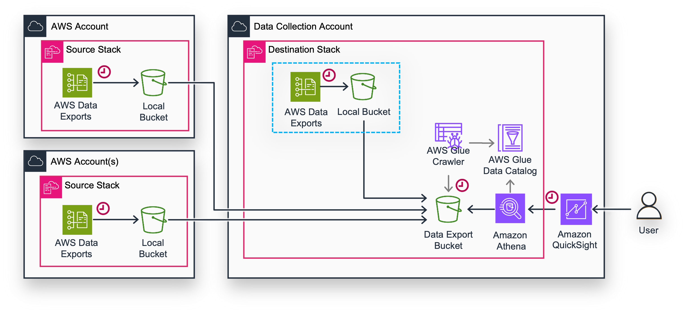
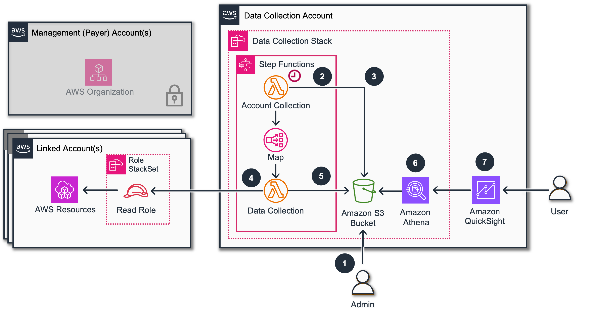

# Data Collection without AWS Organizations

When deploying AWS Cost Intelligence Dashboard (CID), customers who
don’t have direct access to AWS Organizations (because it’s managed by
partners or separate internal teams) should first consider collaborating
with the team owning AWS Management (Payer) Account to deploy CID at
scale across the organization with Row Level Security implemented,
ensuring each business unit can only view cost and operational data for
their specific AWS accounts.

However, if collaboration with the Management account team isn’t
feasible due to organizational constraints, customers can still deploy
multiple CID dashboards independently without requiring AWS
Organizations access, providing flexibility even without centralized
organizational visibility.

Following dashboards are available without access to AWS Organization:

| Dashboard                              | Requirement     | Details                          |
| -------------------------------------- | --------------- | -------------------------------- |
| CUDOS, CID, KPI                        | Data Exports    | CUR                              |
| SPG Marketplace                        | Data Exports    | CUR                              |
| Sustainability                         | Data Exports    | CUR, Carbon                      |
| CORA                                   | Data Exports    | COH                              |
| Amazon Connect Cost Insights Dashboard | Data Exports    | CUR                              |
| Trusted Advisor                        | Data Collection | Trusted Advisor Module           |
| Support Cases Radar                    | Data Collection | Support Cases Module             |
| Extended Support Cost Projection       | Data Collection | Inventory Module                 |
| Graviton Savings Dashboard             | Data Collection | Inventory and Pricing<br>Modules |
| AWS News Feeds                         | Data Collection | AWS Feeds Module                 |

Following Dashboards are not available without access to AWS
Organization:

- Health Events Dashboards, Compute Optimizer Dashboards, Anomaly Detection Dashboard, AWS Budgets Dashboard

## Data Exports without AWS Organizations

Foundational dashboards like CUDOS, CID, and KPI are only depend on AWS
Cost and Usage report in AWS Data Exports. Also CORA and FOCUS depend on
Cost Optimization Hub and Focus reports respectively.

Using CID Data Exports stack you can deploy AWS Data Exports in a set of
AWS Account, and using replication consolidate all data in one of
accounts called Data Collection Account for deploying of Dashboards.



Please follow the instructions in [Data Exports](data-exports.md "data-exports.md") and
first install the Stack with Destination parameters in the Data
Collection account. Please Note that in order to get data for the Data
Collection itself you need to put the AWS Account of Data Collection
Account in the list of SourceAccountIds as FIRST, and then you can add
all other Account Ids that will later transfer their Data Exports here.

Once done you can go ahead and install the Stack with only Source
parameters in each AWS Account of your perimeter. (you need to specify
Destination Account Id and keep Source Account Ids as empty). Do not
forget to set the exports you need on both sides.

## Data Collection without AWS Organizations

By default, the [Data Collection](data-collection.md "data-collection.md") tooling uses AWS
Organizations to obtain a list of accounts in scope for the modules that
collect information at the Linked Account level. However, in some cases,
business or governance policies may limit access to AWS Organizations.
This guide shows you how to manually define a list of specific Linked
Accounts to poll directly, rather than relying on the AWS Organizations
API.



1. An administrator user uploads a list of accounts to S3 bucket (can be easily automated).
2. A scheduled event trigger an execution of Lambda Function. By default every 14 days.
3. The Account Collection Lambda can detect an account list on s3 bucket.
4. The data collection Lambda goes to each account and assume the role to read the information
5. The Lambda Stores collected data to S3
6. Customer can query tables via Athena
7. or deploy Quick Sight Dashboards on top of these data.

To enable data collection you must first ensure that the [deploy-in-linked-account.yaml](https://aws-managed-cost-intelligence-dashboards-us-east-1.s3.amazonaws.com/cfn/data-collection/deploy-in-linked-account.yaml "https://aws-managed-cost-intelligence-dashboards-us-east-1.s3.amazonaws.com/cfn/data-collection/deploy-in-linked-account.yaml")
CloudFormation template is installed in all concerned accounts. The
standard deployment of the Data Collection permissions policy script is
launched in the Management Account and employs a StackSet to automate
the deployment of the account-level roles. But for this purpose, unless
you have access to the Management Account for deploying the StackSet,
you must instead deploy the permissions template in each Linked Account
in scope.

Note, not all Data Collection modules will work without AWS Organizations. The following modules are supported:

- Inventory
- ECS Chargeback
- RDS Usage
- Transit Gateway
- Trusted Advisor
- Support Cases

## Step by Step Guide

1. If you have not done so already,
   [deploy
   the permissions stack](cloudformation/home.md#/stacks/create/review?&templateURL=https://aws-managed-cost-intelligence-dashboards-us-east-1.s3.amazonaws.com/cfn/data-collection/deploy-in-linked-account.yaml&stackName=CidDataCollectionLinkedAccountReadPermissionsStack&param_DataCollectionAccountID=REPLACE%20WITH%20DATA%20COLLECTION%20ACCOUNT%20ID&param_IncludeBudgetsModule=no&param_IncludeECSChargebackModule=no&param_IncludeInventoryCollectorModule=no&param_IncludeRDSUtilizationModule=no&param_IncludeTAModule=yes&param_IncludeTransitGatewayModule=no "cloudformation/home.md#/stacks/create/review?&templateURL=https://aws-managed-cost-intelligence-dashboards-us-east-1.s3.amazonaws.com/cfn/data-collection/deploy-in-linked-account.yaml&stackName=CidDataCollectionLinkedAccountReadPermissionsStack¶m_DataCollectionAccountID=REPLACE%20WITH%20DATA%20COLLECTION%20ACCOUNT%20ID¶m_IncludeBudgetsModule=no¶m_IncludeECSChargebackModule=no¶m_IncludeInventoryCollectorModule=no¶m_IncludeRDSUtilizationModule=no¶m_IncludeTAModule=yes¶m_IncludeTransitGatewayModule=no") into each Linked Account in scope. You should
   adjust the template parameters to choose the modules you wish to use,
   using the list of supported modules above.
2. Follow [Step 2](data-collection-deployment.md "data-collection-deployment.md") of the standard Data Collection deployment to deploy the Data
   Collection tooling. Select the same modules that you selected with your
   permissions stack deployment.
3. Create either a JSON or CSV file with your Linked Account information.
   For either format, declare each account as on a separate line, per the
   following examples. Note there is no header row for the CSV but the
   order is the same as the JSON: `account_id, account_name, payer_id`.
   Name the file `account-list.json` or `account-list.csv` accordingly.

JSON:

```
 {"account_id": "111111111111", "account_name": "My account 1", "payer_id": "999999999999"}
 {"account id": "222222222222", "account name": "My account 2", "payer id": "999999999999"}
```

CSV:

```
 111111111111,My account 1,999999999999
 222222222222,My account 2,999999999999
```

1. Locate the main bucket created by the Data Collection stack. The default is `cid-data-[YOUR ACCOUNT NUMBER]`. Create a folder off of the root and name it `account-list`. Then deploy the file you created to that folder. The framework will detect the existence of the file when it next runs and use it instead of AWS Organizations for the affected modules. The bucket path should look like something like `cid-data-111111111111/account-list/account-list.csv`.
2. Now you can trigger StepFunctions for data collection (Search
   TrustedAdvisor, locate the StepFunction and launch execution without any
   specific parameter needed).
3. When StepFunction completed you can check the data in Athena and
   proceed to deployment of dashboards.
