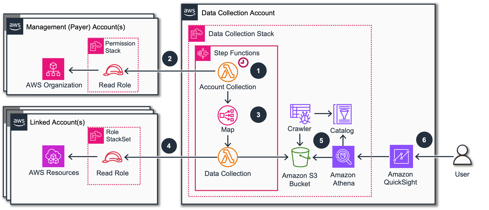

# Data Collection

## Introduction

Amazon Web Services offers a broad set of global cloud-based products
including compute, storage, databases, analytics, networking, mobile,
developer tools, management tools, security and enterprise applications.
These services help organizations move faster, lower IT costs and scale.
This workshop provides a set of modules to automate the collection of
AWS resource utilization data across multiple Management and Linked
accounts. It is designed to centralize this data and make it easy to
query and visualize **to help you identify and track optimization
opportunities**.

Modules can be installed in any combination using the provided
CloudFormation stack. They can be added or removed after initial
installation by simply updating the stack. You can learn more about each
module
[on
GitHub](https://github.com/awslabs/cid-framework/tree/main/data-collection#modules "https://github.com/awslabs/cid-framework/tree/main/data-collection#modules").

## Architecture

Resources for this workshop are deployed with AWS CloudFormation in
several accounts:

1.  **Data Collection Stack**. This stack deploys common
    and module-specific resources in the **Data Collection Account**. Each
    data collection module is optional. We recommend using a dedicated **Data
    Collection Account** rather than using the Management Account for this
    stack.
2.  **Read Permissions Stack** This stack is deployed in one or
    several Management Accounts. It deploys several entities:

        * **Management Role Stack** This stack deploys an AWS IAM Role granting read-only access
        to AWS Organizations as well as other roles that are required for the
        various modules that you elect to install.
        * **Linked Accounts StackSet** - Some information can be collected only on the level of each individual
        Linked Account, and this StackSet will deploy a Stack to each of those
        accounts with an AWS IAM Role granting the permissions required for your
        selected module.
        * **Linked Accounts Role Stack for Management Account** -
        (optional) CloudFormation StackSets only deploy resources into Linked
        Accounts and do not deploy into the Management Account. This stack is
        only needed if you deploy any modules that collect data directly from
        Linked Accounts and the Management Account also contains relevant
        resources that you want to additionally include.

1. An [Amazon EventBridge](https://aws.amazon.com/eventbridge/ "https://aws.amazon.com/eventbridge/") Rule
   invokes a Step Function of every deployed data collection module, based
   on a configurable schedule.
2. The Step Function launches a Lambda function **Account Collector** that
   assumes a Read Role in the Management Account to retrieve the list of
   Linked Accounts via the AWS Organizations API.
3. The Step Function launches another Data Collection Lambda for each
   Linked Account (or for each Management Account if the data collection is
   available on Organization level).
4. This Data Collection Lambda assumes a role in the Management Account
   or in each Linked Account (depending on the module) and retrieves
   respective data via the AWS SDK for Python. The retrieved data is then
   stored an Amazon S3 bucket.
5. Once data is stored in the S3 bucket, the Step Function triggers an
   [AWS Glue](https://aws.amazon.com/glue/ "https://aws.amazon.com/glue/") crawler which creates or updates
   the table in the Glue Data Catalog.
6. Collected data is then available to be analyzed with
   [Amazon Athena](https://aws.amazon.com/athena "https://aws.amazon.com/athena") and visualized with
   [Amazon Quick Sight](https://aws.amazon.com/quicksight/ "https://aws.amazon.com/quicksight/") using the Cloud
   Intelligence Dashboards.

## Costs

- Estimated costs should be <$5 a month for a small organization.

## Authors

- Eric Christensen, Senior Technical Account Manager, AWS
- Julio Cesar Chaves Fernandez, Technical Account Manager, AWS
- Stephanie Gooch, Senior Commercial Architect, AWS
- Iakov Gan, Senior Solution Architect, AWS
- Yuriy Prykhodko, Principal Technical Account Manager, AWS

## Contributors

- Andy Brown, OPTICS Manager Commercial Architects IBUs, AWS
- Xianshu Zeng, OPTICS Commercial Architect, AWS
- Rem Baumann, OPTICS Commercial Architect, AWS
- Yash Bindlish, Enterprise Support Manager, AWS

## Feedback & Support

Follow [Feedback & Support](feedback-support.md "feedback-support.md") guide

###### Steps
