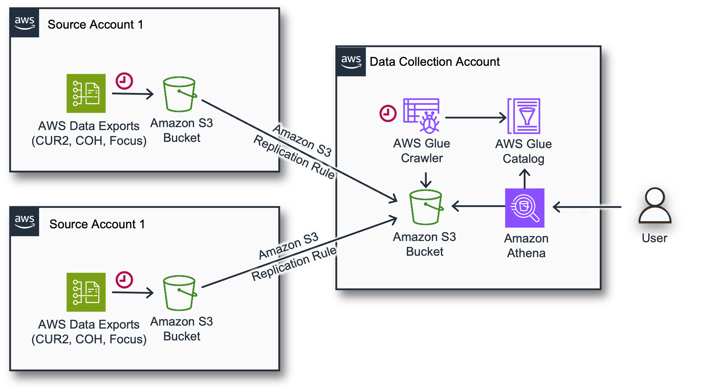
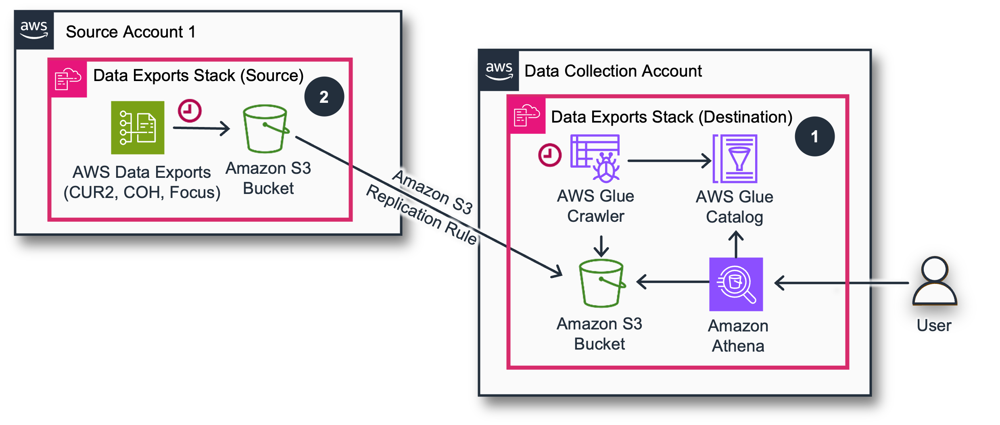

# Data Exports

## Authors

- Zach Erdman, Senior Product Manager, AWS
- Petro Kashlikov, Senior Solutions Architect, AWS
- Iakov Gan, Senior Solutions Architect, AWS
- Yuriy Prykhodko, Principal Technical Account Manager, AWS

## Introduction

The
[AWS
Data Exports](../../../cur/latest/userguide/what-is-data-exports.md "../../../cur/latest/userguide/what-is-data-exports.md") service allows you to create exports of various types of
billing and cost management data to an Amazon S3 bucket in your local
AWS account. This page introduces a simple
[Cloud
Formation Template](https://github.com/aws-solutions-library-samples/cloud-intelligence-dashboards-data-collection/blob/main/data-exports/deploy/data-exports-aggregation.yaml "https://github.com/aws-solutions-library-samples/cloud-intelligence-dashboards-data-collection/blob/main/data-exports/deploy/data-exports-aggregation.yaml") that can automate the following tasks:

- **Create AWS Data Exports**: Set up exports for billing and cost management data to be delivered to an Amazon S3 bucket in your account.
- **Cross-Account Replication**: Replicate the exported data to dedicated Data Collection AWS account for centralized analysis or auditing purposes.
- **Athena Table Creation**: Create Amazon Athena tables for querying the exported data directly, enabling data analysis and visualization.

## Common Use Cases

This solution covers the following use cases:

1. Move Data Exports data from a Management (Payer) Account to a dedicated Data Collection Account.
2. Aggregate Data Exports data across multiple AWS Organizations into a single account.
3. Aggregate Data Exports data across multiple linked accounts into a single AWS account for the cases when there is no access to Management (Payer) Account.
4. Single account deployment of Data Exports for test purposes.

## Supported AWS Data Export types

1. Cost And Usage Report (CUR) 2.0
2. FOCUS 1.0 with additional AWS specific columns (Preview)
3. Cost Optimization Recommendations from AWS Cost Optimization Hub
4. Carbon emissions

## Architecture

The same stack must be installed the Destination (Data Collection)
account and also in one or many Source account(s).

- `Destination (Data Collection) Account` is used to consolidate, analyze or/and visualize the data. Typically FinOps or CCoE team owns this account.
- `Source Account` is the account where stack will create AWS Data Exports. Typically it is one or many Management (Payer) Accounts, but can be also one or many Linked Accounts.



The CloudFormation template installed in 2 accounts does the following:

1. Creates data exports for one or more [supported export types](#supported-data-export-types "#supported-data-export-types"), and a local Amazon S3 bucket in the Source Account.
2. Sets up a replication from a local Amazon S3 Bucket in a Source Account to another Aggregation bucket in a Data Collection Account.
3. Creates AWS Glue Database, Amazon Athena Tables and AWS Glue Crawlers in the Data Collection Account.

Each individual Data Export has a prefix `<export-name>/<account-id>` so the aggregated structure has the following structure:

```
s3://<prefix>-<destination-account-id>-data-exports/
    <export-name>/<src-account1>/<prefix>-<export-name>/data/<month-partition>/*.parquet
    <export-name>/<src-account2>/<prefix>-<export-name>/data/<month-partition>/*.parquet
    <export-name>/<src-account2>/<prefix>-<export name>/data/<month-partition>/*.parquet
```

## Costs

- Estimated costs of the data storage in Amazon S3 bucket should be <$10 a month for medium size organization, depending on the volume of the data it can vary.

## Before you start

1. **Define the Region** Deployment can be only done in any region. Please
   carefully choose region as it should be the same region where you are
   planning to deploy Amazon QuickSight Dashboards to avoid cross region
   Amazon S3 costs. AWS Data Exports are available only in us-east-1, so
   when deployed in other regions, CFN creates Data Exports using Custom
   Resources.
2. **Define the Destination Account** Make sure to note your Destination
   Account Id. It should be the same account where you plan to deploy
   Amazon QuickSight dashboards.
3. **Make sure you have access**: You need access to the Source and
   Destination accounts allowing you to create AWS CloudFormation stacks
   and work with AWS Glue and Amazon Athena. When creating a _Carbon
   emissions_ export, your permissions must include the
   [IAM
   policies required for the Customer Carbon Footprint Tool](../../../awsaccountbilling/latest/aboutv2/what-is-ccft.md#ccft-gettingstarted-IAM "../../../awsaccountbilling/latest/aboutv2/what-is-ccft.md#ccft-gettingstarted-IAM").

## Prerequisites

If you plan to activate Data Export for Cost Optimization Hub you need to activate [the service](https://console.aws.amazon.com/costmanagement/home#/cost-optimization-hub "https://console.aws.amazon.com/costmanagement/home#/cost-optimization-hub") first.

## Deployment

The deployment process consists of 2 steps. The first is in
Destination/Data Collection account, and the 2nd in one or multiple
Source Accounts.



### Step 1 of 3. (In Destination/Data Collection Account) Create Destination for Data Exports aggregation

1. Login to your **Data Collection Account**. Make sure you use the target region.
2. Click the **Launch Stack button** below to open the **stack template** in your AWS CloudFormation console.

[](https://console.aws.amazon.com/cloudformation/home#/stacks/create/review?&templateURL=https://aws-managed-cost-intelligence-dashboards.s3.amazonaws.com/cfn/data-exports-aggregation.yaml&stackName=CID-DataExports-Destination&param_ManageCUR2=yes&param_ManageCOH=yes&param_ManageCarbon=yes&param_DestinationAccountId=REPLACE%20WITH%20DATA%20COLLECTION%20ACCOUNT%20ID&param_SourceAccountIds=PUT%20HERE%20PAYER%20ACCOUNT%20ID "https://console.aws.amazon.com/cloudformation/home#/stacks/create/review?&templateURL=https://aws-managed-cost-intelligence-dashboards.s3.amazonaws.com/cfn/data-exports-aggregation.yaml&stackName=CID-DataExports-Destination¶m_ManageCUR2=yes¶m_ManageCOH=yes¶m_ManageCarbon=yes¶m_DestinationAccountId=REPLACE%20WITH%20DATA%20COLLECTION%20ACCOUNT%20ID¶m_SourceAccountIds=PUT%20HERE%20PAYER%20ACCOUNT%20ID")

1. Enter a **Stack name** for your template such as **CID-DataExports-Destination**.
2. Enter your **Destination Account ID** parameter (Your Data Collection Account, where you will deploy dashboards).
3. Choose the exports to manage. For selected types in Destination account the stack will create Athena Tables and allow replication from Management Accounts.
4. Enter your **Source Account IDs** parameter as a comma separated list of all accounts that must deliver AWS Data Exports. In a rare case if you need the Data Collection account to produce AWS Data Export(for testing or mono account deploy), you need to specify this Account Id first in the list, and skip the "Step 2 of 3".
5. Review the configuration, click **I acknowledge that AWS CloudFormation might create IAM resources, and click Create stack**.
6. You will see the stack will start with **CREATE_IN_PROGRESS**. This step can take ~5 mins. Once complete, the stack will show **CREATE_COMPLETE**.

### Step 2 of 3. (In Management/Payer/Source Account) Create AWS Data Exports and Amazon S3 Replication Rules

1. Click the **Launch Stack button** below to open the **stack template** in your AWS CloudFormation console.

[](https://console.aws.amazon.com/cloudformation/home#/stacks/create/review?&templateURL=https://aws-managed-cost-intelligence-dashboards.s3.amazonaws.com/cfn/data-exports-aggregation.yaml&stackName=CID-DataExports-Source&param_ManageCUR2=yes&param_ManageCOH=yes&param_ManageCarbon=yes&param_DestinationAccountId=REPLACE%20WITH%20DATA%20COLLECTION%20ACCOUNT%20IDs&param_SourceAccountIds= "https://console.aws.amazon.com/cloudformation/home#/stacks/create/review?&templateURL=https://aws-managed-cost-intelligence-dashboards.s3.amazonaws.com/cfn/data-exports-aggregation.yaml&stackName=CID-DataExports-Source¶m_ManageCUR2=yes¶m_ManageCOH=yes¶m_ManageCarbon=yes¶m_DestinationAccountId=REPLACE%20WITH%20DATA%20COLLECTION%20ACCOUNT%20IDs¶m_SourceAccountIds=")

1. Enter a **Stack name** for your template such as **CID-DataExports-Source**.
2. Enter your **Destination Account ID** parameter (Your Data Collection Account, where you will deploy dashboards).
3. Choose the exports to manage. For selected types in Source account the stack will create exports set up replication to the Data Collection Accounts. Please keep the choice consistent with the same configuration in the Data Collection Account.
4. Review the configuration, click **I acknowledge that AWS CloudFormation might create IAM resources, and click Create stack**.
5. You will see the stack will start with **CREATE_IN_PROGRESS**. This step can take ~5 mins. Once complete, the stack will show **CREATE_COMPLETE**.
6. Repeat for other Source Accounts.
   It will typically take about 24 hours for the first delivery of AWS Data
   Exports replication to the Destination Account, but it might take up to
   72 hours (3 days). You can continue with the dashboards deployment
   however data will appear on the dashboards the next day after the first
   data delivery.

#### Backfill Data Export

You can now
[create
a Support Case](https://support.console.aws.amazon.com/support/home#/case/create "https://support.console.aws.amazon.com/support/home#/case/create"), requesting a
[backfill](../../../cur/latest/userguide/troubleshooting.md#backfill-data "../../../cur/latest/userguide/troubleshooting.md#backfill-data")
of your reports (CUR or FOCUS) with up to 36 months of historical data.
Case must be created from each of your Source Accounts (Typically
Management/Payer Accounts).

Support ticket example:

```
Service: Billing
Category: Other Billing Questions
Subject: Backfill Data

Hello Dear Billing Team,
Please can you backfill the data in DataExport named `cid-cur2` for last 12 months.
Thanks in advance,
```

You can also use following command in CloudShell to create this case via
command line:

```
aws support create-case \
    --subject "Backfill Data" \
    --service-code "billing" \
    --severity-code "normal" \
    --category-code "other-billing-questions" \
    --communication-body "
        Hello Dear Billing Team,
        Please can you backfill the data in DataExport named 'cid-cur2' for last 12 months.
        Thanks in advance"
```

Make sure you create the case from your Source Accounts (Typically
Management/Payer Accounts).

### Step 3 of 3. (In Destination/Data Collection Account) Allow QuickSight access to Database and Bucket

In order to allow Amazon QuickSight access to Bucket and Database table you need to extend the role that QuickSight uses.

#### Option A: If you use CID Foundational dashboards (CUDOS, KPI, Cost Intelligence) installed via CloudFormation or with Terraform

1. Open CloudFormation console
2. Locate CFN stack (default name = `Cloud-Intelligence-Dashboards`). Please note it is not the stack of DataExports. It is the one that is used to install Dashboards.
3. Update the stack with the latest version from this [template](https://aws-managed-cost-intelligence-dashboards.s3.amazonaws.com/cfn/cid-cfn.yml "https://aws-managed-cost-intelligence-dashboards.s3.amazonaws.com/cfn/cid-cfn.yml"). The version must be >=v3.8.
   If this does not work and you see errors in permissions you can do following:

Typically when deploying with CloudFormation the stack create a role **CidQuickSightDataSourceRole**. This role must be extended with additional permissions.

1. Open CloudShell in Data Collection Account and launch following script (can be just pasted to CloudShell):

```
export qs_role=$(aws cloudformation describe-stacks --stack-name Cloud-Intelligence-Dashboards --query "Stacks[].Parameters[?ParameterKey=='QuickSightDataSourceRoleName'].ParameterValue" --output text)
export policy_arn=$(aws cloudformation list-exports --query "Exports[?Name=='cid-DataExports-ReadAccessPolicyARN'].Value" --output text)

if [ "$qs_role" -eq "CidQuickSightDataSourceRole" ]; then

    if [ -z "${policy_arn// }" ]; then # Check if policy_arn is empty
        echo "Error: Policy ARN not found in CloudFormation exports."
    else
        aws iam attach-role-policy --role-name "$qs_role" --policy-arn "$policy_arn"
    fi
else
    echo "This script only supports modification of CID default Quicksight Role == CidQuickSightDataSourceRole but in the stack role is $qs_role. Please attach a policy $policy_arn or grant similar permissions in UI."
fi
```

#### Option B: If you installed CID without CloudFormation or Terraform but with cid-cmd command line tool

Typically when deploying with Command Line cid-cmd manage a role
**CidCmdQuickSightDataSourceRole**. This role must be extended with
additional permissions.

Option1: use command line to attach access policy to the QuickSight role

1. Open CloudShell in Data Collection Account and launch following script
   (can be just pasted to CloudShell)

```
# Check if policy_arn is empty or only whitespace
export policy_arn=$(aws cloudformation list-exports --query "Exports[?Name=='cid-DataExports-ReadAccessPolicyARN'].Value" --output text)

# Check if policy_arn is empty or only whitespace
if [ -z "${policy_arn// }" ]; then
    echo "Error: Policy ARN not found in CloudFormation exports."
else
    aws iam attach-role-policy --role-name CidCmdQuickSightDataSourceRole --policy-arn "$policy_arn"
fi
```

Option2: Attach Policy to Role manually

1. Locate the role `CidCmdQuickSightDataSourceRole` in your IAM console.
2. Locate Arn of the Managed Policy in output of CFN Stack you can check export named `cid-DataExports-ReadAccessPolicyARN`
3. Attach the managed policy to the role
   Option3:

4. Locate the role `CidCmdQuickSightDataSourceRole` in your IAM console.
5. Add a following policy allowing read a bucket and database:

```
[
	{
		"Sid": "AllowGlue",
		"Effect": "Allow",
		"Action": [
			"glue:GetPartition",
			"glue:GetPartitions",
			"glue:GetDatabase",
			"glue:GetDatabases",
			"glue:GetTable",
			"glue:GetTables"
		],
		"Resource": [
			"arn:aws:glue:${AWS::Region}:${AWS::AccountId}:table/cid_data_export/*",
			"arn:aws:glue:${AWS::Region}:${AWS::AccountId}:database/cid_data_export"
		]
	},
	{
		"Sid": "AllowListBucket",
		"Effect": "Allow",
		"Action": "s3:ListBucket",
		"Resource": [
			"arn:aws:s3:::cid-${AWS::AccountId}-data-exports"
		]
	},
	{
		"Sid": "AllowListBucket",
		"Effect": "Allow",
		"Action": "s3:GetObject",
		"Resource": [
			"arn:aws:s3:::cid-${AWS::AccountId}-data-exports/*"
		]
	}
]
```

#### Option C: If you use a default QuickSight role.

Follow [this guide](../../../quicksight/latest/user/troubleshoot-connect-S3.md "../../../quicksight/latest/user/troubleshoot-connect-S3.md") to add a bucket `arn:aws:s3:::cid-${AWS::AccountId}-data-exports` to grant access for QuickSight to Data Exports.

## Updating Stack

### Adding Exports

Update Stack in Data Collection Account as well as in all Source Account
with [the latest version](https://aws-managed-cost-intelligence-dashboards.s3.amazonaws.com/cfn/data-exports-aggregation.yaml "https://aws-managed-cost-intelligence-dashboards.s3.amazonaws.com/cfn/data-exports-aggregation.yaml"). Set parameter that corresponds to the needed Data
Collection to 'yes'.

### Adding Source Accounts

If you need to add Source Account, you need first to login to your Data
Collection account and update Source Account Ids list. Then you can
create a stack in the new Source Account as per deployment guide.

## Usage

1. You can query tables in `cid_data_exports` database in Amazon Athena.
2. Now you can proceed with installation of [Dashboard](dashboards.md "dashboards.md") of your choice. Please note that only FOCUS dashboard supported for now.

## Teardown

If you need to delete the stack you can do that by deleting all stacks in all Source accounts and Destination one. Before deleting stacks you might need to empty Amazon S3 buckets.

## Feedback & Support

Follow [Feedback & Support](feedback-support.md "feedback-support.md") guide
