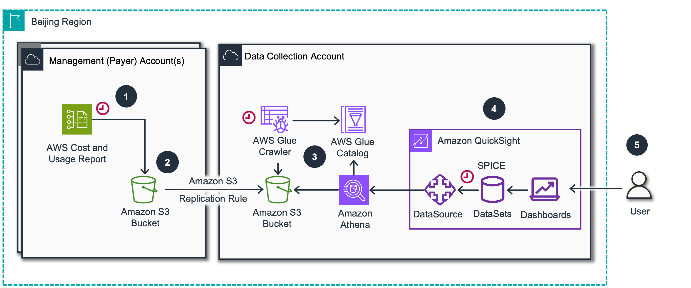
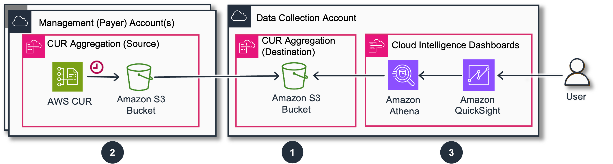
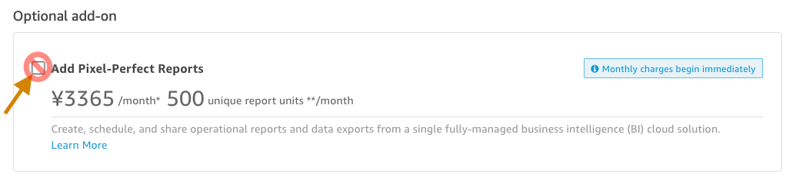
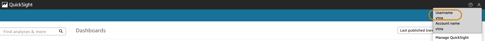
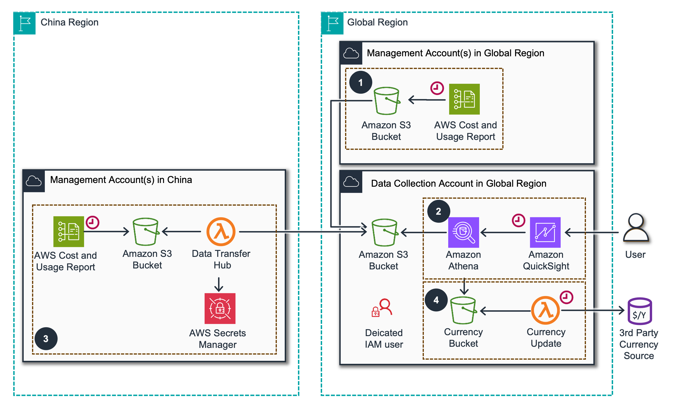

# Deployment In China

###### Note

For deployments in AWS China Regions, please note there are
specific regional considerations and limitations. For all other AWS
Regions, please follow the [standard deployment guide](deployment-in-global-regions.md "deployment-in-global-regions.md")

## Architecture

There are 2 options how you can analyze your Cost and Usage. You can
consolidate all your Cost and Usage data to Global Regions (for example
using [Data Transfer
Hub](https://github.com/aws-solutions/data-transfer-hub "https://github.com/aws-solutions/data-transfer-hub")) or you can deploy Cloud Intelligence Dashboards in China Regions.
Here we will provide a specific guidance for deployment in China
Regions.

We recommend deployment of the Dashboards in a dedicated Data Collection
Account, other than your Management (Payer) Account. This guidance
provides a CloudFormation template to copy Cost and Usage Report(CUR)
data from your Management Account to the dedicated one. You can use it
to aggregate data from multiple Management Accounts or multiple Linked
Accounts.

If you do not have access to the Management/Payer Account, you can still
collect the data across multiple Linked accounts using the same
approach.

1. [AWS Cost
   and Usage Report](https://aws.amazon.com/aws-cost-management/aws-data-exports/ "https://aws.amazon.com/aws-cost-management/aws-data-exports/") delivers daily the Cost & Usage data to an
   [Amazon S3 Bucket](https://aws.amazon.com/s3/ "https://aws.amazon.com/s3/") in the Management Account.
2. [Amazon S3](https://aws.amazon.com/s3/ "https://aws.amazon.com/s3/") replication rule copies CUR data
   to a dedicated Data Collection Account S3 bucket automatically.
3. [Amazon Athena](https://aws.amazon.com/athena/ "https://aws.amazon.com/athena/") allows querying data
   directly from the S3 bucket using an [AWS
   Glue](https://aws.amazon.com/glue/ "https://aws.amazon.com/glue/") table schema definition.
4. [Amazon Quick Sight](https://aws.amazon.com/quicksight/ "https://aws.amazon.com/quicksight/") creates datasets
   from [Amazon Athena](https://aws.amazon.com/athena/ "https://aws.amazon.com/athena/"), refreshes daily and
   caches in
   [SPICE](../../../quicksight/latest/user/spice.md "../../../quicksight/latest/user/spice.md")(Super-fast,
   Parallel, In-memory Calculation Engine) for
   [Amazon Quick Sight](https://aws.amazon.com/quicksight/ "https://aws.amazon.com/quicksight/")
5. User Teams (Executives, FinOps, Engineers) can access Cloud
   Intelligence Dashboards in [Amazon
   Quick Sight](https://aws.amazon.com/quicksight/ "https://aws.amazon.com/quicksight/"). Access is secured through [AWS
   IAM](https://aws.amazon.com/iam/ "https://aws.amazon.com/iam/"), IIC ([AWS IAM Identity
   Center](https://aws.amazon.com/iam/identity-center/ "https://aws.amazon.com/iam/identity-center/"), formerly SSO), and optional
   [Row
   Level Security](https://catalog.workshops.aws/awscid/en-US/customizations/row-level-security "https://catalog.workshops.aws/awscid/en-US/customizations/row-level-security").

## Deployment

Deployment process consists of 3 main steps:

1. Deploy Amazon S3 Bucket and Athena Tables in the **Data Collection Account**
2. Amazon S3 Bucket and a replication policy in **Source** Accounts (one or many)
3. Deploy Cloud Intelligence Dashboards (CID) Stack in the **Data Collection Account**

## Deployment

### Before you start

1. Choose **Beijing Region (cn-north-1)** for your deployment as Quick Sight
   is only available in this region for AWS China.
2. Define your Data Collection Account. Create or reuse an existing
   shared account. We do not recommend using the Management(Payer) Account
   for data collection.
3. Make sure you have permissions for deploying CloudFormation Stacks.

- In the Management/Payer Account you will need permission to access AWS
  CloudFormation, AWS Cost & Usage Reports, AWS IAM, AWS Lambda and Amazon
  S3.
- In the Data Collection Account you will need permission to access
  Amazon Athena, AWS CloudFormation, AWS Directory Service, Amazon
  EventBridge, AWS Glue, AWS IAM, AWS Lambda, Amazon Quick Sight, and
  Amazon S3 via both the console and the Command Line Tool.
- For a CLI deployment, you will not require CloudFormation permissions.
- You can use this CloudFormation template to provision an IAM role with
  minimal permissions required for dashboard deployment. It takes an IAM
  role name as a parameter and adds the required policies to the role.

### Step 1. [Data Collection Account] Create Destination For CUR Aggregation

1. Sign in to your Data Collection Account.
2. Click the Launch Stack button below to open the **pre-populated stack
   template** in your CloudFormation console. This Stack will create bucket
   open for replication and Athena Tables.

[](https://console.amazonaws.cn/cloudformation/home?region=cn-north-1#/stacks/quickcreate?&templateURL=https://aws-managed-cost-intelligence-dashboards.s3.amazonaws.com/cfn/cur-aggregation.yaml&stackName=CID-CUR-Destination&param_CreateCUR=False&param_DestinationAccountId=REPLACE%20WITH%20THE%20CURRENT%20ACCOUNT%20ID&param_SourceAccountIds=PUT%20HERE%20PAYER%20ACCOUNT%20ID "https://console.amazonaws.cn/cloudformation/home?region=cn-north-1#/stacks/quickcreate?&templateURL=https://aws-managed-cost-intelligence-dashboards.s3.amazonaws.com/cfn/cur-aggregation.yaml&stackName=CID-CUR-Destination¶m_CreateCUR=False¶m_DestinationAccountId=REPLACE%20WITH%20THE%20CURRENT%20ACCOUNT%20ID¶m_SourceAccountIds=PUT%20HERE%20PAYER%20ACCOUNT%20ID")

### Step 2. [Source/Management Account] Create CUR and Configure Replication

1. Sign in to your Source Account (Management/Payer Account).
2. Click the Launch Stack button below to open the **pre-populated stack
   template** in your CloudFormation console.

[](https://console.amazonaws.cn/cloudformation/home?region=cn-north-1#/stacks/quickcreate?&templateURL=https://aws-managed-cost-intelligence-dashboards.s3.amazonaws.com/cfn/cur-aggregation.yaml&stackName=CID-CUR-Replication&param_CreateCUR=True&param_DestinationAccountId=REPLACE%20WITH%20DATA%20COLLECTION%20ACCOUNT%20ID&param_SourceAccountIds= "https://console.amazonaws.cn/cloudformation/home?region=cn-north-1#/stacks/quickcreate?&templateURL=https://aws-managed-cost-intelligence-dashboards.s3.amazonaws.com/cfn/cur-aggregation.yaml&stackName=CID-CUR-Replication¶m_CreateCUR=True¶m_DestinationAccountId=REPLACE%20WITH%20DATA%20COLLECTION%20ACCOUNT%20ID¶m_SourceAccountIds=")

### Step 3. [Data Collection Account] Deploy Dashboards

#### 3.1 - Prepare Amazon Quick Sight (Quick Suite)

###### Note

Quick Suite is only available in cn-north-1 Beijing region for AWS China

1.  Sign in to your Data Collection Account and navigate to the AWS
    Management Console and search for **Quick Suite** in the services menu.
2.  Select **Sign up for Quick Suite** if this is your first time accessing
    the service.
3.  On the Quick Suite setup page, you’ll need to choose an authentication
    method:

        * **IAM Identity Center** - Recommended for simplified user management and
        SSO capabilities
        * **Active Directory** - Suitable for enterprises with existing AD
        infrastructure

        You cannot change authentication method after the initial setup. You
        will need to re-create the Amazon Quick Suite account.

4.  If selecting IAM Identity Center:

        * Configure user groups for Quick Suite access levels (Admin/Reader)
        * Follow the
        [IAM
        Identity Center user management guide](../../../singlesignon/latest/userguide/addusers.md "../../../singlesignon/latest/userguide/addusers.md") to set up groups and permissions

    Note: Choose your authentication method based on your organization’s requirements and existing identity management infrastructure.

5.  At the bottom of the sign up page, there is an optional add-on for Pixel-Perfect Reports:

###### Note

Make sure to uncheck Pixel-Perfect Reports option unless specifically needed, as it incurs additional charges. This feature can be enabled later if needed.

1. Complete the account creation:
   - Select the appropriate Authentication method
   - Enter a unique name for your Quick Suite account
   - Enter an email address for notifications
   - (Optional) Click Select S3 buckets and choose all cid buckets (cid-\*)
   - Click Finish and wait for the congratulations screen

#### 3.2 - Deploy Foundational Dashboards

###### Note

To avoid cross-region data transfer costs, use the Beijing
Region (cn-north-1) - the only region where Quick Suite is available in
China.

1. Sign in to your Data Collection Account.
2. Click the Launch Stack button below to open the **pre-populated stack
   template** in your CloudFormation console.

[](https://console.amazonaws.cn/cloudformation/home?region=cn-north-1#/stacks/quickcreate?&templateURL=https://aws-managed-cost-intelligence-dashboards.s3.amazonaws.com/cfn/cid-cfn.yml&stackName=Cloud-Intelligence-Dashboards&param_DeployCUDOSv5=yes&param_DeployKPIDashboard=yes&param_DeployCostIntelligenceDashboard=yes&param_CreateLocalAssetsBucket=yes&param_CURVersion=1.0&param_KeepLegacyCURTable=yes&param_CurrencySymbol=JPY "https://console.amazonaws.cn/cloudformation/home?region=cn-north-1#/stacks/quickcreate?&templateURL=https://aws-managed-cost-intelligence-dashboards.s3.amazonaws.com/cfn/cid-cfn.yml&stackName=Cloud-Intelligence-Dashboards¶m_DeployCUDOSv5=yes¶m_DeployKPIDashboard=yes¶m_DeployCostIntelligenceDashboard=yes¶m_CreateLocalAssetsBucket=yes¶m_CURVersion=1.0¶m_KeepLegacyCURTable=yes¶m_CurrencySymbol=JPY") 3. Configure stack parameters:

- Enter a Stack name for your template such as
  Cloud-Intelligence-Dashboards
- Review Common Parameters and confirm prerequisites before specifying
  the other parameters. You must answer "yes" to both prerequisites
  questions.
- Copy and paste your **Quick SightUserName** into the parameter text box.
  To find your Quick Sight username:

      + Open a new tab or window and navigate to the **Quick Sight** console
      + Find your username from the person icon in the top right corner

      

- Select the Dashboards you want to install. We recommend deploying all
  three: Cost Intelligence Dashboard, CUDOS, and the KPI Dashboard.
- Make sure Parameters **CreateLocalAssetsBucket** set to **yes** and
  **CURVersion** set to **1.0**
- The **CurrencySymbol** parameter is defaulted to JPY (Japanese Yen - ¥).
  Please select the appropriate symbol from the dropdown option to match
  your CUR settings.
- Review the configuration, select the checkbox **I acknowledge that
  Amazon CloudFormation might create IAM resources with custom names**, and
  click **Create stack**.
- You will see the stack will start in **CREATE_IN_PROGRESS**. This step
  can take ~20 minutes. Once complete, the stack will show
  **CREATE_COMPLETE**

###### Note

Dashboards will be empty initially. We recommend initiating a
backfill via Support Cases

### Step 4 (optional). Request Data Backfill

You can create a Support Case requesting a back-fill of your Cost And
Usage Report with up to 36 months of historical data. Case must be
created from each of your Source Accounts (typically Management/Payer
Accounts).

## Post-Deployment Steps

After successful deployment:

1. Check stack outputs for dashboard URLs
2. Verify Quick Sight access
3. Wait for data to populate (typically 24-48 hours for first data delivery)
4. Consider requesting a backfill through AWS Support if you need historical data

## FAQ

### How can I see AWS Usage in China and other Partitions?

- You can consolidate Cost and Usage report from China and Global
  regions in one account (can be in any partition of your choice). We
  recommend using [Data
  Transfer Hub](https://github.com/aws-solutions/data-transfer-hub "https://github.com/aws-solutions/data-transfer-hub"). Please consult with your legal team before moving data
  across AWS Partitions. If you aggregate data in different currencies you
  might need additionally a
  [currency conversion](spend-in-local-currency.md "spend-in-local-currency.md").

1. Amazon S3 replicates AWS CUR data from a Management account in Global
   region to a Data Collection Account.
2. Cloud Intelligence Dashboards leverage Amazon Athena and Amazon
   Quick Sight for viualization.
3. [Data Transfer Hub](https://github.com/aws-solutions/data-transfer-hub "https://github.com/aws-solutions/data-transfer-hub")
   moves data from China region to the Data collection account in Global
   Region.
4. Additional solution can be used for pulling up to date exchange rate
   information from a 3rd party source.

### What dashboards are available in China?

- At the moment only Foundational Dashboards (CUDOS, CID, KPI) are
  available. We are working on other dashboard as well.

Other questions? Visit our [FAQs](faq.md "faq.md").
