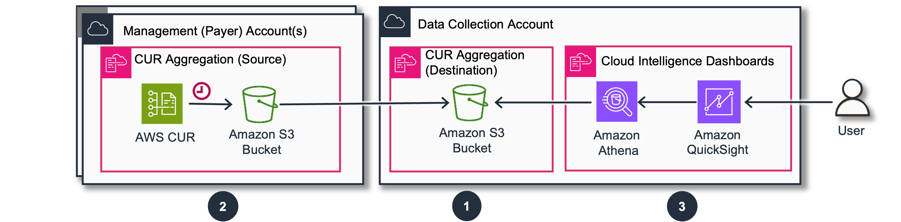
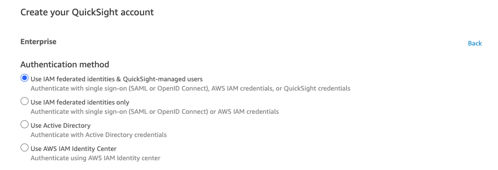
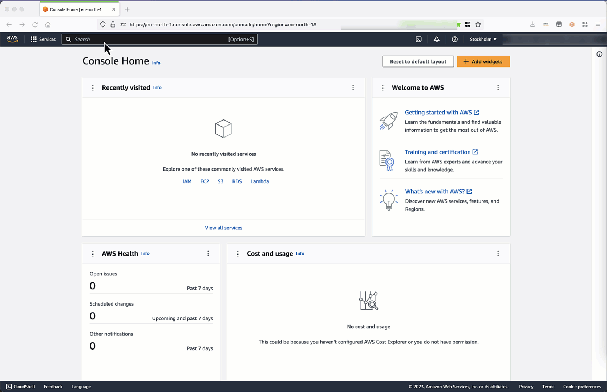
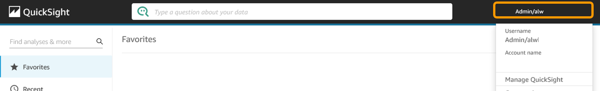

# Deployment in Global Regions

###### Note

Since November 2024, Cloud Intelligence Dashboards use
[AWS
Cost And Usage Report 2.0](../../../cur/latest/userguide/table-dictionary-cur2.md "../../../cur/latest/userguide/table-dictionary-cur2.md") (CUR 2.0) as the main source for Foundational
Dashboards. If you are deploying in China Regions, please follow the
[China deployment instructions](deployment-in-china.md "deployment-in-china.md"). If you have Legacy CUR setup, you can check
[migration process](migration-to-cur.md "migration-to-cur.md").

## Architecture

We recommend the deployment of the Dashboards in a dedicated Data
Collection Account, other than your Management (Payer) Account in order
to respect AWS Best Practices
[[1](../../../organizations/latest/userguide/orgs_best-practices_mgmt-acct.md#bp_mgmt-acct_avoid-deploying "../../../organizations/latest/userguide/orgs_best-practices_mgmt-acct.md#bp_mgmt-acct_avoid-deploying"),
[2](../../../whitepapers/latest/organizing-your-aws-environment/design-principles-for-your-multi-account-strategy.md#avoid-deploying-workloads-to-the-organizations-management-account "../../../whitepapers/latest/organizing-your-aws-environment/design-principles-for-your-multi-account-strategy.md#avoid-deploying-workloads-to-the-organizations-management-account")].
This Guide provides a CloudFormation template to copy CUR 2.0 data from
your Management Account to a dedicated one. You can use it to aggregate
data from multiple Management (Payer) Accounts or multiple Linked
Accounts.

If you do not have access to the Management/Payer Account, you can still
collect the data across multiple Linked accounts using the
[same approach](data-collection-without-org.md "data-collection-without-org.md").



Deployment process consists of 3 main steps:

1. Step 1: Deploy Amazon S3 Bucket and Athena Tables in the **Data Collection Account**.
2. Step 2: Deploy AWS Data Exports, Amazon S3 Bucket and a replication policy in **Source** Accounts (one or many).
3. Step 3: Deploy Cloud Intelligence Dashboards (CID) Stack in the **Data Collection Account**.

## Deployment

## Before you start

1. Choose the **region** for your deployment. Make sure to install all stacks in the same region to avoid cross region data transfer charges.
2. Define your Data Collection Account. Create or reuse an existing shared account. We do not recommend using the Management(Payer) Account for data collection.
3. Make sure you have the permissions for deploying CloudFormation Stacks.

- In the Management/Payer Account you will need permission to access AWS CloudFormation, AWS Cost & Usage Reports, AWS IAM, AWS Lambda and Amazon S3.
- In the Data Collection Account you will need permission to access Amazon Athena, AWS CloudFormation, AWS Directory Service, Amazon EventBridge, AWS Glue, AWS IAM, AWS Lambda, Amazon QuickSight, and Amazon S3 via both the console and the Command Line Tool.
- For a CLI deployment,you will not require CloudFormation permissions.
- You can use this [CloudFormation template](https://github.com/aws-solutions-library-samples/cloud-intelligence-dashboards-framework/blob/main/cfn-templates/cid-admin-policies.yaml "https://github.com/aws-solutions-library-samples/cloud-intelligence-dashboards-framework/blob/main/cfn-templates/cid-admin-policies.yaml") to provision an IAM role with minimal permissions required for dashboard deployment. It takes an IAM role name as a parameter and adds the required policies to the role.

1. If you use AWS Lake Formation in your Data Collection Account:

Currently only foundational dashboards, CORA, Sustainability and FOCUS Dashboards support Lake Formation.

- You will need to install an additional stack before [cid-lakeformation-prerequisite.yaml](https://github.com/aws-solutions-library-samples/cloud-intelligence-dashboards-framework/blob/main/cfn-templates/cid-lakeformation-prerequisite.yaml "https://github.com/aws-solutions-library-samples/cloud-intelligence-dashboards-framework/blob/main/cfn-templates/cid-lakeformation-prerequisite.yaml").
- Also you will need to set `LakeFormationEnabled` parameter to `yes` in the Steps 1 and 3.

## Step 1. [Data Collection Account] Create Destination For CUR Aggregation

1. Sign in to your Data Collection Account.
2. Click the Launch Stack button below to open the **pre-populated stack template** in your CloudFormation console. This stack will create bucket open for replication and Athena Tables.

[](https://console.aws.amazon.com/cloudformation/home#/stacks/create/review?&templateURL=https://aws-managed-cost-intelligence-dashboards.s3.amazonaws.com/cfn/data-exports-aggregation.yaml&stackName=CID-DataExports-Destination&param_ManageCUR2=yes&param_ManageCOH=no&param_DestinationAccountId=REPLACE%20WITH%20DATA%20COLLECTION%20ACCOUNT%20ID&param_SourceAccountIds=PUT%20HERE%20PAYER%20ACCOUNT%20IDS "https://console.aws.amazon.com/cloudformation/home#/stacks/create/review?&templateURL=https://aws-managed-cost-intelligence-dashboards.s3.amazonaws.com/cfn/data-exports-aggregation.yaml&stackName=CID-DataExports-Destination¶m_ManageCUR2=yes¶m_ManageCOH=no¶m_DestinationAccountId=REPLACE%20WITH%20DATA%20COLLECTION%20ACCOUNT%20ID¶m_SourceAccountIds=PUT%20HERE%20PAYER%20ACCOUNT%20IDS")

    * Update `DestinationAccountId` parameter as your **Data Collection**
    Account ID (Current Account ID).
    * Make sure `Manage CUR 2.0` is set `yes`. You can optionally select
    Cost Optimization Hub (if you have this service activated) and FOCUS
    exports. This will allow you to use
    [CORA](cora-dashboard.md "cora-dashboard.md") and
    [FOCUS](focus-dashboard.md "focus-dashboard.md") dashboards.
    * Enter your Source Account(s) IDs, using commas to separate multiple
    Account IDs. These are accounts that will send their Data Exports to the
    bucket in the current Account. If you decided to deploy dashboards in
    Management/Payer Account (not recommended), make sure that
    SourceAccountId contains the current Account Id as the first element and
    skip Step 2.
    * Review the configuration, click **I acknowledge that AWS CloudFormation
    might create IAM resources** and click **Create stack**.
    * You will see the stack will start with **CREATE\_IN\_PROGRESS**. This step
    can take 5 - 15 mins. Once complete, the stack will show
    **CREATE\_COMPLETE**.

You can only have one instance of this Stack in
your Account. If you see errors indicating that one of exports exists
already, update the existing stack setting `ManageCUR2` to `yes`.

You can add or delete Source Accounts later by updating this stack and
adding or deleting Account IDs in a comma separated list of Source
Account parameter.

## Step 2. [In Management/Payer/Source Account] Create CUR 2.0 and Replication

1. Click the **Launch Stack button** below to open the **stack template** in
   your AWS CloudFormation console.

[](https://console.aws.amazon.com/cloudformation/home#/stacks/create/review?&templateURL=https://aws-managed-cost-intelligence-dashboards.s3.amazonaws.com/cfn/data-exports-aggregation.yaml&stackName=CID-DataExports-Source&param_ManageCUR2=yes&param_ManageCOH=no&param_DestinationAccountId=REPLACE%20WITH%20DATA%20COLLECTION%20ACCOUNT%20IDs&param_SourceAccountIds= "https://console.aws.amazon.com/cloudformation/home#/stacks/create/review?&templateURL=https://aws-managed-cost-intelligence-dashboards.s3.amazonaws.com/cfn/data-exports-aggregation.yaml&stackName=CID-DataExports-Source¶m_ManageCUR2=yes¶m_ManageCOH=no¶m_DestinationAccountId=REPLACE%20WITH%20DATA%20COLLECTION%20ACCOUNT%20IDs¶m_SourceAccountIds=")

    1. Enter a **Stack name** for your template such as
    **CID-DataExports-Source**.
    2. Enter your **Destination Account ID** parameter (Your Data Collection
    Account, where you will deploy dashboards).
    3. Choose the exports to manage. The choice must be consistent with the
    configuration in the Data Collection Account (as in Step 1).
    4. Review the configuration, click **I acknowledge that AWS
    CloudFormation might create IAM resources**, and click **Create stack**.
    5. You will see the stack will start with **CREATE\_IN\_PROGRESS**. This
    step can take ~5 mins. Once completed, the stack will show
    **CREATE\_COMPLETE**.
    6. Repeat for other Source Accounts.It will typically take about 24 hours for the first delivery of AWS Data

Exports replication to the Destination Account, but it might take up to
72 hours (3 days). You can continue with the dashboards deployment
however data will appear on the dashboards the next day after the first
data delivery.

## Backfill Data Export

You can now
[create
a Support Case](https://support.console.aws.amazon.com/support/home#/case/create "https://support.console.aws.amazon.com/support/home#/case/create"), requesting a
[backfill](../../../cur/latest/userguide/troubleshooting.md#backfill-data "../../../cur/latest/userguide/troubleshooting.md#backfill-data")
of your reports (CUR or FOCUS) with up to 36 months of historical data.
Case must be created from your Source Account (typically
Management/Payer Account). If you are using multiple Management/Payer
Accounts, the support ticket must be created in each.

Support ticket example:

```
Service: Billing
Category: Other Billing Questions
Subject: Backfill Data

Hello Dear Billing Team,
Please can you backfill the data in DataExport named `cid-cur2` for last 12 months.
Thanks in advance,
```

You can also use following command in AWS CloudShell to create this case
via command line (requires AWS Enterprise or OnRamp Support):

```
aws support create-case \
    --subject "Backfill Data" \
    --service-code "billing" \
    --severity-code "normal" \
    --category-code "other-billing-questions" \
    --communication-body "
        Hello Dear Billing Team,
        Please can you backfill the data in DataExport named 'cid-cur2' for last 12 months.
        Thanks in advance"
```

Make sure you create the case from your Source Accounts (Typically
Management/Payer Accounts).

## Step 3. [Data Collection Account] Deploy Dashboards

### 3.1 - Prepare Amazon QuickSight

Amazon QuickSight is the AWS Business Intelligence tool. You can install
Dashboards into your Amazon QuickSight account and customize them to
your needs. If you are already a regular Amazon QuickSight user you can
skip these steps and move on to the next step. If not, complete the
steps below.

1. Log into your Destination Linked Account and search for **QuickSight**
   in the list of Services
2. You will be asked to **Sign up** before you will be able to use it
3. After pressing the **Sign up** button you will be presented with 2
   options, please ensure you select the **Enterprise Edition** during this
   step

###### Note

`Amazon QuickSight Q` feature has additional monthly cost and not needed for CID

1. Select **Continue** and you will be presented with an option to add
   Pixel-Perfect Reports. This is not required in order to deploy these
   dashboards, so you can safely choose **No, Maybe Later**.

###### Note

`Amazon QuickSight Pixel-Perfect Reports` feature has additional monthly cost and not needed for CID

1. You will then need to fill in a series of options in order to finish creating your account:
   - Please select the appropriate **Authentication** method

   ###### Note

   Select `Use AWS IAM Identity Center` if you want to use and share the CID dashboards in Production with your wider Organization using your existing Identity Provider such as Azure AD, Okta, or others. Follow the steps [here](publishing-as-sso-application.md "publishing-as-sso-application.md"). You may select `Use IAM federated identities & QuickSight-managed users` to get started quickly, however, **NOTE:** You will **NOT** be able to change the QuickSight Authentication method later

   
   - Ensure you select the **Region** that is most appropriate based on where you plan to deploy the dashboards.
   - Enter a **name** for your QuickSight account. This must be unique across all QuickSight accounts.
   - Enter an **email address** for notifications to be sent to. This email will be linked to your QuickSight user account so it can be your email.
   - (Optional) Click **Select S3 buckets** and choose all cid buckets
     (`cid-*`). By default CID installed with Cloud Formation will not use
     these permissions but you might need that for other custom analysis that
     you create for CUR analysis outside of CID framework. Also you might
     need these permissions if you are planning to use CLI for dashboard
     installation.

1. Click **Finish** and wait for the congratulations screen to display



1. Click on the persona icon on the top right and select Manage
   QuickSight.
2. Click on the SPICE Capacity option. Purchase enough SPICE capacity so
   that the total is roughly 40GB. If you get SPICE capacity errors later,
   you can come back here to purchase more. If you’ve purchased too much
   you can also release it after you’ve deployed the dashboards. You can
   also use auto purchase feature.

### 3.2 Deploy Dashboards

Make sure you use the same Region as in Step 1 to avoid cross region
Data Transfer costs. Also your AWS Account must have a
`quicksight:DescribeTemplate` permission for reading from us-east-1
region.

In this step we will use CloudFormation stack to create Athena
Workgroup, S3 bucket, Glue Table, Glue Crawler, QuickSight datasets, and
finally the Dashboards. The template uses a custom resource (a Lambda
with
[this
CLI tool](https://github.com/aws-solutions-library-samples/cloud-intelligence-dashboards-framework/blob/main/CID-CMD.md "https://github.com/aws-solutions-library-samples/cloud-intelligence-dashboards-framework/blob/main/CID-CMD.md")) to create, delete, or update assets.

CloudFormation

1. Log in to to your **Data Collection** Account.
2. Click the Launch Stack button below to open the **pre-populated stack template** in your CloudFormation.

[](https://console.aws.amazon.com/cloudformation/home#/stacks/create/review?templateURL=https://aws-managed-cost-intelligence-dashboards.s3.amazonaws.com/cfn/cid-cfn.yml&stackName=Cloud-Intelligence-Dashboards&param_DeployCUDOSv5=yes&param_DeployKPIDashboard=yes&param_DeployCostIntelligenceDashboard=yes "https://console.aws.amazon.com/cloudformation/home#/stacks/create/review?templateURL=https://aws-managed-cost-intelligence-dashboards.s3.amazonaws.com/cfn/cid-cfn.yml&stackName=Cloud-Intelligence-Dashboards¶m_DeployCUDOSv5=yes¶m_DeployKPIDashboard=yes¶m_DeployCostIntelligenceDashboard=yes") 3. Enter a **Stack name** for your template such as **Cloud-Intelligence-Dashboards** 4. Review **Common Parameters** and confirm prerequisites before specifying the other parameters. You must answer `yes` to both prerequisites questions. 5. Copy and paste your **QuicksightUserName** into the parameter text box. To find your QuickSight username:

    * Open a new tab or window and navigate to the **QuickSight** console
    * Find your username from the person icon in the top right corner


    

6. Select the Dashboards you want to install. We recommend deploying all three: Cost Intelligence Dashboard, CUDOS, and the KPI Dashboard.
7. Review the configuration, click **I acknowledge that AWS CloudFormation might create IAM resources, and click Create stack**.
8. You will see the stack will start in **CREATE_IN_PROGRESS**. This step can take ~15 minutes. Once complete, the stack will show **CREATE_COMPLETE**
9. You can check the stack output for dashboard URLs. Please note that dashboards will be empty by this point. We recommend initiate a backfill via a Support Cases (see [Backfill](#deployment-global-backfill-data-export "#deployment-global-backfill-data-export") section).

**Troubleshooting:**

**No export named cid-DataExports-ReadAccessPolicyARN found.**

If you see `No export named cid-DataExports-ReadAccessPolicyARN found.` then you probably did not installed CUR2 with Cloud formation stack as per Step

1. Alternatively you can also use Legacy CUR but in this case you need explicitly specify the parameter `CurVersion=1.0`.

Command Line
Alternative method to install dashboards is the
[cid-cmd](https://github.com/aws-solutions-library-samples/cloud-intelligence-dashboards-framework/blob/main/CID-CMD.md#command-line-tool-cid-cmd "https://github.com/aws-solutions-library-samples/cloud-intelligence-dashboards-framework/blob/main/CID-CMD.md#command-line-tool-cid-cmd") tool.

1. Log in to to your **Data Collection** Account.
2. Open [AWS CloudShell](https://console.aws.amazon.com/cloudshell/home "https://console.aws.amazon.com/cloudshell/home")
3. Install cid-cmd tool. Run the following command and make sure you hit enter :

```
 pip3 install --upgrade cid-cmd
```

4. Deploy CUDOS Dashboard:

```
 cid-cmd deploy --dashboard-id cudos-v5
```

Please follow the instructions from the deployment wizard.
More info about command line options are in the
[Readme](https://github.com/aws-solutions-library-samples/cloud-intelligence-dashboards-framework/blob/main/CID-CMD.md#command-line-tool-cid-cmd "https://github.com/aws-solutions-library-samples/cloud-intelligence-dashboards-framework/blob/main/CID-CMD.md#command-line-tool-cid-cmd")
or `cid-cmd --help`. 5. Repeat deployment command for Cost Intelligence Dashboard and KPI:

```
 cid-cmd deploy
```

Please note that Advanced Dashboard will require Advanced [Data Collection](data-collection.md "data-collection.md")

Terraform
WIP

###### Note

After update QuickSight datasets will be refreshed
automatically. During the refresh process you may see "Dataset changed
too much" error which should disappear once datasets are fully
refreshed

## Update of the stack

###### Note

We recommend customers updating both cid-cmd tool and CloudFormation stack to a version 4.2.3 or more recent.

Please note that dashboards are not updated with update of
CloudFormation Stack. You need to use [command line for updates](update-dashboards.md "update-dashboards.md") as it preserves potential customization.

You can check the latest Cloud Formation Stack [Here](https://aws-managed-cost-intelligence-dashboards.s3.amazonaws.com/cfn/cid-cfn.yml "https://aws-managed-cost-intelligence-dashboards.s3.amazonaws.com/cfn/cid-cfn.yml") and the source code on
[GitHub](https://github.com/aws-solutions-library-samples/cloud-intelligence-dashboards-framework/blob/main/cfn-templates/cid-cfn.yml "https://github.com/aws-solutions-library-samples/cloud-intelligence-dashboards-framework/blob/main/cfn-templates/cid-cfn.yml"). Please note the version in Description.

1. Open CloudFormation console and identify the stack (default name is
   `Cloud-Intelligence-Dashboards`).
2. Open the Stack and press Update button.
3. Choose to update the template and insert this link: [https://aws-managed-cost-intelligence-dashboards.s3.amazonaws.com/cfn/cid-cfn.yml](https://aws-managed-cost-intelligence-dashboards.s3.amazonaws.com/cfn/cid-cfn.yml "https://aws-managed-cost-intelligence-dashboards.s3.amazonaws.com/cfn/cid-cfn.yml")
4. Review the parameters. Please make sure to choose the right version of
   CUR in CurVersion parameter. Choose 1.0 to stay on CUR1. Choose 2.0 to
   switch all new dashboards to CUR 2. To preform a full migration please
   reference [CUR2 migration guide](migration-to-cur.md "migration-to-cur.md").

## Troubleshooting

### No data in Dashboards after 24-48 hours

Please check the following:

1. In QuickSight, go to Datasets and click on Summary View. Check for errors (if you see a status `Failed`, you can click it to see more info).
2. Check if CUR 2.0 data has arrived to the S3 bucket. If you just created CUR you will need to wait 24-48 hours before the first data arrives.
3. The QuickSight datasets refresh once per day, if your first CUR was delivered after your latest refresh, you may need to click manual refresh on each dataset to see data in the dashboard.

**Any issues? Visit our [FAQs](faq.md "faq.md").**

## Next steps

- Deploy [CORA](cora-dashboard.md "cora-dashboard.md")
- Deploy [Compute Optimizer Dashboard](compute-optimizer-dashboard.md "compute-optimizer-dashboard.md") and [Trusted Advisor Organizational (TAO) Dashboard](trusted-advisor-dashboard.md "trusted-advisor-dashboard.md")
