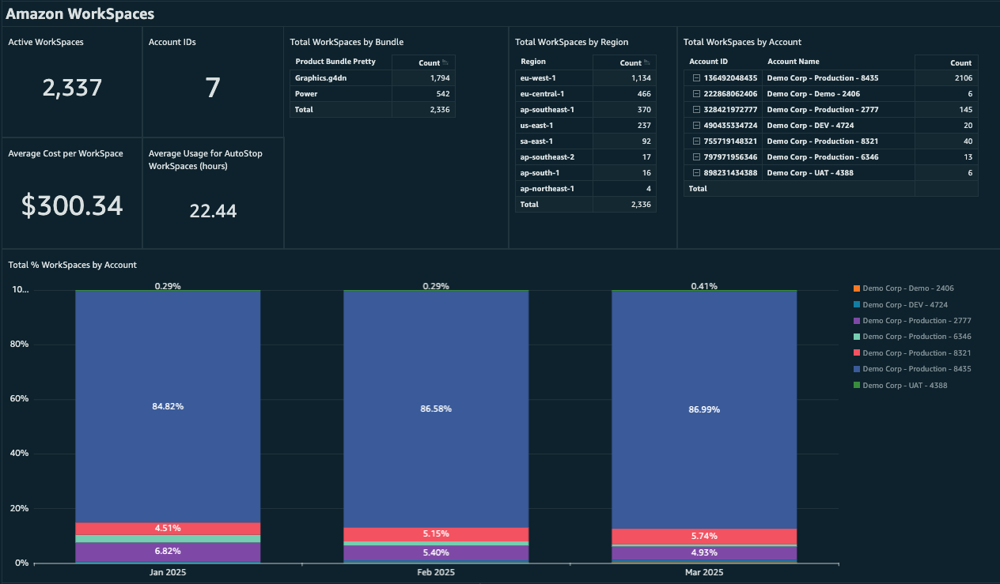
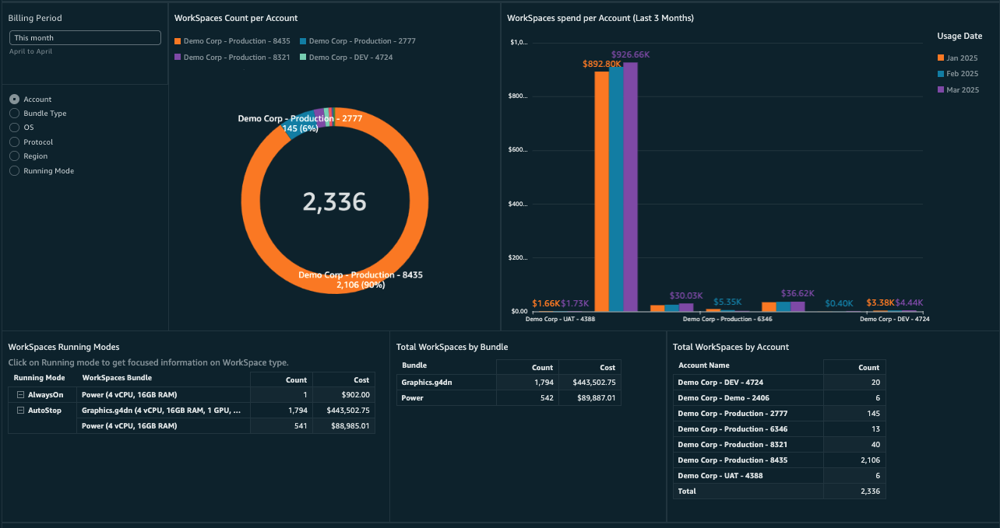
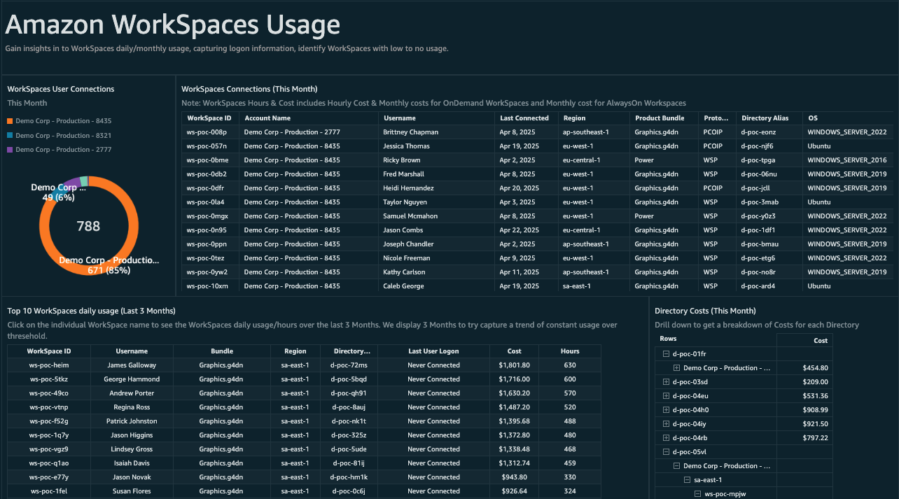
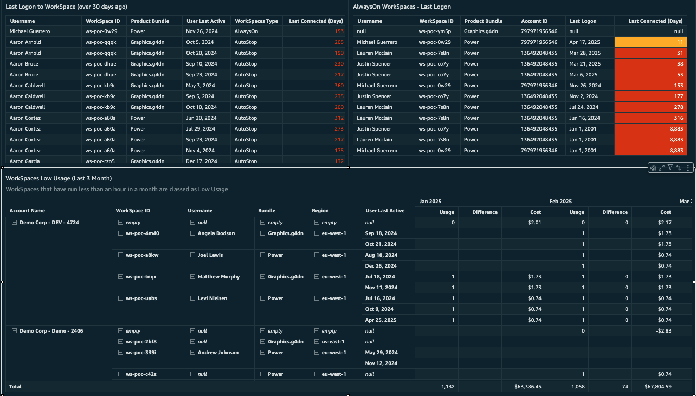
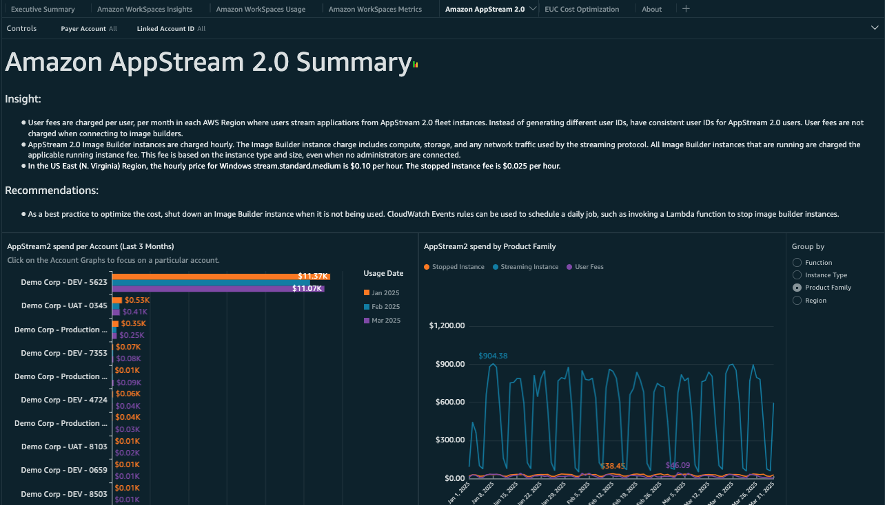
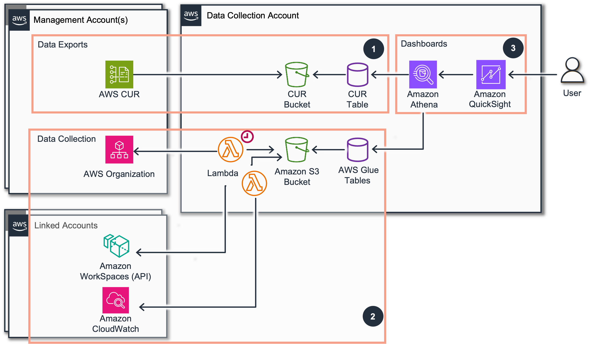

# AWS End User Computing (EUC) Dashboard

## Introduction

The End User Computing (EUC) Dashboard provides a unified view of your AWS EUC environment through an intuitive Quick Sight interface. Key capabilities include:

- Operational visibility into Amazon WorkSpaces and Amazon AppStream 2.0 usage patterns
- Cost optimization insights and spending analytics
- Performance monitoring with CloudWatch metrics integration
- WorkSpaces Logon statistics
- Resource utilization tracking and trending
- Recommendations for environment optimization

This solution helps teams make data-driven decisions to optimize costs, improve operational efficiency, and enhance the end-user experience across their EUC estate.



The dashboard has six tabs:

- **Summary**:
  - Break down of EUC services costs for last 3 months.
  - Top Spending accounts for each service.
  - High level summary of your EUC estate.



- **Amazon WorkSpaces Insights**:
  - In-dept break down of WorkSpaces costs for entire environment, additional insights not available in the Cost Usage Report including:
    - Protocol
    - Operating Systems

  - Daily Cost breakdown.
  - WorkSpaces Monthly usage.
  - WorkSpaces Cost Breakdown.
  - Workspaces Software bundle information.





- **Amazon WorkSpaces Usage**:
  - WorkSpaces User connections.
  - Top10 Daily usage.
  - Directory cost breakdown.
  - WorkSpaces daily usage and Hours used.
  - WorkSpaces Logon information
    - Last Logon
    - Low Usage
    - AlwaysOn WorkSpaces Logon information
    - Never Logged on

- **Amazon WorkSpaces Metrics**:
  - This tab is additional will breaks down Cloudwatch CPU/Memory utilization of WorkSpaces.



- **Amazon AppStream 2.0**
  - Detail overview of AppStream 2.0 environment.

- **EUC Cost Optimization**
  - Cost saving opportunities in your EUC environment.

## Architecture



1. The EUC Dashboard is depended on AWS Data Exports service delivers Cost & Usage Report (CUR2) daily to an Amazon S3 Bucket in the Management Account.
2. The EUC Dashboard also requires Data Collection lab for the Amazon Lambda to capture WorkSpaces data and CloudWatch metrics and copies Export data to a dedicated Data Collection Account automatically. EUC Dashboard can be configured during setup to use AWS Organizations (all linked accounts) or specific linked accounts to capture this data.

## Prerequisites

1. Deploy one or more of the foundational dashboards: [CUDOS, Cost Intelligence, or KPI Dashboard](cudos-cid-kpi.md "cudos-cid-kpi.md"). This will enable CUR and will enable required Quick Sight and Athena resources needed for this dashboard.
2. [Deploy](data-collection-deployment.md "data-collection-deployment.md") or [Update](data-collection-update.md "data-collection-update.md") the Data Collection Lab and make sure the following modules are enabled. Version 3.2.0 or higher required.
   - **Include Inventory Collector Module** (Mandatory) - This enables the collection of WorkSpaces environmental information using the WorkSpaces API.
   - **Include WorkSpaces Utilization Data Collection Module** (Optional) - This enables the collection of Cloudwatch metrics for WorkSpaces. Please see **Visualizing WorkSpaces Cloudwatch Metric** section below to configure this.
   - **EUC Module Settings** (Optional) - You can choose to scan all linked accounts in an organization or specify accounts that have WorkSpaces deployed, provide a comma-separated list of account IDS in the field to only scan these accounts. Leaving blank will scan all accounts.

## Deployment

###### Example

CloudFormation

###### Note

**Prerequisite**: To install this dashboard using CloudFormation, you need to install Foundational Dashboards CFN with version v4.0.0 or above as described [here](deployment-in-global-regions.md#deployment-in-global-region-deploy-dashboard "deployment-in-global-regions.md#deployment-in-global-region-deploy-dashboard")

1. Log in to to your **Data Collection** Account.
2. Click the Launch Stack button below to open the **pre-populated stack template** in your CloudFormation.

[](https://console.aws.amazon.com/cloudformation/home#/stacks/create/review?templateURL=https://aws-managed-cost-intelligence-dashboards.s3.amazonaws.com/cfn/cid-plugin.yml&stackName=EUC-Dashboard&param_DashboardId=euc-dashboard&param_RequiresDataCollection=yes "https://console.aws.amazon.com/cloudformation/home#/stacks/create/review?templateURL=https://aws-managed-cost-intelligence-dashboards.s3.amazonaws.com/cfn/cid-plugin.yml&stackName=EUC-Dashboard¶m_DashboardId=euc-dashboard¶m_RequiresDataCollection=yes") 3. You can change **Stack name** for your template if you wish. 4. Leave **Parameters** values as it is. 5. Review the configuration and click **Create stack**. 6. You will see the stack will start in **CREATE_IN_PROGRESS**. Once complete, the stack will show **CREATE_COMPLETE** 7. You can check the stack output for dashboard URLs.

**Troubleshooting:** If you see error "No export named cid-CidExecArn found" during stack deployment, make sure you have completed prerequisite steps.

Command Line
Alternative method to install dashboards is the [cid-cmd](https://github.com/aws-solutions-library-samples/cloud-intelligence-dashboards-framework/?tab=readme-ov-file#command-line-tool-cid-cmd "https://github.com/aws-solutions-library-samples/cloud-intelligence-dashboards-framework/?tab=readme-ov-file#command-line-tool-cid-cmd") tool.

1. Log in to to your **Data Collection** Account.
2. Open up a command-line interface with permissions to run API requests in your AWS account. We recommend to use [CloudShell](https://console.aws.amazon.com/cloudshell "https://console.aws.amazon.com/cloudshell").
3. In your command-line interface run the following command to download and install the CID CLI tool:

```
pip3 install --upgrade cid-cmd
```

4. In your command-line interface run the following command to deploy the dashboard:

```
cid-cmd deploy --dashboard-id euc-dashboard
```

Please follow the instructions from the deployment wizard. More info about command line options are in the [Readme](https://github.com/aws-solutions-library-samples/cloud-intelligence-dashboards-framework/blob/main/CID-CMD.md#command-line-tool-cid-cmd "https://github.com/aws-solutions-library-samples/cloud-intelligence-dashboards-framework/blob/main/CID-CMD.md#command-line-tool-cid-cmd") or `cid-cmd --help`. 5. Select the EUC Dashboard and hit enter 6. Follow any instructions in the command line tool 7. EUC Dashboard will deploy with a link

## **Visualizing WorkSpaces Cloudwatch Metric** (Optional)

In the EUC Dashboard, to view the WorkSpaces Cloudwatch metrics in the **WorkSpaces Metrics** tab, follow these steps:

- During Deployment, make sure you selected **yes** for the **Include WorkSpaces Utilization Data Collection Module** parameter.
- Go to the [Amazon Athena](https://console.aws.amazon.com/athena/ "https://console.aws.amazon.com/athena/") Query Editor.
- Select the database that has the views for CID. By default it can be CUR 1 **cid_cur** cur or CID 2 **cid_data_export** cur2 database.
- Run the following query to update **euc_metrics_view** view in Amazon Athena, **replacing the cur table name 'Line 89' based on version of cur running. e.g. "cid_data_export"."cur2" cur**

```
CREATE OR REPLACE VIEW "euc_metrics_view" AS
WITH
  workspace_metrics AS (
   SELECT
     m."WorkspaceId"
   , m."UserName"
   , CAST(parse_datetime(m.timestamp, 'yyyy-MM-dd HH:mm:ss') AS timestamp) cw_timestamp
   , m."State"
   , m."BundleId"
   , m."DirectoryId"
   , m."ComputerName"
   , m."RunningMode"
   , m."RootVolumeSizeGib"
   , m."UserVolumeSizeGib"
   , m."accountid"
   , m."region"
   , m."CPUUsage"
   , m."MemoryUsage"
   , m."InSessionLatency"
   , m."UserVolumeDiskUsage"
   , m."RootVolumeDiskUsage"
   , m."UpTime"
   , CAST(parse_datetime(w.lastconnected, 'MM/dd/yy HH:mm:ss') AS timestamp) lastconnected
   FROM
     ("optimization_data"."workspaces_metrics_data" m
   LEFT JOIN "optimization_data"."inventory_workspaces_data" w ON (m."WorkspaceId" = w."WorkspaceId"))
)
SELECT
  wi."WorkspaceId"
, wi."UserName"
, wi.cw_timestamp
, wi."State"
, wi."BundleId"
, wi."DirectoryId"
, wi."ComputerName"
, wi."RunningMode"
, wi."RootVolumeSizeGib"
, wi."UserVolumeSizeGib"
, wi."accountid"
, wi."region"
, wi."CPUUsage"
, wi."MemoryUsage"
, wi."InSessionLatency"
, wi."UserVolumeDiskUsage"
, wi."RootVolumeDiskUsage"
, wi."UpTime"
, wi.lastconnected
, split_part(billing_period, '-', 1) year
, split_part(billing_period, '-', 2) month
, bill_billing_period_start_date billing_period
, date_trunc('day', CAST(line_item_usage_start_date AS timestamp)) usage_date
, bill_payer_account_id payer_account_id
, line_item_usage_account_id linked_account_id
, line_item_line_item_type charge_type
, line_item_product_code
, line_item_usage_type
, line_item_operation
, line_item_line_item_description
, line_item_resource_id
, product['product_family'] product_product_family
, product_instance_type
, product_instance_family
, product['product_name'] product_product_name
, product['operating_system'] product_operating_system
, product['group'] product_group
, product['bundle_description'] product_bundle_description
, product['bundle_group'] product_bundle_group
, product['resource_type'] product_resource_type
, product['storage'] product_storage
, product['running_mode'] product_running_mode
, product['group_description'] product_group_description
, product['software_included'] product_software_included
, pricing_unit
, pricing_term
, split_part(line_item_resource_id, '/', 2) resource_id
, split_part(line_item_resource_id, ':', 6) resource_type
, split_part(line_item_resource_id, 'directory/', 2) resource_directory_id
, CAST(line_item_unblended_cost AS DECIMAL(18, 6)) line_item_unblended_cost
, CAST(line_item_usage_amount AS DECIMAL(18, 6)) line_item_usage_amount
, CAST(pricing_public_on_demand_cost AS DECIMAL(18, 6)) pricing_public_on_demand_cost
, sum((CASE WHEN ("line_item_line_item_type" = 'Usage') THEN "line_item_usage_amount" ELSE 0 END)) "usage_quantity"
, sum("line_item_unblended_cost") "unblended_cost"
FROM
  (<CUR2TABLE> cur2
LEFT JOIN workspace_metrics wi ON ((split_part(cur2.line_item_resource_id, '/', 2) = wi.workspaceid) AND (cur2.line_item_usage_account_id = wi.accountid)))
WHERE ((("bill_billing_period_start_date" >= ("date_trunc"('month', current_timestamp) - INTERVAL  '7' MONTH)) AND (CAST("concat"("billing_period", '-01') AS date) >= ("date_trunc"('month', current_date) - INTERVAL  '7' MONTH)) AND (line_item_product_code = 'AmazonWorkSpaces')) OR (line_item_product_code = 'AmazonAppStream') OR (line_item_product_code = 'AWSDirectoryService'))
GROUP BY 1, 2, 3, 4, 5, 6, 7, 8, 9, 10, 11, 12, 13, 14, 15, 16, 17, 18, 19, 20, 21, 22, 23, 24, 25, 26, 27, 28, 29, 30, 31, 32, 33, 34, 35, 36, 37, 38, 39, 40, 41, 42, 43, 44, 45, 46, 47, 48, 49, 50, 51, 52
```

## Update

Please note that dashboards are not updated with update of CloudFormation Stack. When new version of the dashboard template is released, you can update your dashboard by running the following command in your command-line interface:

```
cid-cmd update --dashboard-id euc-dashboard
```

## Authors

- Christian O’Donoghue, Senior Technical Account Manager

## Contributors

- Daniel Matlock, Technical Account Manager
- James Gaskell, Ex-Amazonian
- Yuriy Prykhodko, AWS Principal Technical Account Manager
- Iakov Gan, Ex-Amazonian
- Brian Sheppard, AWS Principal Technical Account Manager
- Natassa Eleftheriou, Senior Technical Account Manager

## Feedback & Support

Have a success story to share with the Team, suggest an improvement or report an error?

- Please email: [euc-dashboard@amazon.com](mailto:euc-dashboard@amazon.com "mailto:euc-dashboard@amazon.com")
- Follow [Feedback & Support](feedback-support.md "feedback-support.md") guide

###### Note

These dashboards and their content: (a) are for informational purposes only, (b) represent current AWS product offerings and practices, which are subject to change without notice, and (c) does not create any commitments or assurances from AWS and its affiliates, suppliers or licensors. AWS content, products or services are provided "as is" without warranties, representations, or conditions of any kind, whether express or implied. The responsibilities and liabilities of AWS to its customers are controlled by AWS agreements, and this document is not part of, nor does it modify, any agreement between AWS and its customers.
