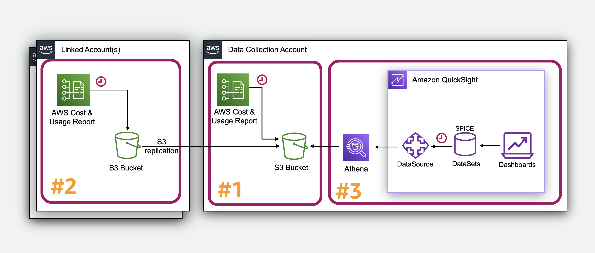
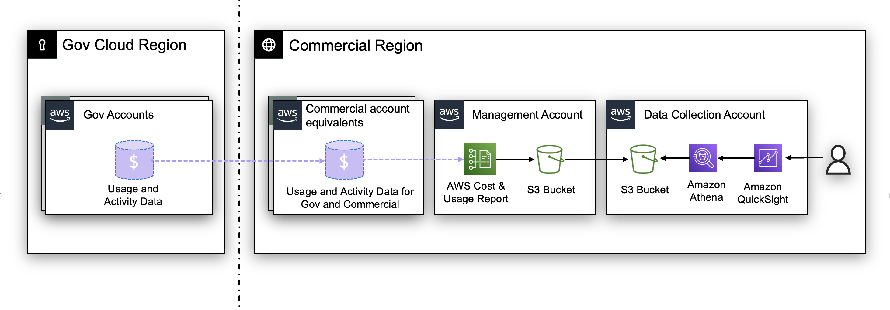
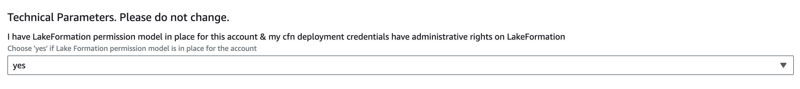

# FAQs

## Last Updated

July 2025

## Feedback & Support

Follow [Feedback & Support](feedback-support.md "feedback-support.md") guide

## General FAQs

### Which dashboards are available for installation?

Full list can be found [here](dashboards.md "dashboards.md").

### How can I install the Cloud Intelligence Dashboards?

First you need to complete the [prerequisite](deployment-in-global-regions.md "deployment-in-global-regions.md") steps,
after that you can follow the instructions [here](deployment-in-global-regions.md#deployment-in-global-regions-deployment "deployment-in-global-regions.md#deployment-in-global-regions-deployment") for
the specific required dashboard

### What columns are in the Cost and Usage Report (CUR), what do they mean?

CUR documentation can be found
[here](../../../pdfs/cur/latest/userguide/cur-user-guide.md "../../../pdfs/cur/latest/userguide/cur-user-guide.md")

### Where can I find more info about CUR delivery timelines and any FAQs for CUR?

On average, CURs are updated up to 3 times daily, but that will
fluctuate depending on the size of the file/amount of user usage and
many other factors. you can monitor your CUR S3 bucket to see the
date/time the new month’s file is deposited. Within the CUR itself you
can see the corresponding usage dates/times to infer which usage is
reflected within that file.

### Can I use an existing Cost and Usage Report (CUR) instead of the one created by CID?

For CUR2 we do not support exports other then deployed by cid Data
Exports Stack. For Legacy CUR we do not recommend using an existing CUR
unless it is for an installation within a Management (Payer) Account AND
the existing Legacy CUR strictly conforms to the CID requirements:

- Additional report details: **Include Resource IDs**
- Time Granularity: **Hourly**
- Report Versioning: **Overwrite existing report**
- Report data integration for: **Amazon Athena**
- Compression type: **Parquet**
- Name of CUR: **Only alphanumeric characters and underscore (\_) are allowed**. Ex: "cid"
- Prefix: You need to have a specific prefix. Ex: **cur/123412341234**. This will help to combine multiple CURs in one place.

When creating a new CUR with CloudFormation you can request a backfill
of up to 3 years of data via a support case. If you had an existing CUR
with the required structure and you need more than 3 years of historical
data, please checkout the [Migration Section](#faq-migration "#faq-migration").

By default, you can have up to 10 CUR configurations in parallel.

### Why do we need to copy CUR across accounts? Isn’t it less expensive to provide a direct access?

CID uses S3 replication for CUR aggregation. The data is not stored in
the source account thanks to a Lifecycle policy. The S3 replication is a
cheap, secure and reliable way to aggregate data and avoid operational
complexity.

### I want more than 7 months in my CUDOS / CID Dashboard

By default CUDOS has 7 months of data, If you need to pull more data,
you can follow below steps as long as you have that additional data in
CUR.

- Go to Athena
- Edit/Show query for summary_view view
- Modify the line towards the bottom that has 2 entries saying "7" months (6 past + 1 current) and replace them with your desired months
- Run the query and it should complete successfully and that will automatically update the view.
- Go to Quick Sight and select Dataset in the left tab
- Select the summary_view and click on refresh dataset and do a full refresh. It might take some time depending on data. If you run into
  SPICE issues, make sure to adjust spice capacity in your Quick Sight account as needed.
- Once it is done, check your Quick Sight dashboard and select a visual and click on view dashboard filter to modify the date to either Relative
  date or Date and Time range to verify the data for the past years.

Note: Some visuals are additionally limited by filters. Feel free to
adjust them within dashboard as needed.

### In which regions can the Cloud Intelligence Dashboards be deployed in?

CID requires Quick Sight, Athena and Glue. Cost Usage Reports (CUR)
Bucket has to be in the same region as those services. CUR bucket can be
replicated to the region that supports CIDs via S3 bucket replication.
When using the cid-cmd, you can define the Region to deploy the
dashboard in as a parameter e.g. _cid-cmd --region_name eu-west-2 deploy_.

- [Quick Sight](../../../general/latest/gr/quicksight.md "../../../general/latest/gr/quicksight.md")
- [Glue](../../../general/latest/gr/glue.md "../../../general/latest/gr/glue.md")
- [Athena](../../../general/latest/gr/athena.md "../../../general/latest/gr/athena.md")

China and US Gov regions are supported as well.

### How long does it take to initially deploy the Cloud Intelligence Dashboards Framework?

Assuming the [prerequisites](cudos-cid-kpi.md "cudos-cid-kpi.md")
were met correctly the automation would take around 5-10 minutes to
deploy.

### Do I need to learn any coding skills to customize the analysis?

No, just AWS native BI service Quick Sight and customer facing data Cost
and Usage Reports structure. Here is public documentation for
[Quick Sight](../../../quicksight/index.md "../../../quicksight/index.md") and
[Cost
Usage Reports](../../../cur/latest/userguide/data-dictionary.md "../../../cur/latest/userguide/data-dictionary.md").

### How do I edit or customize the dashboards?

In order to create an analysis from any of the Dashboards, Go edit the
newly created dashboard’s permissions to enable the "Save As" option:

- Go to your Dashboard.
- Click "Share"
- Click "Share dashboard"
- Enable the "Allow “save as"” next to your username
- Click "Confirm"
- Click the link in the top left corner to Go back to Dashboard (or similar)
- You should now see a "Save as" (you might have to refresh browser)
- Click "Save as"
- Name your Analysis
- Once completed, you can then customize the Analysis filters, visuals etc.

You can see this video below

See more in [customizations](customizations.md "customizations.md") section.

### I have no access to Management (Payer) Account can I install Dashboard for a subset of Linked Accounts?

Yes. This is a common use-case for Business Units who need a better
visibility on their spend and usage. In this case each Business Unit can
consolidate CUR from a subset of accounts into one account and own a set
of Dashboards.

You need to decide which of your Linked accounts will be a Data
Collection Account and then you can use the same procedure as described
for [multi-account
setup](deployment-in-global-regions.md#deployment-in-global-regions-deployment "deployment-in-global-regions.md#deployment-in-global-regions-deployment"):

- Step 1: [CFN
  "CUR aggregation Stack"](deployment-in-global-regions.md#deploy-in-global-regions-create-destination-for-cur "deployment-in-global-regions.md#deploy-in-global-regions-create-destination-for-cur") will run in the Data collection account.
  Please Note to provide the full list of other accounts as input. Also
  you will need to activate `CreateCUR=True` option to collect data from
  this account as well.
- Step 2: [Deploy CFN "CUR aggregation Stack"](deployment-in-global-regions.md#deploy-in-global-regions-create-cur-and-replication "deployment-in-global-regions.md#deploy-in-global-regions-create-cur-and-replication") in all other Linked accounts specifying
  your Data Collection Account as the Destination. Once done you can
  optionally create a Support Case in each Account asking to Backfill the
  CUR `cid` with historical data (up to 3 years).
- Step 3: [Run CFN "All-in-one Dashboards stack"](deployment-in-global-regions.md#deployment-in-global-region-deploy-dashboard "deployment-in-global-regions.md#deployment-in-global-region-deploy-dashboard") that will create the Glue Crawler,
  Athena Database, Athena Tables, Quick Sight DataSets and Dashboards.
  (Quick Sight Enterprise must be activated in this account, [Prepare Amazon Quick Sight](deployment-in-global-regions.md#deploy-in-global-regions-prepare-quicksight "deployment-in-global-regions.md#deploy-in-global-regions-prepare-quicksight"))



Please note that in this case if a new source account must be added, you
need to run update of CFN "CUR aggregation stack" in the Data
Collection Account and only after that install CFN "CUR aggregation
Stack" in the new account.

### What are the solution limitations?

Amazon Quick Sight SPICE capacity for Enterprise edition is up to 1
billion rows or 1 TB per dataset. Amazon Athena DML query timeout is max
3 hours. If you face these limitations please check troubleshooting
section of this FAQ. Also you can contact your Technical Account Manager
(TAM) to organize a deep dive with the CID team.

### How can I share dashboards with other users?

You can share dashboards and visuals with specific users or groups in
your account or with everyone in your Amazon Quick Sight account. Or you
share them with anyone on the internet. You can share dashboards and
visuals by using the Quick Sight console or the Quick Sight API. Access to
a shared visual depends on the sharing settings that are configured for
the dashboard that the visual belongs to. To share and embed visuals to
your website or application, adjust the sharing settings of the
dashboard that it belongs to. For more information, see the following:

- [Granting
  individual Amazon Quick Sight users and groups access to a dashboard in
  Amazon Quick Sight](../../../quicksight/latest/user/share-a-dashboard-grant-access-users.md "../../../quicksight/latest/user/share-a-dashboard-grant-access-users.md")
- [Granting
  everyone in your Amazon Quick Sight account access to a dashboard](../../../quicksight/latest/user/share-a-dashboard-grant-access-everyone.md "../../../quicksight/latest/user/share-a-dashboard-grant-access-everyone.md")
- See more in [share section of this workshop](share-dashboards.md "share-dashboards.md").

### How is the Unit Cost is being calculated?

In general- spend in $/usage_quantity For example for Compute/RDS we
take only instances running hours cost and divide by usage, for S3 we
take only storage cost and divide by storage size

### Can we see Marketplace usage on Cloud Intelligence Dashboards?

Yes, on CUDOS dashboard under MoM Trends tab. You have 2 filters Billing
Entity and Legal entity

### How can I export a dashboard to PDF?

On the right upper corner of the dashboard, click on the Export icon →
Generate PDF

### How can I export a visual to CSV?

Click on a specific visual, click on the 3 dots → Export to CSV

### How can I change KPI values on the KPI dashboard?

On KPI dashboard, under Set KPI Goals tab. Choose a specific KPI and
adjust the bar according to your KPI value

### How I can consolidate data from multiple AWS Organizations

You can add data collection from multiple AWS Organizations to be
visualized in the same dashboards and then use Row Level Security to
restrict access if needed.

1. In Data Collection account (where you have dashboards) you need to update CID-CUR-Destination stack and add to a comma separated list
   `SourceAccountIds` all additional Management Account Id(s).
2. In each Management Account account (Payer) you need to install
   CID-CUR-Source as described in [step 2 here](deployment-in-global-regions.md "deployment-in-global-regions.md").
3. In each Management Account request a backfill of CUR with the name `cid` with up to 3 years of historical data via a support case.
   You can expect the CUR to appear 24h after the backfill request
   completed.

4. Follow Data Collection instructions to install permissions each Management Account account (Payer) as described in [here](data-collection-deployment.md "data-collection-deployment.md").
5. In Data Collection Account update the Data Collection Stack and add new Management Accounts as a comma separated list.
6. Trigger data collection as per documentation [here](data-collection-deployment.md "data-collection-deployment.md").
   For Data Collection the backfill is not possible. You can check
   dashboards in after 24h or trigger refresh of all related datasets
   manually.

### How can I visualize GovCloud usage and spend in CID?

GovCloud accounts do not have a billing interface, therefore all
GovCloud account billing data is shown and expressed in the equivalent
commercial account. As part of deploying CID in your commercial account,
GovCloud spend and usage data will be reflected in the commercial CID
deployment. Therefore, the accounts IDs shown in the dashboards will be
the Commercially-linked account IDs for your GovCloud accounts.



Cost and Usage report is only available in the AWS Commercial region;
you can deploy CID in the AWS Commercial account and it will reflect
GovCloud workloads usage and spend.

## Troubleshooting

### Cost values or other numbers in the Cloud Intelligence Dashboards don’t match what I see in my invoices or in Cost Explorer - what do I do?

###### Note

Due to a recent change in CUR2.0 data some customers can
experience inconsistencies in data. We invite customers to
[modify
Athena Views](https://github.com/aws-solutions-library-samples/cloud-intelligence-dashboards-framework/commit/b11e8a500a549c9bf7fe379e870a3b1af65a5465 "https://github.com/aws-solutions-library-samples/cloud-intelligence-dashboards-framework/commit/b11e8a500a549c9bf7fe379e870a3b1af65a5465") (summary_view, hourly_view and resource_view), and then
refresh corresponding datasets in Quick Sight. Alternatively customers
can use [recursive update](update-dashboards.md "update-dashboards.md").

1. Make sure you’re
   using the latest version of dashboards and underlying datasets. Consider
   running [recursive update](update-dashboards.md "update-dashboards.md").
2. Check the Quick Sight dataset refreshes — sometimes they error out. They
   should be scheduled for once a day at least.
3. Cost Explorer does round
   cost values, so we’ve seen these rounding errors propagate to noticeable
   differences between Cost Explorer and the
   CUR/CloudIntelligenceDashboards. The CUR has more accurate cost values.
4. Double check your settings in Cost Explorer for unblended, amortized,
   net amortized etc. to make sure you’re comparing to the same cost values
   in the dashboards.
5. A lot of visuals in CUDOS and our other dashboards
   are about usage, for example S3 costs will be filtered to exclude API
   requests and data transfers and JUST show the cost of storing those GBs.
6. In the Cloud Intelligence Dashboards you can always break a spend
   amount down into its parts, like grouping by operation or usage type,
   then comparing it to Cost Explorer or your invoices to see what is
   different.
7. Enterprise Support fees arrive after the 15th of the next
   month. Exclude ES charges in your comparison.
8. Taxes, refunds, and
   credits are excluded from many visuals in CUDOS and the other
   dashboards.

### Savings Plans which returned within 7 days window incorrectly shown as a negative value in the amortized cost - what do I do?

Make sure you’re using the latest version of the
[summary_view](https://github.com/aws-solutions-library-samples/cloud-intelligence-dashboards-framework/blob/main/cid/builtin/core/data/queries/cid/summary_view.sql "https://github.com/aws-solutions-library-samples/cloud-intelligence-dashboards-framework/blob/main/cid/builtin/core/data/queries/cid/summary_view.sql")
in Athena which includes
[following
change](https://github.com/aws-solutions-library-samples/cloud-intelligence-dashboards-framework/commit/7e30cb509cbd78cf63b5efcc954cf68227cfa449 "https://github.com/aws-solutions-library-samples/cloud-intelligence-dashboards-framework/commit/7e30cb509cbd78cf63b5efcc954cf68227cfa449") to handle Savings Plans returns in the amortized cost.
Alternatively you can use [recursive update](update-dashboards.md "update-dashboards.md") to update all
views to the latest versions.

### I am getting the error 'File option is not implemented' on dashboard update

Please use cid tool of version = 4.2.3 for both command line updates and CloudFormation use cases.

### I am getting the error "SOURCE_RESOURCE_LIMIT_EXCEEDED" on dataset update - what do I do?

Athena may face processing limitations if the CUR has a significant
volume. To overcome this, one possible solution is to change the CUR
granularity from "hourly" to "daily". This will reduce the number of
lines in CUR by x24, but it will also necessitate modifying the visuals
that depict hourly ec2 usage by switching to daily granularity.

#### View is stale or in invalid state

This Athena issue
can happen if the CUR table changes a lot. Please check following
resources:

- https://repost.aws/knowledge-center/athena-view-is-stale-error

#### I see this error Error: CUR not detected and we have AWS Lake Formation activated

You can deploy CID
in an account where Lake Formation activated. Under Technical Parameters
Select Yes for "I have LakeFormation permission model in place for this
account my cfn deployment credentials have administrative rights on
LakeFormation"



#### How do I fix the "product_cache_engine" or "product_database_engine" cannot be resolved error?

Some CID views dependent on having or historically having an RDS
database instance and an ElastiCache instance run in your organization.

The CloudFormation
deployment do not have this dependency.

For fixing this in existing deployment you can simply run at least one
RDS database and at least one ElastiCache instance for a couple of
minutes.

If you get the error that the column _product_database_engine_ or
_product_deployment_option_ does not exist, then you need to run an RDS
database instance. If you get the error that the column
_product_cache_engine_ does not exist, then you need to spin up an
ElastiCache instance.

After you run these instances, on the next CUR generation and Crawler
run, the new columns will appear in your CUR table and you can retry.
Typically this takes 24 hours.

#### I’m getting an error in Quick Sight that is saying Athena timed out.

For very large CUR files, Athena may time out trying to query the data
for summary_view. In Athena, find the summary_view view, click the three
dots next to it and select show/edit query. Modify the following:

- [Request Athena](https://docs.amazonaws.cn/en_us/athena/latest/ug/service-limits.html? "https://docs.amazonaws.cn/en_us/athena/latest/ug/service-limits.html?") DML query timeout increase via support case.
- Or, adjust the granularity to monthly, by changing "day" to "month" in row 6.
- Or, adjust the look back from "7" months to desired time-frame in row 75.
- In Quick Sight, refresh your dataset.

#### HIVE_PARTITION_SCHEMA_MISMATCH There is a mismatch between the table and partition schemas. The types are incompatible and cannot be coerced

Edit your Glue
crawler to refresh the metadata from the partitions by following
[these
steps](https://repost.aws/knowledge-center/athena-hive-partition-schema-mismatch "https://repost.aws/knowledge-center/athena-hive-partition-schema-mismatch").

#### Can we use Incremental Refresh for CUR Datasets?

No. Quick Sight Datasets using Cost and Usage Reports (CUR) require Full
Refresh exclusively. Incremental Refresh cannot be used because AWS
updates and overwrites previous month’s CUR data after invoice
finalization, which typically occurs mid-month. To ensure data accuracy
and consistency, the 'Full Refresh' must be implemented for all CUR-based
datasets in Quick Sight.

## Pricing

### How much does it cost to run the CID Framework?

Assumptions for a set of Foundational Dashboards:

- Number of working days per month = (22)
- SPICE capacity = (100 GB)
- Number of Quick Sight authors = (3)
- Number of Quick Sight readers = (15)

Cost breakdown using the
[AWS
Pricing Calculator](https://calculator.aws/#/estimate?id=991281b8b57ced55853631c27d780550265839d3 "https://calculator.aws/#/estimate?id=991281b8b57ced55853631c27d780550265839d3"):

- S3 cost for CUR: $5-10/month\*\*
- AWS Glue Crawler: $3/month\*\*
- AWS Athena data scanned: $15/month\*\*
- Quick Sight Enterprise: ⇐ $24/month/author or $3/month/reader. See [Pricing](https://aws.amazon.com/quicksight/pricing/ "https://aws.amazon.com/quicksight/pricing/")
- Quick Sight SPICE capacity: $10-20/month\*\*
- Total: $100-$200 monthly

There is also a free trial for 30 days for 4 users of Quick Sight, so the
first month’s overall cost may be less if a trial period is still
available.

Estimate the cost for your solution using
[AWS
Pricing Calculator](https://calculator.aws/#/estimate?id=991281b8b57ced55853631c27d780550265839d3 "https://calculator.aws/#/estimate?id=991281b8b57ced55853631c27d780550265839d3")

###### Note

**Costs above are relative to the size of your CUR data**

### Is there additional cost for Advanced and Additional dashboards?

It depends on the the frequency of scans, number of regions and accounts
and a volume of the workloads. Generally for customers with a monthly
bill 1M$ the cost of data collection is less then $50/month for
default scan frequency.

## Customization

Refer to the [Customizations](customizations.md "customizations.md") section of this workshop for more customizations.

### How can I add tagging visuals to CUDOS dashboard?

Refer to the [Add organizational taxonomy](add-org-taxonomy.md "add-org-taxonomy.md") section.

### How to get alerts from dashboards?

Step by step can be found on the video below

### Can I translate Dashboards to another language?

Translating the Dashboard into another language poses a significant
challenge. While it’s theoretically possible to generate a Quick Sight
Analysis from the Dashboard and adjust titles and static text in
recommendations, achieving a complete translation of dashboards is a
highly complex task. The dashboards use fields from the Cost and Usage
Report, which contain values in English. Dashboards heavily rely on
these values in built-in filters and Calculated Fields logic, presenting
a significant obstacle to automatic translation.

## Migration

### I am planning a migration of AWS Accounts to a different AWS Organization. What changes I need to make in CloudFormation stack in destination account?

Maintain current configuration until billing cycle completion to ensure accurate post-migration invoice adjustments and upfront charges. After billing cycle completion, terminate Cost and Usage Report replication from the migrating account by removing its stack and deleting its account ID from the data exports stack in the destination account. Adjust queries to only use cur if source_account_id is equal to payer account(Can be done even before migration).

###### Important

It is important to request a backfill of your CUR before transferring AWS Accounts. Once an account leaves an AWS Organization you loose the ability to backfill CUR data.

###### Note

Some upfront charges can be duplicated in CUR during account migration. They must be consolidated on the update of CUR after finalization of Invoices (around 15th or the next month).

### I am planning a migration of AWS Accounts to a different AWS Organization. What can I do for keeping the visibility on cost during and after migration?

Account migration from one AWS Organization to another is a quite
frequent operation. It can be a technical implementation of a merge, an
acquisition, divestiture of businesses or an internal consolidation.
Set up CID dashboards in the target Organization BEFORE migration,
making sure that the CUR for all accounts in the scope of migration is
consolidated to the target Data Collection Account. You can install CID
with the Data Collection account in the target Organization and
additional Organizations (or limited number of AWS accounts) can be
added as needed.

### I want to export a portion of CUR data related to a limited number of AWS Accounts to a different Organization or CID deployment.

Set up CID in the Organization and use Athena command
[UNLOAD](../../../athena/latest/ug/unload.md "../../../athena/latest/ug/unload.md") in the
source account to export a selection of data into parquet format. Please note, Legacy CUR is partitioned by "partitioned_by=ARRAY['year','month']" vs CUR 2.0 by partitioned_by=ARRAY['billing\_period']

```
 UNLOAD (
          SELECT
         , "identity_line_item_id"
         , "identity_time_interval"
         , "bill_invoice_id"
         , "bill_billing_entity"
         , "bill_bill_type"
         , "bill_payer_account_id"
         , "line_item_usage_account_id"
         , "line_item_line_item_type"
         , "line_item_product_code"
         , "line_item_usage_type"
         .... etc etc .... according to the schema of your CUR
         , "resource_tags_user_environment"
         , year          -- MUST BE THE LAST
         , month         -- MUST BE THE LAST
          FROM
             cid_cur.cur
          WHERE
             line_item_usage_account_id IN (
                  '111222333444',
                  '555666777888'
             )
       )
        TO 's3://${target-account-bucket}/cur/${payer_account_id}/cid/cid/'
        WITH (
          format = 'PARQUET',
         partitioned_by = ARRAY['year', 'month']
       )
```

You can also use Athena command [CTAS](../../../athena/latest/ug/ctas.md "../../../athena/latest/ug/ctas.md") in the source account to export a selection of data into parquet format.

```
 CREATE TABLE (database).temp_table
WITH (
      format = 'Parquet',
      parquet_compression = 'SNAPPY',
      external_location = 's3://${target-account-bucket}/cur/${payer_account_id}/cid/cid/',
      partitioned_by=ARRAY['year','month'])
AS SELECT *
FROM "(database)"."(table)"
WHERE line_item_usage_account_id IN( '(account ID)', '(account ID)', '(account ID)', '(account ID)')
```

```
 CREATE TABLE (database).temp_table
WITH (
      format = 'Parquet',
      parquet_compression = 'SNAPPY',
      external_location = 's3://${target-account-bucket}/cur2/${payer_account_id}/cid2-cur2/data/',
      partitioned_by=ARRAY['billing_period'])
AS SELECT *
FROM "(database)"."(table)"
WHERE line_item_usage_account_id IN( '(account ID)', '(account ID)', '(account ID)', '(account ID)')
```

###### Export on schedule

If you need to regularly export this data, you can deploy this as a Lambda to run on schedule.

### I have an archive of Cost and Usage Report (CUR). How I integrate to CID after migration?

It is recommended to setup CUR replication before migration. You can
reuse historical data if you have an existing CUR export, and if it
strictly conforms to the CID requirements.

- Additional report details: **Include Resource IDs**
- Time Granularity: **Hourly**
- Report Versioning: **Overwrite existing report**
- Report data integration for: **Amazon Athena**
- Compression type: **Parquet**
  If you respect the above requirements, on an single tenant account or an
  organization (**FromOrg**), you are able to copy the CUR to another CID
  deployment, in another organization (**ToOrg**).

For the import process to work, the imported data should comply with a
strict S3 mapping structure. S3 mapping is based on the CUR name and
bucket prefix. In order to migrate existing reports, S3 mappings should
be compliant. This will require to rename before transfer the data to
the cid bucket of the destination organization.

Assumptions:

- FromOrg Account ID: `777888899944`
- FromOrg BucketName: `my-cid-bucket-name`
- FromOrg Specified CUR prefix: `my-prefix`
- FromOrg CUR Name: `cost_report_001`
- ToOrg Account Id : `111112222233`
- ToOrg bucket Name: `cid-111112222233-shared`
- ToOrg CID deployment resource prefix: `cid` (default)

1. Rename file export

```
 cd /tmp
mkdir cur_mig
cd cur_mig

With AWS Credentials with sufficient permissions to copy my-cid-bucket-name data
aws s3 sync s3::/FromOrgBucket/FromOrgPrefix/FromOrgCURName/ ./

## Resolved
aws s3 sync s3://my-cid-bucket-name/my-prefix/cost_report_001/cost_report_001/ ./

### Rename cid export name by account id
mv cost_report_001 cid
```

1. Copy to new bucket

```
 With AWS Credentials with sufficient permissions to copy cid-111112222233-shared data
aws s3 cp --recursive ./ s3://NewOrgBucket/cur/FromOrgAccountId/cid/cid

# Resolved
aws s3 cp --recursive ./ s3://cid-111112222233-shared/cur/777888899944/cid/cid/
```

1. Refresh datasets
   Quick Sight will be automatically updated within 24h. You can manually
   refresh the dataset by following this steps:

- Go to Glue console and run the CID Glue Crawler
- When the crawl is DONE, refresh each quicksight Dataset on quicksight

## Security

### How do I limit access to the data in the Dashboards using row level security?

Do you want to give access to the dashboards to someone within your
organization, but you only want them to see data from accounts or
business units associated with their role or position? You can use row
level security in Quick Sight to accomplish limiting access to data by
user. In these steps below, we will define specific Linked Account IDs
against individual users. Once the Row-Level Security is enabled, users
will continue to load the same Dashboards and Analyses, but will have
custom views that restrict the data to only the Linked Account IDs
defined.

Step by step can be found on the video below

See more in [Row Level Security](row-level-security.md "row-level-security.md") section.

### We have an encrypted S3 buckets for CUR and Athena query results. Does CID Framework support encrypted S3 buckets?

Yes. Quick Sight would require an IAM role and a suitable IAM policy
allowing access to KMS.

### Can I encrypt my CUR buckets in S3?

For a KMS encrypted
bucket, KEY and ROLE policies need to be modified to allow you to use
the KMS key that encrypts the S3 bucket. Additional security features
like SCP can also be applied in your Organization. For troubleshooting
IAM permissions you can use CloudTrail and open support tickets with
cloud support engineers. Here is a sample KMS key policy that should be
added in cases where the CUR bucket is KMS encrypted. The policy allows
Quick Sight and Glue roles to decrypt the data encrypted with that KMS
key.

###### Important

This statement is to be added to an existing kms key policy
and not to replace it, the key could have other policies in place used
by other services, like key administrators policy.

- replace _region_ with your region
- replace _account_ with account number
- replace _crawler-role_ with cur glue crawler IAM role (can be found in crawler config/Service role)
- replace _key-id_ with the id of your KMS key or alias (or use \*)

```
  {
      "Sid": "Allow Quick Sight and Glue",
      "Action": "kms:Decrypt",
      "Effect": "Allow",
      "Principal":
      {
          "AWS":
          [
              "arn:aws:iam::{account}:role/service-role/aws-quicksight-service-role-v0",
              "arn:aws:iam::{account}:role/{crawler-role}"
          ]
      },
      "Resource": "arn:aws:kms:{region}:{account}:key/{key-id or \*}"
  }
```

### Can I do cross-account queries in Athena instead of replicating CUR buckets?

CUR bucket replication is the preferred method because it is tested and
documented. Technically you can use cross-account methods but it is
untested. It is true that CUR bucket replication will create more cost
as the you will have to store the CUR twice, although you could think of
it as a backup in case something happens to the payer accounts. We
recommend CUR bucket replication also because the Athena tables are
created/updated via a Glue crawler where you get all CUR schema changes
handled. Glue crawlers don’t support cross account set up. It also gets
significantly more complicated if KMS encryption is used.

## Backup / Disaster Recovery

### How can I implement backup and disaster recovery for CID?

We recommend installation from scratch in case if you fully lost the access to your Quick Sight account. But you may want to backup data, collected by CID as well as your custom dashboards.

**Backup:**

1. Configure cross-region/cross-account replication to DR region/account for S3 CUR and data collection buckets (cid-\*). For CUR you can request backfill for 3 years of data.
2. Periodically backup your dashboards using [bundles](https://repost.aws/articles/ARNZN2L2L2SomnCShtJaB-qA/amazon-quicksight-asset-deployments-using-assetbundle-export-and-import-apis-private-datasource-guidelines "https://repost.aws/articles/ARNZN2L2L2SomnCShtJaB-qA/amazon-quicksight-asset-deployments-using-assetbundle-export-and-import-apis-private-datasource-guidelines") or using `cid-cmd export`. Both can be used in bash or python. Store artifacts on S3 in DR region/account.
3. If you use customization of Athena views, they must be backed up as well.

**Restore:**

1. Install CID from scratch.
2. Sync S3 buckets.
3. Install additional dashboards from backup.

## Optimization Data Collection FAQs

### My region is not covered in the "Code Bucket" Parameter

We have set this up in the most common regions. If your region is not in
the list please email [costoptimization@amazon.com](mailto:costoptimization@amazon.com "mailto:costoptimization@amazon.com") and we will create
this resource for you.

### Compute Optimizer Module Failing

Please make sure you enable Compute Optimizer following this
[guide](../../../organizations/latest/userguide/services-that-can-integrate-compute-optimizer.md "../../../organizations/latest/userguide/services-that-can-integrate-compute-optimizer.md").

### I need to edit my StackSet

If, when you deployed your StackSets, you chose to deploy to all
accounts and you now wish to edit you will need to get your **Root ID**.

This can be found in your AWS Organizations part of the console.

### Why should I have a separate cost account?

There are two main reasons for this:

1. We recommend customer avoid deploying workloads to the organization’s
   management account in general:

"Since privileged operations can be performed within an organization’s
management account and SCPs do not apply to the management account, we
recommend that you limit access to an organization’s management account.
You should also limit the cloud resources and data contained in the
management account to only those that must be managed in the management
account." from
[here](../../../whitepapers/latest/organizing-your-aws-environment/design-principles-for-organizing-your-aws-accounts.md "../../../whitepapers/latest/organizing-your-aws-environment/design-principles-for-organizing-your-aws-accounts.md").

1. As there are lambda function deployed in the account these could
   benefit from Compute Savings plans. This means that there could be
   higher savings missed in other accounts because they are used on the
   lambdas first:

"In a Consolidated Billing Family, Savings Plans are applied first to
the owner account’s usage, and then to other accounts’ usage. This
occurs only if you have sharing enabled." from
[here](../../../savingsplans/latest/userguide/sp-applying.md "../../../savingsplans/latest/userguide/sp-applying.md").

### My Athena database has tables in called year and payer

We have upgraded the lab to work for multi-payers. For this we added a
new partition of payer_id=your_payer_id which can upset the crawler.

To fix please follow the steps below:

1. Ensure your costoptimization bucket does have the new
   **payer_id=your_payer_id** folder in your data.
2. Delete your new tables with names that have long hashs attached to
   them and start with payer or year
3. Run the following [python script](samples/s3_files_migration.py.md "samples/s3_files_migration.py.md")

`python3 s3_files_migration.py ODC_your_bucket_name`

```
This will move all current files into the new format
```

1. Run your crawlers to update your tables

## CUDOS v5 FAQS

### What’s new in CUDOS v5 compare to previous version?

To improve performance in CUDOS v5 we’ve re-designed dataset structure.
All datasets used by CUDOS v5 use fast Quick Sight SPICE storage which
reduces time required to load visuals. CUDOS v5 is using 3 datasets:

- **summary_view** with historical data for last 7 months (by default) and
  with daily granularity for latest 3 months without resource details. See
  source code
  [here](https://github.com/aws-solutions-library-samples/cloud-intelligence-dashboards-framework/blob/main/cid/builtin/core/data/queries/cid/summary_view.sql "https://github.com/aws-solutions-library-samples/cloud-intelligence-dashboards-framework/blob/main/cid/builtin/core/data/queries/cid/summary_view.sql")
- **resource_view** with cost and usage details for every resource for
  last 30 days with daily granularity. See source code
  [here](https://github.com/aws-solutions-library-samples/cloud-intelligence-dashboards-framework/blob/main/cid/builtin/core/data/queries/cudos/resource_view.sql "https://github.com/aws-solutions-library-samples/cloud-intelligence-dashboards-framework/blob/main/cid/builtin/core/data/queries/cudos/resource_view.sql")
- **hourly_view** with hourly granularity for last 30 days without
  resource level details. See source code
  [here](https://github.com/aws-solutions-library-samples/cloud-intelligence-dashboards-framework/blob/main/cid/builtin/core/data/queries/cudos/hourly_view.sql "https://github.com/aws-solutions-library-samples/cloud-intelligence-dashboards-framework/blob/main/cid/builtin/core/data/queries/cudos/hourly_view.sql")

Datasets **customer_all**, **ec2_running_cost** and
**savings_plans_eligible_spend** are not used by CUDOS v5. Also we’ve
added new features to MoM Trends, AI/ML and other tabs. You can find
full list of changes
[here](https://github.com/aws-solutions-library-samples/cloud-intelligence-dashboards-framework/blob/main/changes/CHANGELOG-cudos.md "https://github.com/aws-solutions-library-samples/cloud-intelligence-dashboards-framework/blob/main/changes/CHANGELOG-cudos.md")

### How to update to CUDOS v5 if I have previous version of CUDOS installed?

We’ve released CUDOS v5 as a separate Quick Sight template. This allows
having both CUDOS v5 and CUDOS v4 deployed in parallel to switch to
CUDOS v5 over time and delete CUDOS v4. You can deploy CUDOS v5 with one
of the following options:

**Option 1:** If you deployed CUDOS with CloudFormation template you can
update with following steps:

1. Update CloudFormation Stack (default name Cloud-Intelligence-Dashboards) with [the latest version of the template](https://aws-managed-cost-intelligence-dashboards.s3.amazonaws.com/cfn/cid-cfn.yml "https://aws-managed-cost-intelligence-dashboards.s3.amazonaws.com/cfn/cid-cfn.yml").
2. Set the parameter `Deploy CUDOS v5 Dashboard` to `yes`.
3. Proceed with deployment of the stack.

By default new version of the template will keep previous version of
CUDOS deployed to allow a parallel run while switching to CUDOS v5
dashboard. If you would like to delete the previous version of CUDOS you
can change the parameter `CUDOS Dashboard v4 - Deprecated` to `no`
in Technical Parameters section.

**Option 2:** You can deploy CUDOS v5 with the cid-cmd command line tool.
For that you need to run in AWS CloudShell or any other terminal
following commands:

1. Install pip:

```
python3 -m ensurepip --upgrade
```

1. Install latest version of cid-cmd:

```
pip3 install --upgrade cid-cmd
```

2. Deploy CUDOS dashboard

```
cid-cmd deploy --dashboard-id cudos-v5
```

If you would like to delete previous version of CUDOS you can run `cid-cmd delete --dashboard-id cudos`

### What should I consider while switching to CUDOS v5?

1. **Support**: New features or fixes will be released in CUDOS v5 only.
   You can have both v4 and v5 versions deployed however we recommend to
   switch to v5 and remove v4.
2. **Performance**: CUDOS v5 has significant performance improvements for
   resource level visuals and we are going to release more resource
   specific insights in the future.
3. **Spice capacity**: resource_view and hourly_view datasets will require
   additional SPICE capacity which you might need to allocate. In case of
   insufficient capacity you will see error message during the dataset
   refresh.
4. **Reduced amount of Athena data scans**: Having all CUDOS v5 datasets in
   SPICE reduces amount of data scanned by Athena compare to previous
   version.
5. **Row level security (RLS)**: If you are using row level security
   feature of Quick Sight you would need to apply RLS to new datasets
   hourly_view and resource_view before sharing dashboard with your users.
6. **Share CUDOS v5 dashboard with users**: CUDOS v5 has a new URL to the
   dashboard https://quicksight.aws.amazon.com/sn/dashboards/cudos-v5. You
   would need to share CUDOS v5 dashboard with all users who have access to
   previous version of the dashboard and ask them to use the new url.

## Containers Cost Allocation Dashboards

### What is the difference between the SCAD and Kubecost Containers Cost Allocation dashboards?

Below is a feature comparison of both dashboards, which will help you
decide which dashboard to use:

| **Feature**                  | **Kubecost Containers Cost Allocation Dashboard**                                                                                                                                                                                                                                                                                                                                                                                                                                                                                                                                  | **SCAD<br>Containers Cost Allocation Dashboard**                                                                                                                                                                                                                                                                                                                                                                                                                                                                                                                                                                                                                                                                                             |
| ---------------------------- | ---------------------------------------------------------------------------------------------------------------------------------------------------------------------------------------------------------------------------------------------------------------------------------------------------------------------------------------------------------------------------------------------------------------------------------------------------------------------------------------------------------------------------------------------------------------------------------- | -------------------------------------------------------------------------------------------------------------------------------------------------------------------------------------------------------------------------------------------------------------------------------------------------------------------------------------------------------------------------------------------------------------------------------------------------------------------------------------------------------------------------------------------------------------------------------------------------------------------------------------------------------------------------------------------------------------------------------------------- |
| Third-Party required?        | Yes, Kubecost (free tier, EKS-optimized<br>enterprise)                                                                                                                                                                                                                                                                                                                                                                                                                                                                                                                             | No                                                                                                                                                                                                                                                                                                                                                                                                                                                                                                                                                                                                                                                                                                                                           |
| Data Collection Schedule     | Daily                                                                                                                                                                                                                                                                                                                                                                                                                                                                                                                                                                              | Up to 3 times a day, based on<br>[CUR<br>schedule](../../../cur/latest/userguide/what-is-cur.md "../../../cur/latest/userguide/what-is-cur.md")                                                                                                                                                                                                                                                                                                                                                                                                                                                                                                                                                                                              |
| Data Freshness               | Each daily data collection, collects data from Kubecost<br>in timeframe from 72 hours ago to 48 hours ago00:00 UTC                                                                                                                                                                                                                                                                                                                                                                                                                                                                 | Depends on<br>CUR’s data freshness                                                                                                                                                                                                                                                                                                                                                                                                                                                                                                                                                                                                                                                                                                           |
| Supported Cost Metrics       | CPU, RAM, **PV**, **Network**, **LB**, Shared. User<br>input is required for "Shared" cost                                                                                                                                                                                                                                                                                                                                                                                                                                                                                         | CPU, RAM, Shared.User input is<br>required for "Shared" cost                                                                                                                                                                                                                                                                                                                                                                                                                                                                                                                                                                                                                                                                                 |
| Supported Usage Metrics      | CPU, RAM, **PV**, **Network**                                                                                                                                                                                                                                                                                                                                                                                                                                                                                                                                                      | CPU, RAM                                                                                                                                                                                                                                                                                                                                                                                                                                                                                                                                                                                                                                                                                                                                     |
| Can Control Cost View?       | No, locked as Amortized or Net-Amortized, based<br>on how Kubecost derived the data from CUR                                                                                                                                                                                                                                                                                                                                                                                                                                                                                       | Yes, you can toggle between:-<br>On-Demand<br>• Amortized<br>• Net-Amortized                                                                                                                                                                                                                                                                                                                                                                                                                                                                                                                                                                                                                                                                 |
| Supported Cluster Types      | Any K8s cluster type that Kubecost<br>supports.Was tested on EKS but can be customized to support other<br>cluster types                                                                                                                                                                                                                                                                                                                                                                                                                                                           | EKS, **ECS**                                                                                                                                                                                                                                                                                                                                                                                                                                                                                                                                                                                                                                                                                                                                 |
| Lowest Time Granularity      | Daily                                                                                                                                                                                                                                                                                                                                                                                                                                                                                                                                                                              | **Hourly**                                                                                                                                                                                                                                                                                                                                                                                                                                                                                                                                                                                                                                                                                                                                   |
| Lowest Construct             | **Container**                                                                                                                                                                                                                                                                                                                                                                                                                                                                                                                                                                      | Pod                                                                                                                                                                                                                                                                                                                                                                                                                                                                                                                                                                                                                                                                                                                                          |
| Supported Aggregation Levels | Cluster:\<br>• Cluster name\<br>• Cluster ARNK8s<br>constructs:\<br>• Namespace\<br>• Controller kind\<br>• Controller name\<br>• Deployment\*<br>DaemonSet\<br>• StatefulSet\<br>• Job\<br>• Pod name\<br>• **Container name **\*Pod label**<br>\*Node label **\*Pod Annotation\*Node:**\*<br>• Node name\<br>• Node instance ID\<br>• **Node<br>capacity type (On-Demand, Spot)_<br>• Node OS\<br>• **Node<br>architecture **\*Node’s node group_<br>• \*Node image (AMI ID)**\<br>• **Karpenter<br>provisioner name\*Other:\*<br>• Linked account ID\<br>• Region code\<br>• AZ | Cluster:\*<br>Cluster type\<br>• Cluster name\<br>• Cluster ARNK8s constructs:\<br>• Node name\*<br>Namespace\<br>• Controller kind\<br>• Controller name\<br>• Deployment\<br>• ReplicaSet\*<br>DaemonSet\<br>• StatefulSet\<br>• Job\<br>• ReplicationController\<br>• Pod name\<br>• **Pod<br>UID\*Amazon ECS:\*<br>• Service\<br>• Task IDAWS Batch:\<br>• Compute environement\<br>• Job<br>definition name\<br>• Job definition revision\<br>• Job queueInstance:\<br>• Instance<br>ID\<br>• **Purchase option (On-Demand, Spot, SP, RI) **\*Instance family**<br>**Instance type family\***<br>• Instance type\<br>• OSOther:\<br>• Payer account ID**\***Linked account name\*\*_\<br>• Linked account ID_<br>• Region code\<br>• AZ |
| K8s Labels Support           | Yes (requires user input)                                                                                                                                                                                                                                                                                                                                                                                                                                                                                                                                                          | No                                                                                                                                                                                                                                                                                                                                                                                                                                                                                                                                                                                                                                                                                                                                           |
| K8s Node Labels Support      | Yes (requires user input)                                                                                                                                                                                                                                                                                                                                                                                                                                                                                                                                                          | No                                                                                                                                                                                                                                                                                                                                                                                                                                                                                                                                                                                                                                                                                                                                           |
| K8s Annotations Support      | Yes (requires user input)                                                                                                                                                                                                                                                                                                                                                                                                                                                                                                                                                          | No                                                                                                                                                                                                                                                                                                                                                                                                                                                                                                                                                                                                                                                                                                                                           |

###### Note

This page is updated regularly with new answers. If you have a question you’d like answered here, please [reach out to us](feedback-support.md "feedback-support.md")
