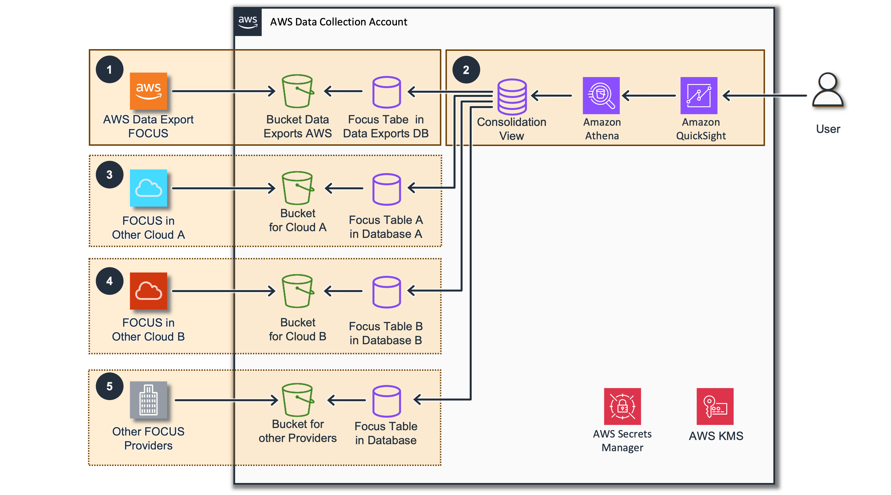
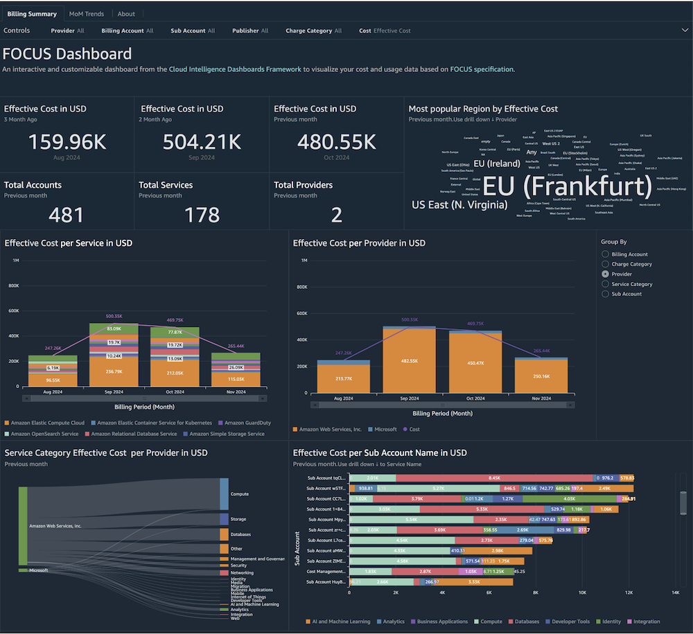
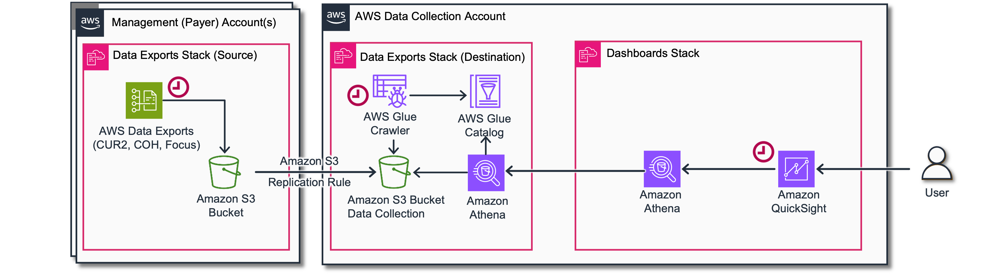
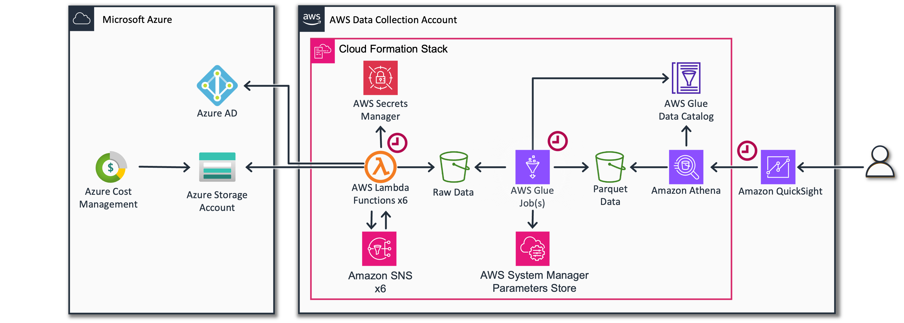
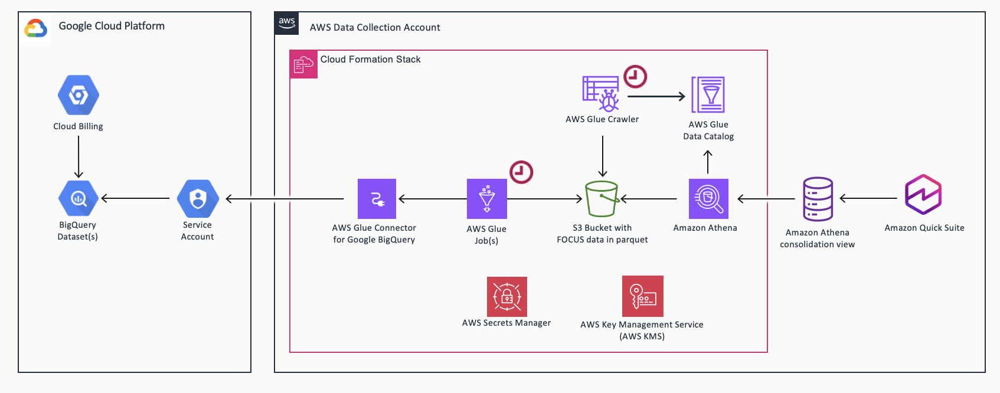
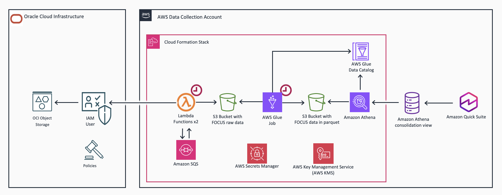

# FOCUS Dashboard

## Introduction

[The FinOps Cost and Usage Specification](https://focus.finops.org/ "https://focus.finops.org/")
(FOCUS) is an open-source specification that defines clear requirements
for cloud vendors to produce consistent cost and usage datasets.

Supported by the FinOps Foundation, FOCUS aims to reduce complexity for
FinOps Practitioners so they can drive data-driven decision-making and
maximize the business value of cloud, while making their skills more
transferable across clouds, tools, and organizations.

CID FOCUS Dashboard is an open source and customizable dashboard which
provides pre-defined visuals to get actionable insights from FOCUS data
in Amazon Quick Sight. It allows you to quickly get started with using
FOCUS in your organization. FOCUS Dashboard provides the following
features:

- Consolidated view for FOCUS data from multiple dimensions across entire organization
- Effective discounts rate calculations
- MoM trends with ability to drill down from high level visibility into resource level details in a matter of few clicks

## High Level Architecture



1. AWS Data Exports service provides FOCUS data. Use CID [Data Exports](data-exports.md "data-exports.md") stack to activate that in your Management (Payer) Account and automatically configure the replication to a Data Collection account.
2. Install [CID FOCUS Dashboards](#focus-dashboard-deployment "#focus-dashboard-deployment") that leverages FOCUS data and provides a placeholder consolidated view in Amazon Athena that can be extended once added new FOCUS data from other providers.
3. Install the FOCUS data collection stack(s) that collects the data from other data providers. Currently we provide integrations to collect FOCUS data from [Microsoft Azure](https://catalog.workshops.aws/cidforazure/en-US/03-setup "https://catalog.workshops.aws/cidforazure/en-US/03-setup"), [Google Cloud Platform](https://catalog.workshops.aws/cid-gcp-cost-dashboard/en-US/02-solution-design "https://catalog.workshops.aws/cid-gcp-cost-dashboard/en-US/02-solution-design") and [Oracle Cloud Infrastructure](https://github.com/awslabs/cid-oci-cost-dashboard/ "https://github.com/awslabs/cid-oci-cost-dashboard/")
   [see more](#focus-dashboard-add-focus-data-from-other-cloud-providers "#focus-dashboard-add-focus-data-from-other-cloud-providers"). Typically these stack are leveraging scheduled AWS Lambda or AWS Glue Jobs and retrieve data from API using credentials stored in AWS Secret Manager. Also The data in this case encrypted with custom KMS keys to protect sensitive billing information from any unauthorized access (including AWS).
4. Update [FOCUS Consolidation View](https://github.com/aws-solutions-library-samples/cloud-intelligence-dashboards-framework/blob/main/dashboards/focus/focus_consolidation_view/focus_consolidation_view.sql "https://github.com/aws-solutions-library-samples/cloud-intelligence-dashboards-framework/blob/main/dashboards/focus/focus_consolidation_view/focus_consolidation_view.sql") to include tables with FOCUS data from other cloud providers
5. You can also export cost data from OnPremises datacenters or SaaS providers in the same format and integrate them in similar way.

## Demo Dashboard

Get more familiar with Dashboard using the live, interactive demo
dashboard following this
[link](https://cid.workshops.aws.dev/demo?dashboard=focus-dashboard&sheet=default "https://cid.workshops.aws.dev/demo?dashboard=focus-dashboard&sheet=default")



## Prerequisites

Before installing FOCUS Dashboard you need to enable FOCUS Data
Export and consolidate it from your Management (Payer) Accounts in Data
Collection Account.



1. Create FOCUS Data Export following the steps in [Data Export](data-exports.md "data-exports.md") page and return to this page
   once completed.

## Deployment

CloudFormation

###### Note

**Prerequisite**: To install this dashboard using CloudFormation, you need to install Foundational Dashboards CFN with version v4.0.0 or above as described [here](deployment-in-global-regions.md#deployment-in-global-region-deploy-dashboard "deployment-in-global-regions.md#deployment-in-global-region-deploy-dashboard")

1. Log in to to your **Data Collection** Account.
2. Click the Launch Stack button below to open the **pre-populated stack template** in your CloudFormation.

[](https://console.aws.amazon.com/cloudformation/home#/stacks/create/review?templateURL=https://aws-managed-cost-intelligence-dashboards.s3.amazonaws.com/cfn/cid-plugin.yml&stackName=FOCUS-Dashboard&param_DashboardId=focus-dashboard&param_RequiresDataExports=yes "https://console.aws.amazon.com/cloudformation/home#/stacks/create/review?templateURL=https://aws-managed-cost-intelligence-dashboards.s3.amazonaws.com/cfn/cid-plugin.yml&stackName=FOCUS-Dashboard¶m_DashboardId=focus-dashboard¶m_RequiresDataExports=yes") 3. You can change **Stack name** for your template if you wish. 4. Leave **Parameters** values as it is. 5. Review the configuration and click **Create stack**. 6. You will see the stack will start in **CREATE_IN_PROGRESS**. Once complete, the stack will show **CREATE_COMPLETE** 7. You can check the stack output for dashboard URLs.

###### Note

**Troubleshooting:** If you see error "No export named cid-CidExecArn found" during stack deployment, make sure you have completed prerequisite steps.

Command Line
Alternative method to install dashboards is the [cid-cmd](https://github.com/aws-solutions-library-samples/cloud-intelligence-dashboards-framework/blob/main/CID-CMD.md#command-line-tool-cid-cmd "https://github.com/aws-solutions-library-samples/cloud-intelligence-dashboards-framework/blob/main/CID-CMD.md#command-line-tool-cid-cmd") tool.

1. Log in to to your **Data Collection** Account.
2. Open up a command-line interface with permissions to run API requests in your AWS account. We recommend to use [CloudShell](https://console.aws.amazon.com/cloudshell "https://console.aws.amazon.com/cloudshell").
3. In your command-line interface run the following command to download and install the CID CLI tool:

```
 pip3 install --upgrade cid-cmd
```

4. In your command-line interface run the following command to deploy the dashboard:

```
 cid-cmd deploy --dashboard-id focus-dashboard
```

Please follow the instructions from the deployment wizard. More info about command line options are in the
[Readme](https://github.com/aws-solutions-library-samples/cloud-intelligence-dashboards-framework/blob/main/CID-CMD.md#command-line-tool-cid-cmd "https://github.com/aws-solutions-library-samples/cloud-intelligence-dashboards-framework/blob/main/CID-CMD.md#command-line-tool-cid-cmd")
or `cid-cmd --help`.

###### Note

Please note that DataExport can take up to 24-48 hours to deliver the
first reports. If you just installed Data Exports, the dashboard will be
most likely empty. Please come back after 24 hours.

## Add FOCUS data from other cloud providers to FOCUS Dashboard

### Microsoft Azure



1. Deploy [FOCUS Dashboard](#focus-dashboard-deployment "#focus-dashboard-deployment")
2. Deploy [Cloud
   Intelligence Dashboard for Azure workshop](https://catalog.workshops.aws/cidforazure/en-US/03-setup "https://catalog.workshops.aws/cidforazure/en-US/03-setup") choosing FOCUS in
   [Export
   Type](https://catalog.workshops.aws/cidforazure/en-US/03_Setup/05_Parameters/#export-type "https://catalog.workshops.aws/cidforazure/en-US/03_Setup/05_Parameters/#export-type")
3. Integrate Azure data into [focus_consolidation_view](https://github.com/aws-solutions-library-samples/cloud-intelligence-dashboards-framework/tree/main/dashboards/focus/focus_consolidation_view "https://github.com/aws-solutions-library-samples/cloud-intelligence-dashboards-framework/tree/main/dashboards/focus/focus_consolidation_view") in Amazon Athena by
   following
   [these
   steps](https://catalog.workshops.aws/cidforazure/en-US/03-setup/04-dashboard-deployment/02-focus-export-dashboard#instructions "https://catalog.workshops.aws/cidforazure/en-US/03-setup/04-dashboard-deployment/02-focus-export-dashboard#instructions")

### GCP



1. Deploy [FOCUS Dashboard](#focus-dashboard-deployment "#focus-dashboard-deployment")
2. Deploy [GCP](https://catalog.workshops.aws/cid-gcp-cost-dashboard/en-US/02-solution-design "https://catalog.workshops.aws/cid-gcp-cost-dashboard/en-US/02-solution-design") workshop
3. Integrate data into [focus_consolidation_view](https://github.com/aws-solutions-library-samples/cloud-intelligence-dashboards-framework/tree/main/dashboards/focus/focus_consolidation_view "https://github.com/aws-solutions-library-samples/cloud-intelligence-dashboards-framework/tree/main/dashboards/focus/focus_consolidation_view") in Amazon Athena

### OCI



1. Deploy [FOCUS Dashboard](#focus-dashboard-deployment "#focus-dashboard-deployment")
2. Deploy [OCI](https://github.com/awslabs/cid-oci-cost-dashboard/ "https://github.com/awslabs/cid-oci-cost-dashboard/") workshop
3. Integrate data into [focus_consolidation_view](https://github.com/aws-solutions-library-samples/cloud-intelligence-dashboards-framework/tree/main/dashboards/focus/focus_consolidation_view "https://github.com/aws-solutions-library-samples/cloud-intelligence-dashboards-framework/tree/main/dashboards/focus/focus_consolidation_view") in Amazon Athena

## Update

Please note that dashboards are not updated with update of
CloudFormation Stack. When new version of the dashboard template is
released, you can update your dashboard by running the following command
in your command-line interface:

```
 cid-cmd update --dashboard-id focus-dashboard
```

## Authors

- Yuriy Prykhodko, Principal Technical Account Manager
- Iakov Gan, Senior Solution Architect
- Zach Erdman, Senior Product Manager
- Mo Mohoboob, Senior Specialist SA
- Marco De Bianchi, Sr. Delivery Consultant
- Soham Majumder, Technical Account Manager

## Contributors

- Petro Kashlikov, Senior Solutions Architect

## Feedback & Support

Follow [Feedback & Support](feedback-support.md "feedback-support.md") guide

## FAQ

### Can we replace CUR/CUDOS dashboard with FOCUS?

Unfortunately FOCUS Format does not include important information like [lineItem/Operation](../../../cur/latest/userguide/Lineitem-columns.md#Lineitem-details-O "../../../cur/latest/userguide/Lineitem-columns.md#Lineitem-details-O") that is critical for FinOps use cases. Until FOCUS specification extended to support that we cannot recommend FOCUS for Cost Optimization scenarios. Nevertheless FOCUS can be useful for a wide range high level reporting use cases.

### How we can add XXX FOCUS provider?

Feel free to contribute data export mechanisms for other FOCUS providers. We will be happy to review and reference them.

###### Note

These dashboards and their content: (a) are for informational
purposes only, (b) represent current AWS product offerings and
practices, which are subject to change without notice, and (c) does not
create any commitments or assurances from AWS and its affiliates,
suppliers or licensors. AWS content, products or services are provided
"as is" without warranties, representations, or conditions of any
kind, whether express or implied. The responsibilities and liabilities
of AWS to its customers are controlled by AWS agreements, and this
document is not part of, nor does it modify, any agreement between AWS
and its customers.
