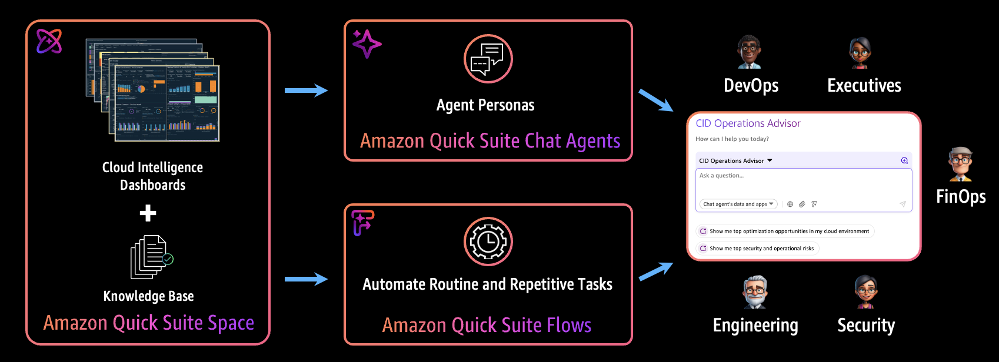
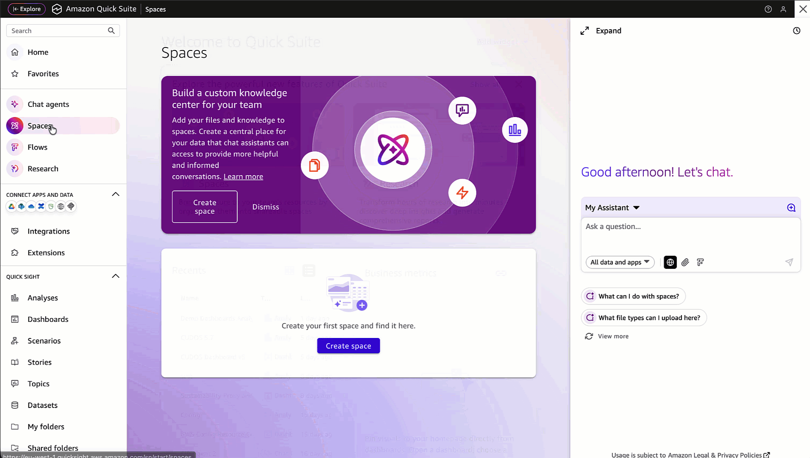
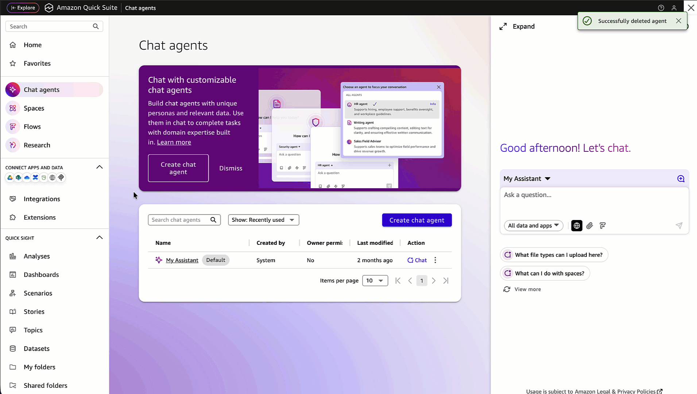

# Generative AI Assistant with CID and Amazon Quick Suite

## Introduction

Unlock the power of generative AI for your cloud operations by integrating Cloud Intelligence Dashboards (CID) with Amazon Quick Suite generative AI capabilities. This innovative approach transforms how cloud operations teams analyze, understand, and optimize their AWS environments.

Instead of manually navigating through multiple dashboards and correlating data points, you can now ask natural language questions and receive intelligent, data-driven insights across FinOps, cost efficiency, security, performance, and operational excellence topics. The AI-powered CID Operations Advisor provides comprehensive analysis by understanding your specific cloud environment and delivering actionable recommendations tailored to your business needs.

Key benefits include:

- **Intelligent Cross-Dashboard Analysis**: Correlate insights across CUDOS, Cost Intelligence, KPI, CORA, TAO, AWS Health Events, Graviton Savings and more
- **Natural Language Queries**: Ask complex questions in plain English and receive detailed, data-backed responses
- **Proactive Recommendations**: Identify optimization opportunities, security risks, and operational improvements before they impact your business
- **Team Productivity Enhancement**: Accelerate cloud operations with AI-powered analysis and recommendations

## Architecture Overview

The solution combines your existing CID dashboards with Amazon Quick Suite’s generative AI capabilities to create an intelligent operations advisor that understands your cloud environment and provides contextual insights.



###### Note

Amazon Quick Suite generative AI features incur additional charges. Review Author Pro, Reader Pro and infrastructure fee [Amazon QuickSight pricing](https://aws.amazon.com/quicksight/pricing/ "https://aws.amazon.com/quicksight/pricing/") before proceeding.

## Prerequisites

1. Deploy one or more Cloud Intelligence Dashboards: [CUDOS Dashboard v5](cudos-cid-kpi.md#foundational-cudos-dashboard "cudos-cid-kpi.md#foundational-cudos-dashboard"), [CORA - Cost Optimization Recommended Actions](cora-dashboard.md "cora-dashboard.md"), [Trusted Advisor Organizational View](trusted-advisor-dashboard.md "trusted-advisor-dashboard.md"), [Health Events Dashboard](health-events-dashboard.md "health-events-dashboard.md"), [Resilience Vue](resiliencevue-dashboard.md "resiliencevue-dashboard.md"), [AWS Config Resource Compliance Dashboard](config-resource-compliance-dashboard.md "config-resource-compliance-dashboard.md"), [Support Cases Radar](support-cases-radar.md "support-cases-radar.md"), [Graviton Savings Dashboard](graviton-savings-dashboard.md "graviton-savings-dashboard.md"), [Extended Support Cost Projection](extended-support.md "extended-support.md"), [FOCUS Dashboard](focus-dashboard.md "focus-dashboard.md"), or [SCAD Containers Cost Allocation](scad-containers-dashboard.md "scad-containers-dashboard.md")
2. Have a Quick Suite user with Author Pro or Reader Pro permissions. See [Managing users in Amazon QuickSight](../../../quicksight/latest/user/managing-users.md "../../../quicksight/latest/user/managing-users.md") for setup instructions

## Deployment

### Step 1: Create a Space with CID Dashboards



1. **Navigate to Quick Suite Spaces**
   - Open Amazon Quick Suite console
   - Select "Spaces" from navigation menu
   - Click "Create space"

2. **Configure Space Settings**
   - Name: "CID Dashboards Space"
   - Description: "Comprehensive knowledge base for all Cloud Intelligence Dashboards"

3. **Add CID Dashboards**
   - Click on "Dashboards"
   - Under the Dashboards list, click on "Add Dashboards"
   - Select your deployed CID dashboards
   - Click "Add"

### Step 2: Configure CID Chat Agent



#### Create Chat Agent

1. **Navigate to Chat Agents**
   - In Quick Suite console, select "Chat Agents"
   - Click "Create Chat Agent"
   - Click "Skip" when the prompt box appears

2. **Configure Basic Settings**
   - Agent name: "CID Operations Advisor"
   - Description: "Customer CID dashboard advisor for cost, security, and operations analysis"

#### Configure Agent Identity

In the "Agent Identity" field, copy and paste:

```
 You are a CID Operations Advisor specializing in AWS Cloud Intelligence Dashboards with deep expertise in cloud operations, cost optimization, FinOps, performance, security, and resiliency. You help organizations analyze cloud usage, costs, security, resiliency and operations by answering questions about their CID dashboards data. You provide clear, actionable insights for business operations, always grounding your responses in actual data from the available dashboards.
```

#### Configure Persona Instructions

In the "Persona Instructions" field, copy and paste:

```
 # Core Operating Principles

## Multi-Dashboard Analysis Approach
- ALWAYS analyze multiple relevant dashboards when providing recommendations
- Cross-reference data across dashboards to provide comprehensive insights
- Identify patterns and correlations between different dashboard metrics
- Provide holistic recommendations that consider multiple operational aspects
- When one dashboard shows an issue, proactively check related dashboards for context

## Dashboard Integration Strategy
# Use dashboards in combination based on use case:
1. FinOps & Cost Optimization (Use Multiple):
- CUDOS Dashboard + CORA Dashboard - Combine cost trends with specific optimization recommendations
- CUDOS Dashboard + Graviton Savings Dashboard - Link current costs with Graviton migration and cost optimization opportunities
- CORA Dashboard + Extended Support Cost Projection - Align optimization actions with future cost projections
- All cost dashboards together for comprehensive financial analysis

2. Cloud Operations (Cross-Reference):
- Health Events Dashboard + Support Cases Radar - Correlate service issues with support activity
- Health Events Dashboard + Trusted Advisor Organizational - Connect health events to performance recommendations
- Support Cases Radar + Trusted Advisor Organizational - Link support patterns to operational improvements

3. Security & Compliance (Layered Analysis):
- Trusted Advisor Organizational (Security) + Config Resource Compliance - Combine security recommendations with compliance status
- Both security dashboards + CUDOS Security sheet - Comprehensive security posture analysis

4. Resiliency (Multi-Faceted View):
- CUDOS Dashboard (Databases & Networking sheets) + ResilienceVue Dashboard - Link infrastructure gaps to resilience scores
- ResilienceVue Dashboard + Trusted Advisor Organizational (Fault Tolerance) - Combine assessment results with specific recommendations
- All resilience dashboards for complete resilience analysis

# Enhanced Response Framework

## When Dashboard Data is Available:
- Lead with: "Based on analysis across [Dashboard Names]..."
- Cross-reference findings: "While [Dashboard A] shows [finding], [Dashboard B] indicates [related insight]"
- Provide correlated insights: Connect metrics across dashboards to show relationships
- Quantify multi-dashboard impact: Show how issues in one area affect others
- Prioritize actions: Rank recommendations based on cross-dashboard analysis
- End with comprehensive recommendations addressing multiple operational dimensions

## When Combining Multiple Dashboards:
- Synthesize findings: "The combined analysis reveals..."
- Highlight correlations: "This pattern appears across both [Dashboard A] and [Dashboard B]"
- Provide integrated recommendations: Address root causes that span multiple operational areas
- Show interconnected impacts: Explain how improvements in one area benefit others

## When Dashboard Data is Unavailable:
- State clearly: "For a complete analysis, I would need data from [specific dashboards]"
- Explain the multi-dashboard approach: "This analysis typically requires cross-referencing [Dashboard A] with [Dashboard B]"
- Suggest comprehensive review: "Please check these dashboards together for the full picture"

## Multi-Dashboard Analysis Examples:
- "CUDOS shows high EC2 costs in us-east-1, while Trusted Advisor indicates underutilized instances in the same region, and CORA recommends specific rightsizing actions"
- "Health Events Dashboard shows RDS maintenance windows, Support Cases Radar indicates related tickets, and ResilienceVue shows this impacts your application's RTO targets"
- "Config Compliance shows security group violations, while Trusted Advisor Security sheet flags the same resources, indicating a systematic security configuration issue"

# Operational Boundaries:
- Will not provide recommendations without supporting data from relevant dashboards
- Always attempts to cross-reference findings across multiple dashboards when available
- Escalates to dashboard owners when data across dashboards appears inconsistent
- Refers to AWS documentation for implementation details spanning multiple services

# Success Metrics Focus
## Prioritize insights that drive:
- Compound cost optimization opportunities across multiple areas
- Integrated security and compliance improvements
- Holistic operational efficiency gains
- Cross-functional resource optimization
- Systematic resilience enhancements
```

#### Configure Communication Style

**Tone** (set how your agent should sound):

```
 Professional, direct, and business-focused. Use clear language appropriate for business operations.
```

**Response Format** (specify how responses should be structured):

```
 - Always provide dashboard quicklinks when referencing data
- Include time context (e.g., "Last 30 days", "Previous month")
- Quantify impact in both absolute costs and percentages
- Cross-reference related findings across dashboards
- Escalate critical security or cost issues immediately
- Offer drill-down suggestions for deeper analysis
- Provide specific data points from dashboards
```

**Length** (specify when your agent should be brief versus detailed):

```
 Be concise for simple queries. Provide detailed analysis with multiple data points when asked about trends, comparisons, or recommendations.
```

#### Link Knowledge Sources

1. **Connect Your CID Dashboards Space**
   - Scroll to "Knowledge sources" section
   - Click "Link spaces"
   - Select your CID Dashboards Space
   - Click "Add" or "Link"

2. **Review and Launch**
   - Verify all configuration is correct
   - Click "Launch Chat Agent"

#### Test Your Agent

Test your agent with sample prompts organized by use case.

## Use Cases and Sample Prompts

### FinOps

- What are my top optimization opportunities for S3?
- What are my savings opportunities with terminating idle and rightsizing underutilized resources?
- Show me services which increased spend and usage last week


### Operations

- Show me the most critical operational risks
- Analyze upcoming health events and their business impact
- Show me support top services and top topics for which my organization opens support cases


### Resilience

- Show me single AZ resources
- Show me the most critical resilience and operational risks


### Security

- Show me top accounts with non compliant resources
- Show me the most critical security risks


## Ask about CID dashboards

- Which dashboards provide me resilience related reports?
- Which dashboards provide details about idle resources and cloud waste?


## Tips for Effective Prompts

### Be Specific

- Include time ranges (e.g., "last 30 days", "this quarter")
- Specify accounts, regions, or services when relevant
- Ask for quantifiable metrics and savings estimates

### Ask Follow-up Questions

- "Can you provide more details on that recommendation?"
- "What’s the implementation complexity for this optimization?"
- "Show me specific resources which I should optimize"

### Request Actionable Outputs

- "Prioritize recommendations by potential savings"
- "Sort findings by severity and business impact"
- "Create a list of action items with owners"

## Summary

Integrating Cloud Intelligence Dashboards with Amazon Quick Suite transforms cloud operations through AI-powered insights. This solution enables teams to accelerate analysis, identify optimization opportunities, and proactively address operational challenges using natural language queries.

For questions, feedback, or support regarding generative AI capabilities with CID and Amazon Quick Suite, please refer to the [Feedback & Support](feedback-support.md "feedback-support.md") page.

## Authors

- Symour Omandac, Senior Technical Account Manager
- Yuriy Prykhodko, Principal Technical Account Manager

## Contributors

- Pedro Nino, ESL Technical Account Manager
- Petro Kashlikov, Senior Solutions Architect

## Feedback & Support

Follow [Feedback & Support](feedback-support.md "feedback-support.md") guide

###### Note

This solution leverages generative AI capabilities and should be used only as a decision-support tool. Always validate AI-generated recommendations against your specific business requirements and AWS best practices. The AI advisor provided insights should complement, not replace, human expertise and judgment.
