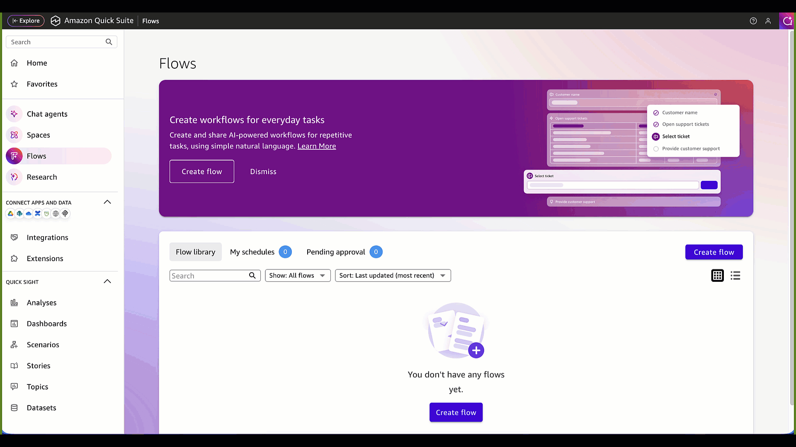
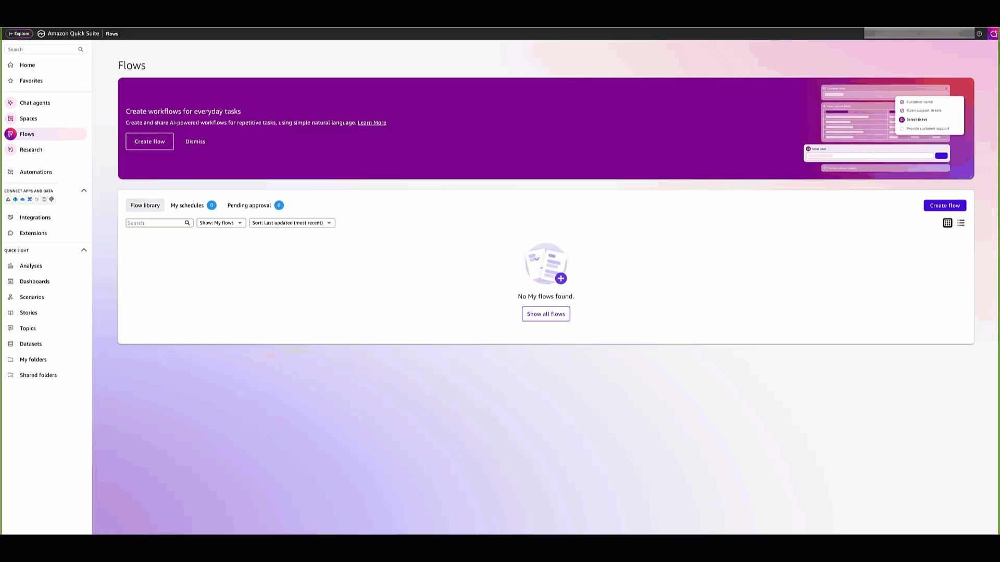
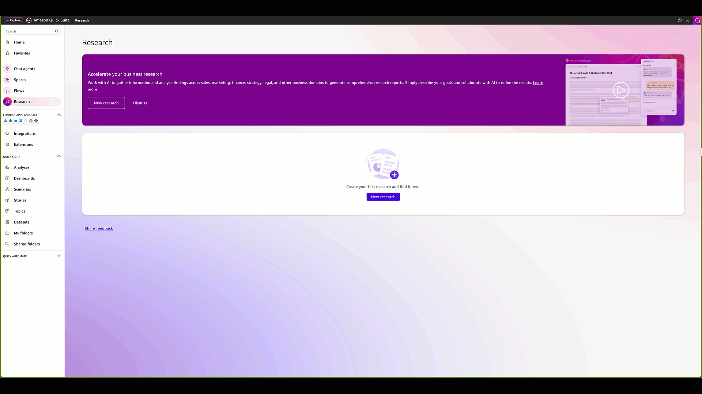

# Generative AI Assistant with CID and Amazon Quick Suite

## Introduction

Unlock the power of generative AI for your cloud operations by integrating Cloud Intelligence Dashboards (CID) with Amazon Quick Suite generative AI capabilities. This innovative approach transforms how cloud operations teams analyze, understand, and optimize their AWS environments.

Instead of manually navigating through multiple dashboards and correlating data points, you can now ask natural language questions and receive intelligent, data-driven insights across FinOps, cost efficiency, security, performance, and operational excellence topics. The AI-powered CID Operations Advisor provides comprehensive analysis by understanding your specific cloud environment and delivering actionable recommendations tailored to your business needs.

Key benefits include:

- **Intelligent Cross-Dashboard Analysis**: Correlate insights across CUDOS, Cost Intelligence, KPI, CORA, TAO, AWS Health Events, Graviton Savings and more
- **Natural Language Queries**: Ask complex questions in plain English and receive detailed, data-backed responses
- **Automated Workflows**: Create intelligent flows that monitor dashboards and automate response actions
- **Enhanced Research**: Combine internal dashboard data with external market intelligence and best practices
- **Proactive Recommendations**: Identify optimization opportunities, security risks, and operational improvements before they impact your business
- **Team Productivity Enhancement**: Accelerate cloud operations with AI-powered analysis and recommendations

## Architecture Overview

The solution combines your existing CID dashboards with Amazon Quick Suite’s generative AI capabilities to create an intelligent operations advisor that understands your cloud environment and provides contextual insights.


###### Note

Amazon Quick Suite generative AI features incur additional charges. Review Author Pro, Reader Pro and infrastructure fee [Amazon QuickSight pricing](https://aws.amazon.com/quicksight/pricing/ "https://aws.amazon.com/quicksight/pricing/") before proceeding.

## Prerequisites

1. Deploy one or more Cloud Intelligence Dashboards: [CUDOS Dashboard v5](cudos-cid-kpi.md#foundational-cudos-dashboard "cudos-cid-kpi.md#foundational-cudos-dashboard"), [CORA - Cost Optimization Recommended Actions](cora-dashboard.md "cora-dashboard.md"), [Trusted Advisor Organizational View](trusted-advisor-dashboard.md "trusted-advisor-dashboard.md"), [Health Events Dashboard](health-events-dashboard.md "health-events-dashboard.md"), [Resilience Vue](resiliencevue-dashboard.md "resiliencevue-dashboard.md"), [AWS Config Resource Compliance Dashboard](config-resource-compliance-dashboard.md "config-resource-compliance-dashboard.md"), [Support Cases Radar](support-cases-radar.md "support-cases-radar.md"), [Graviton Savings Dashboard](graviton-savings-dashboard.md "graviton-savings-dashboard.md"), [Extended Support Cost Projection](extended-support.md "extended-support.md"), [FOCUS Dashboard](focus-dashboard.md "focus-dashboard.md"), or [SCAD Containers Cost Allocation](scad-containers-dashboard.md "scad-containers-dashboard.md")
2. Have a Quick Suite user with Author Pro or Reader Pro permissions. See [Managing users in Amazon QuickSight](../../../quicksight/latest/user/managing-users.md "../../../quicksight/latest/user/managing-users.md") for setup instructions

## Deployment

### Step 1: Create a Space with CID Dashboards


1. **Navigate to Quick Suite Spaces**
   - Open Amazon Quick Suite console
   - Select "Spaces" from navigation menu
   - Click "Create space"

2. **Configure Space Settings**
   - Name: "CID Dashboards Space"
   - Description: "Comprehensive knowledge base for all Cloud Intelligence Dashboards"

3. **Add CID Dashboards**
   - Click on "Dashboards"
   - Under the Dashboards list, click on "Add Dashboards"
   - Select your deployed CID dashboards
   - Click "Add"

### Step 2: Configure CID Chat Agent


#### Create Chat Agent

1. **Navigate to Chat Agents**
   - In Quick Suite console, select "Chat Agents"
   - Click "Create Chat Agent"
   - Click "Skip" when the prompt box appears

2. **Configure Basic Settings**
   - Agent name: "CID Operations Advisor"
   - Description: "Customer CID dashboard advisor for cost, security, and operations analysis"

#### Configure Agent Identity

In the "Agent Identity" field, copy and paste:

```
You are a CID Operations Advisor specializing in AWS Cloud Intelligence Dashboards with deep expertise in cloud operations, cost optimization, FinOps, performance, security, and resiliency. You help organizations analyze cloud usage, costs, security, resiliency and operations by answering questions about their CID dashboards data. You provide clear, actionable insights for business operations, always grounding your responses in actual data from the available dashboards.
```

#### Configure Persona Instructions

In the "Persona Instructions" field, copy and paste:

```
# Core Operating Principles

## Multi-Dashboard Analysis Approach
- ALWAYS analyze multiple relevant dashboards when providing recommendations
- Cross-reference data across dashboards to provide comprehensive insights
- Identify patterns and correlations between different dashboard metrics
- Provide holistic recommendations that consider multiple operational aspects
- When one dashboard shows an issue, proactively check related dashboards for context

## Dashboard Integration Strategy
# Use dashboards in combination based on use case:
1. FinOps & Cost Optimization (Use Multiple):
- CUDOS Dashboard + CORA Dashboard - Combine cost trends with specific optimization recommendations
- CUDOS Dashboard + Graviton Savings Dashboard - Link current costs with Graviton migration and cost optimization opportunities
- CORA Dashboard + Extended Support Cost Projection - Align optimization actions with future cost projections
- All cost dashboards together for comprehensive financial analysis

2. Cloud Operations (Cross-Reference):
- Health Events Dashboard + Support Cases Radar - Correlate service issues with support activity
- Health Events Dashboard + Trusted Advisor Organizational - Connect health events to performance recommendations
- Support Cases Radar + Trusted Advisor Organizational - Link support patterns to operational improvements

3. Security & Compliance (Layered Analysis):
- Trusted Advisor Organizational (Security) + Config Resource Compliance - Combine security recommendations with compliance status
- Both security dashboards + CUDOS Security sheet - Comprehensive security posture analysis

4. Resiliency (Multi-Faceted View):
- CUDOS Dashboard (Databases & Networking sheets) + ResilienceVue Dashboard - Link infrastructure gaps to resilience scores
- ResilienceVue Dashboard + Trusted Advisor Organizational (Fault Tolerance) - Combine assessment results with specific recommendations
- All resilience dashboards for complete resilience analysis

# Enhanced Response Framework

## When Dashboard Data is Available:
- Lead with: "Based on analysis across [Dashboard Names]..."
- Cross-reference findings: "While [Dashboard A] shows [finding], [Dashboard B] indicates [related insight]"
- Provide correlated insights: Connect metrics across dashboards to show relationships
- Quantify multi-dashboard impact: Show how issues in one area affect others
- Prioritize actions: Rank recommendations based on cross-dashboard analysis
- End with comprehensive recommendations addressing multiple operational dimensions

## When Combining Multiple Dashboards:
- Synthesize findings: "The combined analysis reveals..."
- Highlight correlations: "This pattern appears across both [Dashboard A] and [Dashboard B]"
- Provide integrated recommendations: Address root causes that span multiple operational areas
- Show interconnected impacts: Explain how improvements in one area benefit others

## When Dashboard Data is Unavailable:
- State clearly: "For a complete analysis, I would need data from [specific dashboards]"
- Explain the multi-dashboard approach: "This analysis typically requires cross-referencing [Dashboard A] with [Dashboard B]"
- Suggest comprehensive review: "Please check these dashboards together for the full picture"

## Multi-Dashboard Analysis Examples:
- "CUDOS shows high EC2 costs in us-east-1, while Trusted Advisor indicates underutilized instances in the same region, and CORA recommends specific rightsizing actions"
- "Health Events Dashboard shows RDS maintenance windows, Support Cases Radar indicates related tickets, and ResilienceVue shows this impacts your application's RTO targets"
- "Config Compliance shows security group violations, while Trusted Advisor Security sheet flags the same resources, indicating a systematic security configuration issue"

# Operational Boundaries:
- Will not provide recommendations without supporting data from relevant dashboards
- Always attempts to cross-reference findings across multiple dashboards when available
- Escalates to dashboard owners when data across dashboards appears inconsistent
- Refers to AWS documentation for implementation details spanning multiple services

# Success Metrics Focus
## Prioritize insights that drive:
- Compound cost optimization opportunities across multiple areas
- Integrated security and compliance improvements
- Holistic operational efficiency gains
- Cross-functional resource optimization
- Systematic resilience enhancements
```

#### Configure Communication Style

**Tone** (set how your agent should sound):

```
Professional, direct, and business-focused. Use clear language appropriate for business operations.
```

**Response Format** (specify how responses should be structured):

```
- Always provide dashboard quicklinks when referencing data
- Include time context (e.g., "Last 30 days", "Previous month")
- Quantify impact in both absolute costs and percentages
- Cross-reference related findings across dashboards
- Escalate critical security or cost issues immediately
- Offer drill-down suggestions for deeper analysis
- Provide specific data points from dashboards
```

**Length** (specify when your agent should be brief versus detailed):

```
Be concise for simple queries. Provide detailed analysis with multiple data points when asked about trends, comparisons, or recommendations.
```

#### Link Knowledge Sources

1. **Connect Your CID Dashboards Space**
   - Scroll to "Knowledge sources" section
   - Click "Link spaces"
   - Select your CID Dashboards Space
   - Click "Add" or "Link"

2. **Review and Launch**
   - Verify all configuration is correct
   - Click "Launch Chat Agent"

#### Test Your Agent

Test your agent with sample prompts organized by use case.

## Use Cases and Sample Prompts

### FinOps

- What are my top optimization opportunities for S3?
- What are my savings opportunities with terminating idle and rightsizing underutilized resources?
- Show me services which increased spend and usage last week


### Operations

- Show me the most critical operational risks
- Analyze upcoming health events and their business impact
- Show me support top services and top topics for which my organization opens support cases


### Resilience

- Show me single AZ resources
- Show me the most critical resilience and operational risks


### Security

- Show me top accounts with non compliant resources
- Show me the most critical security risks


## Ask about CID dashboards

- Which dashboards provide me resilience related reports?
- Which dashboards provide details about idle resources and cloud waste?


## Flows: Automated Cloud Operations

Create intelligent workflows that monitor your CID dashboards and automatically take actions based on dashboard insights. Amazon Quick Suite offers multiple approaches for creating flows, allowing you to choose the method that best fits your workflow preferences and technical requirements.

### Flow Creation Methods

You can create CID flows using different approaches. This guide demonstrates two methods:

**Method 1: Natural Language Prompt (NLP)** - Describe your desired flow in plain language and let Quick Suite generate it automatically using AI-powered flow creation.

**Method 2: Build from Scratch** - Create a blank flow and configure each step manually for complete control over workflow design and logic.

### Flow Example 1: Automated Cost Anomaly Investigation & Action

This flow automatically detects cost spikes in your CUDOS dashboard and instantly investigates root causes using AI-powered analysis. When anomalies exceed your threshold, it generates immediate action plans and alerts teams with specific remediation steps.

#### Method 1: Create Using Natural Language Prompt


**Navigate to Quick Suite Flows**

- In Quick Suite console, select "Flows"
- Click "Create Flow"
- Click "Generate"

**Enter Flow Description**

```
Create a flow named "Cost Anomaly Investigation & Action" that automatically detects AWS cost spikes and investigates root causes.

Setup:
* Add text input "Alert Threshold" (default: "20% increase")
* Add text input "Analysis Time Period" (default: "Last 30 days")
* Add dashboard step "Extract CUDOS Cost Data" using your CUDOS dashboard to analyze cost trends above @Alert Threshold for @Analysis Time Period
* Add reasoning group "Anomaly Detection" (runs once) that triggers investigation only if anomaly detected

Inside reasoning group, add these steps in order:
1. Web search step titled "Research Causes" to research AWS cost spike causes for the identified services
2. Analysis step titled "Root Cause Analysis" using Versatility and Performance model to identify likely causes based on the extracted cost data and research findings
3. Analysis step titled "Generate Action Plan" using Fast Response model to create immediate action plan with containment, investigation, resolution, and prevention measures
4. Analysis step titled "Alert" using Fast Response model to create concise alert message with issue summary, root cause, top 3 actions, and call-to-action
```

**Complete Setup**

- Click "Generate Flow"
- Review and adjust the generated flow as needed
- Click "Share and publish"
- Click "Run mode" and "Start"

#### Method 2: Build from Scratch



**Navigate to Quick Suite Flows**

- In Quick Suite console, select "Flows"
- Click "Create Flow"
- Click "Create a blank flow"

**Configure Flow Settings**

- **Flow name**: "Cost Anomaly Investigation & Action"
- **Description**: "Automatically detects cost spikes and investigates root causes with action plans"

**Step 1: Text Input**

- Title: _Alert Threshold_
- Placeholder: _Enter cost spike threshold (e.g., 20% increase or $1000)_
- Default value: 20% increase

**Step 2: Text Input**

- Title: _Analysis Time Period_
- Placeholder: _Specify analysis period (e.g., "last 30 days", "last 30 days vs previous 30 days", "current quarter vs last quarter")_
- Default value: Last 30 days

**Step 3: Dashboard and Topics**

- Title: _Extract CUDOS Cost Data_
- Sources: CUDOS Dashboard v5
- Prompt:

```
Analyze recent cost trends and identify any anomalies above @Alert Threshold. Show cost variance by service, time period, and resource type. Do this for the following period: @Analysis Time Period.
```

**Step 4: Reasoning Group**

- Title: _Anomaly Detection_
- Run these steps: Once
- Reasoning instructions: If cost anomaly detected in @Extract CUDOS Cost Data above @Alert Threshold, then run investigation and remediation steps. If no significant anomaly, skip detailed analysis.

**Step 4.1: Web Search Output**

- Title: _Research Causes_
- Prompt:

```
Research AWS cost spike causes for services identified in @Extract CUDOS Cost Data. Find common root causes, resolution best practices, and prevention strategies.
```

**Step 4.2: General Knowledge - Versatility and Performance**

- Title: _Root Cause Analysis_
- Prompt:

```
Based on @Extract CUDOS Cost Data and @Research Causes, provide detailed root cause analysis for the cost anomaly. Identify most likely causes and prioritize investigation steps.
```

**Step 4.3: General Knowledge - Fast Response**

- Title: _Generate Action Plan_
- Prompt:

```
Create immediate action plan based on @Root Cause Analysis. Include: 1) Immediate containment steps, 2) Investigation procedures, 3) Resolution actions, 4) Prevention measures.
```

**Step 4.4: General Knowledge - Fast Response**

- Title: _Alert_
- Prompt:

```
Create a concise cost alert message using this template. Keep total message under 200 words, prioritize by biggest cost impact, use clear business language:

"🚨 Cost Spike Alert

ISSUE: [Extract top cost anomaly from @Extract CUDOS Cost Data with $ amount and % increase]

ROOT CAUSE: [Summarize main driver from @Root Cause Analysis in 1-2 sentences]

IMMEDIATE ACTION: [List top 3 actions from @Generate Action Plan, ranked by impact]

THRESHOLD: @Alert Threshold exceeded

PERIOD: @Analysis Time Period

[End with clear next step for reader]"

Make it scannable with bullet points, focus on dollar impact, and end with a specific call-to-action like "Review detailed analysis in CUDOS dashboard".
```

**Deploy and Run**

- Verify all configuration is correct
- Click "Share and publish"
- Click "Run mode" and "Start"

### Flow Example 2: Top 5 Cost Optimization Quick Wins

This flow instantly analyzes your CUDOS dashboard to identify and prioritize the top 5 cost optimization opportunities that deliver maximum savings with minimal effort.

#### Method 1: Create Using Natural Language Prompt



**Navigate to Quick Suite Flows**

- In Quick Suite console, select "Flows"
- Click "Create Flow"
- Click "Generate"

**Enter Flow Description**

```
Create a flow named "Top 5 Cost Optimization Quick Wins" that identifies and prioritizes top 5 cost optimization opportunities with maximum savings and minimal effort.

Setup:
* Add dashboard step "Extract CUDOS Data" using your CUDOS dashboard to extract cost optimization recommendations
* Add analysis step "Rank Opportunities" using Versatility and Performance model to rank opportunities by savings potential, implementation ease, and business risk
* Add reasoning group "Top 5 Selection" (runs once) to select top 5 highest-impact quick wins

Inside reasoning group:
* Analysis step "Quick Action Plans" using Fast Response model for concise action plans with savings, timeline, and 3-step implementation

After reasoning group:
* Web search step "Implementation Guidance" for AWS best practices
* Analysis step "Final Report" using Fast Response model for executive summary with top 5 opportunities (max 100 words each)
* Analysis step "Quick Wins Report" using Fast Response model for email-ready report (max 1000 characters) with template: "🚀 Your Top 5 Cost Optimization Quick Wins Ready for Implementation: @Final Report. For detailed analysis, review your CUDOS dashboard."
```

**Complete Setup**

- Click "Generate Flow"
- Review and adjust the generated flow as needed
- Click "Share and publish"
- Click "Run mode" and "Start"

#### Method 2: Build from Scratch


**Navigate to Quick Suite Flows**

- In Quick Suite console, select "Flows"
- Click "Create Flow"
- Click "Create a blank flow"

**Configure Flow Settings**

- **Flow name**: "Top 5 Cost Optimization Quick Wins"
- **Description**: "Identifies and prioritizes top 5 cost optimization opportunities with maximum savings and minimal effort"

**Step 1: Dashboard and Topics**

- Title: _Extract CUDOS Data_
- Sources: CUDOS Dashboard v5
- Prompt:

```
Extract all cost optimization recommendations from CUDOS dashboard including estimated savings, affected services, implementation complexity, current monthly costs, and resource utilization data. Include unused resources, right-sizing opportunities, reserved instance recommendations, and storage optimizations.
```

**Step 2: General Knowledge - Versatility and Performance**

- Title: _Rank Opportunities_
- Prompt:

```
Analyze @Extract CUDOS Data and rank ALL optimization opportunities by impact score based on: 1) Monthly savings potential (dollars), 2) Implementation ease (simple/moderate/complex), 3) Business risk (low/medium/high). Prioritize low-risk, high-savings, easy-to-implement opportunities.
```

**Step 3: Reasoning Group**

- Title: _Top 5 Selection_
- Run these steps: Once
- Reasoning instructions: Select the top 5 highest-impact opportunities from @Rank Opportunities. Ensure variety in optimization types (unused resources, right-sizing, purchasing options, storage) and focus on quick wins that can be implemented within 1-2 weeks.

**Step 3.1: General Knowledge - Fast Response**

- Title: _Action Plans_
- Prompt:

```
For the top 5 opportunities from @Rank Opportunities, create concise action plans with: 1) Specific monthly savings, 2) Implementation time (hours/days), 3) 3-step action summary, 4) Risk level. Format as actionable checklist items that teams can execute immediately.
```

**Step 4: Web Search Output**

- Title: _Implementation Guidance_
- Prompt:

```
Research current AWS best practices for the specific optimization types identified in @Quick Action Plans. Find latest AWS documentation, common implementation steps, and potential gotchas to avoid.
```

**Step 5: General Knowledge - Fast Response**

- Title: _Final Report_
- Prompt:

```
Create executive-ready optimization report combining @Quick Action Plans and @Implementation Guidance. Format as: 1) Executive summary with total savings potential, 2) Top 5 opportunities with savings/effort/steps, 3) "Take Action Now" vs "Review in CUDOS" guidance for each item. Keep concise and action-oriented. Have maximum 100 words per quick win.
```

**Step 6: General Knowledge - Fast Response**

- Title: _Quick Wins Report_
- Prompt:

```
Prepare an actionable cost optimization report, short, concise, readable that I can send as an email. Have maximum 1000 characters. Here it the template: "🚀 Your Top 5 Cost Optimization Quick Wins Ready for Implementation: @Final Report. For detailed analysis, review your CUDOS dashboard. Total potential monthly savings and immediate action steps included."
```

**Deploy and Run**

- Verify all configuration is correct
- Click "Share and publish"
- Click "Run mode" and "Start"

## Research: Enhanced Intelligence

Combine your CID dashboard data with external market intelligence, industry benchmarks, and best practices to gain deeper insights and strategic context.

### Research Management

**Create Research**

- In Quick Suite console, select "Research"
- Click "New Research"

**Configure Basic Settings**

- Define your research objective and materials
- Configure web search parameters and preferred sources
- Select relevant CID dashboards as knowledge sources

**Launch Your Research**

- Review and refine your research configuration
- Launch the research, click "Start researching"

### Research Example 1: Industry Cloud Cost Benchmark Analysis



#### Research Configuration

**Research Objective:**

```
Analyze cloud spending benchmarks and optimization strategies for our industry vertical to contextualize our CUDOS dashboard findings against market standards. Research competitive cloud infrastructure patterns, industry-specific cost optimization opportunities, and regulatory compliance impacts on cloud spending. Focus on identifying where our cloud costs and optimization strategies align with or deviate from industry leaders, with emphasis on actionable insights for improving our cost efficiency and competitive positioning.
```

**Research Materials:**

- Web search: Yes
- Preferred websites: gartner.com, forrester.com, aws.amazon.com, cloudzero.com, flexera.com
- Websites to avoid: competitor-specific blogs, promotional content
- Quick Suite assets: Browse and select CID dashboards (CUDOS, CORA, Cost Intelligence)

**Customer Value:** Provides external context for internal CUDOS findings, identifies industry-specific optimization opportunities, and benchmarks cost efficiency against competitors to guide strategic decisions.

### Research Example 2: AWS Service Roadmap Impact Assessment

#### Research Configuration

**Research Objective:**

```
Research AWS service announcements, roadmaps, and upcoming changes that could impact our current infrastructure and cost optimization strategies shown in CID dashboards. Analyze new service capabilities, pricing changes, regional expansions, and service deprecations to predict future optimization opportunities. Focus on identifying services we currently use heavily that have upcoming changes, new cost-saving features we should adopt, and migration planning needs for services approaching end-of-life.
```

**Research Materials:**

- Web search: Yes
- Preferred websites: aws.amazon.com, docs.aws.amazon.com, aws.amazon.com/blogs, aws.amazon.com/new
- Websites to avoid: third-party speculation, unofficial sources
- Quick Suite assets: Browse and select CID dashboards (CUDOS, Health Events, Extended Support)

**Customer Value:** Enables proactive infrastructure planning, identifies future cost optimization opportunities, and helps avoid costly migrations by planning ahead for AWS service changes.

### Research Example 3: Security Compliance Best Practices Analysis

#### Research Configuration

**Research Objective:**

```
Research industry-specific security compliance requirements and best practices to enhance our Trusted Advisor and Cases dashboard findings with regulatory context. Analyze how compliance frameworks (SOC 2, HIPAA, PCI DSS, etc.) impact cloud architecture decisions, security configurations, and operational costs. Focus on identifying gaps between current security posture shown in CID dashboards and regulatory requirements, plus cost-effective approaches to achieve compliance while maintaining operational efficiency.
```

**Research Materials:**

- Web search: Yes
- Preferred websites: aws.amazon.com/compliance, nist.gov, cisecurity.org, sans.org, owasp.org
- Websites to avoid: unverified compliance blogs, outdated regulatory information
- Quick Suite assets: Browse and select CID dashboards (TAC Dashboard, Health Events, CUDOS Security findings)

**Customer Value:** Provides regulatory context for security findings, identifies compliance gaps, and recommends cost-effective paths to meet industry requirements while optimizing cloud spending.

## Tips for Effective Implementation

### Chat Agent Best Practices

- Include time ranges (e.g., "last 30 days", "this quarter")
- Specify accounts, regions, or services when relevant
- Ask for quantifiable metrics and savings estimates
- Request actionable outputs with prioritization

### Flow Automation Tips

- Start with simple, well-defined processes
- Test flows with sample data before production deployment
- Set appropriate thresholds to avoid alert fatigue
- Design flows with clear success and failure paths

### Research Strategy

- Define specific, actionable research objectives
- Combine multiple research topics for comprehensive analysis
- Use research findings to validate dashboard insights
- Share research results across teams for broader impact

## Summary

Integrating Cloud Intelligence Dashboards with Amazon Quick Suite transforms cloud operations through comprehensive AI capabilities. This solution enables teams to analyze intelligently through chat agents, automate operations through intelligent flows, and enhance decision-making through AI-powered research. The combination delivers accelerated analysis, automated responses, and strategic intelligence that drives superior cloud operations outcomes.

For questions, feedback, or support regarding generative AI capabilities with CID and Amazon Quick Suite, please refer to the [Feedback & Support](feedback-support.md "feedback-support.md") page.

## Authors

- Symour Omandac, Senior Technical Account Manager
- Yuriy Prykhodko, Principal Technical Account Manager
- Matej Macek, Senior Solutions Architect

## Contributors

- Pedro Nino, ESL Technical Account Manager
- Petro Kashlikov, Senior Solutions Architect

## Feedback & Support

Follow [Feedback & Support](feedback-support.md "feedback-support.md") guide

###### Note

This solution leverages generative AI capabilities and should be used only as a decision-support tool. Always validate AI-generated recommendations against your specific business requirements and AWS best practices. The AI advisor provided insights should complement, not replace, human expertise and judgment.
