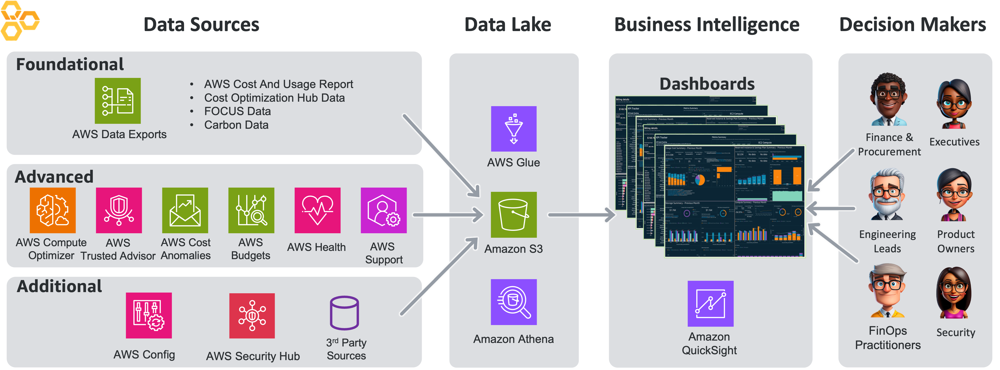

# Cloud Intelligence Dashboards Framework

## Introduction

Cloud Intelligence Dashboards is an open-source framework from [AWS Enterprise Support](https://aws.amazon.com/premiumsupport/plans/enterprise/ "https://aws.amazon.com/premiumsupport/plans/enterprise/") lovingly maintained by AWS experts that provides customers with comprehensive insights into their cloud cost, usage, and operations data.

As a part of the [AWS Well-Architected Framework](https://aws.amazon.com/architecture/well-architected/ "https://aws.amazon.com/architecture/well-architected/"), it helps customers with their Cloud Optimization Journey across all six Pillars with visuals and KPIs based on proven Best Practices and White Papers.

Deploy in under 30 minutes using CloudFormation templates or command-line tools to drive financial accountability, optimize costs, track usage, implement governance best practices, and achieve operational excellence at scale.

The Cloud Intelligence Dashboards offer various advantages, including, but not limited to:

- **Easy to Use**: All the data insights are presented in clear and understandable language, arranged by services, and include high-level summaries.
- **Secure**: The dashboards support Identity and Access Management (IAM), do not require any agents to be installed, keep all data within the organization, and use only native AWS services.
- **In Depth**: The dashboards provide hundreds of pre-built visuals, offer resource-level granularity, are fully customizable, and provide machine-learning-driven insights.
- **Multi-Organization and Multi-Cloud Support**: The solution supports multi-AWS organizations (multi-payer) environments and offers multi-cloud capabilities for comprehensive visibility across different cloud environments.
- **Cost Efficient**: Since the dashboards are serverless, users only need to pay for what they use. See [FAQs](faq.md "faq.md")

Cloud Intelligence Dashboards is an [AWS Well-Architected Lab](https://wellarchitectedlabs.com/cloud-intelligence-dashboards/ "https://wellarchitectedlabs.com/cloud-intelligence-dashboards/") referenced on [AWS Solutions Library](https://aws.amazon.com/solutions/guidance/advanced-cloud-observability-with-cloud-intelligence-dashboards-on-aws/ "https://aws.amazon.com/solutions/guidance/advanced-cloud-observability-with-cloud-intelligence-dashboards-on-aws/"). This documentation will walk you through deployment and usage of dashboards as well as the data collection mechanisms.

## Cloud Intelligence Dashboards at re:invent 2023

## Recommended User Journey

We recommend the following sequence of actions:

1. Review all available [Dashboards](dashboards.md "dashboards.md"), check demos and documentation
2. Deploy [Foundational Dashboards](deployment-in-global-regions.md "deployment-in-global-regions.md")
3. Deploy [Data Collection](data-exports.md "data-exports.md") and [Advanced Dashboards](dashboard-advanced.md "dashboard-advanced.md")
4. Configure [Organizational Taxonomy](add-org-taxonomy.md "add-org-taxonomy.md") specific to your company
5. Configure [Row Level Security](row-level-security.md "row-level-security.md") to allow fine-grain access control for your Teams
6. Explore [customization](customizations.md "customizations.md") scenarios to tailor dashboards to your custom requirements

At any moment, please contact your AWS or Partner Account Team to discuss how you can leverage CID in your Cloud Optimization journey.

## Public References and Customer Case Studies

- [Siemens Energy Testimonial](https://aws.amazon.com/premiumsupport/customers/testimonials/#siemens-energy "https://aws.amazon.com/premiumsupport/customers/testimonials/#siemens-energy")
- [How Cvent saved over $3M in less than two years by creating a cost-aware culture](https://aws.amazon.com/blogs/aws-cloud-financial-management/how-cvent-saved-over-3m-in-less-than-two-years-by-creating-a-cost-aware-culture/ "https://aws.amazon.com/blogs/aws-cloud-financial-management/how-cvent-saved-over-3m-in-less-than-two-years-by-creating-a-cost-aware-culture/")
- [Telenor simplifies data access and control with Row Level Security](https://aws.amazon.com/blogs/aws-cloud-financial-management/cs-telenor-simplifies-data-access-and-control-with-row-level-security/ "https://aws.amazon.com/blogs/aws-cloud-financial-management/cs-telenor-simplifies-data-access-and-control-with-row-level-security/")
- [How Strategic Blue uses Amazon Quick Sight and AWS Cost and Usage Reports to help their customers save millions](https://aws.amazon.com/blogs/big-data/how-strategic-blue-uses-amazon-quicksight-and-aws-cost-and-usage-reports-to-help-their-customers-save-millions "https://aws.amazon.com/blogs/big-data/how-strategic-blue-uses-amazon-quicksight-and-aws-cost-and-usage-reports-to-help-their-customers-save-millions")
- [PandaDoc’s AWS case study with the Cloud Intelligence Dashboards](https://aws.amazon.com/blogs/aws-cloud-financial-management/how-pandadoc-took-cloud-operation-to-a-new-level-with-aws "https://aws.amazon.com/blogs/aws-cloud-financial-management/how-pandadoc-took-cloud-operation-to-a-new-level-with-aws")
- [BYJU’S Builds CI/CD Pipeline, Optimizes Cost Savings Using AWS Enterprise Support](https://aws.amazon.com/solutions/case-studies/byjus-case-study/ "https://aws.amazon.com/solutions/case-studies/byjus-case-study/")
- [Verisk Leverages AWS Cloud Financial Management Services to Better Understand and Govern Costs](https://aws.amazon.com/solutions/case-studies/verisk-cost-management "https://aws.amazon.com/solutions/case-studies/verisk-cost-management")
- [BMW Cloud Efficiency Analytics powered by Amazon Quick Sight and Amazon Athena](https://aws.amazon.com/blogs/big-data/bmw-cloud-efficiency-analytics-powered-by-amazon-quicksight-and-amazon-athena "https://aws.amazon.com/blogs/big-data/bmw-cloud-efficiency-analytics-powered-by-amazon-quicksight-and-amazon-athena")
- [What If Media testimonial](https://aws.amazon.com/premiumsupport/customers/testimonials/#what-if-media "https://aws.amazon.com/premiumsupport/customers/testimonials/#what-if-media")
- [How Accor optimized its costs and carbon footprint with AWS Graviton (blog post in French)](https://aws.amazon.com/fr/blogs/france/comment-accor-a-optimise-ses-couts-et-son-empreinte-carbone-avec-aws-graviton/ "https://aws.amazon.com/fr/blogs/france/comment-accor-a-optimise-ses-couts-et-son-empreinte-carbone-avec-aws-graviton/")

## AWS Blog posts referring to Cloud Intelligence Dashboards

- [A detailed overview of Trusted Advisor Organizational Dashboard](https://aws.amazon.com/blogs/mt/a-detailed-overview-of-trusted-advisor-organizational-dashboard "https://aws.amazon.com/blogs/mt/a-detailed-overview-of-trusted-advisor-organizational-dashboard")
- [Empower your engineers to take an active role in cost optimization](https://aws.amazon.com/blogs/aws-cloud-financial-management/ce-empower-your-engineers-to-take-an-active-role-in-cost-optimization "https://aws.amazon.com/blogs/aws-cloud-financial-management/ce-empower-your-engineers-to-take-an-active-role-in-cost-optimization")
- [How to track your cost optimization KPIs with the KPI Dashboard](https://aws.amazon.com/blogs/aws-cloud-financial-management/how-to-track-your-cost-optimization-kpis-with-the-kpi-dashboard "https://aws.amazon.com/blogs/aws-cloud-financial-management/how-to-track-your-cost-optimization-kpis-with-the-kpi-dashboard")
- [How to manage Amazon WorkSpaces cost optimization at scale](https://aws.amazon.com/blogs/desktop-and-application-streaming/how-to-manage-amazon-workspaces-cost-optimization-at-scale "https://aws.amazon.com/blogs/desktop-and-application-streaming/how-to-manage-amazon-workspaces-cost-optimization-at-scale")
- [Visualize and gain insights into your AWS cost and usage with Cloud Intelligence Dashboards and CUDOS using Amazon Quick Sight](https://aws.amazon.com/blogs/mt/visualize-and-gain-insights-into-your-aws-cost-and-usage-with-cloud-intelligence-dashboards-using-amazon-quicksight "https://aws.amazon.com/blogs/mt/visualize-and-gain-insights-into-your-aws-cost-and-usage-with-cloud-intelligence-dashboards-using-amazon-quicksight")
- [A Detailed Overview of the Cost Intelligence Dashboard](https://aws.amazon.com/blogs/aws-cloud-financial-management/a-detailed-overview-of-the-cost-intelligence-dashboard "https://aws.amazon.com/blogs/aws-cloud-financial-management/a-detailed-overview-of-the-cost-intelligence-dashboard")
- [Trends Dashboard with AWS Cost and Usage Reports, Amazon Athena and Amazon Quick Sight](https://aws.amazon.com/blogs/aws-cost-management/trends-dashboard-with-aws-cost-and-usage-reports-amazon-athena-and-amazon-quicksight "https://aws.amazon.com/blogs/aws-cost-management/trends-dashboard-with-aws-cost-and-usage-reports-amazon-athena-and-amazon-quicksight")
- [Analyze Data Transfer and adopt cost optimized designs to realize cost savings](https://aws.amazon.com/blogs/industries/analyze-data-transfer-and-adopt-cost-optimized-designs-to-realize-cost-savings "https://aws.amazon.com/blogs/industries/analyze-data-transfer-and-adopt-cost-optimized-designs-to-realize-cost-savings")
- [How to view Azure costs using Amazon Quick Sight](https://aws.amazon.com/blogs/modernizing-with-aws/cloud-intelligence-dashboard-for-azure "https://aws.amazon.com/blogs/modernizing-with-aws/cloud-intelligence-dashboard-for-azure")
- [AWS tools to optimize your Amazon RDS costs](https://aws.amazon.com/blogs/database/aws-tools-to-optimize-your-amazon-rds-costs "https://aws.amazon.com/blogs/database/aws-tools-to-optimize-your-amazon-rds-costs")
- [Use Landing Zone Accelerator on AWS customizations to deploy Cloud Intelligence Dashboards](https://aws.amazon.com/blogs/publicsector/use-landing-zone-accelerator-on-aws-customizations-to-deploy-cloud-intelligence-dashboards/ "https://aws.amazon.com/blogs/publicsector/use-landing-zone-accelerator-on-aws-customizations-to-deploy-cloud-intelligence-dashboards/")
- [Migrating from x86 to AWS Graviton on Amazon EKS using Karpenter](https://aws.amazon.com/blogs/containers/migrating-from-x86-to-aws-graviton-on-amazon-eks-using-karpenter/ "https://aws.amazon.com/blogs/containers/migrating-from-x86-to-aws-graviton-on-amazon-eks-using-karpenter/")
- [Accelerate your AWS Graviton adoption with the AWS Graviton Savings Dashboard](https://aws.amazon.com/blogs/compute/accelerate-your-aws-graviton-adoption-with-the-aws-graviton-savings-dashboard/ "https://aws.amazon.com/blogs/compute/accelerate-your-aws-graviton-adoption-with-the-aws-graviton-savings-dashboard/")
- [How to monitor, optimize, and secure Amazon Cognito machine-to-machine authorization](https://aws.amazon.com/blogs/security/how-to-monitor-optimize-and-secure-amazon-cognito-machine-to-machine-authorization/ "https://aws.amazon.com/blogs/security/how-to-monitor-optimize-and-secure-amazon-cognito-machine-to-machine-authorization/")
- [Reduce your Amazon ElastiCache costs by up to 60% with Valkey and CUDOS](https://aws.amazon.com/blogs/database/reduce-your-amazon-elasticache-costs-by-up-to-60-with-valkey-and-cudos/ "https://aws.amazon.com/blogs/database/reduce-your-amazon-elasticache-costs-by-up-to-60-with-valkey-and-cudos/")

## Costs

See [FAQs](faq.md "faq.md")

## Skill level

This guide requires 100-200 level knowledge of AWS and assumes that you have experience with the AWS Console and are familiar with the basics of Cloud Financial Management on AWS.

## Modules

- [Dashboards](dashboards.md "dashboards.md")
- [Data Exports](data-exports.md "data-exports.md")
- [Data Collection](data-collection.md "data-collection.md")
- [Customizations](customizations.md "customizations.md")
- [FAQs](faq.md "faq.md")
- [Feedback & Support](feedback-support.md "feedback-support.md")

## Teardown

- [Dashboards](dashboard-teardown.md "dashboard-teardown.md")
- [Data Collection](data-collection-teardown.md "data-collection-teardown.md")

## Feedback Support

- If you wish to provide feedback on this lab, there is an error, or you want to make a suggestion, please email: [cloud-intelligence-dashboards@amazon.com](mailto:cloud-intelligence-dashboards@amazon.com "mailto:cloud-intelligence-dashboards@amazon.com")
- [Ask your questions](https://repost.aws/tags/TANKNkVH-tSUa2jYNx4F159g/cloud-intelligence-dashboards "https://repost.aws/tags/TANKNkVH-tSUa2jYNx4F159g/cloud-intelligence-dashboards") on re:Post and get answers from our team, other AWS experts, and other customers using the dashboards.
- [Subscribe to our YouTube channel](https://www.youtube.com/channel/UCl0O3ASMCwA_gw0QIKzoU3Q/ "https://www.youtube.com/channel/UCl0O3ASMCwA_gw0QIKzoU3Q/") to see guides, tutorials, and walkthroughs on all things Cloud Intelligence Dashboards.

## Leadership

The Cloud Intelligence Dashboards are managed by:

- Yuriy Prykhodko, Principal Technical Account Manager, AWS (Founder)
- Iakov Gan, Senior Solutions Architect, AWS

## Content Contributors

- Meredith Holborn, Senior Technical Account Manager, AWS
- Nisha Notani, Senior Technical Account Manager, AWS
- Thomas Buatois, Solutions Architect, AWS
- Stephanie Gooch, Senior Optimization Solutions Architect, AWS
- Veaceslav Mindru, Senior Technical Account Manager, AWS
- Ahmed Khairy, Technical Account Manager, AWS
- Sumit Dhuwalia, Technical Account Manager, AWS
- Judith Lehner, Senior Technical Account Manager, AWS
- Yash Bindlish, Enterprise Support Manager, AWS
- Stephen Heverin, Senior Technical Account Manager, AWS
- Shankar Gopalan, WWSO Specialist, AWS
- Udi Dahan, Technical Account Manager, AWS
- Andrew Pan, Technical Account Manager (China), AWS
- Mohideen Hajamohideen, Senior Cloud Infra Architect, AWS
- Marco De Bianchi, Senior Cloud FinOps Architect, AWS
- Samuel Chniber, Senior Solutions Architect, AWS
- Vineeth Nair, Technical Account Manager, AWS
- Devashish Meher, Technical Account Manager, AWS

## Legal Notice

###### Important

Dashboards and their content: (a) are for informational purposes only, (b) represent current AWS product offerings and practices, which are subject to change without notice, and (c) does not create any commitments or assurances from AWS and its affiliates, suppliers or licensors. AWS content, products or services are provided "as is" without warranties, representations, or conditions of any kind, whether express or implied. The responsibilities and liabilities of AWS to its customers are controlled by AWS agreements, and this document is not part of, nor does it modify, any agreement between AWS and its customers.
