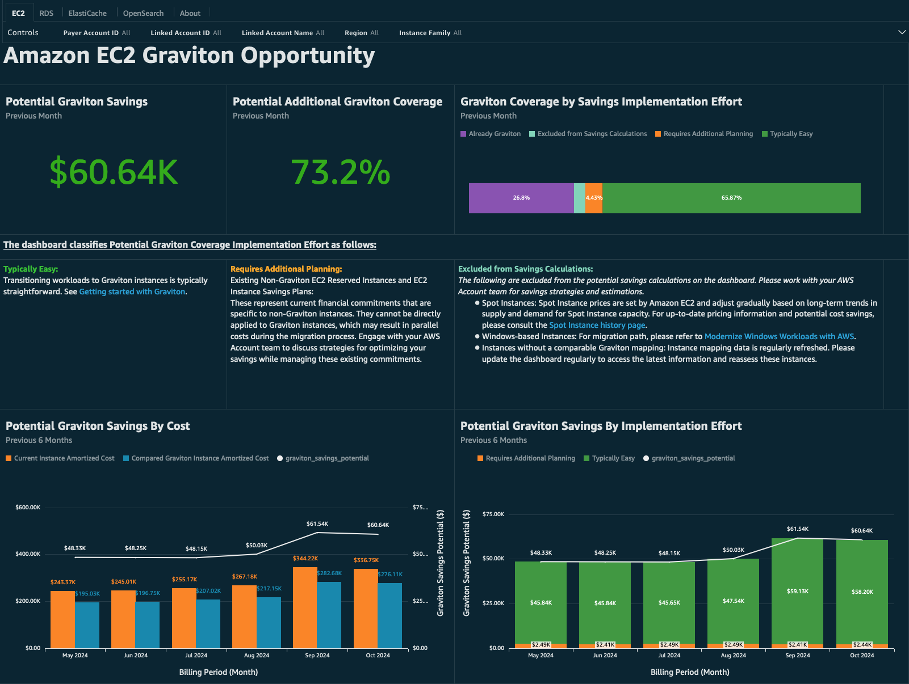
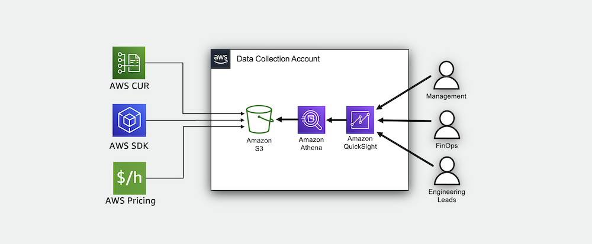
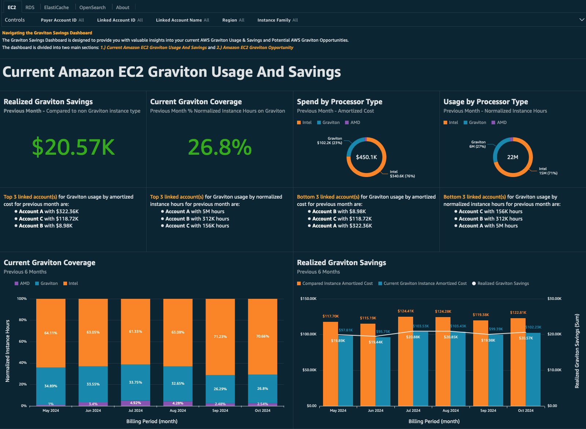
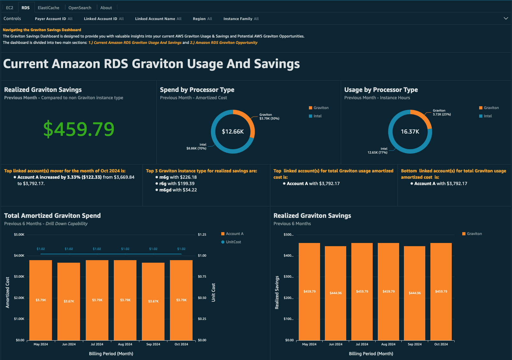
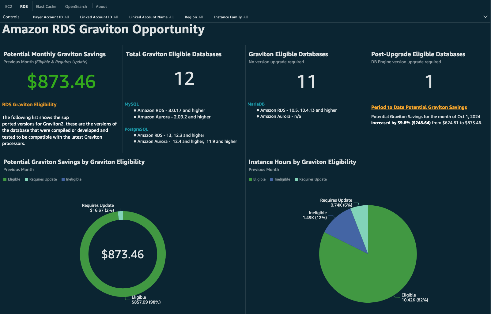
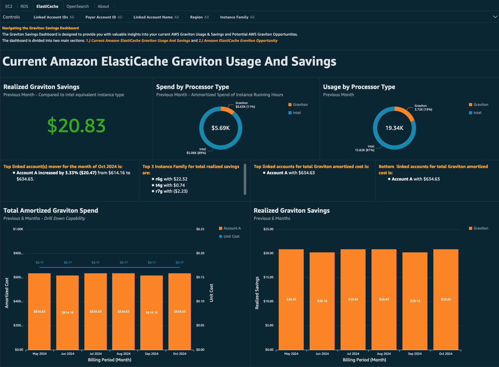
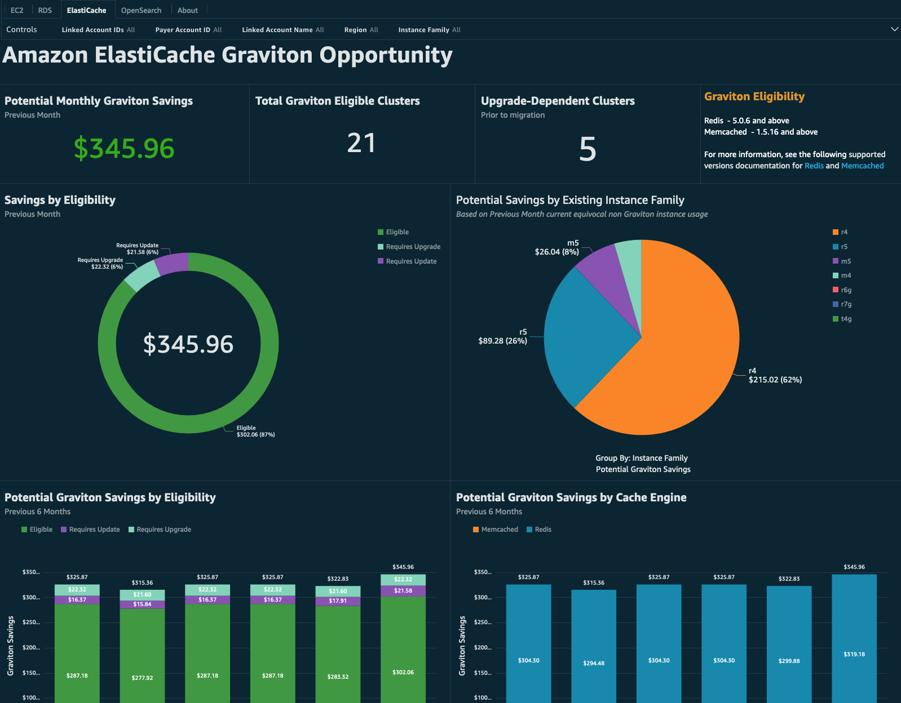
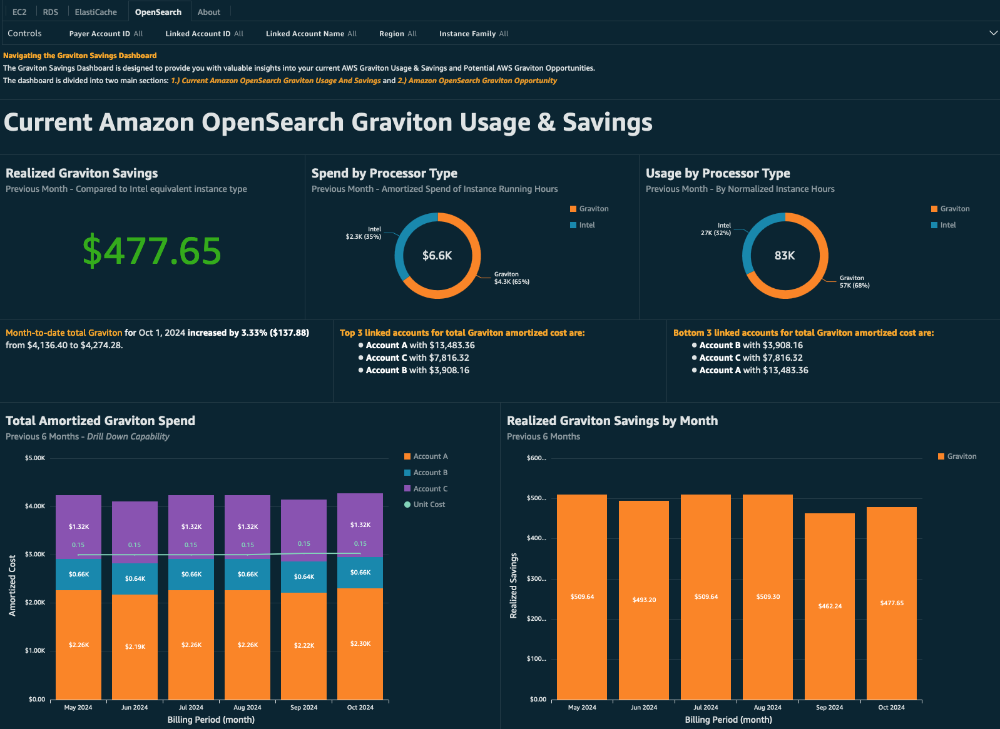
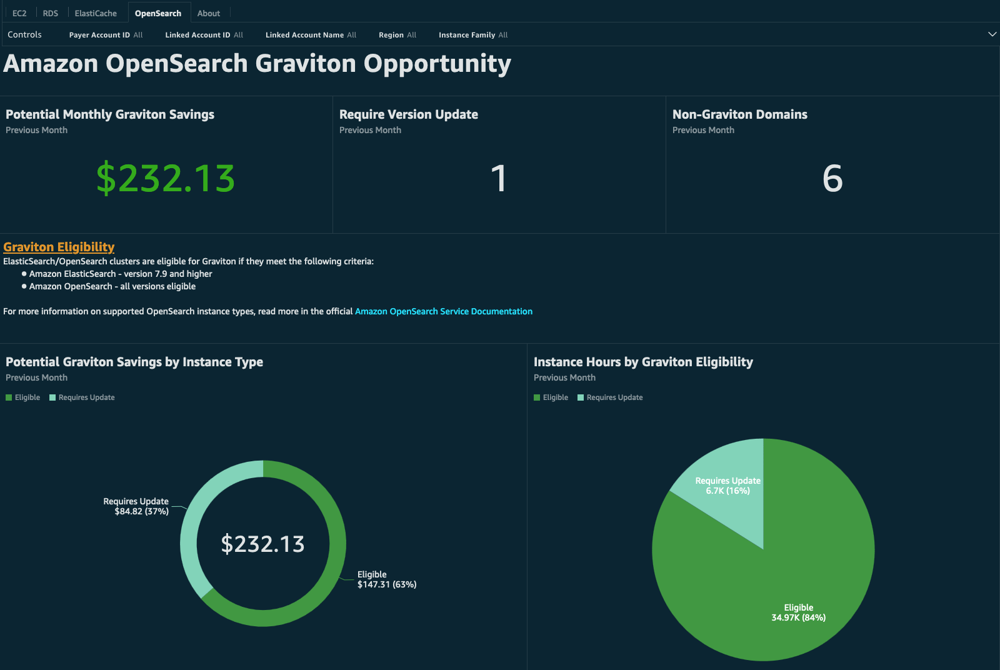

# Graviton Savings Dashboard

## Introduction

The Graviton Savings Dashboard (GSD) visualizes your current usage of
[AWS Graviton Processors](https://aws.amazon.com/ec2/graviton/ "https://aws.amazon.com/ec2/graviton/") and
estimates potential cost savings when switching to Graviton. This tool
helps you make informed decisions about optimizing your cloud
infrastructure and track your progress.

[AWS Graviton Processors](https://aws.amazon.com/ec2/graviton/ "https://aws.amazon.com/ec2/graviton/") are a CPU
developed by Amazon using the Arm instruction set designed to deliver
the best price performance for your cloud workloads running in Amazon
Elastic Compute Cloud (Amazon EC2). AWS Graviton-based instances cost up
to 20% less and use up to 60% less energy than comparable x86-based
Amazon EC2 instances.

Main features of Graviton Savings Dashboard:

- **Current Graviton Usage and Realized Savings** - View your current Graviton usage and realized savings for Amazon EC2, RDS, OpenSearch and Elasticache
- **Potential Graviton Savings** - Detect current workloads that are eligible for Graviton and evaluate potential savings from the transition.
- **Governance** - Centralized Dashboard view allows FinOps Team to track and monitor AWS Graviton savings and opportunities across one or multiple AWS Organizations (Payers).

## Demo Dashboard

Get more familiar with Dashboard using the live, interactive demo
dashboard following this
[link](https://cid.workshops.aws.dev/demo?dashboard=graviton-savings-dashboard "https://cid.workshops.aws.dev/demo?dashboard=graviton-savings-dashboard").



See more screenshots in the [usage guide](#graviton-savings-usage-overview "#graviton-savings-usage-overview").

## Architecture Overview

The Dashboard uses AWS CUR from [Foundational Dashboards Stack](deployment-in-global-regions.md "deployment-in-global-regions.md"), and additionally AWS Pricing and Inventory Modules
from [Data Collection Stack](data-collection.md "data-collection.md"). These stacks
automatically collect data and store on Amazon S3. Customers can then
leverage Amazon Athena and provided Amazon Quick Sight dashboard for
visualization and analysis.



## Prerequisites

1. If you do not have your Cost and Usage Report (CUR) set up, follow Steps 1 and 2 from the [CUDOS, CID, and KPI Dashboard](deployment-in-global-regions.md "deployment-in-global-regions.md") deployment guide.
2. Deploy or update [Data Collection Lab](data-collection.md "data-collection.md") and make sure Inventory Data collection module is enabled.

## Deployment

CloudFormation

###### Note

**Prerequisite**: To install this dashboard using CloudFormation, you need to install Foundational Dashboards CFN with version v4.0.0 or above as described [here](deployment-in-global-regions.md#deployment-in-global-region-deploy-dashboard "deployment-in-global-regions.md#deployment-in-global-region-deploy-dashboard")

1. Log in to to your **Data Collection** Account. 1. Click the Launch Stack button below to open the **pre-populated stack template** in your CloudFormation.

[](https://console.aws.amazon.com/cloudformation/home#/stacks/create/review?templateURL=https://aws-managed-cost-intelligence-dashboards.s3.amazonaws.com/cfn/cid-plugin.yml&stackName=Graviton-Savings-Dashboard&param_DashboardId=graviton-savings&param_RequiresDataCollection=yes "https://console.aws.amazon.com/cloudformation/home#/stacks/create/review?templateURL=https://aws-managed-cost-intelligence-dashboards.s3.amazonaws.com/cfn/cid-plugin.yml&stackName=Graviton-Savings-Dashboard¶m_DashboardId=graviton-savings¶m_RequiresDataCollection=yes")

    1. You can change **Stack name** for your template if you wish.
    2. Leave **Parameters** values as it is.
    3. Review the configuration and click **Create stack**.
    4. You will see the stack will start in **CREATE\_IN\_PROGRESS**. Once complete, the stack will show **CREATE\_COMPLETE**
    5. You can check the stack output for dashboard URLs.


    ###### Note


    **Troubleshooting:** If you see error "No export named cid-CidExecArn found" during stack deployment, make sure you have completed prerequisite steps.

Command Line
Alternative method to install dashboards is the
[cid-cmd](https://github.com/aws-solutions-library-samples/cloud-intelligence-dashboards-framework/blob/main/CID-CMD.md#command-line-tool-cid-cmd "https://github.com/aws-solutions-library-samples/cloud-intelligence-dashboards-framework/blob/main/CID-CMD.md#command-line-tool-cid-cmd")
tool.

1. Log in to to your **Data Collection** Account.
2. Open up a command-line interface with permissions to run API requests
   in your AWS account. We recommend to use
   [CloudShell](https://console.aws.amazon.com/cloudshell "https://console.aws.amazon.com/cloudshell").
3. In your command-line interface run the following command to download
   and install the CID CLI tool:

```
 pip3 install --upgrade cid-cmd
```

4. In your command-line interface run the following command to deploy the
   dashboard:

```
 cid-cmd deploy --dashboard-id graviton-savings
```

Please follow the instructions from the deployment wizard. More info
about command line options are in the
[Readme](https://github.com/aws-solutions-library-samples/cloud-intelligence-dashboards-framework/blob/main/CID-CMD.md#command-line-tool-cid-cmd "https://github.com/aws-solutions-library-samples/cloud-intelligence-dashboards-framework/blob/main/CID-CMD.md#command-line-tool-cid-cmd")
or `cid-cmd --help`.

## Update

Please note that dashboards are not updated with update of
CloudFormation Stack. When new version of the dashboard template is
released, you can update your dashboard by running the following command
in your command-line interface:

```
cid-cmd update --dashboard-id graviton-savings
```

## Usage Overview

The Graviton Savings Dashboard provides the
ability for users to track current Graviton usage and realized savings,
as well as identify potential migration opportunities. Each of the 4
services represented in the dashboard (EC2, RDS, ElastiCache, and
OpenSearch) have dedicated tabs to review current usage and potential
savings.

**EC2**

**Current Usage and Savings**

The Current Amazon EC2 Graviton Usage and Savings section provides a
comprehensive overview of your current usage of EC2 Graviton-based
instances and the potential cost savings you realized by migrating
workloads to Graviton. These savings are calculated in comparison to the
latest Intel-based instance generation of the same size. The section
also allows you to explore Graviton coverage by month, usage/savings by
account and instance family, and unit costs trends to see how your
Graviton adoption has impacted your workloads. This detailed information
can help you assess the benefits and cost optimization opportunities of
adopting Graviton-based EC2 instances.



**Graviton Opportunities**

The Amazon EC2 Graviton Opportunity section provides insights into the
potential cost savings you could realize by migrating eligible workloads
to Graviton-based instances. This section allows you to analyze your
Graviton coverage - both at the account level and by instance family.
This can help you identify clusters of workloads that present the
greatest opportunities to benefit from the cost advantages of Graviton.


**RDS**

**Current Usage and Savings**

RDS has a similar Current Usage and Savings visuals to EC2, providing
details on your current usage, realized savings, cost, and savings
percentage. It also provides details by RDS Engine usage, as this is a
large driver of eligibility for Graviton.



**Graviton Opportunities**

Eligibility for RDS Graviton is driven based on RDS Type, Engine, and
version number. The below table details out eligibility for Graviton:

| Type          | MySQL             | PostgreSQL                       | MariaDB                     |
| ------------- | ----------------- | -------------------------------- | --------------------------- |
| Amazon RDS    | 8.0.17 and higher | 12.3, 13 and higher              | 10.4.13, 10.5 and<br>higher |
| Amazon Aurora | 2.09.2 and higher | 11.9 and higher, 12.4 and higher | n/a                         |

The RDS Graviton Opportunities section provides a breakdown of your
Graviton eligibility based on several criteria. If your current database
is using a compatible engine version and meets the required engine
version, it will be displayed as "Eligible". If it meets the engine
type requirements but does not meet the version number requirements, it
will be listed as "Requires Update". Otherwise, it will be listed as
"Ineligible". The "Eligibility and Savings by RDS Resource ID" table
can be used as an explorer to identify workloads and determine potential
savings for particular usage. You can use the controls at the top of the
page and the filters on the table to isolate particular usage, and
export the report to send to application teams to showcase
instance-level savings.

You can learn more about RDS Graviton Eligibility
[here](https://aws.amazon.com/blogs/database/key-considerations-in-moving-to-graviton2-for-amazon-rds-and-amazon-aurora-databases/ "https://aws.amazon.com/blogs/database/key-considerations-in-moving-to-graviton2-for-amazon-rds-and-amazon-aurora-databases/")



**ElastiCache**

**Current Usage and Savings**

Similar to EC2 and RDS the Current Usage and Savings visuals for
Elasticache, provide details on your current usage, realized savings,
cost, and savings percentage. It also provides details by cache engine,
as this is a large driver of eligibility for Graviton.



**Graviton Opportunities**

The ElastiCache Graviton Opportunity section highlights the potential
monthly savings from using Graviton processors for your ElastiCache
clusters. This section identifies the eligible clusters that meet the
criteria to migrate to Graviton-based instances. The eligibility for
Graviton usage is based on the specific database engine and version
running on the cluster. Your caches are eligible to move to Graviton if
they are:

- Redis - 5.0.6 and above
- Memcached - 1.5.16 and above
  For more information, see the following supported versions documentation
  for
  [Redis](../../../AmazonElastiCache/latest/red-ug/supported-engine-versions.md "../../../AmazonElastiCache/latest/red-ug/supported-engine-versions.md")
  and
  [Memcached](../../../AmazonElastiCache/latest/mem-ug/supported-engine-versions-mc.md "../../../AmazonElastiCache/latest/mem-ug/supported-engine-versions-mc.md")



**OpenSearch**

**Current Usage and Savings**

Similar to other services, the Current Amazon OpenSearch Graviton Usage
and Savings section provides insights into your usage by engine to give
you context into the eligibility of Graviton usage.



**Graviton Opportunities**

OpenSearch Graviton eligibility is a bit more straight forward than
other AWS Managed Services. The below table describes eligibility for
both Amazon ElasticSearch and AmazonOpenSearch:

| Type                 | Required Version      |
| -------------------- | --------------------- |
| Amazon ElasticSearch | 7.9 or higher         |
| Amazon OpenSearch    | All versions eligible |

For more information on supported OpenSearch instance types, read more
in the official
[Amazon
OpenSearch Service Documentation](../../../opensearch-service/latest/developerguide/supported-instance-types.md "../../../opensearch-service/latest/developerguide/supported-instance-types.md")



### Authors

- Rosa Corley, Senior FinOps Commercial Architect
- Rajani Guptan, Senior Technical Account Manager
- Rem Baumann, Ex-Amazonian
- Erik Petersen, Ex-Amazonian

### Contributors

- Iakov Gan, Senior Solution Architect
- Eric Christensen, Technical Account Manager
- Yuriy Prykhodko, Principal Technical Account Manager
- Travis James, Optimization Solutions Architect
- John Masci, Principle Optimization Solutions Architect
- Vinay Gaonkar, Principal Go To Market, EC2 Spot
- Hahnara Hyun, Senior Specialist Solutions Architect, EC2 Graviton
- Zi Shen Lim, Sustainability GTM, Graviton
- Bhavik Gandhi, FinOps Commercial Architect
- Shankar Gopalan, WWSO Specialist

## Feedback Support

If you have feedback or questions on the dashboard, please send your
inquiries to [aws-cid-graviton-savings-dashboard@amazon.com](mailto:aws-cid-graviton-savings-dashboard@amazon.com "mailto:aws-cid-graviton-savings-dashboard@amazon.com")

###### Note

These dashboards and their content: (a) are for informational
purposes only, (b) represent current AWS product offerings and
practices, which are subject to change without notice, and (c) does not
create any commitments or assurances from AWS and its affiliates,
suppliers or licensors. AWS content, products or services are provided
"as is" without warranties, representations, or conditions of any
kind, whether express or implied. The responsibilities and liabilities
of AWS to its customers are controlled by AWS agreements, and this
document is not part of, nor does it modify, any agreement between AWS
and its customers.
