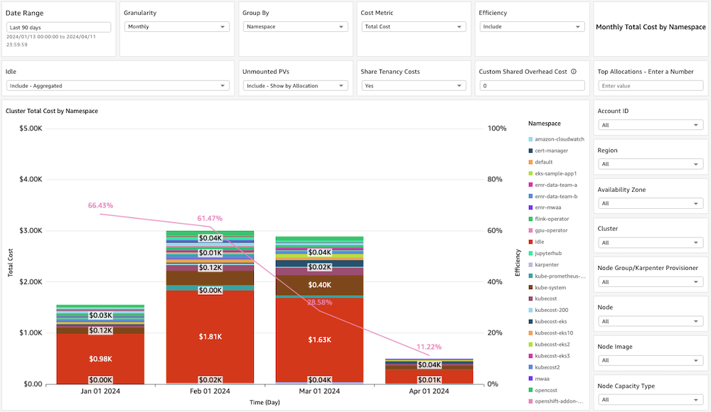

# Kubecost Containers Cost Allocation Dashboard

## Introduction

The Kubecost Containers Cost Allocation Dashboard provides insights into
Kubernetes in-cluster cost and usage based on data collection from a
self-hosted Kubecost (supports any Kubecost tier - Kubecost free tier,
Kubecost EKS-optimized bundle and Kubecost enterprise tier).
DevOps teams, FinOps team or any relevant stakeholder can gain insights
into cost and usage of Kubernetes workloads inside their Kubernetes
clusters, down to the container level, and aggregated based on different
Kubernetes constructs (pod, namespace, controller, and more).
You can implement showback and chargeback methodologies for multi-tenant
Kubernetes clusters, and also understand the efficiency (usage vs
requests) of your Kubernetes clusters.
The dashboard’s visualizations include high-level KPI visuals to
understand general spend, interactive visuals that allow easy-to-use
experience to drill down into Kubernetes in-cluster cost and usage, and
customizable visuals per cost metric.

The dashboard has three tabs:

- Executive Summary:
  - KPI visuals per cost metric (CPU cost, RAM cost, total cost,
    efficiency metrics, and more)
  - Total Cost by Account ID
  - Top Spending Clusters

- Workloads Explorer:
  - Interactive stacked-bar chart and pivot table visuals that show cost
    by different dimensions based on in-dashboard aggregations and filters

- EKS Breakdown
  - Distribution Graphs Area - a collection of pie charts showing pod
    distribution by different dimensions (capacity type, instance type, and
    more)
  - Coverage Graphs Area - a collection of stacked-bar charts showing pod
    coverage by different dimensions (capacity type, instance type)
  - Drill-down Graphs Area - a collection of charts showing in-cluster
    cost by namespace, based on different cost metrics (CPU cost, RAM cost,
    and more)

You can also check AWS Native [SCAD Containers Cost Allocation Dashboard](scad-containers-dashboard.md "scad-containers-dashboard.md") and the [Comparison Table in FAQ](faq.md#faq-scad-kubecost-dashboard-difference "faq.md#faq-scad-kubecost-dashboard-difference").

## Demo Dashboard

Get more familiar with Dashboard using the live, interactive demo
dashboard following this
[link](https://cid.workshops.aws.dev/demo/?dashboard=containers-cost-allocation "https://cid.workshops.aws.dev/demo/?dashboard=containers-cost-allocation")

## CID’s Containers Cost Allocation Dashboards Comparison

The CID framework has two Containers Cost Allocation dashboards:

- This one, which is based on data collection from Kubecost
- The [SCAD Containers Cost Allocation Dashboard](scad-containers-dashboard.md "scad-containers-dashboard.md"), which is based on CUR’s Split Cost Allocation Data (SCAD)

Please visit review the [Containers Cost Allocation dashboards comparison in the FAQs](faq.md#faq-scad-kubecost-dashboard-difference "faq.md#faq-scad-kubecost-dashboard-difference") for more information.

## Deployment

Please follow the
[instructions
in the Containers Cost Allocation Dashboard GitHub repo](https://github.com/awslabs/containers-cost-allocation-dashboard/blob/main/README.md "https://github.com/awslabs/containers-cost-allocation-dashboard/blob/main/README.md").

## Update

Please follow the
[update
instructions in the Containers Cost Allocation Dashboard GitHub repo](https://github.com/awslabs/containers-cost-allocation-dashboard/blob/main/UPDATE.md "https://github.com/awslabs/containers-cost-allocation-dashboard/blob/main/UPDATE.md").

## Learn more

- Find more information in the
  [solution’s
  GitHub repo](https://github.com/awslabs/containers-cost-allocation-dashboard "https://github.com/awslabs/containers-cost-allocation-dashboard")
- Explore more on Kubecost in the [Kubecost web
  site](https://www.kubecost.com/ "https://www.kubecost.com/") and read more on the
  [self-hosted Kubecost
  deployment option](https://www.kubecost.com/products/self-hosted "https://www.kubecost.com/products/self-hosted")
- Explore more on the Kubecost EKS-optimized bundle in the
  [launch
  blog post](https://aws.amazon.com/blogs/containers/aws-and-kubecost-collaborate-to-deliver-cost-monitoring-for-eks-customers/ "https://aws.amazon.com/blogs/containers/aws-and-kubecost-collaborate-to-deliver-cost-monitoring-for-eks-customers/")

      + Read on more features of this bundle such as
      [AMP
      integration](https://aws.amazon.com/blogs/mt/integrating-kubecost-with-amazon-managed-service-for-prometheus/ "https://aws.amazon.com/blogs/mt/integrating-kubecost-with-amazon-managed-service-for-prometheus/"),
      [multi-cluster
      visibility](https://aws.amazon.com/blogs/containers/multi-cluster-cost-monitoring-using-kubecost-with-amazon-eks-and-amazon-managed-service-for-prometheus/ "https://aws.amazon.com/blogs/containers/multi-cluster-cost-monitoring-using-kubecost-with-amazon-eks-and-amazon-managed-service-for-prometheus/") and
      [securing
      access with Amazon Cognito](https://aws.amazon.com/blogs/containers/securing-kubecost-access-with-amazon-cognito/ "https://aws.amazon.com/blogs/containers/securing-kubecost-access-with-amazon-cognito/")
      + See EKS-optimized bundle installation steps in the
      [EKS
      cost monitoring user guide](../../../eks/latest/userguide/cost-monitoring.md "../../../eks/latest/userguide/cost-monitoring.md")
      + Review comparison between the EKS-optimized bundle and other Kubecost
      tiers in the first question in the
      [EKS
      cost monitoring FAQs](../../../eks/latest/userguide/cost-monitoring.md#cost-monitoring-faq "../../../eks/latest/userguide/cost-monitoring.md#cost-monitoring-faq")

## Authors

- Udi Dahan, Technical Account Manager

## Feedback & Support

Follow [Feedback & Support](feedback-support.md "feedback-support.md") guide

Have a success story to share with the Team, suggest an improvement or
report an error?

- Please email: [containers-cost-allocation-dashboard@amazon.com](mailto:containers-cost-allocation-dashboard@amazon.com "mailto:containers-cost-allocation-dashboard@amazon.com")

###### Note

These dashboards and their content: (a) are for informational
purposes only, (b) represent current AWS product offerings and
practices, which are subject to change without notice, and (c) does not
create any commitments or assurances from AWS and its affiliates,
suppliers or licensors. AWS content, products or services are provided
"as is" without warranties, representations, or conditions of any
kind, whether express or implied. The responsibilities and liabilities
of AWS to its customers are controlled by AWS agreements, and this
document is not part of, nor does it modify, any agreement between AWS
and its customers.
