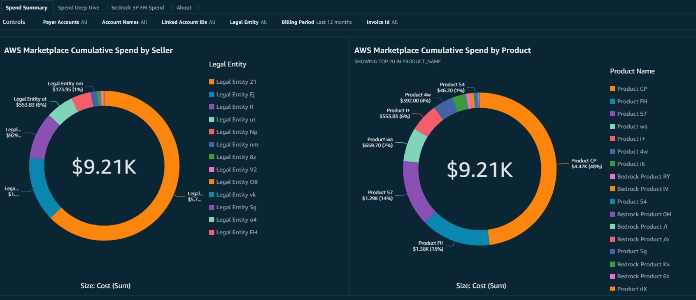

# AWS Marketplace Single Pane of Glass (SPG) Dashboard

## Introduction

The AWS Marketplace Single Pane of Glass (SPG) dashboard delivers
comprehensive procurement insights through an interactive, out-of-the-box
Amazon Quick Sight interface. Designed for AWS Marketplace buyers, this solution
offers detailed visibility into third-party software subscriptions, including
AI Agents, data products, and professional services. Users can access
visualizations spanning all AWS Marketplace offerings, encompassing both
self-service public offers and custom seller private offers. The dashboard
provides detailed analytics on AWS Marketplace spend and usage across multiple
AWS Organizations, displays software license grants and entitlements, and surfaces
critical agreement information such as "Deployed on AWS" badge status and contract
terms. This unified view enables procurement teams to monitor and analyze their
AWS Marketplace investments effectively.

The dashboard has five tabs:

- [**Spend Summary**](https://cid.workshops.aws.dev/demo/?dashboard=aws-marketplace "https://cid.workshops.aws.dev/demo/?dashboard=aws-marketplace"):

  - AWS Marketplace Cumulative Spend by Seller
  - AWS Marketplace Cumulative Spend by Product
  - AWS Marketplace Spend by Seller
  - AWS Marketplace Spend and Usage by Seller Product
  - Marketplace Invoice Tracker

- [**Spend Deep Dive**](https://cid.workshops.aws.dev/demo?dashboard=aws-marketplace&sheet=Spend%20Deep%20Dive "https://cid.workshops.aws.dev/demo?dashboard=aws-marketplace&sheet=Spend%20Deep%20Dive"):

  - Spend by Product
  - Spend by AWS Account ID
  - Spend Mapping by Seller
  - Spend Details by Invoice

- [**Bedrock 3P Foundational Model (FM) Spend**](https://cid.workshops.aws.dev/demo?dashboard=aws-marketplace&sheet=Bedrock%203P%20FM%20Spend "https://cid.workshops.aws.dev/demo?dashboard=aws-marketplace&sheet=Bedrock%203P%20FM%20Spend")

  - 3P FM Spend by Seller
  - Spend and Usage by FM Product

- [**Granted and Entitled Licenses**](https://cid.workshops.aws.dev/demo/?dashboard=aws-marketplace&sheet=Granted%20and%20Entitled%20Licenses "https://cid.workshops.aws.dev/demo/?dashboard=aws-marketplace&sheet=Granted%20and%20Entitled%20Licenses")

  - Upcoming Contract Expirations
  - Org View of Licenses
  - License Summary by Product
  - License Grant and Sharing Details
  - Product mapping to License Grants

- [**Marketplace Agreements**](https://cid.workshops.aws.dev/demo/?dashboard=aws-marketplace&sheet=Marketplace%20Agreements "https://cid.workshops.aws.dev/demo/?dashboard=aws-marketplace&sheet=Marketplace%20Agreements")

  - Active Agreement Count by Deployment Status
  - Active Agreement Value by Deployment Status
  - Agreement Information
  - Active Agreement Acceptances
  - Agreement Charges by Month
  - Agreement Charge Details
  - Agreement Legal Terms

## Demo Dashboard

Get more familiar with the Dashboard using the live, interactive demo
dashboard following this [interactive demo dashboard](https://cid.workshops.aws.dev/demo?dashboard=aws-marketplace "https://cid.workshops.aws.dev/demo?dashboard=aws-marketplace")



## Prerequisites

1. Deploy one or more of the foundational dashboards: [CUDOS, Cost Intelligence, or KPI Dashboard](cudos-cid-kpi.md "cudos-cid-kpi.md").
2. (Optional, required for the [Granted and Entitled Licenses page](https://cid.workshops.aws.dev/demo/?dashboard=aws-marketplace&sheet=Granted%20and%20Entitled%20Licenses "https://cid.workshops.aws.dev/demo/?dashboard=aws-marketplace&sheet=Granted%20and%20Entitled%20Licenses")) Deploy the [Data Collection](data-collection-deployment.md "data-collection-deployment.md"), with the _Include Marketplace Licensing Collection_ module parameter set to **yes**. Then, in each payer account, complete the following steps:

   1. Navigate to [Marketplace Settings](https://us-east-1.console.aws.amazon.com/marketplace/settings/license-manager-integration?region=us-east-1 "https://us-east-1.console.aws.amazon.com/marketplace/settings/license-manager-integration?region=us-east-1") to create integration for **AWS License Manager**. Choose **Enable trusted access across your organization** and **AWS Marketplace license management service-linked role for this account** and **Create Integration**.
   2. Navigate to [AWS License Manager Get Started](https://us-east-1.console.aws.amazon.com/license-manager/home?region=us-east-1#/gettingStarted "https://us-east-1.console.aws.amazon.com/license-manager/home?region=us-east-1#/gettingStarted") and choose **Start using AWS License Manager**. Select **I grant AWS License Manager the required permissions** and choose **Grant permissions**.
   3. Navigate to [AWS License Manager Settings](https://us-east-1.console.aws.amazon.com/license-manager/home?region=us-east-1#/settings/managedLicenses "https://us-east-1.console.aws.amazon.com/license-manager/home?region=us-east-1#/settings/managedLicenses") and choose **Link AWS Organizations accounts** under **Account Details**.

3. (Optional, required for the [Marketplace Agreements page](https://cid.workshops.aws.dev/demo/?dashboard=aws-marketplace&sheet=Marketplace%20Agreements "https://cid.workshops.aws.dev/demo/?dashboard=aws-marketplace&sheet=Marketplace%20Agreements")) Deploy the [Data Collection](data-collection-deployment.md "data-collection-deployment.md"), with the _Include Marketplace Data Collection Module_ parameter set to **yes**.

## Deployment

###### Example

CloudFormation

###### Note

**Prerequisite**: To install this dashboard using CloudFormation, you need to install Foundational Dashboards CFN with version v4.0.0 or above as described [here](deployment-in-global-regions.md#deployment-in-global-region-deploy-dashboard "deployment-in-global-regions.md#deployment-in-global-region-deploy-dashboard")

1. Log in to your **Data Collection** Account.
2. Click the Launch Stack button below to open the **pre-populated stack template** in your CloudFormation.

[](https://console.aws.amazon.com/cloudformation/home#/stacks/create/review?templateURL=https://aws-managed-cost-intelligence-dashboards.s3.amazonaws.com/cfn/cid-plugin.yml&stackName=AWS-Marketplace-SPG-Dashboard&param_DashboardId=aws-marketplace&param_RequiresDataCollection=yes "https://console.aws.amazon.com/cloudformation/home#/stacks/create/review?templateURL=https://aws-managed-cost-intelligence-dashboards.s3.amazonaws.com/cfn/cid-plugin.yml&stackName=AWS-Marketplace-SPG-Dashboard&param_DashboardId=aws-marketplace&param_RequiresDataCollection=yes") 3. You can change **Stack name** for your template if you wish. 4. Leave **Parameters** values as they are. 5. Review the configuration and click **Create stack**. 6. You will see the stack will start in **CREATE\_IN\_PROGRESS**. Once complete, the stack will show **CREATE\_COMPLETE** 7. You can check the stack output for dashboard URLs.

###### Note

**Troubleshooting:** If you see error "No export named cid-CidExecArn found" during stack deployment, make sure you have completed prerequisite steps.

Command Line
An alternative method to install dashboards is the [cid-cmd](https://github.com/aws-solutions-library-samples/cloud-intelligence-dashboards-framework/blob/main/CID-CMD.md#command-line-tool-cid-cmd "https://github.com/aws-solutions-library-samples/cloud-intelligence-dashboards-framework/blob/main/CID-CMD.md#command-line-tool-cid-cmd") tool.

1. Log in to your **Data Collection** Account.
2. Open up a command-line interface with permissions to run API requests in your AWS account. We recommend using [CloudShell](https://console.aws.amazon.com/cloudshell "https://console.aws.amazon.com/cloudshell").
3. In your command-line interface run the following command to download and install the CID CLI tool:

```
pip3 install --upgrade cid-cmd
```

4. In your command-line interface run the following command to deploy the dashboard:

```
cid-cmd deploy --dashboard-id aws-marketplace
```

Please follow the instructions from the deployment wizard. More info about command line options are in the
[Readme](https://github.com/aws-solutions-library-samples/cloud-intelligence-dashboards-framework/blob/main/CID-CMD.md#command-line-tool-cid-cmd "https://github.com/aws-solutions-library-samples/cloud-intelligence-dashboards-framework/blob/main/CID-CMD.md#command-line-tool-cid-cmd")
or `cid-cmd --help`.

Terraform
You can deploy the AWS Marketplace SPG Dashboard using the [CID Terraform module](https://github.com/aws-solutions-library-samples/cloud-intelligence-dashboards-framework/tree/main/terraform/cicd-deployment "https://github.com/aws-solutions-library-samples/cloud-intelligence-dashboards-framework/tree/main/terraform/cicd-deployment").

###### Note

**Prerequisite**: Complete the foundational Terraform deployment as described in the [Foundational Dashboards deployment guide](deployment-in-global-regions.md#deployment-in-global-region-deploy-dashboard "deployment-in-global-regions.md#deployment-in-global-region-deploy-dashboard") (select the **Terraform** tab) before deploying additional dashboards.

1. In your [user-config.tf](https://github.com/aws-solutions-library-samples/cloud-intelligence-dashboards-framework/blob/main/terraform/cicd-deployment/user-config.tf "https://github.com/aws-solutions-library-samples/cloud-intelligence-dashboards-framework/blob/main/terraform/cicd-deployment/user-config.tf"), find the `dashboards` block and set `marketplace` to `"yes"`:

```
  marketplace = "yes"  # AWS Marketplace SPG Dashboard
```

2. Ensure the following module block is present in your `dashboards.tf`:

```
module "marketplace_dashboard" {
  source = "./modules/cloudformation_stack"
  providers = {
    aws = aws.datacollection
  }

  config = local.additional_dashboards.marketplace
}
```

###### Note

This block is already included if you are using the full module files from the repository. If your existing deployment only has foundational dashboards, add this block to `dashboards.tf` manually. For individual dashboard deployments, include `depends_on = [module.cloud_intelligence_dashboards]` to ensure correct ordering. 3. Run the Terraform workflow:

```
terraform init
terraform plan
terraform apply
```

###### Note

If you are adding this dashboard to an existing Terraform deployment, `terraform plan` will show the additional stack to be created. The `dashboards.tf` file handles the resource definitions automatically — no manual edits to it are needed. If you have a custom module structure with a separate path, ensure the `source` parameter in your module block points to the correct location.

For detailed instructions, refer to the [Terraform Deployment README](https://github.com/aws-solutions-library-samples/cloud-intelligence-dashboards-framework/blob/main/terraform/cicd-deployment/README.md "https://github.com/aws-solutions-library-samples/cloud-intelligence-dashboards-framework/blob/main/terraform/cicd-deployment/README.md").

## Update

Please note that dashboards are not updated with update of
CloudFormation Stack. When a new version of the dashboard template is
released, you can update your dashboard by running the following command
in your command-line interface:

```
cid-cmd update --dashboard-id aws-marketplace
```

## Visualizing Third-Party Software License Procurement

In the SPG Dashboard, to view the AWS Marketplace licenses and grants in
the **Granted and Entitled Licenses** tab, follow these steps:

- Deploy the [Data Collection](data-collection-deployment.md "data-collection-deployment.md"), make sure to
  select **yes** for the _Include Marketplace Licensing Collection_
  parameter.
- Go to the [Amazon Athena](https://console.aws.amazon.com/athena/ "https://console.aws.amazon.com/athena/") Query
  Editor.
- Select the database that has the views for CID. By default it can be
  **cid\_cur** database.
- Run the following query to update **marketplace\_licenses\_grants\_view**
  view in Amazon Athena.

```
CREATE OR REPLACE VIEW "marketplace_licenses_grants_view" AS
SELECT DISTINCT
  lt.payer_id management_account_id
, SPLIT_PART(lt.beneficiary, ':', 5) "subscribed_account_id"
, SPLIT_PART(gt.granteeprincipalarn, ':', 5) "grantee_account_id"
, FROM_UNIXTIME(CAST(lt.createtime AS DOUBLE)) "license_create_time"
, date_parse(substr(lt.validity.begin, 1, 10), '%Y-%m-%d') "license_start_date"
, date_parse(substr(lt.validity."end", 1, 10), '%Y-%m-%d') "license_end_date"
, SPLIT_PART(lt.licensearn, ':', 7) "license_id"
, lt.productname
, data.value "seller"
, SPLIT_PART(agreement.value, ':', 7) "agreement_id"
, lt.status "license_status"
, lt.productsku
, lt.issuer.NAME "license_issuer"
, lt.homeregion
, lt."version" "license_version"
, gt.grantname "grant_name"
, SPLIT_PART(gt.grantarn, ':', 7) "grant_id"
, gt.grantstatus "grant_status"
, gt.version "grant_version"
, ARRAY_JOIN(gt.grantedoperations, ',') "granted_operations"
, gt.options.activationoverridebehavior "activation_override_behavior"
FROM
  optimization_data.license_manager_licenses lt
, optimization_data.license_manager_grants gt
, UNNEST(licensemetadata) t ("data")
, UNNEST(licensemetadata) s (agreement)
WHERE ((lt.licensearn = gt.licensearn) AND (t."data".NAME = 'sellerOfRecord'))
```

## Visualizing AWS Marketplace Agreements

In the SPG Dashboard, to view the AWS Marketplace Agreements in the **Marketplace Agreements** tab, do the following:

- Deploy the [Data Collection](data-collection-deployment.md "data-collection-deployment.md"), make sure to select **yes** for the _Include Marketplace Data Collection Module_ parameter.
- Go to the [Amazon Athena](https://console.aws.amazon.com/athena/ "https://console.aws.amazon.com/athena/") Query Editor.
- Select the database that has the views for CID. By default it can be **cid\_cur** database.
- Run the following queries to update **terms** and **agreements** views in Amazon Athena.

```
CREATE OR REPLACE VIEW "terms" AS
SELECT *
FROM optimization_data.terms
```

```
CREATE OR REPLACE VIEW "agreements" AS
SELECT *
FROM optimization_data.agreements
```

###### Note

The licenses and Agreements data in the dashboard refreshes once a day. If you
would like to customize the schedule, please review [Tailoring Data Collector schedules](tailor-data-collector.md "tailor-data-collector.md").

## Learn more

Explore more on
[Buyer
Workshop](https://catalog.workshops.aws/aws-marketplace-buyer/en-US/costmanagement/analysis/quicksight "https://catalog.workshops.aws/aws-marketplace-buyer/en-US/costmanagement/analysis/quicksight")

## Authors

- Ramya Vijayaraghavan, Ex-Amazonian
- Kaushik Raha, Principal Specialist, AWS Marketplace
- Soumya Vanga, Solutions Architect, AWS Marketplace
- Kamylla Prado, Solutions Architect, AWS Marketplace

## Feedback & Support

Follow [Feedback & Support](feedback-support.md "feedback-support.md") guide

Have a success story to share with the Team, suggest an improvement or
report an error?

- Please email: [aws-marketplace-cid-spg-dashboard@amazon.com](mailto:aws-marketplace-cid-spg-dashboard@amazon.com "mailto:aws-marketplace-cid-spg-dashboard@amazon.com")

###### Note

These dashboards and their content: (a) are for informational
purposes only, (b) represent current AWS product offerings and
practices, which are subject to change without notice, and (c) does not
create any commitments or assurances from AWS and its affiliates,
suppliers or licensors. AWS content, products or services are provided
"as is" without warranties, representations, or conditions of any
kind, whether express or implied. The responsibilities and liabilities
of AWS to its customers are controlled by AWS agreements, and this
document is not part of, nor does it modify, any agreement between AWS
and its customers.
