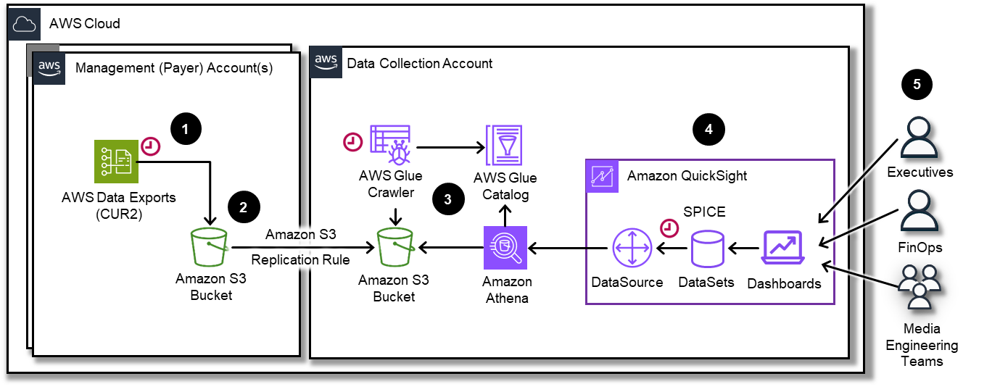
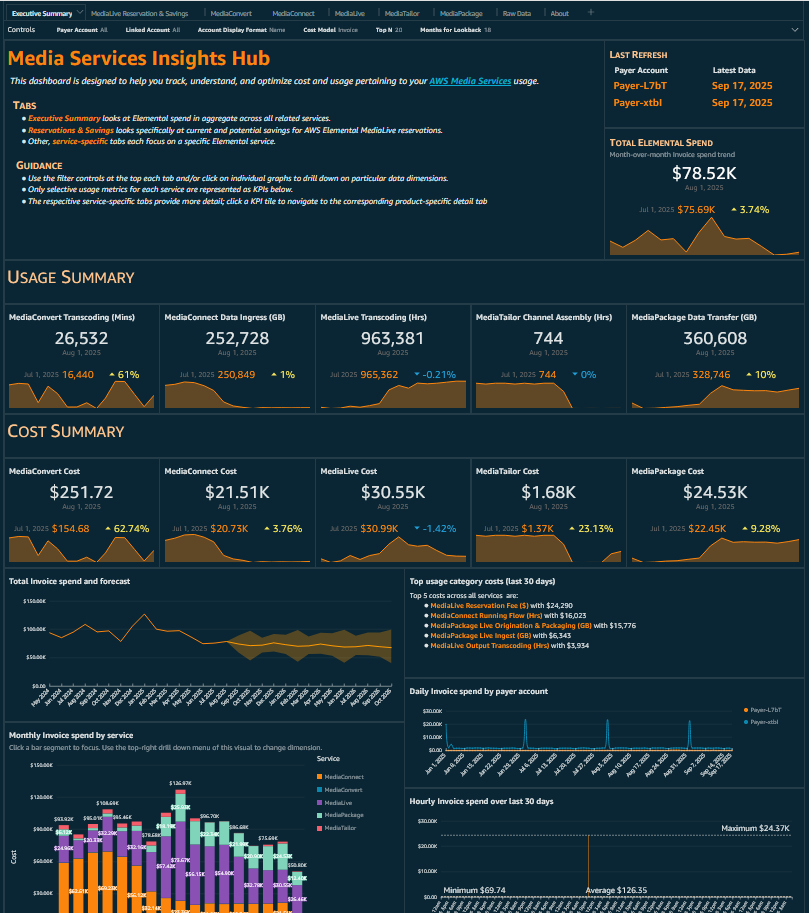

# Media Services Insights Hub

## Introduction

The Media Services Insights Hub (MSIH) dashboard provides comprehensive visibility into AWS Elemental Media Services usage, costs,
and performance metrics. This dashboard leverages AWS Cost and Usage Report (CUR) data to deliver actionable insights for
optimizing media workflows and managing costs across your media infrastructure.

The dashboard covers key AWS Elemental Media Services including:

- [AWS Elemental MediaConnect](https://aws.amazon.com/mediaconnect/ "https://aws.amazon.com/mediaconnect/") - Secure, reliable live video transport
- [AWS Elemental MediaConvert](https://aws.amazon.com/mediaconvert/ "https://aws.amazon.com/mediaconvert/") - File-based video transcoding
- [AWS Elemental MediaLive](https://aws.amazon.com/medialive/ "https://aws.amazon.com/medialive/") - Live video processing
- [AWS Elemental MediaPackage](https://aws.amazon.com/mediapackage/ "https://aws.amazon.com/mediapackage/") - Video origination and packaging
- [AWS Elemental MediaTailor](https://aws.amazon.com/mediatailor/ "https://aws.amazon.com/mediatailor/") - Video personalization and monetization



The MSIH dashboard is organized into intuitive tabs:

1. **Executive Summary** High-level overview of media services costs, usage trends, and key performance indicators across all services.
2. **MediaLive Reservations & Savings** Deep-dive into current and potential savings achieved through AWS Elemental MediaLive reservations.
3. **MediaConnect** Detailed analysis of live video transport costs, connection usage, and data transfer metrics.
4. **MediaConvert** Comprehensive view of transcoding job costs, queue utilization, and processing time analysis.
5. **MediaLive** In-depth monitoring of live streaming costs, channel utilization, and reservation optimization opportunities.
6. **MediaTailor** Insights into ad insertion costs, session metrics, and revenue optimization opportunities.
7. **MediaPackage** Analysis of video packaging and origination costs, endpoint usage, and content delivery metrics.

Each tab provides progressively detailed insights to help you optimize your media workflows and control costs effectively.

## Demo Dashboard

Get more familiar with the dashboard using the live, interactive demo by following this
[link](https://cid.workshops.aws.dev/demo?dashboard=media-services-insights "https://cid.workshops.aws.dev/demo?dashboard=media-services-insights")



## Prerequisites

Deploy the [CID Foundational Dashboards](dashboard-foundational.md "dashboard-foundational.md") stack.
This will enable your CUR, Amazon Athena and Quick Sight resources required for this and other dashboards.

## Deployment

CloudFormation

###### Note

**Prerequisite**: To install this dashboard using CloudFormation,
you need to install the [Data Exports Lab](data-exports.md "data-exports.md")

1. Log in to your **Data Collection** Account.
2. Click the Launch Stack button below to open the **pre-populated stack template** in your CloudFormation.

[](https://console.aws.amazon.com/cloudformation/home#/stacks/create/review?templateURL=https://aws-managed-cost-intelligence-dashboards.s3.amazonaws.com/cfn/cid-plugin.yml&stackName=Media-Services-Insights-Hub&param_DashboardId=media-services-insights&param_RequiresDataExports=yes "https://console.aws.amazon.com/cloudformation/home#/stacks/create/review?templateURL=https://aws-managed-cost-intelligence-dashboards.s3.amazonaws.com/cfn/cid-plugin.yml&stackName=Media-Services-Insights-Hub¶m_DashboardId=media-services-insights¶m_RequiresDataExports=yes") 3. You can change **Stack name** for your template if you wish. 4. Leave **Parameters** values as it is. 5. Review the configuration and click **Create stack**. 6. You will see the stack will start in **CREATE_IN_PROGRESS**. Once complete, the stack will show **CREATE_COMPLETE** 7. You can check the stack output for dashboard URLs.

###### Note

**Troubleshooting:** If you see error "No export named cid-CidExecArn found" during stack deployment,
make sure you have completed prerequisite steps.

Command Line
Alternative method to install dashboards is the [cid-cmd](https://github.com/aws-solutions-library-samples/cloud-intelligence-dashboards-framework/blob/main/CID-CMD.md#command-line-tool-cid-cmd "https://github.com/aws-solutions-library-samples/cloud-intelligence-dashboards-framework/blob/main/CID-CMD.md#command-line-tool-cid-cmd") tool.

1. Log in to your **Data Collection** Account.
2. Open up a command-line interface with permissions to run API requests in your AWS account. We recommend to use [CloudShell](https://console.aws.amazon.com/cloudshell "https://console.aws.amazon.com/cloudshell").
3. In your command-line interface run the following command to download and install the CID CLI tool:

```
pip3 install --upgrade cid-cmd
```

4. In your command-line interface run the following command to deploy the dashboard:

```
cid-cmd deploy --dashboard-id media-services-insights
```

Please follow the instructions from the deployment wizard. More info about command line options are in the
[Readme](https://github.com/aws-solutions-library-samples/cloud-intelligence-dashboards-framework/blob/main/CID-CMD.md#command-line-tool-cid-cmd "https://github.com/aws-solutions-library-samples/cloud-intelligence-dashboards-framework/blob/main/CID-CMD.md#command-line-tool-cid-cmd")
or `cid-cmd --help`.

## Update

Please note that currently dashboards can be initially deployed via CloudFormation
but they cannot be updated through CloudFormation Stack updates.
When new version of the dashboard template is released, you can update your dashboard
by running the following command in your command-line interface:

```
cid-cmd update --dashboard-id media-services-insights
```

## Dashboard Customization

1. Unleash your data creativity! Dive into custom analysis by creating your own visuals from this dashboard. Follow our quick [guide](create-analysis.md "create-analysis.md") to get started.
2. To integrate CID with AWS Organizations for enhanced cost visibility across multiple accounts and organizational units follow the [documentation to add taxonomy details](add-org-taxonomy.md "add-org-taxonomy.md")
3. To set up cost allocation tags for better resource tracking and cost attribution across your media services, follow the [Cost Allocation Tags documentation](../../../awsaccountbilling/latest/aboutv2/cost-alloc-tags.md "../../../awsaccountbilling/latest/aboutv2/cost-alloc-tags.md")

## Usage Guide

There are multiple tabs available in this dashboard.

Executive Summary Tab
Start with the Executive Summary to get a high-level view of your media services spending and usage patterns. This tab provides:

- Total media services costs and month-over-month trends
- Service-wise cost breakdown and utilization metrics
- Top spending accounts and regions
- Cost per service comparison and growth trends
- Key performance indicators and cost optimization opportunities
- Regional distribution of media services usage
- Monthly cost forecasting and budget tracking

MediaConnect Tab
Monitor live video transport costs and connection performance:

- Connection usage patterns and data transfer volumes
- Cost breakdown by connection type and region
- Bandwidth utilization and peak usage analysis
- Source and destination flow analysis
- Data transfer cost optimization opportunities
- Connection uptime and reliability metrics
- Regional cost comparison for optimal placement

MediaConvert Tab
Track transcoding job costs and queue performance:

- Job processing costs by queue and priority
- Queue utilization and processing time analysis
- Input/output format cost comparison
- Reserved capacity utilization and recommendations
- Job failure rates and retry costs
- Processing time trends and optimization opportunities
- Cost per minute of content processed
- Peak usage periods and capacity planning

MediaLive Tab
Analyze live streaming costs and channel utilization:

- Channel costs by type and configuration
- Input/output bandwidth utilization
- Reserved instance vs on-demand cost analysis
- Channel uptime and availability metrics
- Regional deployment cost comparison
- Encoding profile cost optimization
- Redundancy configuration cost impact
- Peak concurrent channel usage

MediaPackage Tab
Review packaging and origination costs:

- Endpoint usage and request volume analysis
- Content delivery cost breakdown
- Origin request patterns and caching efficiency
- Packaging format cost comparison
- Regional endpoint performance and costs
- Content protection and DRM costs
- Harvest job costs and optimization
- CDN integration cost analysis

MediaTailor Tab
Examine ad insertion costs and session analytics:

- Session volume and ad request patterns
- Personalization costs and revenue impact
- Configuration usage and optimization
- Ad decision server integration costs
- Content delivery network costs
- Session duration and engagement metrics
- Revenue per session analysis
- Peak traffic handling and scaling costs

## Cost Optimization Recommendations

There are a several ways to optimize your Elemental costs. Below are some of them.

Reserved Capacity

- Purchase MediaLive reserved instances for predictable live streaming workloads (up to 75% savings)
- Consider MediaConvert reserved capacity for consistent transcoding volumes
- Analyze usage patterns to determine optimal reservation terms (1-year vs 3-year)
- Monitor reservation utilization and adjust capacity as needed

Right-sizing and Configuration

- Review MediaLive channel configurations and encoding profiles
- Optimize MediaConvert job settings for cost-effective processing
- Implement appropriate redundancy levels based on content criticality
- Use efficient encoding presets to reduce processing time and costs

Data Transfer

- Leverage CloudFront for global content delivery and reduced origin costs
- Place MediaConnect flows and MediaLive channels in optimal regions
- Implement efficient caching strategies for MediaPackage endpoints
- Use VPC endpoints to reduce data transfer costs between services

Operational Efficiency

- Implement automated scaling for MediaLive channels based on demand
- Use MediaTailor’s server-side ad insertion to reduce CDN costs
- Monitor and optimize MediaPackage harvest jobs scheduling
- Implement proper content lifecycle management to reduce storage costs

Monitoring

- Set up cost anomaly detection for unusual spending patterns
- Create budget alerts for each media service
- Monitor service-specific metrics to identify optimization opportunities
- Regular review of unused or underutilized resources

## Authors & Contributors

- Krutarth Doshi, Sr. Technical Account Manager
- Eric Christensen, Sr. Technical Account Manager
- Ala Muhtaseb, Sr. Solutions Architect
- Imane Zeroual, Sr. Cloud Operations Architect
- Guillaume Girault, Technical Account Manager

## Feedback & Support

Follow [Feedback & Support](feedback-support.md "feedback-support.md") guide

Have a success story to share with the Team, suggest an improvement or report an error?

- Please email: [cloud-intelligence-dashboards-media-services@amazon.com](mailto:cloud-intelligence-dashboards-media-services@amazon.com "mailto:cloud-intelligence-dashboards-media-services@amazon.com")

###### Note

These dashboards and their content: (a) are for informational
purposes only, (b) represents current AWS product offerings and
practices, which are subject to change without notice, and (c) does not
create any commitments or assurances from AWS and its affiliates,
suppliers or licensors. AWS content, products or services are provided
"as is" without warranties, representations, or conditions of any
kind, whether express or implied. The responsibilities and liabilities
of AWS to its customers are controlled by AWS agreements, and this
document is not part of, nor does it modify, any agreement between AWS
and its customers.
